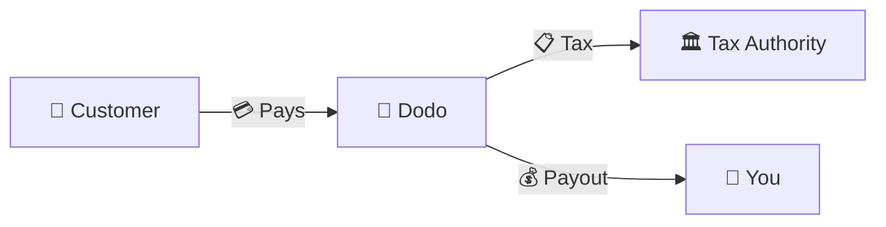
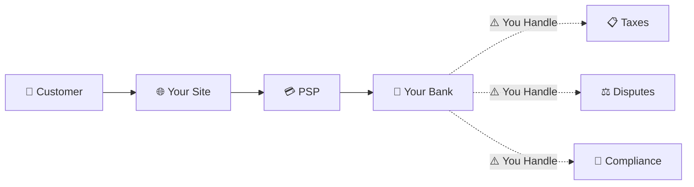
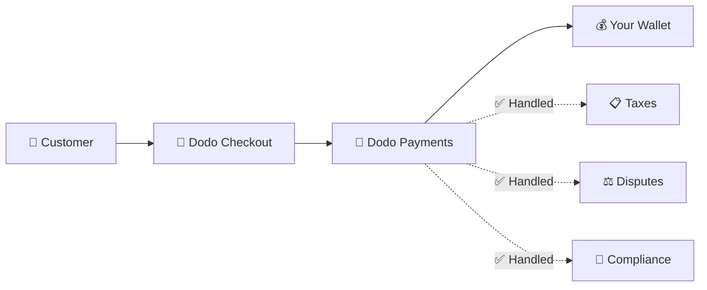
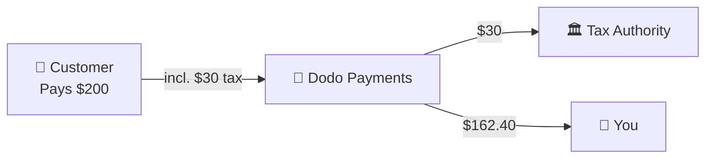

Dodo Payments fungerar som en **Merchant of Record (MoR)** — vi blir den juridiska säljaren av dina digitala produkter och tar på oss ansvaret för betalningar, skatter, bedrägerier och efterlevnad så att du kan fokusera helt på att bygga din produkt.

<CardGroup cols={3}>
<Card title="220+ Regioner" icon="globe">
Skatteöverensstämmelse hanteras automatiskt
</Card>

<Card title="30+ Betalningsmetoder" icon="credit-card">
Kort, plånböcker och lokala metoder
</Card>

<Card title="Ingen Skattedeklaration" icon="file-invoice">
Vi hanterar all remittering
</Card>
</CardGroup>

## Vad är en Merchant of Record?

En **Merchant of Record** är den juridiska enhet som visas på din kunds kreditkortutdrag och tar ansvar för transaktionen. När du använder Dodo Payments som din MoR:

- **Vi är den juridiska säljaren** — Dodo visas på bankutdrag och kvitton
- **Du är produktens skapare** — Du bygger, prissätter och levererar din produkt
- **Vi hanterar back office** — Skatter, tvister, efterlevnad och faktureringssupport
- **Du får nettoutbetalningar** — Intäkter sätts direkt in på ditt konto

<Note>
Tänk på en Merchant of Record som att anställa ett globalt ekonomiteam som hanterar fakturering, skatter och fakturering i varje land — utan att du behöver lyfta ett finger.
</Note>

## Varför använda en Merchant of Record?

Att sälja digitala produkter globalt innebär att navigera i moms i Europa, GST i Australien, försäljningsskatt i USA och otaliga andra krav. Varje jurisdiktion har olika regler, skattesatser, trösklar och inlämningsfrister.

| Ditt Ansvar | Utan MoR | Med Dodo som MoR |
|---------------------|:-----------:|:----------------:|
| Moms/GST Registrering | ❌ Du | ✅ Dodo |
| Skatteberäkning | ❌ Du | ✅ Dodo |
| Skattedeklaration & Remittering | ❌ Du | ✅ Dodo |
| Återbetalningsansvar | ❌ Du | ✅ Dodo |
| PCI Efterlevnad | ❌ Du | ✅ Dodo |
| Stöd för Flera Valutor | ❌ Komplicerat | ✅ Inbyggt |
| Lokala Betalningsmetoder | ❌ Integrera Varje | ✅ 30+ Inkluderat |

<Tip>
**Exempel**: Säljer en prenumeration för €50/månad till en fransk kund?

**Utan MoR**: Registrera för fransk moms, ta ut €60 (20% moms), lämna in kvartalsvisa franska deklarationer, hantera revisioner — på franska.

**Med Dodo**: Vi samlar in €60, remitterar €10 moms till Frankrike och betalar dig €50 minus avgifter. Du skriver kod.
</Tip>

## PSP vs. MoR: Viktiga Skillnader

Att förstå skillnaden mellan en **Betalningstjänstleverantör** (som Stripe) och en **Merchant of Record** är avgörande.

### Betalningstjänstleverantör (PSP)

En PSP bearbetar transaktioner men lämnar dig som den juridiska säljaren:

<Warning>
Med en PSP är **du** ansvarig för skatteregistrering, insamling, inlämning och remittering i varje jurisdiktion där du har kunder.
</Warning>

### Merchant of Record (Dodo)

En MoR blir den juridiska säljaren och hanterar efterlevnad från början till slut:

<Check>
Med Dodo som MoR hanterar vi skatter, tvister och efterlevnad. Du får nettoutbetalningar utan pappersarbete.
</Check>

### Jämförelse Sida vid Sida

| Aspekt | PSP (Stripe, etc.) | MoR (Dodo) |
|--------|:------------------:|:----------:|
| Juridisk Säljare | Ditt Företag | Dodo |
| På Kundens Uttdrag | Ditt Namn | Dodo |
| Skatteregistrering | ❌ Du | ✅ Dodo |
| Skatteberäkning | ❌ Du | ✅ Dodo |
| Skatteremittering | ❌ Du | ✅ Dodo |
| Återbetalningsrisk | ❌ Du | ✅ Dodo |
| PCI Efterlevnad | ❌ Du | ✅ Dodo |
| Global Setup | Komplicerat | Enkelt |

<Info>
**Viktigt**: Både PSP:er och MoR:er hanterar betalningsbearbetning. Den avgörande skillnaden är **vem som är juridiskt ansvarig** för skatteöverensstämmelse och transaktionsansvar.
</Info>

## Hur Skatteöverensstämmelse Fungerar

Dodo hanterar hela skattecykeln automatiskt:

<Steps>
<Step title="Kundens Plats">
Vi upptäcker kundens land och bestämmer vilka skatteregler som gäller — moms, GST, försäljningsskatt eller andra lokala krav.
</Step>

<Step title="Skatteberäkning">
Den korrekta skattesatsen beräknas baserat på produkttyp, kundens plats och B2B/B2C-status. EU-företagskunder med giltiga momsnummer får omvänd skattebelastning tillämpad.
</Step>

<Step title="Insamling vid Kassa">
Skatt visas tydligt och samlas in vid kassan. Kunder ser exakt vad de betalar.
</Step>

<Step title="Inlämning & Remittering">
Vi lämnar in deklarationer och betalar insamlade skatter till de relevanta myndigheterna enligt schema. Du ser aldrig ett skatteformulär.
</Step>
</Steps>

## Intäktsflöde

Så här rör sig pengarna från kund till ditt konto:

### Exempel på Utbetalningsuppdelning

| Post | Belopp |
|-----------|-------:|
| Kundbetalning | $200.00 |
| Försäljningsskatt (15% moms) | −$30.00 |
| Dodo Plattformavgift (4%) | −$8.00 |
| Betalningsbearbetning | −$0.60 |
| **Din Utbetalning** | **$162.40** |

## När man Väljer MoR vs. PSP

<Tabs>
<Tab title="Välj Dodo (MoR)">
**Dodo Payments är idealiskt om du:**

- Säljer digitala produkter, SaaS eller prenumerationer
- Har kunder i flera länder
- Vill undvika huvudvärk med skatteregistrering
- Föredrar förutsägbar, outsourcad efterlevnad
- Värderar snabbhet till marknaden över maximal kontroll
- Inte vill hantera tvister och bedrägerier
</Tab>

<Tab title="Överväg en PSP">
**En PSP kan passa dig om du:**

- Verkar främst i ett land
- Har interna ekonomiska och efterlevnadsteam
- Behöver absolut kontroll över kassa-UX
- Arbetar med extremt tunna marginaler
- Säljer fysiska varor (MoR:er fokuserar på digitala)
</Tab>
</Tabs>

<Note>
Många företag börjar med en PSP och byter till en MoR när de växer internationellt. Dodo erbjuder migrationsstöd för att göra denna övergång smidig.
</Note>

## Vanliga Frågor

<AccordionGroup>
<Accordion title="Vad visas på min kunds kreditkortutdrag?">
Dodo Payments visas som säljare. Vi inkluderar din produkt-/varumärkesreferens där teckenbegränsningar tillåter, och kunder får detaljerade kvitton som visar din produktinformation.
</Accordion>

<Accordion title="Äger jag fortfarande kundrelationen?">
Ja. Du kontrollerar prissättning, varumärkning, produktleverans och direkt kommunikation. Dodo hanterar faktureringsmekaniken, men kunderna vet att de köper från dig. Ditt varumärke visas tydligt i kassan, e-post och fakturor.
</Accordion>

<Accordion title="Hur fungerar B2B moms omvänd skattebelastning?">
För B2B-försäljning i EU kan kunder ange sitt momsnummer vid kassan. Vi validerar det och tillämpar omvänd skattebelastning automatiskt — skatten flyttas till köparens momsdeklaration istället för att samlas in.
</Accordion>

<Accordion title="Kan jag använda min egen betalningsprocessor?">
Dodo fungerar som en komplett lösning med vår betalningsinfrastruktur. Denna integration är vad som gör att vi kan ta på oss skatte- och bedrägeriansvar. Vi arbetar på att tillhandahålla en integration med andra betalningsprocessorer i framtiden.
</Accordion>

<Accordion title="Hur fungerar återbetalningar?">
Initiera återbetalningar från din instrumentpanel. Vi bearbetar återbetalningen i kundens ursprungliga betalningsmetod och valuta. Skattebeloppen justeras och avstämmas automatiskt.
</Accordion>

<Accordion title="Vad händer med min inkomstskatt?">
Dodo hanterar **försäljningsskatter** (moms, GST, försäljningsskatt) på kundtransaktioner. Du förblir ansvarig för ditt företags inkomstskatt, bolagsskatt och skatteåtaganden på de utbetalningar du får.
</Accordion>

<Accordion title="Vilka länder kan jag sälja till?">
Vi accepterar betalningar från 220+ länder och regioner med kontinuerlig expansion. Se hela listan:

<Card title="Stödda Regioner" icon="globe" href="/miscellaneous/list-of-countries-we-accept-payments-from">
Se alla 220+ länder och regioner där vi accepterar betalningar.
</Card>
</Accordion>
</AccordionGroup>

## Kom igång

<CardGroup cols={2}>
<Card title="Skapa Konto" icon="rocket" href="https://app.dodopayments.com/signup">
Registrera dig gratis och acceptera globala betalningar på några minuter.
</Card>

<Card title="MoR vs PG Djupdykning" icon="scale-balanced" href="/features/mor-vs-pg">
Detaljerad jämförelse med exempel och användningsfall.
</Card>

<Card title="Acceptanspolicy" icon="building-shield" href="/miscellaneous/merchant-acceptance">
Lär dig vilka företag vi stöder.
</Card>

<Card title="Prata med oss" icon="envelope" href="mailto:founders@dodopayments.com">
Få personlig vägledning från vårt team.
</Card>
</CardGroup>
