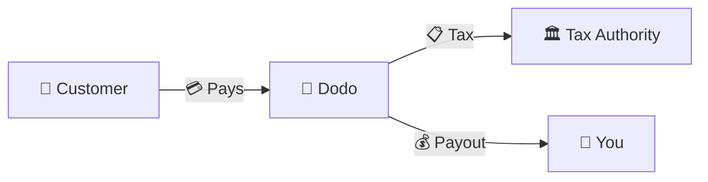
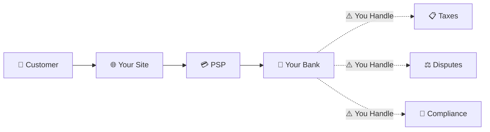
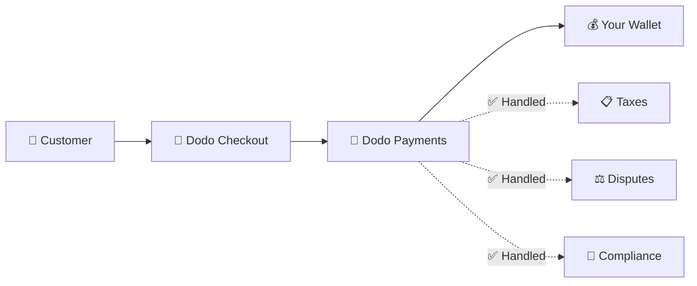
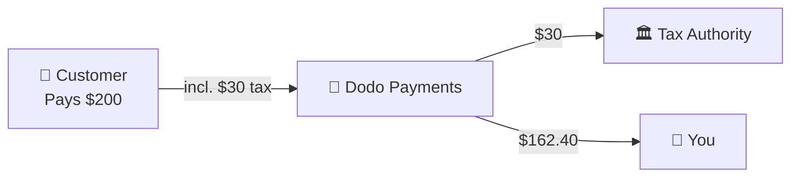

Dodo Payments fungerar som en **Merchant of Record (MoR)** — vi blir den juridiska säljaren av dina digitala produkter och tar på oss ansvaret för betalningar, skatter, bedrägerier och efterlevnad så att du kan fokusera helt på att bygga din produkt.

<CardGroup cols={3}>
{/* LOCKED_PATTERN_0dfe8c9e68953181aad63120292193bb */}
Skatteefterlevnad hanteras automatiskt
</Card>

{/* LOCKED_PATTERN_a7f32ee62695527a537b82d99f01c4bc */}
Kort, plånböcker och lokala metoder
</Card>

{/* LOCKED_PATTERN_cb6e35d755bb02c3f1254b1c5a9c4c73 */}
Vi hanterar alla överföringar
</Card>
</CardGroup>

## Vad är en Merchant of Record?

En **Merchant of Record** är den juridiska enhet som visas på din kunds kreditkortutdrag och tar ansvar för transaktionen. När du använder Dodo Payments som din MoR:

- **Vi är den juridiska säljaren** — Dodo visas på bankutdrag och kvitton
- **Du är produktens skapare** — Du bygger, prissätter och levererar din produkt
- **Vi hanterar back office** — Skatter, tvister, efterlevnad och faktureringssupport
- **Du får nettoutbetalningar** — Intäkter sätts direkt in på ditt konto

<Note>
Tänk på en Merchant of Record som att anställa ett globalt ekonomiteam som sköter fakturering, skatt och betalningshantering i varje land — utan att du behöver lyfta ett finger.
</Note>

## Varför använda en Merchant of Record?

Att sälja digitala produkter globalt innebär att navigera i moms i Europa, GST i Australien, försäljningsskatt i USA och otaliga andra krav. Varje jurisdiktion har olika regler, skattesatser, trösklar och inlämningsfrister.

| Ditt Ansvar | Utan MoR | Med Dodo som MoR |
|---------------------|:-----------:|:----------------:|
| Moms/GST Registrering | ❌ Du | ✅ Dodo |
| Skatteberäkning | ❌ Du | ✅ Dodo |
| Skattedeklaration & Remittering | ❌ Du | ✅ Dodo |
| Återbetalningsansvar | ❌ Du | ✅ Dodo |
| PCI Efterlevnad | ❌ Du | ✅ Dodo |
| Stöd för Flera Valutor | ❌ Komplicerat | ✅ Inbyggt |
| Lokala Betalningsmetoder | ❌ Integrera Varje | ✅ 30+ Inkluderat |

<Tip>
**Exempel**: Säljer du en prenumeration på €50/månad till en fransk kund?

**Utan MoR**: Registrera för fransk moms, ta ut €60 (20% moms), lämna in kvartalsvisa franska deklarationer, hantera revisioner — på franska.

**Med Dodo**: Vi tar in €60, betalar €10 moms till Frankrike och betalar dig €50 minus avgifter. Du skriver kod.
</Tip>

## PSP vs. MoR: Viktiga Skillnader

Att förstå skillnaden mellan en **Betalningstjänstleverantör** (som Stripe) och en **Merchant of Record** är avgörande.

### Betalningstjänstleverantör (PSP)

En PSP bearbetar transaktioner men lämnar dig som den juridiska säljaren:

<Warning>
Med en PSP är **du** ansvarig för skattemässig registrering, inhämtning, rapportering och betalning i varje jurisdiktion där du har kunder.
</Warning>

### Merchant of Record (Dodo)

En MoR blir den juridiska säljaren och hanterar efterlevnad från början till slut:

<Check>
Med Dodo som MoR hanterar vi skatter, tvister och efterlevnad. Du får nettoutbetalningar utan pappersarbete.
</Check>

### Jämförelse Sida vid Sida

| Aspekt | PSP (Stripe, etc.) | MoR (Dodo) |
|--------|:------------------:|:----------:|
| Juridisk Säljare | Ditt Företag | Dodo |
| På Kundens Uttdrag | Ditt Namn | Dodo |
| Skatteregistrering | ❌ Du | ✅ Dodo |
| Skatteberäkning | ❌ Du | ✅ Dodo |
| Skatteremittering | ❌ Du | ✅ Dodo |
| Återbetalningsrisk | ❌ Du | ✅ Dodo |
| PCI Efterlevnad | ❌ Du | ✅ Dodo |
| Global Setup | Komplicerat | Enkelt |

<Info>
**Viktigt**: Både PSP och MoR hanterar betalningsbearbetning. Den avgörande skillnaden är **vem som är juridiskt ansvarig** för skattemässig efterlevnad och transaktionsansvar.
</Info>

## Hur Skatteöverensstämmelse Fungerar

Dodo hanterar hela skattecykeln automatiskt:

<Steps>
{/* LOCKED_PATTERN_9939f53f87faa28f5e85c7bcd4aa5d90 */}
Vi upptäcker kundens land och avgör vilken skattereglering som gäller — moms, GST, sales tax eller andra lokala krav.
</Step>

{/* LOCKED_PATTERN_70142fc485c0e1d535a43e599b490143 */}
Korrekt skattesats beräknas baserat på produkttyp, kundens plats och B2B/B2C-status. EU-företagskunder med giltiga momsnummer får omvänd skattskyldighet automatiskt.
</Step>

{/* LOCKED_PATTERN_44b82b1d71e9f255cf562f67916ee9b7 */}
Skatt visas tydligt och samlas in i kassan. Kunderna ser exakt vad de betalar.
</Step>

{/* LOCKED_PATTERN_1a778e95cb3812007334c0b47194f9ac */}
Vi lämnar in deklarationer och betalar insamlade skatter till relevanta myndigheter enligt schema. Du ser aldrig ett skatteformulär.
</Step>
</Steps>

## Intäktsflöde

Så här rör sig pengarna från kund till ditt konto:

### Exempel på Utbetalningsuppdelning

| Post | Belopp |
|-----------|-------:|
| Kundbetalning | $200.00 |
| Försäljningsskatt (15% moms) | −$30.00 |
| Dodo Plattformavgift (4%) | −$8.00 |
| Betalningsbearbetning | −$0.60 |
| **Din Utbetalning** | **$162.40** |

## När man Väljer MoR vs. PSP

<Tabs>
{/* LOCKED_PATTERN_1d2e428d12b1ee53f2d946d9302bede1 */}
**Dodo Payments är idealiskt om du:**

- Säljer digitala produkter, SaaS eller prenumerationer
- Har kunder i flera länder
- Vill undvika huvudvärken med skattemässig registrering
- Föredrar förutsägbar, outsourcad efterlevnad
- Värdesätter snabb marknadsintroduktion framför maximalt kontroll
- Inte vill hantera tvister och bedrägerier
</Tab>

{/* LOCKED_PATTERN_9020967e8e2c9a3ebc575f4072e18e76 */}
**En PSP kan passa dig om du:**

- Verkar främst i ett land
- Har interna finans- och efterlevnadsteam
- Behöver fullständig kontroll över kassaupplevelsen
- Arbetar med extremt små marginaler
- Säljer fysiska varor (MoR fokuserar på digitalt)
</Tab>
</Tabs>

<Note>
Många företag börjar med en PSP och byter till en MoR när de växer internationellt. Dodo erbjuder migrationssupport för att göra övergången sömlös.
</Note>

## Vanliga Frågor

<AccordionGroup>
{/* LOCKED_PATTERN_03db007d1397fc75cc7c059a12f7514d */}
Dodo Payments framträder som handlaren. Vi inkluderar din produkt-/varumärkesreferens där teckenbegränsningar tillåter, och kunder får detaljerade kvitton som visar din produktinformation.
</Accordion>

{/* LOCKED_PATTERN_14efbd55af6b9971cc9bb290118d1ce5 */}
Ja. Du styr pris, varumärke, produktleverans och direkt kommunikation. Dodo hanterar faktureringsmekaniken, men kunderna vet att de köper från dig. Ditt varumärke syns tydligt i kassan, mejl och fakturor.
</Accordion>

{/* LOCKED_PATTERN_5e87ff5ce15f8c25ec293008878ec1c8 */}
För B2B-försäljning inom EU kan kunder ange sitt momsnummer i kassan. Vi validerar det och tillämpar omvänd skattskyldighet automatiskt — skatten flyttas till köparens momsdeklaration istället för att samlas in.
</Accordion>

{/* LOCKED_PATTERN_828a96aed23c294d40585d542017c689 */}
Dodo fungerar som en komplett lösning med vår betalningsinfrastruktur. Denna integration gör att vi kan ta på oss skatt- och bedrägeriansvar. Vi arbetar för att kunna erbjuda integration med andra betalningsleverantörer i framtiden.
</Accordion>

{/* LOCKED_PATTERN_7d718a1b657f28e952148f962ca6593e */}
Initiera återbetalningar från din instrumentpanel. Vi behandlar återbetalningen med kundens ursprungliga betalningsmetod och valuta. Skattebelopp justeras och avstämmas automatiskt.
</Accordion>

{/* LOCKED_PATTERN_dc7f113144600495109fc2c229c89f70 */}
Dodo hanterar **försäljningsskatter** (moms, GST, sales tax) på kundtransaktioner. Du ansvarar fortfarande för ditt företags inkomstskatt, bolagsskatt och skattemässiga skyldigheter på de utbetalningar du får.
</Accordion>

{/* LOCKED_PATTERN_04ec30ba2875e1ca25e9a1ae1dcc112d */}
Vi accepterar betalningar från 220+ länder och regioner och växer kontinuerligt. Se hela listan:

{/* LOCKED_PATTERN_1baa59aa331aff639990872bb61046bd */}
Visa alla 220+ länder och regioner där vi accepterar betalningar.
</Card>
</Accordion>
</AccordionGroup>

## Kom igång

<CardGroup cols={2}>
{/* LOCKED_PATTERN_a6e00712f4bf1e0645985bccec8d5def */}
Registrera dig gratis och acceptera globala betalningar på några minuter.
</Card>

{/* LOCKED_PATTERN_d858044e80838a32f52c51b21b17f5eb */}
Detaljerad jämförelse med exempel och användningsfall.
</Card>

{/* LOCKED_PATTERN_4e501d9df0a1b75ab7c08a16b87219c5 */}
Lär dig vilka företag vi stödjer.
</Card>

{/* LOCKED_PATTERN_6053eaa23d9fa4210c02c58e94af8536 */}
Få personlig vägledning från vårt team.
</Card>
</CardGroup>
