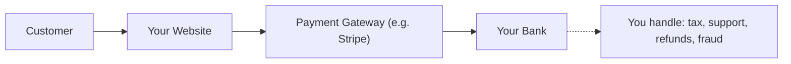
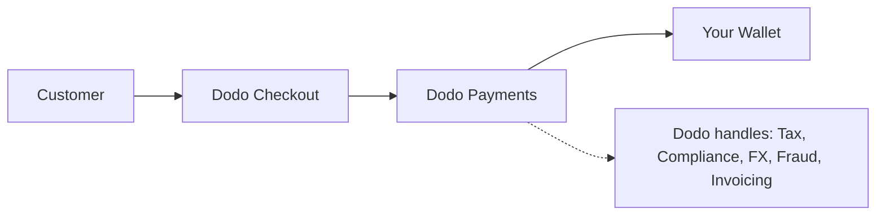

## Introduktion

Denna guide jämför MoR-modellen med den traditionella Payment Gateway-ansatsen, vilket hjälper dig att förstå de fördelar som Dodo Payments ger till ditt företag.

## Den Grundläggande Skillnaden

| Funktion                          | MoR (Dodo Payments)         | Payment Gateway (Traditionell PG)           |
|----------------------------------|--------------------------------------------|--------------------------------------------|
| Laglig Säljare                   | Dodo Payments (MoR)                        | Ditt Företag                               |
| Skatteinsamling & Remittering    | Hanteras av Dodo                            | Du är ansvarig                            |
| Efterlevnad & Regulatoriskt Ansvar| Dodo åtar sig ansvar                      | Du hanterar lokala lagar och chargebacks   |
| Valuta för Avräkning             | USD, EUR, INR och 25+ andra stöds         | Beror på ditt säljarkonto                  |
| Riskhantering                    | Inbyggt skydd mot bedrägeri och chargebacks| Du sätter upp dina egna verktyg (t.ex. Stripe Radar) |
| Utbetalningar                    | Aggererade och förenklade globala utbetalningar | Direkt från PG till dig, med bankuppsättning |

## Vad Det Betyder För Dig

Med **Dodo som MoR**, blir vi den lagliga säljaren till dina kunder, vilket gör att du kan:

- Hoppa över att sätta upp lokala enheter
- Undvika att hantera moms, GST eller försäljningsskatt
- Erbjuda fler betalningsmetoder globalt
- Minska juridisk risk
- Lansera snabbare på nya marknader

<Note>
Tänk dig att sälja en digital prenumeration till en användare i Frankrike. Med Dodo Payments samlar vi in betalningen, redovisar moms till franska myndigheter och skickar dig nettointäkten. Inga skattehuvudvärk. Inga advokater. Bara tillväxt.
</Note>

Dessutom förenklar MoR-modellen hela din back office. Som din MoR hanterar Dodo PCI-efterlevnad, bedrägeridetektion, valutakonvertering och till och med kundfakturastöd, vilket frigör ditt team att fokusera på produkt och tillväxt.

## Visuell Jämförelse

**Intäktsflöde: Payment Gateway**

**Intäktsflöde: Merchant of Record (Dodo)**

## Varför Det Är Viktigt för SaaS & Digitala Företag

När ditt företag växer kan hantering av skatter, efterlevnad och globala betalningspreferenser bli överväldigande. Med en betalningsgateway är du ansvarig för:

- Moms/GST-registrering och redovisning i flera jurisdiktioner
- Hantering av valutakonvertering och chargebacks
- Att tillhandahålla lokaliserad kassa och betalningsmetoder

Med Dodo Payments som din MoR:
- Du expanderar globalt utan att sätta upp lokala enheter
- Skatter beräknas, samlas in och remitteras å dina vägnar
- Du får tillgång till ett bibliotek av betalningsmetoder anpassade till dina kunder
- Vi agerar som din juridiska buffert och operativa partner

<Tip>
"Tänk på en betalningsgateway som en tunnel. Föreställ dig nu att Merchant of Record är en tunnel, tåg, förare och biljettpersonal i ett."
</Tip>

## Vem Bör Använda MoR?

Dodo Payments är perfekt för:
- SaaS- och digitala produktföretag
- Indie-skapare och soloföretagare
- Globala företag med kunder i över 100 länder
- Företag som inte vill hantera skatter och efterlevnad internt

Om du expanderar internationellt, säljer prenumerationer eller bara vill minska operativa huvudvärk, är MoR det smartare valet.

## När Ska Man Använda en Betalningsgateway Istället

Det finns fall där det kan vara meningsfullt att bara använda en betalningsgateway:
- Ditt företag verkar endast i ett land
- Du har redan interna resurser för ekonomi och efterlevnad
- Du kräver fullständig kontroll över kundens faktureringsupplevelse
- Du är mycket kostnadskänslig med tunna marginaler i stor skala

<Note>
För många startups kan det initialt vara tillräckligt att använda en gateway - men när komplexiteten växer kan en övergång till en MoR spara tid, minska risk och påskynda internationell tillväxt.
</Note>

## Varför Välja Dodo Payments

Dodo Payments erbjuder:
- En allt-i-ett betalnings-, skatte- och efterlevnadsstack
- Realtids FX och flervaluta stöd
- Tillgång till 30+ betalningsmetoder
- Säte-baserad fakturering, prenumerationer och engångsbetalningar
- Automatiserad skattehantering i över 150 länder
- Inbyggt bedrägeriskydd och PCI-efterlevnad

Oavsett om du är en ensam grundare eller ett växande SaaS-team, förenklar Dodo komplexiteten i att sälja globalt.

## Lär Dig Mer

<CardGroup cols={2}>
<Card title="Adaptiv Valutastöd" icon="money-bill-wave" href="/features/adaptive-currency">
Lär dig hur Dodo automatiskt presenterar priser i dina kunders lokala valutor
</Card>

<Card title="Stödda Betalningsmetoder" icon="credit-card" href="/features/payment-methods">
Upptäck de 30+ betalningsmetoder som finns tillgängliga genom Dodo Payments
</Card>
</CardGroup>

## Redo att Byta?

Gå med i 3 000+ digitala företag som använder Dodo Payments för att sälja globalt, utan gränser eller flaskhalsar.

<CardGroup cols={2}>
<Card title="Registrera dig Gratis" icon="user-plus" href="https://app.dodopayments.com/signup">
Skapa ditt Dodo Payments-konto och börja sälja globalt idag
</Card>

<Card title="Prata med Försäljning" icon="envelope" href="mailto:founders@dodopayments.com">
Få personlig vägledning från vårt team
</Card>
</CardGroup>

<Tip>
Låt Dodo hantera det svåra - så att du kan fokusera på att bygga en fantastisk produkt.
</Tip>