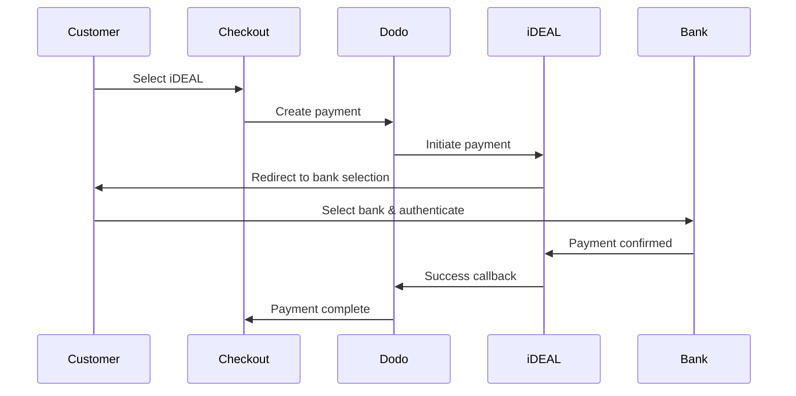

Europeiska kunder föredrar starkt lokala betalningsmetoder som integreras med deras banksystem. Att erbjuda dessa metoder kan öka konverteringsgraden med 20–40 % på målmarknaderna.

## Varför lokala europeiska betalningsmetoder?

<CardGroup cols={3}>
<Card title="Higher Conversion" icon="chart-line">
iDEAL står för cirka 60 % av nederländska onlinebetalningar. Att inte erbjuda det innebär att tappa kunder.
</Card>

<Card title="Lower Fraud" icon="shield-check">
Bankautentiserade betalningar har nära noll bedrägerier och inga chargebacks.
</Card>

<Card title="Real-Time Settlement" icon="bolt">
De flesta europeiska metoder ger omedelbar betalningsbekräftelse.
</Card>
</CardGroup>

## Stödda metoder

| Metod | Land | Marknadsandel | Valuta | Prenumerationer |
| :----- | :------ | :----------- | :------- | :-----------: |
| **iDEAL** | Netherlands | ~60% | EUR | No |
| **Bancontact** | Belgium | ~50% | EUR | No |
| **EPS** | Austria | ~30% | EUR | No |
| **Multibanco** | Portugal | ~40% | EUR | No |

## iDEAL (Nederländerna)

iDEAL är den dominerande onlinebetalningsmetoden i Nederländerna och kopplar direkt till alla större nederländska banker.

### Så fungerar det



### Stödda banker

Alla stora nederländska banker stöds:
- ABN AMRO
- ASN Bank
- Bunq
- ING
- Knab
- Rabobank
- RegioBank
- Revolut
- SNS
- Triodos Bank
- Van Lanschot

### Konfiguration

```javascript
const session = await client.checkoutSessions.create({
  product_cart: [{ product_id: 'prod_123', quantity: 1 }],
  allowed_payment_method_types: ['ideal', 'credit', 'debit'],
  billing_currency: 'EUR',
  billing_address: {
    country: 'NL',
    zipcode: '1012JS'
  },
  return_url: 'https://example.com/success'
});
```

## Bancontact (Belgien)

Bancontact är Belgiens nationella betalsystem, som används av praktiskt taget alla belgiska banker för onlinebetalningar.

### Funktioner
- Fungerar med befintliga belgiska betalkort
- Mobilappstöd (Payconiq by Bancontact)
- Omedelbar betalningsbekräftelse
- Ingen ytterligare registrering krävs för kunder

### Konfiguration

```javascript
const session = await client.checkoutSessions.create({
  product_cart: [{ product_id: 'prod_123', quantity: 1 }],
  allowed_payment_method_types: ['bancontact_card', 'credit', 'debit'],
  billing_currency: 'EUR',
  billing_address: {
    country: 'BE',
    zipcode: '1000'
  },
  return_url: 'https://example.com/success'
});
```

## EPS (Österrike)

EPS (Electronic Payment Standard) möjliggör direkta onlinebanköverföringar för österrikiska kunder.

### Funktioner
- Direkt integration med österrikiska banker
- Betalningsbekräftelse i realtid
- Hög tillit bland österrikiska konsumenter
- Inga chargebacks

### Stödda banker

Stora österrikiska banker, inklusive:
- Erste Bank
- Bank Austria
- Raiffeisen
- BAWAG
- Volksbank

### Konfiguration

```javascript
const session = await client.checkoutSessions.create({
  product_cart: [{ product_id: 'prod_123', quantity: 1 }],
  allowed_payment_method_types: ['eps', 'credit', 'debit'],
  billing_currency: 'EUR',
  billing_address: {
    country: 'AT',
    zipcode: '1010'
  },
  return_url: 'https://example.com/success'
});
```

## Multibanco (Portugal)

Multibanco är Portugals interbanknätverk och erbjuder både onlinebetalningar och bankomatbetalningar.

### Betalningsalternativ

1. **Internetbank** — Direkt banköverföring via internetbank
2. **Bankomatbetalning** — Kunden får en referens att betala vid vilken Multibanco-bankomat som helst
3. **Mobilbank** — Betalning via bankens mobilappar

### Hur bankomatbetalning fungerar

Vid bankomatbetalningar får kunderna en betalningsreferens:

```
Entity: 12345
Reference: 123 456 789
Amount: €50.00
Expiry: 24 hours
```

Kunden kan betala vid vilken portugisisk bankomat som helst eller via internetbank med denna referens.

### Konfiguration

```javascript
const session = await client.checkoutSessions.create({
  product_cart: [{ product_id: 'prod_123', quantity: 1 }],
  allowed_payment_method_types: ['multibanco', 'credit', 'debit'],
  billing_currency: 'EUR',
  billing_address: {
    country: 'PT',
    zipcode: '1000-001'
  },
  return_url: 'https://example.com/success'
});
```

<Note>
Multibanco-bankomatbetalningar kan ha en fördröjning mellan utcheckning och faktisk betalning. Övervaka webbhooks för betalningsbekräftelse.
</Note>

## API-metodtyper

| Typ | Metod | Land |
| :--- | :----- | :------ |
| `ideal` | iDEAL | Netherlands |
| `bancontact_card` | Bancontact | Belgium |
| `eps` | EPS | Austria |
| `multibanco` | Multibanco | Portugal |

## Europeisk kassa för flera länder

För företag som betjänar flera europeiska länder, inkludera alla regionala metoder:

```javascript
const session = await client.checkoutSessions.create({
  product_cart: [{ product_id: 'prod_123', quantity: 1 }],
  allowed_payment_method_types: [
    'ideal',           // Netherlands
    'bancontact_card', // Belgium
    'eps',             // Austria
    'multibanco',      // Portugal
    'credit',          // Fallback
    'debit'            // Fallback
  ],
  billing_currency: 'EUR',
  return_url: 'https://example.com/success'
});
```

Dodo visar automatiskt endast relevanta metoder baserat på kundens plats. En nederländsk kund kommer att se iDEAL; en belgisk kund kommer att se Bancontact.

## Testning

Europeiska betalningsmetoder kan testas i sandlådeläge. Testflödet simulerar bankautentiseringsprocessen.

<Steps>
<Step title="Enable test mode">
Använd dina test-API-nycklar från Dodo Payments.
</Step>

<Step title="Set appropriate billing address">
Ställ in faktureringslandet så att det överensstämmer med betalningsmetoden:
- `NL` för iDEAL
- `BE` för Bancontact
- `AT` för EPS
- `PT` för Multibanco
</Step>

<Step title="Complete the test flow">
Följ det simulerade bankautentiseringsflödet i testmiljön.
</Step>
</Steps>

## Bästa praxis

<AccordionGroup>
<Accordion title="Always include regional methods for target markets">
Om du säljer till nederländska kunder, inkludera iDEAL. Att inte göra det är som att inte ta emot Visa i USA — du kommer att förlora betydande försäljning.
</Accordion>

<Accordion title="Match currency to region">
Europeiska betalningsmetoder kräver EUR. Säkerställ att din prissättning stöder eurotransaktioner.
</Accordion>

<Accordion title="Handle redirects gracefully">
Alla europeiska metoder innebär omdirigeringar till banksajter. Säkerställ att din hantering av retur-URL är robust och tar hänsyn till användare som avbryter mitt i flödet.
</Accordion>

<Accordion title="Provide card fallbacks">
Inte alla europeiska kunder har tillgång till dessa regionala metoder (turister, expats osv.). Inkludera alltid `credit` och `debit` som reservalternativ.
</Accordion>

<Accordion title="Consider Multibanco timing">
Multibanco-bankomatbetalningar kan ta timmar att slutföra. Blockera inte leverans baserat på omedelbar betalning — använd webbhooks för asynkron bekräftelse.
</Accordion>
</AccordionGroup>

## Felsökning

<AccordionGroup>
<Accordion title="European method not appearing">
**Kontrollera:**
1. Matchar kundens faktureringsland metodens land?
2. Är valutan inställd på EUR?
3. Ingår metoden i `allowed_payment_method_types`?

**Lösning:** Europeiska metoder är strikt regionala. En kund med faktureringsland `DE` (Tyskland) kommer inte att se iDEAL, som endast gäller Nederländerna.
</Accordion>

<Accordion title="Bank authentication failed">
**Orsaker:**
- Kunden avbröt under bankautentiseringen
- Bankens autentiseringssystem tillfälligt otillgängligt
- Kunden angav fel uppgifter

**Lösning:** Kunden bör försöka igen. Om problemet kvarstår, föreslå att prova en annan betalningsmetod.
</Accordion>

<Accordion title="Redirect not completing">
**Orsaker:**
- Kunden stängde webbläsaren under bankens omdirigering
- Nätverksproblem under autentiseringen
- Retur-URL felkonfigurerad

**Lösning:** Verifiera att retur-URL är korrekt och åtkomlig. Säkerställ att den hanterar både lyckade och misslyckade tillstånd.

<Accordion title="Multibanco payment pending">
**Orsak:** Kunden fick en betalningsreferens men har ännu inte betalat.

**Lösning:** Detta är väntat för bankomatbetalningar. Vänta på webhook-bekräftelse. Referensen går vanligtvis ut inom 24–72 timmar.
</Accordion>
</AccordionGroup>

## PSD2-efterlevnad

Alla europeiska betalningsmetoder följer PSD2 (Payment Services Directive 2):

- **Strong Customer Authentication (SCA)** — Inbyggt i bankautentiseringsflödet
- **Secure Communication** — All data överförs via säkra kanaler
- **Consumer Protection** — Full efterlevnad av EU:s konsumenträttigheter

## Relaterade sidor

{/* LOCKED_PATTERN_bd3b9ce11ef978f59c6eb5461169b62 */}
<Card title="Payment Methods Overview" icon="credit-card" href="/features/payment-methods">
Se alla stödda betalningsmetoder.
</Card>

<Card title="Adaptive Currency" icon="globe" href="/features/adaptive-currency">
Valutastöd och automatisk konvertering.
</Card>

<Card title="Checkout Guide" icon="book" href="/developer-resources/checkout-session">
Komplett guide för checkout-implementering.
</Card>

<Card title="Webhooks" icon="webhook" href="/developer-resources/webhooks">
Hantera betalningsbekräftelser asynkront.
</Card>
</CardGroup>