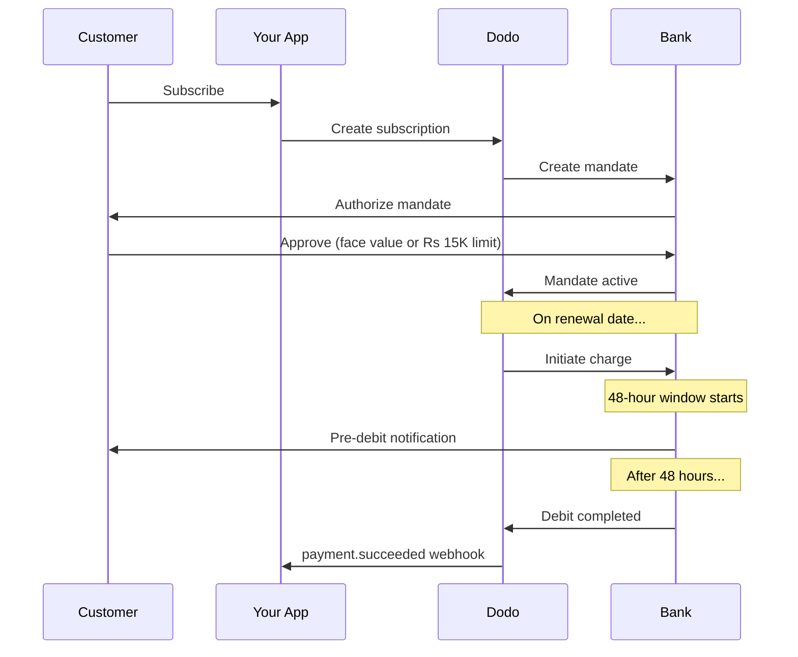

Indien har en unik betalningsinfrastruktur dominerad av UPI (60%+ av digitala transaktioner) och Rupay-kort. Dodo Payments stöder båda med fullständig RBI-överensstämmelse för prenumerationsmandat.

## Varför indiska betalningsmetoder är viktiga

<CardGroup cols={3}>
{/* LOCKED_PATTERN_fef1794963d9b6cdb65542c69efa8053 */}
UPI hanterar mer än 10 miljarder transaktioner per månad. Många indiska kunder har inte internationella kort.
</Card>

{/* LOCKED_PATTERN_b5f6c506ac5b1c8b661845e44f7fdc6c */}
UPI har nästan noll transaktionsavgifter. Utmärkt för transaktioner med hög volym och lägre värde.
</Card>

{/* LOCKED_PATTERN_4d6aa00708c7fde98b8f2cfed63c3234 */}
Till skillnad från de flesta alternativa betalningsmetoder stöder UPI och Rupay återkommande betalningar via RBI-mandat.
</Card>
</CardGroup>

## Stödda metoder

| Metod | Typ | Prenumerationer | Minimibelopp |
| :----- | :--- | :-----------: | :--------- |
| **UPI Collect** | QR-kod / VPA | Ja* | ₹1 |
| **Rupay Credit** | Kort | Ja* | ₹1 |
| **Rupay Debit** | Kort | Ja* | ₹1 |

*Prenumerationer kräver RBI-kompatibla mandat med speciella behandlingsregler.

## Konfiguration

### API Metodtyper

| Typ | Beskrivning |
| :--- | :---------- |
| `upi_collect` | UPI via QR-kod eller VPA-inmatning |
| `credit` | Kreditkort inklusive Rupay |
| `debit` | Betalkort inklusive Rupay |

### Exempel: Indien-fokuserad kassa

```javascript
const session = await client.checkoutSessions.create({
  product_cart: [{ product_id: 'prod_123', quantity: 1 }],
  allowed_payment_method_types: [
    'upi_collect',
    'credit',
    'debit'
  ],
  billing_currency: 'INR',
  customer: {
    email: 'customer@example.in',
    name: 'Priya Sharma',
    phone_number: '+919876543210'
  },
  billing_address: {
    country: 'IN',
    zipcode: '560001'
  },
  return_url: 'https://example.com/success'
});
```

### Krav för UPI

För att UPI ska visas i kassan:
1. **Billing country** måste vara Indien (`IN`)
2. **Currency** måste vara INR
3. För icke-indiska handlare: **Adaptive Currency** måste vara aktiverat

<Warning>
Om du är en icke-indisk handlare och Adaptive Currency inte är aktiverat, kommer UPI inte vara tillgängligt för dina kunder.
</Warning>

## Prenumerationer med RBI-mandat

Indiska betalningsmetodsprenumerationer fungerar under RBI (Reserve Bank of India) föreskrifter med unika krav.

### Hur RBI-mandat fungerar



### Mandattyper

| Prenumerationsbelopp | Mandattyp | Gräns |
| :------------------ | :----------- | :---- |
| **Under Rs 15,000** | Behovsmandat | Rs 15,000 |
| **Rs 15,000 eller mer** | Fast belopp mandat | Exakt prenumerationsbelopp |

**Viktigt för planändringar:** Om en uppgradering resulterar i en avgift som överskrider den befintliga mandatgränsen, kommer avgiften att misslyckas och kunden måste ge nytt tillstånd.

### Den 48-timmars behandlingsfördröjningen

Detta är den mest betydande skillnaden från internationella kortbetalningar:

<Steps>
{/* LOCKED_PATTERN_1168a75869d212ca7106c3911617bd37 */}
På det schemalagda förnyelsedatumet initierar Dodo avgiften hos banken.
</Step>

{/* LOCKED_PATTERN_303e0505fa00f1fe9b5d2ed06a9b7975 */}
Kunden får en avisering från sin bank om den kommande debiteringen.
</Step>

{/* LOCKED_PATTERN_ccf36ccdabfae2684bf414d6b78bda31 */}
Kunden kan avboka mandatet under denna period via sin bankapp.
</Step>

{/* LOCKED_PATTERN_171b46159c8bf2894fdd8df12890dd5f */}
Efter 48 timmar (plus upp till 3 ytterligare timmar för bankbehandling) dras pengarna.
</Step>

{/* LOCKED_PATTERN_183bd9c4ee3d030e8b4107a7afb42a77 */}
`payment.succeeded` webhook skickas efter den faktiska debiteringen, inte vid initieringen.
</Step>
</Steps>

<Warning>
**Ge inte förmåner vid initiering av avgiften.** Vänta på `payment.succeeded` webhook, som kommer ~48–51 timmar efter det schemalagda avgiftsdatumet.
</Warning>

### Hantering av 48-timmarsfönstret

```javascript
// DON'T do this:
async function handleSubscriptionRenewal(subscription) {
  // ❌ Bad: Granting access immediately when charge is initiated
  grantPremiumAccess(subscription.customer_id);
}

// DO this:
async function handlePaymentWebhook(event) {
  if (event.type === 'payment.succeeded') {
    // ✅ Good: Only grant access after payment is confirmed
    grantPremiumAccess(event.data.customer_id);
  }
  
  if (event.type === 'payment.failed') {
    // Handle failed payment (mandate cancelled, insufficient funds)
    revokePremiumAccess(event.data.customer_id);
  }
}
```

### Webhook-händelser för indiska prenumerationer

| Händelse | När | Åtgärd |
| :---- | :--- | :----- |
| `subscription.created` | Mandat auktoriserat | Registrera abonnemangsstart |
| `payment.succeeded` | ~48h efter avgiftsdatumet | Bevilja/förläng tillgång |
| `payment.failed` | Debitering misslyckades | Meddela kunden, pausa tillgång |
| `subscription.on_hold` | Betalning misslyckades | Be om uppdatering av betalningsmetod |
| `subscription.active` | Återaktiverat efter betalning | Återställ tillgång |

## Testning

### UPI test-ID:n

| Status | UPI-ID |
| :----- | :----- |
| Lyckad | `success@upi` |
| Misslyckad | `failure@upi` |

### Indiska kort testnummer

| Märke | Scenario | Kortnummer | Utgång | CVV |
| :---- | :------- | :---------- | :----- | :-- |
| Visa | Lyckad | `4576238912771450` | 06/32 | 123 |
| Visa | Nekad | `4706131211212123` | 06/32 | 123 |
| Mastercard | Lyckad | `5409162669381034` | 06/32 | 123 |
| Mastercard | Nekad | `5105105105105100` | 06/32 | 123 |

## Bästa praxis

<AccordionGroup>
{/* LOCKED_PATTERN_221aaba4b8e7504ee0b95e31b042b2fd */}
Bygg din applikation för att hantera gapet mellan avgiftsinitiering och faktisk betalning. Överväg:
- Grace-perioder för abonnemangstillgång
- Tydlig kommunikation till kunderna om behandlingstiden
- Uppfyllelse baserad på webhook, inte datumdriven
</Accordion>

{/* LOCKED_PATTERN_ba2df03fe2862fb850b01eef0893fa6f */}
Kunder kan när som helst avboka mandat via sina bankappar. Övervaka `subscription.on_hold` webhooks och be kunderna att prenumerera igen eller uppdatera betalningsmetoder.
</Accordion>

{/* LOCKED_PATTERN_e710fb81847c744d4006e4fca6c121cf */}
För rörlig prissättning (t.ex. användningsbaserad) bör du överväga om ett Rs 15 000-mandat på begäran är tillräckligt. Om avgifter kan överstiga detta behöver kunderna återauktorisera.
</Accordion>

{/* LOCKED_PATTERN_3761baecc3c28c65031747389aa832d0 */}
För indiska kunder bör UPI vara primärt betalningsalternativ. Många användare föredrar det framför kort på grund av vana och lägre friktion.
</Accordion>
</AccordionGroup>

## Felsökning

<AccordionGroup>
{/* LOCKED_PATTERN_13ae9b97a0d5eeadd371a86881f06ee7 */}
**Kontrollera:**
1. Är faktureringslandet inställt på `IN`?
2. Är valutan inställd på `INR`?
3. Om du är en icke-indisk handlare: Är Adaptive Currency aktiverat?
4. Är `upi_collect` inkluderat i `allowed_payment_method_types`?

**Lösning:** Verifiera att faktureringsadressen har `country: "IN"` och `billing_currency: "INR"`.
</Accordion>

{/* LOCKED_PATTERN_1f64fa5b04b26f30c279116fbd022060 */}
**Orsak:** Det nya avgiftsbeloppet överstiger det befintliga mandatets gräns (gräns på Rs 15 000).

**Lösning:** Kunden måste uppdatera betalningsmetoden för att skapa ett nytt mandat med korrekt gräns.
</Accordion>

{/* LOCKED_PATTERN_69921150c2a11d99e3416ff7a65f0f34 */}
**Orsak:** Kunden kan ha avbrutit mandatet under 48-timmarsfönstret eller så nekade banken debiteringen.

**Lösning:** Kunden måste återauktorisera mandatet eller uppdatera betalningsmetoden.
</Accordion>

{/* LOCKED_PATTERN_36c4e373527e46486381ecf56059b96b */}
**Orsak:** Fördröjningar i bankens API kan förlänga behandlingen med 2–3 extra timmar.

**Lösning:** Detta är väntat. Bygg ditt system för att hantera varierande förseningar på upp till ~51 timmar totalt.
</Accordion>

{/* LOCKED_PATTERN_8c8856d83fe8bccc50ae2ce27bf29465 */}
**Orsak:** Kantsfall i RBI-reglerna – mandatavbokning under behandlingsfönstret avbryter inte omedelbart prenumerationen.

**Lösning:** Nästa avgift kommer att misslyckas och prenumerationen flyttas till `on_hold`. Övervaka webhooks för `payment.failed`.
</Accordion>
</AccordionGroup>

## Relaterade sidor

<CardGroup cols={2}>
{/* LOCKED_PATTERN_014d7e4ef5d99df996cbbae24da710a6 */}
Se alla stödda betalningsmetoder.
</Card>

{/* LOCKED_PATTERN_a10e92592ab9390be911120f2bcecbd0 */}
Komplett abonnemangsdokumentation inklusive RBI-mandat.
</Card>

<Card title="Webhooks" icon="webhook" href="/developer-resources/webhooks">
Webhook-hantering för betaltevenemang.
</Card>

{/* LOCKED_PATTERN_969f11f876a6712c92c3c11cb433bf1f */}
All testdata inklusive UPI-ID:n och indiska kort.
</Card>
</CardGroup>