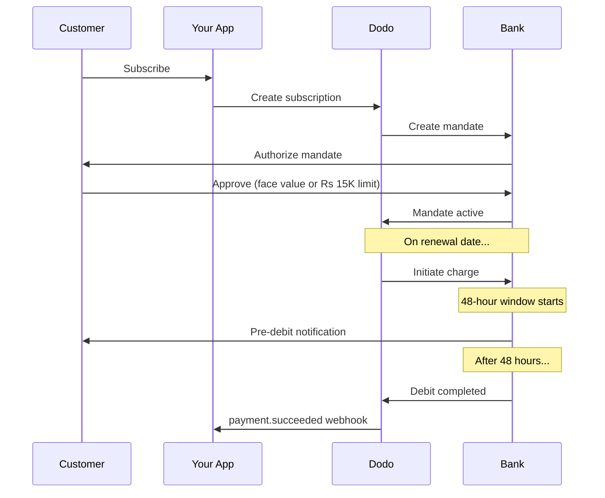

Indien har en unik betalningsinfrastruktur dominerad av UPI (60%+ av digitala transaktioner) och Rupay-kort. Dodo Payments stöder båda med fullständig RBI-överensstämmelse för prenumerationsmandat.

## Varför indiska betalningsmetoder är viktiga

<CardGroup cols={3}>
<Card title="UPI-dominans" icon="mobile">
UPI hanterar 10B+ transaktioner/månad. Många indiska kunder har inte internationella kort.
</Card>

<Card title="Låga transaktionskostnader" icon="indian-rupee-sign">
UPI har nästan noll transaktionsavgifter. Utmärkt för högvolym, lågvärdetransaktioner.
</Card>

<Card title="Stöd för prenumerationer" icon="repeat">
Till skillnad från de flesta alternativa betalningsmetoder stödjer UPI och Rupay återkommande betalningar via RBI-mandat.
</Card>
</CardGroup>

## Stödda metoder

| Metod | Typ | Prenumerationer | Minimibelopp |
| :----- | :--- | :-----------: | :--------- |
| **UPI Collect** | QR-kod / VPA | Ja* | ₹1 |
| **Rupay Credit** | Kort | Ja* | ₹1 |
| **Rupay Debit** | Kort | Ja* | ₹1 |

*Prenumerationer kräver RBI-kompatibla mandat med speciella behandlingsregler.

## Konfiguration

### API Metodtyper

| Typ | Beskrivning |
| :--- | :---------- |
| `upi_collect` | UPI via QR-kod eller VPA-inmatning |
| `credit` | Kreditkort inklusive Rupay |
| `debit` | Betalkort inklusive Rupay |

### Exempel: Indien-fokuserad kassa

```javascript
const session = await client.checkoutSessions.create({
  product_cart: [{ product_id: 'prod_123', quantity: 1 }],
  allowed_payment_method_types: [
    'upi_collect',
    'credit',
    'debit'
  ],
  billing_currency: 'INR',
  customer: {
    email: 'customer@example.in',
    name: 'Priya Sharma',
    phone_number: '+919876543210'
  },
  billing_address: {
    country: 'IN',
    zipcode: '560001'
  },
  return_url: 'https://example.com/success'
});
```

### Krav för UPI

För att UPI ska visas i kassan:
1. **Faktureringsland** måste vara Indien (`IN`)
2. **Valuta** måste vara INR
3. För icke-indiska säljare: **Adaptiv valuta** måste vara aktiverad

<Warning>
Om du är en icke-indisk säljare och Adaptiv valuta inte är aktiverad, kommer UPI inte att vara tillgängligt för dina kunder.
</Warning>

## Prenumerationer med RBI-mandat

Indiska betalningsmetodsprenumerationer fungerar under RBI (Reserve Bank of India) föreskrifter med unika krav.

### Hur RBI-mandat fungerar



### Mandattyper

| Prenumerationsbelopp | Mandattyp | Gräns |
| :------------------ | :----------- | :---- |
| **Under Rs 15,000** | Behovsmandat | Rs 15,000 |
| **Rs 15,000 eller mer** | Fast belopp mandat | Exakt prenumerationsbelopp |

**Viktigt för planändringar:** Om en uppgradering resulterar i en avgift som överskrider den befintliga mandatgränsen, kommer avgiften att misslyckas och kunden måste ge nytt tillstånd.

### Den 48-timmars behandlingsfördröjningen

Detta är den mest betydande skillnaden från internationella kortbetalningar:

<Steps>
<Step title="Avgift initierad (Dag 0)">
På det schemalagda förnyelsedatumet initierar Dodo avgiften med banken.
</Step>

<Step title="Fördebiteringsmeddelande">
Kunden får ett meddelande från sin bank om kommande debitering.
</Step>

<Step title="48-timmarsfönster">
Kunden kan avbryta mandatet under denna period via sin bankapp.
</Step>

<Step title="Debitering slutförd (ca 48-51 timmar)">
Efter 48 timmar (plus upp till 3 ytterligare timmar för bankbehandling) debiteras medlen.
</Step>

<Step title="Webhook skickad">
`payment.succeeded` webhook skickas efter faktisk debitering, inte vid initiering.
</Step>
</Steps>

<Warning>
**Ge inte fördelar vid avgiftsinitiering.** Vänta på `payment.succeeded` webhook, som ankommer ~48-51 timmar efter det schemalagda avgiftsdatumet.
</Warning>

### Hantering av 48-timmarsfönstret

```javascript
// DON'T do this:
async function handleSubscriptionRenewal(subscription) {
  // ❌ Bad: Granting access immediately when charge is initiated
  grantPremiumAccess(subscription.customer_id);
}

// DO this:
async function handlePaymentWebhook(event) {
  if (event.type === 'payment.succeeded') {
    // ✅ Good: Only grant access after payment is confirmed
    grantPremiumAccess(event.data.customer_id);
  }
  
  if (event.type === 'payment.failed') {
    // Handle failed payment (mandate cancelled, insufficient funds)
    revokePremiumAccess(event.data.customer_id);
  }
}
```

### Webhook-händelser för indiska prenumerationer

| Händelse | När | Åtgärd |
| :---- | :--- | :----- |
| `subscription.created` | Mandat auktoriserat | Registrera prenumerationsstart |
| `payment.succeeded` | ~48h efter avgiftsdatum | Ge/fortsätt åtkomst |
| `payment.failed` | Debitering misslyckades | Informera kunden, pausa access |
| `subscription.on_hold` | Betalning misslyckades | Uppmana till betalningsmetoduppdatering |
| `subscription.active` | Återaktiverad efter betalning | Återställ åtkomst |

## Testning

### UPI test-ID:n

| Status | UPI ID |
| :----- | :----- |
| Framgång | `success@upi` |
| Misslyckande | `failure@upi` |

### Indiska kort testnummer

| Märke | Scenario | Kortnummer | Utgång | CVV |
| :---- | :------- | :---------- | :----- | :-- |
| Visa | Framgång | `4576238912771450` | 06/32 | 123 |
| Visa | Nektad | `4706131211212123` | 06/32 | 123 |
| Mastercard | Framgång | `5409162669381034` | 06/32 | 123 |
| Mastercard | Nektad | `5105105105105100` | 06/32 | 123 |

## Bästa praxis

<AccordionGroup>
<Accordion title="Planera för 48-timmarsfördröjningen">
Bygg din applikation för att hantera klyftan mellan avgiftsinitiering och faktisk betalning. Överväg:
- Nådperioder för åtkomst till prenumerationer
- Tydlig kommunikation till kunderna om behandlingstid
- Webhook-drivna uppfyllelser, inte datum-drivna
</Accordion>

<Accordion title="Hantering av mandatavbokningar">
Kunder kan avboka mandat när som helst via sina bankappar. Övervaka `subscription.on_hold` webhooks och uppmana kunder att åter-prenumerera eller uppdatera betalningsmetoder.
</Accordion>

<Accordion title="Ställ in lämpliga mandatbelopp">
För variabel prissättning (t.ex. användningsbaserad), överväg om ett Rs 15,000 behovsmandat är tillräckligt. Om avgifter kan överskrida detta, kommer kunder att behöva ge nytt tillstånd.
</Accordion>

<Accordion title="Erbjud UPI tydligt">
För indiska kunder bör UPI vara det primära betalningsalternativet. Många användare föredrar det framför kort på grund av familjaritet och lägre friktion.
</Accordion>
</AccordionGroup>

## Felsökning

<AccordionGroup>
<Accordion title="UPI syns inte i kassan">
**Kontrollera:**
1. Faktureringsland inställt på `IN`?
2. Valuta inställd på `INR`?
3. Om icke-indisk säljare: Är adaptiv valuta aktiverad?
4. `upi_collect` inkluderad i `allowed_payment_method_types`?

**Lösning:** Verifiera att faktureringsadressen har `country: "IN"` och `billing_currency: "INR"`.
</Accordion>

<Accordion title="Prenumerationsavgift misslyckades efter uppgradering">
**Orsak:** Ny avgift överskrider befintlig mandatgräns (Rs 15,000 tröskel).

**Lösning:** Kunden måste uppdatera betalningsmetoden för att etablera ett nytt mandat med rätt gräns.
</Accordion>

<Accordion title="Prenumeration på vänt men kunden hävdar att de inte avbokade">
**Orsak:** Kunden kan ha avbokat mandatet under 48-timmarsfönstret, eller så har deras bank nekat debiteringen.

**Lösning:** Kunden behöver ge nytt tillstånd för mandatet eller uppdatera sin betalningsmetod.
</Accordion>

<Accordion title="Betalningsdragning försenad mer än 48 timmar">
**Orsak:** Bankens API-förseningar kan förlänga behandlingen med 2-3 ytterligare timmar.

**Lösning:** Detta är förväntat. Bygg ditt system för att hantera variabla förseningar upp till ~51 timmar totalt.
</Accordion>

<Accordion title="Mandat avbockat men prenumerationen fortfarande aktiv">
**Orsak:** Randfall i RBI-förordningar — mandatavbokning under behandlingsfönstret avbryter inte omedelbart prenumerationen.

**Lösning:** Den nästa avgiften kommer att misslyckas och prenumerationen kommer att flyttas till `on_hold`. Övervaka webhooks för `payment.failed`.
</Accordion>
</AccordionGroup>

## Relaterade sidor

<CardGroup cols={2}>
<Card title="Översikt över betalningsmetoder" icon="credit-card" href="/features/payment-methods">
Se alla stödda betalningsmetoder.
</Card>

<Card title="Prenumerationer" icon="repeat" href="/features/subscription">
Fullständig dokumentation om prenumerationer inklusive RBI-mandat.
</Card>

<Card title="Webhooks" icon="webhook" href="/developer-resources/webhooks">
Webhook-hantering för betalningsevenemang.
</Card>

<Card title="Testningsprocess" icon="flask" href="/miscellaneous/testing-process">
All testdata inklusive UPI-ID:n och indiska kort.
</Card>
</CardGroup>