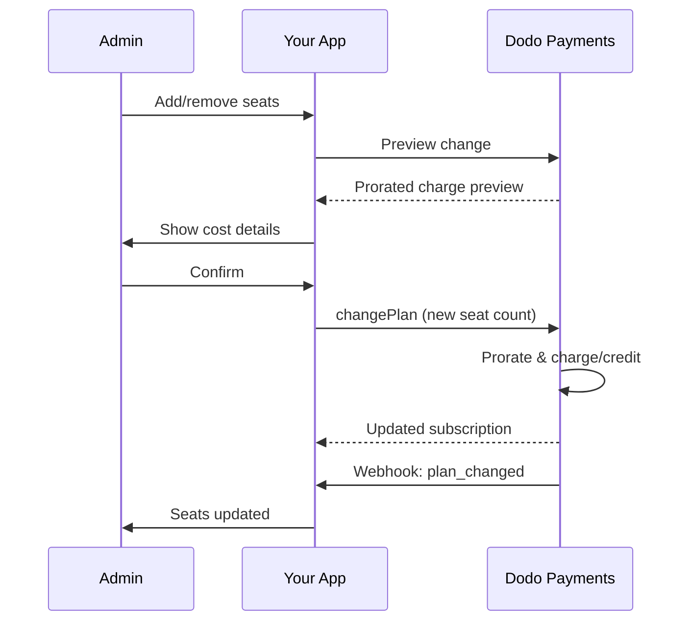

<Info>
Sätebaserad fakturering låter dig debitera kunder baserat på antalet användare, teammedlemmar eller licenser de behöver. Det är den standardiserade prismodellen för samarbetesverktyg för team, företagsprogramvara och B2B SaaS-produkter.
</Info>

<CardGroup cols={2}>
{/* LOCKED_PATTERN_5dfc50fd981c1ac3b2cf0747476bb603 */}
  Steg-för-steg-guide med kodexempel.
</Card>

{/* LOCKED_PATTERN_30543381f1fd7c60d748be8f75d9f37b */}
  Lär dig om tilläggssystemet som driver sätebaserad fakturering.
</Card>

{/* LOCKED_PATTERN_d4eae9dc8961f74fa117678acde32bcf */}
  Hantera sätebaserade prenumerationer och planändringar.
</Card>

<Card title="Webhooks" icon="bell" href="/developer-resources/webhooks/intents/subscription">
  Följa sätesändringar med prenumerationswebhooks.
</Card>
</CardGroup>

---

## Vad är Sätebaserad Fakturering?

Sätebaserad fakturering (även kallad prissättning per användare eller per säte) tar betalt av kunder baserat på antalet användare som får tillgång till din produkt. Istället för en fast avgift, justeras priset efter teamets storlek.

### Vanliga Användningsområden

| Bransch | Exempel | Prissättningsmodell |
|----------|---------|---------------|
| Teamarbete | Slack, Notion, Asana | Per aktiv användare/månad |
| Utvecklarverktyg | GitHub, GitLab, Jira | Per säte/månad |
| CRM-program | Salesforce, HubSpot | Per användarlicens |
| Designverktyg | Figma, Canva | Per redigerarsäte |
| Säkerhetsprogram | 1Password, Okta | Per användare/månad |
| Videokonferens | Zoom, Teams | Per värdlicens |

### Fördelar med Sätebaserad Prissättning

**För Ditt Företag:**
- Intäkterna växer naturligt i takt med att kunderna växer
- Förutsägbar prissättning som kunder kan budgetera för
- Tydlig uppgraderingsväg från individuell till team- till företagsnivå
- Högre livstidsvärde när teamen expanderar

**För Dina Kunder:**
- Betala endast för det de använder
- Lätt att förstå och förutsäga kostnader
- Flexibilitet att lägga till/ta bort användare vid behov
- Rättvis prissättning som matchar teamets storlek

---

## Hur Sätebaserad Fakturering Fungerar i Dodo Payments

Dodo Payments implementerar sätebaserad fakturering med hjälp av **Tillägg**-systemet. Så här fungerar det:

### Arkitekturöversikt

En Team Pro-prenumeration kostar 99 $/månad och inkluderar 5 säten. Om du har mer än 5 användare betalar du ytterligare 15 $/månad för varje extra säte.

Till exempel, om ditt team behöver 15 säten:
- Basplan: 99 $/månad (inkluderar 5 säten)
- Tillägg: 10 extra säten × 15 $/månad = 150 $/månad
- Total månadskostnad: 99 $ + 150 $ = 249 $ för 15 säten

### Nyckelkomponenter

| Komponent | Syfte | Exempel |
|-----------|---------|---------|
| Basprodukt | Kärnprenumeration med inkluderade säten | "Teamplan - $99/månad (5 säten inkluderade)" |
| Sätes-tillägg | Per-säte avgift för ytterligare användare | "Extra säte - $15/månad vardera" |
| Kvantitet | Antal ytterligare säten som köpts | 10 extra säten |

---

## Prissättningsstrategier

Välj den sätebaserade prissättningsstrategi som passar ditt företag:

### Strategi 1: Bas + Per-Säte Tillägg

Inkludera ett visst antal säten i basplanen, ta betalt för ytterligare säten.

**Exempel:**

```
Starter Plan: $49/month
├── Includes: 3 seats
├── Extra seats: $10/month each
└── 8 total seats = $49 + (5 × $10) = $99/month
```

**Bäst för:** Produkter där små team kan fungera med basutbudet.

### Strategi 2: Ren Per-Säte Prissättning

Ta ut en fast avgift per säte utan basavgift.

**Exempel:**

```
Per User: $12/month
├── 5 users = $60/month
├── 20 users = $240/month
└── 100 users = $1,200/month
```

**Implementering:** Sätt basplanens pris till $0, använd endast sätes-tillägget.

**Bäst för:** Enkel, transparent prissättning; användningsbaserade modeller.

### Strategi 3: Trappad Sätesprissättning

Olika basplaner med olika per-säte priser.

**Exempel:**

```
Starter: $0/month base + $15/seat
├── Lower features, higher per-seat cost

Professional: $99/month base + $10/seat
├── More features, lower per-seat cost

Enterprise: $499/month base + $7/seat
└── All features, volume discount on seats
```

**Implementering:** Skapa separata produkter för varje nivå med olika tilläggspriser.

**Bäst för:** Uppmuntra uppgraderingar till högre nivåer; företagsförsäljning.

### Strategi 4: Sätespaket

Sälj säten i paket istället för individuellt.

**Exempel:**

```
5-Seat Pack: $50/month ($10/seat)
10-Seat Pack: $80/month ($8/seat)
25-Seat Pack: $175/month ($7/seat)
```

**Implementering:** Skapa flera tillägg för olika paketstorlekar.

**Bäst för:** Förenkla köpbeslut; uppmuntra större åtaganden.

---

## Ställa in Sätebaserad Fakturering

### Steg 1: Planera Din Prissättning

Innan implementeringen, definiera din prissättningsstruktur:

<Steps>
{/* LOCKED_PATTERN_8f90ecc6ba09743be9ab340aa5a551cf */}
Bestäm vad som ingår i basprenumerationen:
- Grundpris (kan vara 0 $ för ren per-säte-prissättning)
- Antal inkluderade säten
- Funktioner som är tillgängliga på denna nivå
</Step>

{/* LOCKED_PATTERN_170e31746a3dd1fcece04ceccae9b797 */}
Fastställ priset för tillägg per säte:
- Pris per extra säte
- Eventuella volymrabatter (via flera tillägg)
- Max antal säten som tillåts (om tillämpligt)
</Step>

{/* LOCKED_PATTERN_8c15c36cd0c3272db0db1a96e4d332dc */}
Anpassa sätesprissättningen efter din faktureringscykel:
- Månadsprenumerationer → månadsvisa sätesavgifter
- Årsprenumerationer → årsvisa sätesavgifter (ofta rabatterade)
</Step>
</Steps>

### Steg 2: Skapa Sätes-Tillägget

I din Dodo Payments-instrumentpanel:

1. Navigera till **Produkter** → **Tillägg**
2. Klicka på **Skapa Tillägg**
3. Konfigurera tillägget:

| Fält | Värde | Anteckningar |
|-------|-------|-------|
| Namn | "Ytterligare Säte" eller "Teammedlem" | Tydligt, användarvänligt namn |
| Beskrivning | "Lägg till en annan teammedlem i din arbetsyta" | Förklara vad kunderna får |
| Pris | Ditt per-säte pris | t.ex. $10.00 |
| Valuta | Matcha din basprodukt | Måste vara samma valuta |
| Skattekategori | Samma som basprodukt | Säkerställer konsekvent skattehantering |

<Tip>
Skapa beskrivande namn för tillägg som är lätta att förstå på fakturor. "Ytterligare teamplats" är tydligare än "Säte-tillägg" för kunder som granskar sina räkningar.
</Tip>

### Steg 3: Skapa Basprenumerationen

Skapa din prenumerationsprodukt:

1. Navigera till **Produkter** → **Skapa Produkt**
2. Välj **Prenumeration**
3. Konfigurera prissättning och detaljer
4. I avsnittet **Tillägg**, koppla ditt sätes-tillägg

### Steg 4: Koppla Tillägg till Produkt

Länka sätes-tillägget till din prenumeration:

1. Redigera din prenumerationsprodukt
2. Bläddra till avsnittet **Tillägg**
3. Klicka på **Lägg till Tillägg**
4. Välj ditt sätes-tillägg
5. Spara ändringar

<Check>
Din prenumerationsprodukt stödjer nu sätebaserad prissättning. Kunder kan köpa valfritt antal extra säten under utcheckningen.
</Check>

---

## Hantera Säten

### Lägga till Säten till Nya Prenumerationer

När du skapar en kassa-session, specificera säteskvantiteten:

```typescript
const session = await client.checkoutSessions.create({
  product_cart: [{
    product_id: 'prod_team_plan',
    quantity: 1,
    addons: [{
      addon_id: 'addon_seat',
      quantity: 10  // 10 additional seats
    }]
  }],
  customer: { email: 'admin@company.com' },
  return_url: 'https://yourapp.com/success'
});
```

### Ändra Antal Säten på Befintliga Prenumerationer

Använd Change Plan API för att justera säten:

```typescript
// Add 5 more seats to existing subscription
await client.subscriptions.changePlan('sub_123', {
  product_id: 'prod_team_plan',
  quantity: 1,
  proration_billing_mode: 'prorated_immediately',
  addons: [{
    addon_id: 'addon_seat',
    quantity: 15  // New total: 15 additional seats
  }]
});
```

### Ta Bort Säten

För att minska antalet säten, specificera den lägre kvantiteten:

```typescript
// Reduce from 15 to 8 additional seats
await client.subscriptions.changePlan('sub_123', {
  product_id: 'prod_team_plan',
  quantity: 1,
  proration_billing_mode: 'difference_immediately',
  addons: [{
    addon_id: 'addon_seat',
    quantity: 8  // Reduced to 8 additional seats
  }]
});
```

### Ta Bort Alla Ytterligare Säten

Skicka en tom tilläggsarray för att ta bort alla tillägg:

```typescript
// Remove all additional seats, keep only base plan seats
await client.subscriptions.changePlan('sub_123', {
  product_id: 'prod_team_plan',
  quantity: 1,
  proration_billing_mode: 'difference_immediately',
  addons: []  // Removes all add-ons
});
```

---

## Proportionering för Sätesändringar

När kunder lägger till eller tar bort säten mitt under cykeln, avgör proportionering hur de faktureras.



### Proration Modes

| Läge | Lägga till säten | Ta bort säten |
|------|------------------|----------------|
| `prorated_immediately` | Debitera för återstående dagar i cykeln | Kreditera för oanvända dagar |
| `difference_immediately` | Debitera fullt sätespris | Kredit tillämpas vid framtida förnyelser |
| `full_immediately` | Debitera fullt sätespris, återställ faktureringscykeln | Ingen kredit |

### Proration Examples

**Scenario: 15-dagars faktureringscykel kvar, lägga till 5 säten för 10 $/säte**

<Tabs>
{/* LOCKED_PATTERN_7648ba425844faa1251e7c2508881bd6 */}

```
Prorated charge = ($10 × 5 seats) × (15 days / 30 days)
                = $50 × 0.5
                = $25 immediate charge
```

Kunden betalar 25 $ nu, sedan 50 $/månad vid förnyelse.
</Tab>

{/* LOCKED_PATTERN_14967e5128d43a5dabfd1120fa81b437 */}

```
Immediate charge = $10 × 5 seats = $50
```

Kunden betalar hela 50 $ nu, oavsett var i cykeln de befinner sig.
</Tab>

{/* LOCKED_PATTERN_4e8bc31cac215c51dc616cc2b4d7cae7 */}

```
Immediate charge = Full subscription + add-ons
Billing cycle resets to today
```

Kunden betalar hela beloppet, en ny faktureringscykel startar.
</Tab>
</Tabs>

**Scenario: Ta bort 3 säten mitt i cykeln med prorated_immediately**

```
Current: Team Plan ($99/month) + 10 extra seats × $10/seat = $199/month
Change: Remove 3 seats (10 → 7 extra seats) on day 20 of 30-day cycle
Remaining: 10 days

Credit for removed seats:
  = ($10 × 3 seats) × (10 days / 30 days)
  = $30 × 0.333
  = $10.00 credit

→ $10.00 credit added to subscription
→ Next renewal: $99 + (7 × $10) = $169.00/month
→ Credit auto-applies: $169.00 − $10.00 = $159.00 on next invoice
```

<Tip>
**Välja ett prorationläge för sätesändringar**: Använd `prorated_immediately` för rättvis dagbaserad fakturering när team ofta justerar säten. Använd `difference_immediately` för enklare uträkningar som debiterar eller krediterar hela sätespriset. Se [Proration Guide](/developer-resources/subscription-upgrade-downgrade#proration-modes) för detaljerade jämförelser.
</Tip>

### Preview Before Changing

Visa alltid proration innan ändringar görs:

```typescript
const preview = await client.subscriptions.previewChangePlan('sub_123', {
  product_id: 'prod_team_plan',
  quantity: 1,
  proration_billing_mode: 'prorated_immediately',
  addons: [{ addon_id: 'addon_seat', quantity: 20 }]
});

console.log('Immediate charge:', preview.immediate_charge.summary);
// Show customer: "Adding 5 seats will cost $25 today"
```

---

## Tracking Seats with Webhooks

Övervaka sätesändringar genom att lyssna på prenumerationswebhooks:

### Relevant Events

| Event | När det triggas | Användningsfall |
|-------|------------------|------------------|
| `subscription.active` | Ny prenumeration aktiverad | Tilldela initiala säten |
| `subscription.plan_changed` | Säten tillagda/borttagna | Uppdatera sätesantalet i din app |
| `subscription.renewed` | Prenumerationen förnyas | Bekräfta att sätesantalet inte förändrats |
| `subscription.cancelled` | Prenumerationen avslutas | Avsluta alla säten |

### Webhook Handler Example

```typescript
app.post('/webhooks/dodo', async (req, res) => {
  const event = req.body;

  switch (event.type) {
    case 'subscription.active':
      // New subscription - provision seats
      const seats = calculateTotalSeats(event.data);
      await provisionSeats(event.data.customer_id, seats);
      break;

    case 'subscription.plan_changed':
      // Seats changed - update access
      const newSeats = calculateTotalSeats(event.data);
      await updateSeatCount(event.data.subscription_id, newSeats);
      break;

    case 'subscription.cancelled':
      // Subscription cancelled - deprovision
      await deprovisionAllSeats(event.data.subscription_id);
      break;
  }

  res.json({ received: true });
});

function calculateTotalSeats(subscriptionData) {
  const baseSeats = 5;  // Included in plan
  const addonSeats = subscriptionData.addons?.reduce(
    (total, addon) => total + addon.quantity, 0
  ) || 0;
  return baseSeats + addonSeats;
}
```

---

## Enforcing Seat Limits

Din applikation måste upprätthålla sätesgränser. Dodo Payments spårar faktureringen, men du kontrollerar åtkomsten.

### Enforcement Strategies

<Tabs>
{/* LOCKED_PATTERN_1d31b7e688044b0efbd19ad2d6fe35e3 */}
Förhindra strikt att lägga till användare utöver sätesantalet.

```typescript
async function inviteUser(teamId: string, email: string) {
  const team = await getTeam(teamId);
  const subscription = await getSubscription(team.subscriptionId);
  const totalSeats = calculateTotalSeats(subscription);
  const usedSeats = await countTeamMembers(teamId);

  if (usedSeats >= totalSeats) {
    throw new Error('No seats available. Please upgrade your plan.');
  }

  await sendInvitation(teamId, email);
}
```

</Tab>

{/* LOCKED_PATTERN_13b3f8c9c63e02e97bed8afbecbc9f91 */}
Tillåt att överskrida med en varning och en karenstid.

```typescript
async function inviteUser(teamId: string, email: string) {
  const team = await getTeam(teamId);
  const { totalSeats, usedSeats } = await getSeatInfo(team);

  if (usedSeats >= totalSeats) {
    // Allow but flag for billing
    await flagOverage(teamId, usedSeats - totalSeats + 1);
    await notifyAdmin(team.adminEmail, 'You have exceeded your seat limit');
  }

  await sendInvitation(teamId, email);
}
```

</Tab>

{/* LOCKED_PATTERN_b053ebd757bb6327d33717eadf7a8f52 */}
Lägg automatiskt till säten när gränsen nås.

```typescript
async function inviteUser(teamId: string, email: string) {
  const team = await getTeam(teamId);
  const { totalSeats, usedSeats, subscriptionId } = await getSeatInfo(team);

  if (usedSeats >= totalSeats) {
    // Automatically add a seat
    await client.subscriptions.changePlan(subscriptionId, {
      product_id: team.productId,
      quantity: 1,
      proration_billing_mode: 'prorated_immediately',
      addons: [{ addon_id: 'addon_seat', quantity: totalSeats - baseSeats + 1 }]
    });

    await notifyAdmin(team.adminEmail, 'A new seat was added to your plan');
  }

  await sendInvitation(teamId, email);
}
```

</Tab>
</Tabs>

---

## Advanced Patterns

### Different Seat Types

Erbjud olika sätestyper med skild prissättning:

```
Full Seats: $20/month - Full access to all features
View-Only Seats: $5/month - Read-only access
Guest Seats: $0/month - Limited external collaborator access
```

**Implementation:** Skapa separata tillägg för varje sätestyp.

```typescript
const session = await client.checkoutSessions.create({
  product_cart: [{
    product_id: 'prod_team_plan',
    quantity: 1,
    addons: [
      { addon_id: 'addon_full_seat', quantity: 10 },
      { addon_id: 'addon_viewer_seat', quantity: 25 },
      { addon_id: 'addon_guest_seat', quantity: 50 }
    ]
  }]
});
```

### Annual Seat Discounts

Erbjud rabatterad årsvis sätesprissättning:

```
Monthly: $15/seat/month
Annual: $12/seat/month (20% savings)
```

**Implementation:** Skapa separata produkter för månads- och årsplaner med olika tilläggspriser.

### Minimum Seat Requirements

Kräv ett minimalt antal säten för vissa planer:

```typescript
async function validateSeatCount(planId: string, seatCount: number) {
  const minimums = {
    'prod_starter': 1,
    'prod_team': 5,
    'prod_enterprise': 25
  };

  if (seatCount < minimums[planId]) {
    throw new Error(`${planId} requires at least ${minimums[planId]} seats`);
  }
}
```

---

## Best Practices

### Pricing Best Practices

- **Tydlig kommunikation**: Visa per-sätespriset tydligt på din prissida
- **Inkluderade säten**: Överväg att inkludera några säten i grundpriset för att minska friktion
- **Volymrabatter**: Erbjud lägre per-säte-priser för större team för att vinna företagsaffärer
- **Årliga incitament**: Rabatterade årsplaner förbättrar kassaflöde och retention

### Technical Best Practices

- **Cachelagra sätesantal**: Cachelagra prenumerationens sätesantal lokalt för att undvika API-anrop vid varje förfrågan
- **Synkronisera regelbundet**: Synka regelbundet ditt lokala sätesantal med Dodo Payments via API
- **Hantera fel**: Om en sätesändring misslyckas, visa tydliga felmeddelanden och omförsöksalternativ
- **Revisionsspår**: Logga alla sätesändringar för fakturatvister och efterlevnad

### User Experience Best Practices

- **Feedback i realtid**: Visa omedelbart kostnadspåverkan när säten justeras
- **Bekräftelsesteg**: Kräv bekräftelse innan fakturaförändringar genomförs
- **Prorationsgenomskinlighet**: Förklara tydligt proraterade avgifter innan de tillämpas
- **Enkla nedgraderingar**: Gör det inte svårt att minska säten (det bygger förtroende)

---

## Troubleshooting

<AccordionGroup>
{/* LOCKED_PATTERN_4a54068c0366de7cd698037f63ad06d7 */}
**Symptom**: Din app visar ett annat sätesantal än prenumerationen.

**Causes**:
- Webhook har inte mottagits eller bearbetats
- Race condition under sätesändring
- Cachelagrad data uppdateras inte

**Solutions**:
1. Implementera webhook-hanterare för `subscription.plan_changed`
2. Lägg till en knapp "Synka med fakturering" som hämtar aktuell prenumeration
3. Sätt cache TTL för att säkerställa regelbundna uppdateringar
</Accordion>

{/* LOCKED_PATTERN_62506e5aa738923207d9cef5cba18998 */}
**Symptom**: Kunden är förvirrad över avgiften mitt i cykeln.

**Causes**:
- Prorationsläget kommuniceras inte tydligt
- Kunden såg inte förhandsgranskningen innan bekräftelse

**Solutions**:
1. Använd alltid `previewChangePlan` innan ändringar görs
2. Visa tydlig uppdelning: "Lägga till X säten = Y $ idag (proraterat för Z dagar)"
3. Dokumentera din prorationpolicy i hjälpcentret
</Accordion>

{/* LOCKED_PATTERN_a0edc83ae355b61df85c2a2a9b2f2774 */}
**Symptom**: Säte-tillägget är inte tillgängligt under utcheckningen.

**Causes**:
- Tillägget är inte kopplat till produkten
- Tillägget är arkiverat eller borttaget
- Valutaskillnad mellan produkt och tillägg

**Solutions**:
1. Verifiera att tillägget är kopplat i produktinställningarna
2. Kontrollera tilläggsstatus i tilläggsöversikten
3. Säkerställ att valutorna matchar exakt
</Accordion>

{/* LOCKED_PATTERN_a1ec125a9845064654c125fd57ed0115 */}
**Symptom**: Kunden vill minska antalet säten men har användare tilldelade.

**Solutions**:
1. Visa vilka användare som måste tas bort innan säten kan minskas
2. Implementera ett arbetsflöde: Ta bort användare → Minska säten
3. Överväg en karenstid innan sätesminskning verkställs
</Accordion>
</AccordionGroup>

---

## Related Documentation

<CardGroup cols={2}>
{/* LOCKED_PATTERN_67d22b5654e273ff1785a13fd2a08eef */}
  Komplett implementationsguide med kod.
</Card>

{/* LOCKED_PATTERN_64b8932d6eae113337e408ad28c3e677 */}
  Få en djupare förståelse för tilläggssystemet.
</Card>

{/* LOCKED_PATTERN_61918d5684b68ec0c29a61927d4aac95 */}
  Hantera prenumerationsändringar.
</Card>

{/* LOCKED_PATTERN_a38ca2694c5ac00d14f82dd9641df0b4 */}
  Spåra prenumerationshändelser.
</Card>
</CardGroup>
