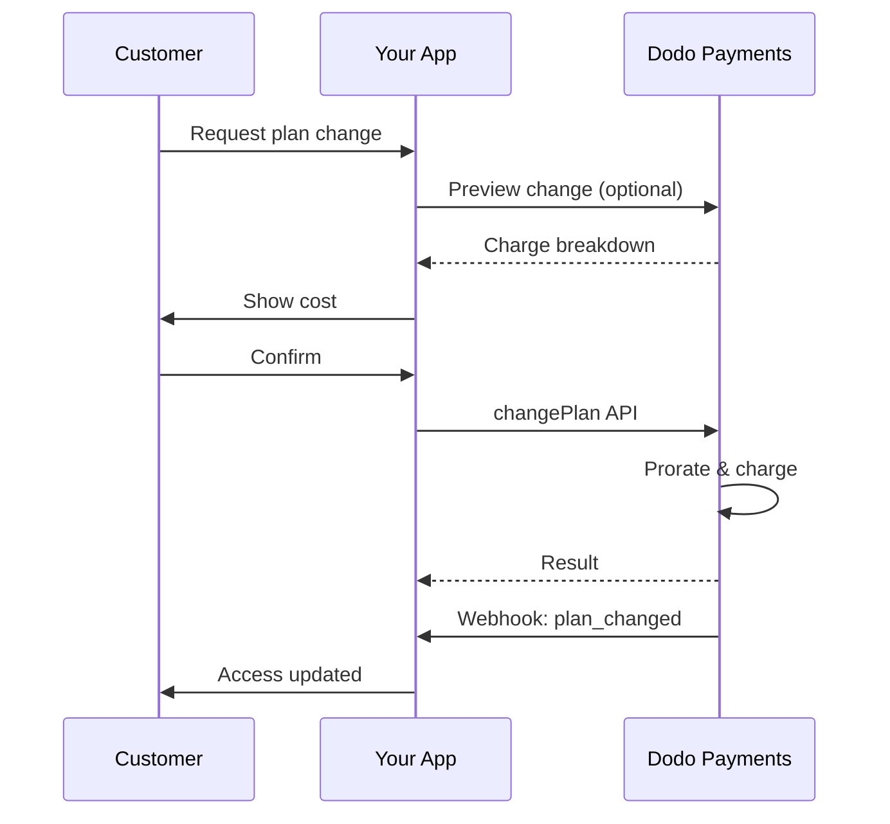
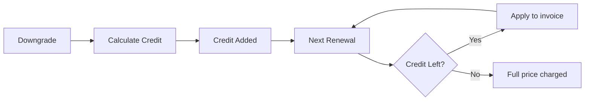

<Info>
Prenumerationer låter dig sälja löpande åtkomst med automatiska förnyelser. Använd flexibla faktureringscykler, gratis provperioder, planändringar och tillägg för att skräddarsy prissättningen för varje kund.
</Info>

<CardGroup cols={2}>
<Card title="Upgrade & Downgrade" icon="repeat" href="/developer-resources/subscription-upgrade-downgrade">
Kontrollera planändringar med proration och uppdateringar av kvantitet.
</Card>

<Card title="On‑Demand Subscriptions" icon="bolt" href="/developer-resources/ondemand-subscriptions">
Autorisera ett mandat nu och debitera senare med egna belopp.
</Card>

<Card title="Customer Portal" icon="id-card" href="/features/customer-portal">
Låt kunder hantera planer, fakturering och avbokningar.
</Card>

<Card title="Subscription Webhooks" icon="code" href="/developer-resources/webhooks/intents/subscription">
Reagera på livscykelhändelser som skapad, förnyad och avbruten.
</Card>
</CardGroup>

## Vad är Prenumerationer?

Prenumerationer är återkommande produkter som kunder köper enligt ett schema. De är idealiska för:

- **SaaS-licenser**: Appar, API:er eller plattformsåtkomst
- **Medlemskap**: Gemenskaper, program eller klubbar
- **Digitalt innehåll**: Kurser, media eller premiuminnehåll
- **Supportplaner**: SLA:er, framgångspaket eller underhåll

## Nyckelfördelar

- **Förutsägbar intäkt**: Återkommande fakturering med automatiska förnyelser
- **Flexibla cykler**: Månatliga, årliga, anpassade intervall och provperioder
- **Planagilitet**: Proportionering för uppgraderingar och nedgraderingar
- **Tillägg och platser**: Koppla valfria, kvantifierbara uppgraderingar
- **Smidig kassa**: Hostad kassa och kundportal
- **Utvecklarvänlig**: Tydliga API:er för skapande, ändringar och användningsspårning

## Skapa Prenumerationer

Skapa prenumerationsprodukter i din Dodo Payments-instrumentpanel, och sälj dem sedan genom kassan eller ditt API. Att separera produkter från aktiva prenumerationer låter dig versionera prissättning, koppla tillägg och spåra prestanda oberoende.

### Skapande av prenumerationsprodukter

Konfigurera fälten i instrumentpanelen för att definiera hur din prenumeration säljs, förnyas och faktureras. Avsnitten nedan motsvarar direkt vad du ser i skapelseformuläret.

#### Produktinformation

- **Produktnamn** (obligatoriskt): Det visade namnet som visas i kassan, kundportalen och fakturor.
- **Produktbeskrivning** (obligatoriskt): Ett tydligt värdeuttalande som visas i kassan och fakturor.
- **Produktbild** (obligatoriskt): PNG/JPG/WebP upp till 3 MB. Används på kassan och fakturor.
- **Varumärke**: Koppla produkten till ett specifikt varumärke för temat och e-post.
- **Skattekategori** (obligatoriskt): Välj kategori (till exempel, SaaS) för att bestämma skatteregler.

<Tip>
Välj den mest precisa skattekategori för att säkerställa korrekt skatteuppbörd per region.
</Tip>

#### Prissättning

- **Prissättningstyp**: Välj <b>Prenumeration</b> (denna guide). Alternativ är Engångsbetalning och Användningsbaserad fakturering.
- **Pris** (obligatoriskt): Grundläggande återkommande pris med valuta.
- **Rabatt som gäller (%)**: Valfri procentuell rabatt som tillämpas på grundpriset; återspeglas i kassan och fakturor.
- **Upprepa betalning varje** (obligatoriskt): Intervall för förnyelser, t.ex. varje 1 Månad. Välj takten (månader eller år) och mängd.
- **Prenumerationsperiod** (obligatoriskt): Total period under vilken prenumerationen förblir aktiv (t.ex. 10 År). Efter denna period slutar förnyelser om de inte förlängs.
- **Prova på period dagar** (obligatoriskt): Ställ in provlängd i dagar. Använd 0 för att inaktivera provperioder. Den första avgiften sker automatiskt när provperioden slutar.
- **Välj tillägg**: Bifoga upp till 10 tillägg som kunder kan köpa tillsammans med grundplanen.

<Warning>
Att ändra pris på en aktiv produkt påverkar nya köp. Befintliga prenumerationer följer dina inställningar för planändring och proration.
</Warning>

<Info>
Tillägg är idealiska för kvantifierbara extratjänster som platser eller lagring. Du kan kontrollera tillåtna kvantiteter och prorationbeteende när kunder ändrar dem.
</Info>

#### Avancerade inställningar

- **Skatteinkluderande prissättning**: Visa priser inklusive tillämpliga skatter. Slutlig skatteberäkning varierar fortfarande beroende på kundens plats.
- **Generera licensnycklar**: Utfärda en unik nyckel till varje kund efter köp. Se <a href="/features/license-keys">Licensnycklar</a>-guiden.
- **Leverans av digitala produkter**: Leverera filer eller innehåll automatiskt efter köp. Läs mer i <a href="/features/digital-product-delivery">Leverans av digitala produkter</a>.
- **Metadata**: Koppla anpassade nyckel-värde-par för intern taggning eller klientintegrationer. Se <a href="/api-reference/metadata">Metadata</a>.

<Tip>
Använd metadata för att lagra identifierare från ditt system (t.ex. accountId) så att du kan stämma av händelser och fakturor senare.
</Tip>

## Prenumerationsprov

Prov låter kunder få tillgång till prenumerationer utan omedelbar betalning. Den första avgiften sker automatiskt när provperioden slutar.

### Konfigurera Prov

Ange **Trial Period Days** i produktprisavsnittet (använd `0` för att inaktivera). Du kan åsidosätta detta när du skapar prenumerationer:

```typescript
// Via subscription creation
const subscription = await client.subscriptions.create({
  customer_id: 'cus_123',
  product_id: 'prod_monthly',
  trial_period_days: 14  // Overrides product's trial period
});

// Via checkout session
const session = await client.checkoutSessions.create({
  product_cart: [{ product_id: 'prod_monthly', quantity: 1 }],
  subscription_data: { trial_period_days: 14 }
});
```

<Warning>
Värdet för `trial_period_days` måste vara mellan 0 och 10 000 dagar.
</Warning>

### Upptäck Provstatus

<Warning>
För närvarande finns det inget direkt fält för att upptäcka provstatus. Följande är en lösning som kräver att du frågor betalningar, vilket är ineffektivt. Vi arbetar på en mer effektiv lösning.
</Warning>

För att avgöra om en prenumeration är i prov, hämta listan över betalningar för prenumerationen. Om det finns exakt en betalning med belopp 0, är prenumerationen i provperiod:

```typescript
const subscription = await client.subscriptions.retrieve('sub_123');
const payments = await client.payments.list({
  subscription_id: subscription.subscription_id
});

// Check if subscription is in trial
const isInTrial = payments.items.length === 1 && 
                  payments.items[0].total_amount === 0;
```

### Uppdatera Provperiod

Förläng provperioden genom att uppdatera `next_billing_date`:

```typescript
await client.subscriptions.update('sub_123', {
  next_billing_date: '2025-02-15T00:00:00Z'  // New trial end date
});
```

<Warning>
Du kan inte sätta `next_billing_date` till en tid i det förflutna. Datumet måste vara i framtiden.
</Warning>

## Ändringar av Prenumerationsplaner

Ändringar av planer låter dig uppgradera eller nedgradera prenumerationer, justera kvantiteter eller migrera till olika produkter. Varje ändring utlöser en omedelbar avgift baserat på den proportioneringsmetod du väljer.

<Tip>
Du kan ändra prenumerationsplaner och uppdatera nästa faktureringsdatum direkt från Dodo Payments-instrumentpanelen. Detta ger ett snabbt sätt att justera prenumerationer för kundserviceförfrågningar, kampanjutgraderingar eller planmigreringar utan API-anrop.
</Tip>

<Tip>
**Aktivera självbetjänade planändringar:** Vill du att kunder ska uppgradera eller nedgradera sina egna prenumerationer via Customer Portal? Lägg till dina prenumerationsprodukter i en Product Collection och aktivera "Allow Subscription Updates" i dina Subscription Settings.
</Tip>



<Card title="Product Collections" icon="layer-group" href="/features/product-collections">
  Gruppera relaterade produkter i kollektioner för att möjliggöra sömlösa uppgraderings-/nedgraderingsvägar i Customer Portal.
</Card>

### Prorationslägen

Välj hur kunder debiteras vid planändringar:

<Info>
**Snabb jämförelse av de tre prorationslägena:**

| | `prorated_immediately` | `difference_immediately` | `full_immediately` |
|---|---|---|---|
| **Uppgradering** | Proraterad avgift för återstående dagar | Full prisskillnad debiteras | Fullt pris för ny plan debiteras |
| **Nedgradering** | Proraterad kredit för återstående dagar | Full prisskillnad som kredit | Ingen kredit, full debitering |
| **Faktureringscykel** | Förblir densamma | Förblir densamma | Återställs till idag |
| **Bäst för** | Rättvis tidsbaserad fakturering | Enkla nivåändringar | Faktureringscykel återställs |
</Info>

#### `prorated_immediately`
Debiterar en proraterad summa baserat på återstående tid i den aktuella faktureringscykeln. Bäst för rättvis fakturering som tar hänsyn till oanvänd tid.

```typescript
await client.subscriptions.changePlan('sub_123', {
  product_id: 'prod_pro',
  quantity: 1,
  proration_billing_mode: 'prorated_immediately'
});
```

#### `difference_immediately`
Debiterar prisdifferensen omedelbart (uppgradering) eller lägger till kredit för framtida förnyelser (nedgradering). Bäst för enkla uppgraderings-/nedgraderingsscenarier.

```typescript
// Upgrade: charges $50 (difference between $30 and $80)
// Downgrade: credits remaining value, auto-applied to renewals
await client.subscriptions.changePlan('sub_123', {
  product_id: 'prod_pro',
  quantity: 1,
  proration_billing_mode: 'difference_immediately'
});
```

<Info>
Krediter från nedgraderingar som använder `difference_immediately` är prenumerationsspecifika och appliceras automatiskt vid framtida förnyelser. De skiljer sig från <a href="/features/customer-credit">Customer Credits</a>.
</Info>

När en kund nedgraderar med `difference_immediately` blir det oanvända värdet en prenumerationsspecifik kredit som automatiskt kvittas mot framtida förnyelser:



#### `full_immediately`
Debiterar hela beloppet för den nya planen omedelbart och ignorerar återstående tid. Bäst för att återställa faktureringscykler.

```typescript
await client.subscriptions.changePlan('sub_123', {
  product_id: 'prod_monthly',
  quantity: 1,
  proration_billing_mode: 'full_immediately'
});
```

<AccordionGroup>
<Accordion title="Example: Prorated upgrade calculation">

**Scenario**: Kund på Basic ($30/mån) uppgraderar till Pro ($80/mån) på dag 16 av en 30-dagarscykel med `prorated_immediately`.

```
Unused credit from Basic = $30 × (15 remaining / 30 total) = $15.00
Prorated cost of Pro     = $80 × (15 remaining / 30 total) = $40.00
────────────────────────────────────────────────────────────────────
Immediate charge         = $40.00 − $15.00 = $25.00
```

Nästa förnyelse på det ursprungliga faktureringsdatumet: **$80.00/mån**.

<Tip>
För mer detaljerade beräkningsexempel och specialfall, se vår fullständiga [Upgrade & Downgrade Guide](/developer-resources/subscription-upgrade-downgrade).
</Tip>

</Accordion>
<Accordion title="Example: Downgrade credit calculation">

**Scenario**: Kund på Pro ($80/mån) nedgraderar till Starter ($20/mån) med `difference_immediately`.

```
Credit = Old plan − New plan = $80 − $20 = $60.00
```

$60-krediten tillämpas automatiskt på framtida förnyelser:
- Förnyelse 1: $20 − $20 (kredit) = **$0.00** ($40 kredit kvar)
- Förnyelse 2: $20 − $20 (kredit) = **$0.00** ($20 kredit kvar)  
- Förnyelse 3: $20 − $20 (kredit) = **$0.00** (kredit slut)
- Förnyelse 4: **$20.00** (fullt pris)

<Info>
Läs mer om hur krediter hanteras i [Upgrade & Downgrade Guide](/developer-resources/subscription-upgrade-downgrade).
</Info>

</Accordion>
</AccordionGroup>

### Ändra planer med tillägg

Ändra tillägg när du byter plan. Tillägg ingår i prorationberäkningar:

```typescript
await client.subscriptions.changePlan('sub_123', {
  product_id: 'prod_pro',
  quantity: 1,
  proration_billing_mode: 'difference_immediately',
  addons: [{ addon_id: 'addon_extra_seats', quantity: 2 }]  // Add add-ons
  // addons: []  // Empty array removes all existing add-ons
});
```

<Info>
Planändringar triggar omedelbara avgifter. Misslyckade avgifter kan flytta prenumerationen till `on_hold`-status. Spåra ändringar via `subscription.plan_changed` webhook-händelser.
</Info>

### Förhandsvisa planändringar

Innan du genomför en planändring, förhandsgranska den exakta avgiften och den resulterande prenumerationen:

```typescript
const preview = await client.subscriptions.previewChangePlan('sub_123', {
  product_id: 'prod_pro',
  quantity: 1,
  proration_billing_mode: 'prorated_immediately'
});

// Show customer the charge before confirming
console.log('You will be charged:', preview.immediate_charge.summary);
```

<Card title="Preview Change Plan API" icon="eye" href="/api-reference/subscriptions/preview-change-plan">
  Förhandsgranska planändringar innan du genomför dem.
</Card>

## Prenumerationstillstånd

Prenumerationer kan befinna sig i olika tillstånd under sin livscykel:

- **`active`**: Prenumerationen är aktiv och förnyas automatiskt
- **`on_hold`**: Prenumerationen är pausad på grund av misslyckad betalning. Uppdatering av betalningsmetod krävs för att återaktivera
- **`cancelled`**: Prenumerationen är avbruten och förnyas inte
- **`expired`**: Prenumerationen har nått sitt slutdatum
- **`pending`**: Prenumerationen skapas eller behandlas

### On Hold-tillstånd

En prenumeration går in i `on_hold`-tillstånd när:

- En förnyelsebetalning misslyckas (otillräckliga medel, utgånget kort osv.)
- En avgift för planändring misslyckas
- Auktorisation av betalningsmetod misslyckas

<Warning>
När en prenumeration befinner sig i `on_hold`-tillstånd förnyas den inte automatiskt. Du måste uppdatera betalningsmetoden för att återaktivera prenumerationen.
</Warning>

### Återaktivera från On Hold

För att återaktivera en prenumeration från `on_hold`-tillstånd, uppdatera betalningsmetoden. Detta gör automatiskt:

1. Skapar en avgift för återstående skulder
2. Genererar en faktura
3. Bearbetar betalningen med den nya betalningsmetoden
4. Återaktiverar prenumerationen till `active`-tillstånd vid lyckad betalning

```typescript
// Reactivate subscription from on_hold
const response = await client.subscriptions.updatePaymentMethod('sub_123', {
  type: 'new',
  return_url: 'https://example.com/return'
});

// For on_hold subscriptions, a charge is automatically created
if (response.payment_id) {
  console.log('Charge created:', response.payment_id);
  // Redirect customer to response.payment_link to complete payment
  // Monitor webhooks for payment.succeeded and subscription.active
}
```

<Info>
Efter att du framgångsrikt uppdaterat betalningsmetoden för en `on_hold`-prenumeration kommer du att få `payment.succeeded` följt av `subscription.active` webhook-händelser.
</Info>

## API-hantering

<AccordionGroup>
<Accordion title="Create subscriptions">
Använd `POST /subscriptions` för att skapa prenumerationer programmatiskt från produkter, med valfria provperioder och tillägg.
<Card title="API Reference" icon="code" href="/api-reference/subscriptions/post-subscriptions">
Se API:et för att skapa prenumerationer.
</Card>
</Accordion>

### Planändringar med proratering
Uppgradera eller nedgradera en prenumeration och kontrollera prorateringsbeteende:

<Accordion title="Update subscriptions">
Använd `PATCH /subscriptions/{id}` för att uppdatera kvantiteter, avboka vid nästa faktureringsdatum eller ändra metadata.
<Card title="API Reference" icon="code" href="/api-reference/subscriptions/patch-subscriptions">
Lär dig hur du uppdaterar prenumerationsdetaljer.
</Card>
</Accordion>

### Avbryt vid periodens slut
Schemalägg en avbokning utan omedelbar uppsägning av tillgång:

<Accordion title="Change plans (proration)">
Ändra den aktiva produkten och kvantiteterna med prorationkontroller.
<Card title="API Reference" icon="code" href="/api-reference/subscriptions/change-plan">
Granska planändringsalternativ.
</Card>
</Accordion>

### On-demand prenumerationer
Skapa en on-demand prenumeration och debiterar senare vid behov:

<Accordion title="On‑demand charges">
För on-demand-prenumerationer, debitera specifika belopp vid behov.
<Card title="API Reference" icon="code" href="/api-reference/subscriptions/create-charge">
Debitera en on-demand-prenumeration.
</Card>
</Accordion>

### Uppdatera betalningsmetod för aktiv prenumeration
Uppdatera betalningsmetoden för en aktiv prenumeration:

<Accordion title="List and retrieve">
Använd `GET /subscriptions` för att lista alla prenumerationer och `GET /subscriptions/{id}` för att hämta en.
<Card title="API Reference" icon="code" href="/api-reference/subscriptions/get-subscriptions">
Bläddra bland API:er för listning och hämtning.
</Card>
</Accordion>

### Återaktivera prenumeration från på_håll
Återaktivera en prenumeration som har satts på håll på grund av misslyckad betalning:

<Accordion title="Usage history">
Hämta registrerad användning för mätbara eller hybrida prismodeller.
<Card title="API Reference" icon="code" href="/api-reference/subscriptions/get-usage-history">
Se API:et för användningshistorik.
</Card>
</Accordion>

## Prenumerationer med RBI-kompatibla mandat

<Accordion title="Update payment method">
Uppdatera betalningsmetoden för en prenumeration. För aktiva prenumerationer uppdaterar detta betalmetoden för framtida förnyelser. För prenumerationer i `on_hold`-tillstånd återaktiveras prenumerationen genom att skapa en avgift för återstående skulder.
<Card title="API Reference" icon="code" href="/api-reference/subscriptions/update-payment-method">
Lär dig hur du uppdaterar betalningsmetoder och återaktiverar prenumerationer.
</Card>
</Accordion>
</AccordionGroup>

  ### Mandatgränser

## Vanliga användningsfall

- **SaaS and APIs**: Skiktad åtkomst med tillägg för platser eller användning
- **Content and media**: Månatlig åtkomst med introduktionserbjudanden
- **B2B support plans**: Årliga kontrakt med premium supporttillägg
- **Tools and plugins**: Licensnycklar och versionerade releaser

## Integrationsexempel

### Checkout-sessioner (prenumerationer)
När du skapar checkout-sessioner, inkludera din prenumerationsprodukt och valfria tillägg:

```typescript
const session = await client.checkoutSessions.create({
  product_cart: [
    {
      product_id: 'prod_subscription',
      quantity: 1
    }
  ]
});
```

### Planändringar med proration
Uppgradera eller nedgradera en prenumeration och styr prorationbeteendet:

```typescript
await client.subscriptions.changePlan('sub_123', {
  product_id: 'prod_new',
  quantity: 1,
  proration_billing_mode: 'difference_immediately'
});
```

### Avsluta vid nästa faktureringsdatum
Schemalägg en avbokning som träder i kraft i slutet av den aktuella faktureringsperioden:

```typescript
await client.subscriptions.update('sub_123', {
  cancel_at_next_billing_date: true
});
```

### On-demand-prenumerationer
Skapa en on-demand-prenumeration och debitera senare vid behov:

```typescript
const onDemand = await client.subscriptions.create({
  customer_id: 'cus_123',
  product_id: 'prod_on_demand',
  on_demand: true
});

await client.subscriptions.createCharge(onDemand.id, {
  amount: 4900,
  currency: 'USD',
  description: 'Extra usage for September'
});
```

### Uppdatera betalmetod för aktiv prenumeration
Uppdatera betalningsmetoden för en aktiv prenumeration:

```typescript
// Update with new payment method
const response = await client.subscriptions.updatePaymentMethod('sub_123', {
  type: 'new',
  return_url: 'https://example.com/return'
});

// Or use existing payment method
await client.subscriptions.updatePaymentMethod('sub_123', {
  type: 'existing',
  payment_method_id: 'pm_abc123'
});
```

### Återaktivera prenumeration från on_hold
Återaktivera en prenumeration som sattes på vänt på grund av misslyckad betalning:

```typescript
// Update payment method - automatically creates charge for remaining dues
const response = await client.subscriptions.updatePaymentMethod('sub_123', {
  type: 'new',
  return_url: 'https://example.com/return'
});

if (response.payment_id) {
  // Charge created for remaining dues
  // Redirect customer to response.payment_link
  // Monitor webhooks: payment.succeeded → subscription.active
}
```

## Prenumerationer med RBI-kompatibla mandater

  UPI och indiska kortprenumerationer följer RBI (Reserve Bank of India) regler med specifika mandatkrav:

  ### Mandate Limits

  Typen av mandat och beloppet beror på prenumerationens återkommande avgift:

  - **Charges below Rs 15,000:** Vi skapar ett on-demand-mandat för Rs 15 000 INR. Prenumerationsbeloppet debiteras periodvis enligt din prenumerationsfrekvens, upp till mandatgränsen.
  - **Charges Rs 15,000 or above:** Vi skapar ett prenumerationsmandat (eller on-demand-mandat) för det exakta prenumerationsbeloppet.

För detaljerad information om RBI-kompatibla mandater för indiska betalningsmetoder, se sidan <a href="/features/payment-methods/india">India Payment Methods</a>.

  ### Upgrade and Downgrade Considerations

  **Important:** Vid uppgraderingar eller nedgraderingar av prenumerationer bör du noga beakta mandatgränserna:

  - Om en uppgradering/nedgradering resulterar i ett avgiftsbelopp som överstiger Rs 15 000 och går utöver den befintliga on-demand-betalningsgränsen kan transaktionsavgiften misslyckas.
  - I sådana fall kan kunden behöva uppdatera sin betalningsmetod eller ändra prenumerationen igen för att skapa ett nytt mandat med rätt gräns.

  ### Authorization for High-Value Charges

  För prenumerationsavgifter på Rs 15 000 eller mer:

  - Kunden kommer att uppmanas av sin bank att godkänna transaktionen.
  - Om kunden inte godkänner transaktionen kommer den att misslyckas och prenumerationen sätts i on hold.

  ### 48-Hour Processing Delay

  **Bearbetningstid:** Återkommande debiteringar på indiska kort och UPI-prenumerationer följer ett unikt bearbetningsmönster:

  - Debiteringar **startas** på det schemalagda datumet enligt din prenumerationsfrekvens.
  - Det faktiska **avdraget** från kundens konto sker först efter **48 timmar** från betalningsstart.
  - Detta 48-timmarsfönster kan utökas upp till **2–3 extra timmar** beroende på bankernas API-svar.

  ### Mandate Cancellation Window

  Under det 48-timmars bearbetningsfönstret:

  - Kunder kan avbryta mandatet via sina bankappar.
  - Om en kund avbryter mandatet under denna period förblir prenumerationen **aktiv** (detta är ett speciellt fall som gäller indiska kort och UPI AutoPay-prenumerationer).
  - Den faktiska avdragningen kan dock misslyckas, och i så fall sätter vi prenumerationen **on hold**.

  **Specialfallshantering:** Om du erbjuder förmåner, krediter eller prenumerationsanvändning till kunder omedelbart vid debiteringsstart måste du hantera detta 48-timmarsfönster lämpligt i din applikation. Överväg:

  - Att fördröja aktivering av förmåner tills betalningsbekräftelse
  - Att införa nådperioder eller tillfällig åtkomst
  - Att övervaka prenumerationstillstånd vid mandatavbokningar
  - Att hantera prenumerationstillstånd i din applikationslogik

  <Tip>
  Övervaka prenumerationswebhooks för att följa betalningsstatusförändringar och hantera specialfall där mandat avbokas under 48-timmarsfönstret.
  </Tip>

## Bästa praxis

- **Börja med tydliga nivåer**: 2–3 planer med tydliga skillnader
- **Kommunicera priser**: Visa totalsummor, proration och nästa förnyelse
- **Använd provperioder med eftertanke**: Konvertera med onboarding, inte bara tid
- **Utnyttja tillägg**: Håll basplaner enkla och erbjud tillägg
- **Testa förändringar**: Verifiera planändringar och proration i testläge

<Info>
Prenumerationer är en flexibel grund för återkommande intäkter. Starta enkelt, testa noggrant och iterera baserat på adoption, churn och expansion.
</Info>