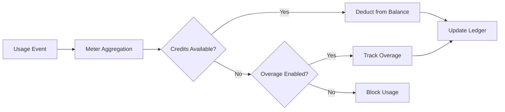

<Info>
Mätare omvandlar råa händelser till fakturerbara mängder. De filtrerar händelser och tillämpar aggregeringsfunktioner (Count, Sum, Max, Last) för att beräkna användning per kund.
</Info>

<Frame>

</Frame>

## API-resurser

<AccordionGroup>
<Accordion title="View Meter API References">
<CardGroup cols={2}>
<Card title="Create Meter" icon="plus" href="/api-reference/meters/create-meter">
Skapa mätare programmässigt via API.
</Card>

<Card title="List Meters" icon="list" href="/api-reference/meters/get-meters">
Hämta alla mätare i ditt konto.
</Card>

<Card title="Get Meter" icon="eye" href="/api-reference/meters/retrieve-meter">
Hämta information om en viss mätare med dess ID.
</Card>

<Card title="Archive Meter" icon="arrow-rotate-right" href="/api-reference/meters/archive-meter">
Arkivera en mätare för att sluta spåra användning.
</Card>

<Card title="Unarchive Meter" icon="arrow-rotate-left" href="/api-reference/meters/unarchive-meter">
Återställ en arkiverad mätare för att börja spåra igen.
</Card>
</CardGroup>
</Accordion>
</AccordionGroup>

## Skapa en Mätare

<Steps>
<Step title="Basic Information">
<ParamField path="Meter Name" type="string" required>
Beskrivande namn (t.ex. "API Requests", "Token Usage")
</ParamField>

<ParamField path="Event Name" type="string" required>
Exakt händelsenamn som ska matchas (skiftlägeskänsligt). Exempel: `api.call`, `image.generated`
</ParamField>
</Step>

<Step title="Aggregation">
<ParamField path="Aggregation Type" type="string" required>
Välj hur händelser aggregeras:

- **Count**: Totalt antal händelser (API-anrop, uppladdningar)
- **Sum**: Lägg ihop numeriska värden (token, byte)
- **Max**: Högsta värde under perioden (toppanvändare)
- **Last**: Senaste värdet
</ParamField>

<ParamField path="Over Property" type="string">
Metadata-nyckel att aggregera (krävs för alla typer utom Count). Exempel: `tokens`, `bytes`, `duration_ms`
</ParamField>

<ParamField path="Measurement Unit" type="string" required>
Enhetsetikett för fakturor. Exempel: `calls`, `tokens`, `GB`, `hours`
</ParamField>
</Step>

<Step title="Filtering (Optional)">
<Frame>

</Frame>

Lägg till villkor för att filtrera vilka händelser som räknas:
- **OCH-logik**: Alla villkor måste matcha
- **ELLER-logik**: Vilket som helst villkor kan matcha

**Jämförare**: lika med, inte lika med, större än, mindre än, innehåller

Aktivera filtrering, välj logik, lägg till villkor med egenskapsnyckel, jämförare och värde.
</Step>

<Step title="Create">
Granska konfigurationen och klicka på **Create Meter**.
</Step>
</Steps>

## Visa Analys

<Frame>

</Frame>

Din mätardashboard visar:
- **Översikt**: Total användning och användningsdiagram
- **Händelser**: Individuella händelser som mottagits
- **Kunder**: Användning och avgifter per kund

## Fakturering i krediter istället för valuta

Som standard debiterar mätare kunder per enhet i dollar (eller din konfigurerade valuta). Du kan istället konfigurera en mätare för att **dra från en kreditbalans** – så användning förbrukar krediter istället för att generera en monetär avgift.

<Info>
Kreditbaserad avräkning kräver en [Credit Entitlement](/features/credit-based-billing) kopplad till samma produkt. Skapa din kredit först, sedan länkar du den till mätaren.
</Info>

### När du ska använda kreditbaserad avräkning

| Scenario | Standard (valuta) | Kreditbaserad |
|----------|-------------------|--------------|
| Enkel prissättning per enhet ($0.01/samtal) | ✅ Bäst alternativ | Onödig överbelastning |
| Förbetalda kreditpaket (köp 10K tokens, använd över tid) | ❌ Går inte att uttrycka | ✅ Bäst alternativ |
| Bundlad användning med prenumerationer (Pro-planen inkluderar 100K samtal) | Möjligt via gratströskel | ✅ Bättre – krediter rullas över, upphör, visas i portalen |
| Produkter med flera mätare som delar en kreditpool | ❌ Varje mätare fakturerar separat | ✅ Alla mätare drar från samma balans |

### Konfigurera en mätare för att dra krediter

<Steps>
{/* LOCKED_PATTERN_2f001d4cc191a503bfa27e2b02a887d3 */}
Först skapar du en kredit i **Products → Credits**. Definiera enheten (t.ex. "API Calls", "Tokens"), precision och livscykelinställningar (utgång, överföring, överanvändning).

Se [Credit-Based Billing guide](/features/credit-based-billing) för detaljerade instruktioner.
</Step>

{/* LOCKED_PATTERN_e56c2bce14c9ffc41b822106f30b9344 */}
Gå till din användningsbaserade produkt och öppna avsnittet **Meter**.
</Step>

{/* LOCKED_PATTERN_0e1120cd860a229dcc6f92a517f37ac6 */}
Klicka på **+**-knappen för att fästa en mätare. Konfigurera händelsenamn, aggregeringstyp och mätenhet som vanligt.
</Step>

{/* LOCKED_PATTERN_5742803ec5f5aba6317bae5a7cd68e62 */}
Aktivera **Bill usage in Credits** i mätarkonfigurationen. Det visar kreditinställningarna:

{/* LOCKED_PATTERN_5164565eee83d03235035c7c8b6b2680 */}

</Frame>

{/* LOCKED_PATTERN_643db6bd6419b3403905cdf5351f1450 */}
Välj vilken krediträttighet den här mätaren ska dra från.
</ParamField>

{/* LOCKED_PATTERN_f350d049ff7e758408e63c7b8b7766de */}
Antalet användningsenheter som krävs för att dra 1 kredit. Till exempel:
- `1` = varje mätarevenemang drar 1 kredit
- `100` = 100 mätarevenemang drar 1 kredit
- `1000` = 1 000 API-anrop förbrukar 1 kredit
</ParamField>
</Step>

{/* LOCKED_PATTERN_6b77ac14c64de04b72ad44281724bb0c */}
Den **gratströskeln** gäller fortfarande – händelser under denna tröskel drar inte krediter.

**Exempel**: Med en gratströskel på 1 000 och mätenheter-per-kredit på 1:
- Kunden använder 2 500 API-anrop
- Första 1 000 är gratis
- Återstående 1 500 drar 1 500 krediter från deras saldo
</Step>
</Steps>

### Hur kreditavdrag fungerar

När det är konfigurerat körs avdragsprocessen automatiskt:

1. **Händelser anländer** - Din applikation skickar användningshändelser via [Event Ingestion API](/features/usage-based-billing/event-ingestion)
2. **Mätaren aggregerar** - Händelser aggregeras enligt din mätarkonfiguration (Count, Sum, Max, Last)
3. **Bakgrundsarbetare bearbetar** - Varje minut hämtar en arbetare nya händelser sedan senaste kontrollpunkt
4. **Krediter dras** - Aggregerad användning konverteras till krediter med `meter_units_per_credit` och dras med **FIFO-ordning** (äldsta behörigheter förbrukas först)
5. **Överanvändning spåras** - Om balansen når noll och överanvändning är aktiverat fortsätter användningen och överanvändningen hanteras enligt konfigurerat beteende (efterges vid återställning, faktureras vid nästa faktura eller förs vidare som underskott)

{/* LOCKED_PATTERN_4907e9f6f7fbd509120d7a87afc829e9 */}
Kreditavdrag körs asynkront (ungefär var minut). Det kan vara en kort fördröjning mellan händelseintag och balanseräkning. Designa din applikation för att hantera denna fördröjning – förlita dig inte på realtidskontroller av saldo för åtkomstkontroll vid enskilda förfrågningar.
{/* LOCKED_PATTERN_176d815432e7554ac558e8631b2bc397 */}

### Flera mätare, en kreditpool

Du kan koppla flera mätare på samma produkt till **samma krediträttighet**. Alla mätare drar från ett gemensamt saldo.

**Exempel**: En AI-plattform med två mätare:
- `text.generation` – 1 kredit per 1 000 tokens
- `image.generation` – 10 krediter per bild

Båda drar från samma "AI Credits"-pool. Kunden ser ett enhetligt saldo i sin portal.

{/* LOCKED_PATTERN_317ec56569e36d0c9e56c2648890a76e */}
Använd olika `meter_units_per_credit`-tariffer mellan mätare för att uttrycka relativa kostnader. Dyra operationer (bildgenerering) kostar färre mätenheter per kredit än billiga (textkomplettering).
{/* LOCKED_PATTERN_4dec52ce04aa8849a8a60508baae30ae */}

<CardGroup cols={2}>
{/* LOCKED_PATTERN_2e110f22e0f3741250f140b212ae466d */}
Visa hela kreditavdragshistoriken för en kund.
</Card>
{/* LOCKED_PATTERN_83b4a13ef9031c5fd9378a998aeaa952 */}
Kontrollera en kunds aktuella kreditbalans via API.
</Card>
</CardGroup>

## Felsökning

<AccordionGroup>
<Accordion title="Events not appearing">
- Händelsenamnet måste matcha exakt (skiftlägeskänsligt)
- Kontrollera att mätarfilter inte exkluderar händelser
- Verifiera att kund-ID:n finns
- Inaktivera temporärt filter för test
</Accordion>

<Accordion title="Aggregation not working">
- Verifiera att Over Property matchar metadata-nyckeln exakt
- Använd siffror, inte strängar: `tokens: 150` inte `"150"`
- Inkludera obligatoriska egenskaper i alla händelser
</Accordion>

<Accordion title="Filters not working">
- Matcha skiftläge exakt
- Använd rätt operatorer för datatypen
- Säkerställ att händelserna inkluderar filtrerade egenskaper
</Accordion>

<Accordion title="Wrong usage totals">
- Kontrollera fliken Events för att räkna faktiska mottagna händelser
- Verifiera aggregeringstyp (Count vs Sum)
- Kontrollera att värden är numeriska för Sum/Max
</Accordion>
</AccordionGroup>

## Nästa steg

<CardGroup cols={2}>

<Card title="Send Events" icon="bolt" href="/features/usage-based-billing/event-ingestion">
Börja skicka användningshändelser från din applikation till dina mätare.
</Card>

<Card title="View Blueprints" icon="copy" href="/features/usage-based-billing/ingestion-blueprints">
Använd färdiga mätarkonfigurationer för vanliga användningsfall.
</Card>
</CardGroup>
