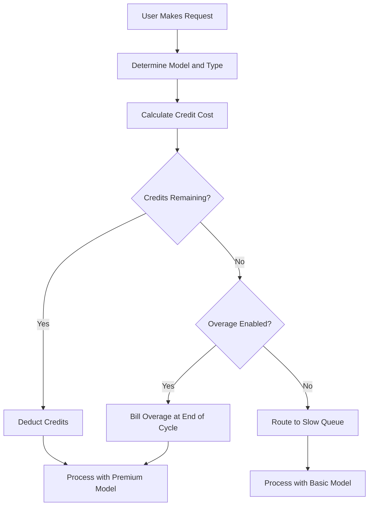

## Cách Cursor Tính Phí

Cursor sử dụng một mô hình lai kết hợp đăng ký hàng tháng với một nhóm tín dụng cạn dần. Cách tiếp cận này cung cấp mức giá có thể dự đoán cho người dùng trong khi quản lý chi phí biến đổi của các mô hình AI khác nhau.

**Các cấp giá**: Cursor cung cấp các cấp từ Hobby đến Ultra, cân bằng quyền truy cập cao cấp và tiêu chuẩn để phù hợp với các quy trình làm việc khác nhau.

| Gói | Giá | Premium Requests | Slow Requests |
| :--- | :--- | :--- | :--- |
| Hobby | Miễn phí | 50/tháng | Không giới hạn |
| Pro | \$20/tháng | 500/tháng | Không giới hạn |
| Pro+ | \$60/tháng | Premium không giới hạn | - |
| Ultra | \$200/tháng | Premium không giới hạn | - |

**Giảm trừ theo trọng số mô hình**: Các yêu cầu khác nhau tiêu thụ số tín dụng khác nhau dựa trên chi phí của mô hình nền tảng. Điều này cho phép Cursor cung cấp một đăng ký duy nhất bao gồm nhiều nhà cung cấp trong khi vẫn đảm bảo các thao tác đắt đỏ được tính toán.

| Loại yêu cầu | Mô hình | Chi phí tín dụng |
| :--- | :--- | :--- |
| Tab Completion | Default | 0 |
| Chat | GPT-4o Mini | 1 |
| Chat | Claude 3.5 Sonnet | 1 |
| Composer | GPT-4o | 5 |
| Agent | Claude 3.5 Sonnet | 10 |
| Agent | o1-preview | 25 |

**Cạn tín dụng và phí vượt mức**: Khi tín dụng hết, người dùng sẽ chuyển sang hàng đợi "Chậm" với các mô hình rẻ hơn thay vì bị cắt quyền. Hoặc họ có thể bật tính năng vượt mức theo mức sử dụng để duy trì quyền truy cập cao cấp với chi phí cố định mỗi yêu cầu.



4. **Doanh nghiệp và Kinh doanh**: Các nhóm sử dụng chung nơi toàn bộ tổ chức chia sẻ một nhóm tín dụng duy nhất. Điều này đơn giản hóa việc quản lý và đảm bảo người dùng sử dụng nhiều không bị chạm giới hạn cá nhân trong khi người khác vẫn còn dung lượng chưa dùng.

## Điều gì làm cho nó khác biệt

Mô hình của Cursor cân bằng trải nghiệm người dùng với chi phí cơ sở hạ tầng bằng cách giải quyết các vấn đề mà các mô hình thanh toán SaaS truyền thống gặp khó khăn.
- **Provider Abstraction**: Một đăng ký duy nhất bao gồm nhiều nhà cung cấp LLM như OpenAI và Anthropic, xử lý giá phức tạp và khóa API phía sau.
- **Weighted Depletion**: Chi phí tương ứng với giá trị bằng cách tính nhiều hơn cho các mô hình mạnh hơn, khiến mức giá cảm thấy công bằng và minh bạch cho tất cả người dùng.
- **Graceful Degradation**: Hàng đợi "Chậm" ngăn việc ngắt quãng hoàn toàn, giữ người dùng ở lại sản phẩm và khuyến khích nâng cấp mà không gây khó chịu.
- **Pooled Credits**: Các nhóm tín dụng cấp đội giảm ma sát cho khách hàng doanh nghiệp bằng cách cho phép chia sẻ tài nguyên hiệu quả trên toàn tổ chức.

## Xây dựng điều này với Dodo Payments

Bạn có thể tái tạo chính xác mô hình này bằng cách sử dụng quyền tín dụng và tính phí theo mức sử dụng của Dodo Payments. Các bước sau sẽ hướng dẫn bạn triển khai.

<Steps>
  <Step title="Create a Custom Unit Credit Entitlement">
    Trước tiên, hãy định nghĩa hệ thống tín dụng trong bảng điều khiển Dodo. Quyền này sẽ đại diện cho "Premium Requests" mà người dùng nhận được cùng với đăng ký của họ.

    *   **Credit Type:** Custom Unit
    *   **Unit Name:** "Premium Requests"
    *   **Precision:** 0 (vì bạn không thể sử dụng nửa yêu cầu)
    *   **Credit Expiry:** 30 days (điều này đảm bảo tín dụng được đặt lại mỗi chu kỳ thanh toán)
    *   **Rollover:** Disabled (các yêu cầu chưa dùng không được chuyển sang tháng tiếp theo)
    *   **Overage:** Enabled
    *   **Price Per Unit:** \$0.04 (chi phí cho mỗi yêu cầu sau khi nhóm ban đầu cạn kiệt)
    *   **Overage Behavior:** Bill overage at billing (điều này thêm chi phí vượt mức vào hóa đơn tiếp theo)

    Cấu hình này đảm bảo người dùng có một nhóm yêu cầu cố định mỗi tháng, với tùy chọn trả thêm nếu họ cần thêm. Đây là nền tảng của mô hình thanh toán lai.

  <Step title="Create Subscription Products">
    Tạo các sản phẩm riêng biệt cho mỗi cấp. Gắn cùng một quyền tín dụng cho mỗi sản phẩm, nhưng với số lượng khác nhau. Điều này cho phép bạn quản lý tất cả các cấp với một hệ thống tín dụng duy nhất, giúp việc nâng cấp hoặc hạ cấp người dùng trở nên dễ dàng.

    *   **Hobby:** \$0/month, 50 credits/cycle
    *   **Pro:** \$20/month, 500 credits/cycle
    *   **Pro+:** \$60/month, 5000 credits/cycle (về cơ bản là vô hạn đối với hầu hết)
    *   **Ultra:** \$200/month, 50000 credits/cycle (về cơ bản là vô hạn)

    Khi người dùng đăng ký một trong các sản phẩm này, Dodo tự động cấp số tín dụng tương ứng cho tài khoản của họ. Điều này xảy ra ngay lập tức, mang lại trải nghiệm khởi tạo liền mạch.

  <Step title="Create a Usage Meter Linked to Credits">
    Tạo một bộ đo có tên `ai.request` với tổng hợp **Sum** trên thuộc tính `credit_cost`. Liên kết bộ đo này với quyền tín dụng của bạn bằng cách bật chuyển đổi "Bill usage in Credits". Đặt số đơn vị bộ đo trên mỗi tín dụng là 1.

    Để xử lý việc giảm tín dụng theo trọng số mô hình, bạn sẽ quản lý chi phí tín dụng ở cấp độ ứng dụng. Khi người dùng tạo yêu cầu, ứng dụng của bạn xác định chi phí dựa trên mô hình hoặc loại hành động.

    ```typescript
    import DodoPayments from 'dodopayments';
    
    /**
     * Determines the credit cost for a given request type and model.
     * This logic lives in your application and can be updated without
     * changing your billing configuration.
     */
    function getCreditCost(requestType: string, model: string): number {
      const costs: Record<string, Record<string, number>> = {
        'tab_completion': { 'default': 0 },
        'chat': { 'gpt-4o-mini': 1, 'gpt-4o': 1, 'claude-sonnet': 1 },
        'composer': { 'gpt-4o-mini': 2, 'gpt-4o': 5, 'claude-sonnet': 5 },
        'agent': { 'gpt-4o': 10, 'claude-sonnet': 10, 'o1': 25 }
      };
      
      // Default to 1 credit if the combination isn't found
      return costs[requestType]?.[model] ?? 1;
    }
    
    /**
     * Ingests usage events into Dodo Payments.
     * For weighted requests, we send multiple events or use a sum aggregation.
     */
    async function trackRequest(customerId: string, requestType: string, model: string) {
      const creditCost = getCreditCost(requestType, model);
      
      // Tab completions are free, so we don't need to track them for billing
      if (creditCost === 0) return;
      
      const client = new DodoPayments({
        bearerToken: process.env.DODO_PAYMENTS_API_KEY,
      });
      
      await client.usageEvents.ingest({
        events: [{
          event_id: `req_${Date.now()}_${Math.random().toString(36).slice(2)}`,
          customer_id: customerId,
          event_name: 'ai.request',
          timestamp: new Date().toISOString(),
          metadata: {
            request_type: requestType,
            model: model,
            credit_cost: creditCost
          }
        }]
      });
    }
    ```

  <Tip>
      Nếu bạn muốn sử dụng một sự kiện duy nhất cho các yêu cầu có trọng số, hãy đặt tổng hợp bộ đo của bạn thành **Sum** và dùng một thuộc tính như `credit_cost` làm giá trị cần cộng. Điều này thường hiệu quả hơn cho lượng dữ liệu lớn và đơn giản hóa logic ứng dụng của bạn.
    </Tip>
  </Step>

  <Step title="Handle Credit Exhaustion (Slow Queue)">
    Nghe webhook `credit.balance_low` từ Dodo. Khi tín dụng của người dùng gần hết, bạn có thể chuyển họ sang hàng đợi chậm trong ứng dụng. Đây là nơi bạn triển khai logic "giảm nhẹ".

    ```typescript
    import DodoPayments from 'dodopayments';
    import express from 'express';
    
    const app = express();
    app.use(express.raw({ type: 'application/json' }));
    
    const client = new DodoPayments({
      bearerToken: process.env.DODO_PAYMENTS_API_KEY,
      webhookKey: process.env.DODO_PAYMENTS_WEBHOOK_KEY,
    });
    
    app.post('/webhooks/dodo', async (req, res) => {
      try {
        const event = client.webhooks.unwrap(req.body.toString(), {
          headers: {
            'webhook-id': req.headers['webhook-id'] as string,
            'webhook-signature': req.headers['webhook-signature'] as string,
            'webhook-timestamp': req.headers['webhook-timestamp'] as string,
          },
        });
        
        if (event.type === 'credit.balance_low') {
          const customerId = event.data.customer_id;
          await updateUserTier(customerId, 'slow');
          await notifyUser(customerId, 'You have used most of your premium requests. Switching to standard models.');
        }
        
        res.json({ received: true });
      } catch (error) {
        res.status(401).json({ error: 'Invalid signature' });
      }
    });
    
    /**
     * Routes a request based on the user's current tier.
     * This function is called before every AI request to determine the model and queue.
     */
    async function routeRequest(customerId: string, requestType: string) {
      const tier = await getUserTier(customerId);
      
      if (tier === 'slow') {
        // Route to a cheaper model and a lower priority queue
        // This saves costs while keeping the user active in the product
        return { model: 'gpt-4o-mini', queue: 'standard' };
      }
      
      // Premium routing for users with remaining credits
      // This provides the best possible performance and model quality
      return { model: 'claude-sonnet', queue: 'priority' };
    }
    ```

  </Step>

  <Step title="Create Checkout">
    Cuối cùng, tạo một phiên thanh toán để người dùng đăng ký gói. Dodo xử lý việc xử lý thanh toán, tuân thủ thuế và phân bổ tín dụng một cách tự động.

    ```typescript
    import DodoPayments from 'dodopayments';
    
    const client = new DodoPayments({
      bearerToken: process.env.DODO_PAYMENTS_API_KEY,
    });
    
    /**
     * Creates a checkout session for a new subscription.
     * This is typically called when a user clicks an "Upgrade" button.
     */
    const session = await client.checkoutSessions.create({
      product_cart: [
        { product_id: 'prod_cursor_pro', quantity: 1 }
      ],
      customer: { email: 'developer@example.com' },
      return_url: 'https://yourapp.com/dashboard'
    });
    ```

  </Step>

## Tăng tốc với LLM Ingestion Blueprint

Việc thanh toán theo trọng số tín dụng ở trên xử lý phần cốt lõi của việc kiếm tiền. Để có phân tích sâu hơn về mức tiêu thụ token thực tế giữa các nhà cung cấp, [LLM Ingestion Blueprint](/developer-resources/ingestion-blueprints/llm) có thể chạy song song với hệ thống tín dụng của bạn.

```bash
npm install @dodopayments/ingestion-blueprints
```

```typescript
import { createLLMTracker } from '@dodopayments/ingestion-blueprints';
import OpenAI from 'openai';
import Anthropic from '@anthropic-ai/sdk';

// Track raw token usage for analytics alongside credit-weighted billing
const openaiTracker = createLLMTracker({
  apiKey: process.env.DODO_PAYMENTS_API_KEY,
  environment: 'live_mode',
  eventName: 'analytics.openai_tokens',
});

const anthropicTracker = createLLMTracker({
  apiKey: process.env.DODO_PAYMENTS_API_KEY,
  environment: 'live_mode',
  eventName: 'analytics.anthropic_tokens',
});

const openai = new OpenAI({ apiKey: process.env.OPENAI_API_KEY });
const anthropic = new Anthropic({ apiKey: process.env.ANTHROPIC_API_KEY });

// Wrap each provider separately
const trackedOpenAI = openaiTracker.wrap({ client: openai, customerId: 'customer_123' });
const trackedAnthropic = anthropicTracker.wrap({ client: anthropic, customerId: 'customer_123' });

// Token tracking is automatic, credit deduction still uses your weighted system
const response = await trackedOpenAI.chat.completions.create({
  model: 'gpt-4o',
  messages: [{ role: 'user', content: 'Hello!' }],
});
```

Điều này mang lại cho bạn hai lớp dữ liệu: thanh toán theo trọng số tín dụng để kiếm tiền và số lượng token thô để phân tích chi phí và theo dõi biên lợi nhuận.

<Tip>
Blueprint LLM hỗ trợ OpenAI, Anthropic, Groq, Google Gemini và nhiều nhà cung cấp khác. Xem [toàn bộ tài liệu blueprint](/developer-resources/ingestion-blueprints/llm) để biết toàn bộ các nhà cung cấp được hỗ trợ.
</Tip>

## Tín dụng nhóm chia sẻ (Doanh nghiệp)

Các gói Business và Enterprise của Cursor gom tín dụng trên nhóm. Bạn có thể triển khai điều này với Dodo bằng cách tạo một đăng ký duy nhất cho toàn tổ chức thay vì từng người dùng riêng lẻ. Điều này đảm bảo việc sử dụng của nhóm được hợp nhất và quản lý như một thực thể duy nhất, điều rất quan trọng đối với khách hàng lớn hơn.

### Chiến lược triển khai

1.  **Khách hàng cấp tổ chức:** Tạo một `customer_id` duy nhất trong Dodo cho toàn bộ tổ chức. Khách hàng này đại diện cho thực thể thanh toán của đội và giữ nhóm tín dụng dùng chung. Tất cả hóa đơn và phân bổ tín dụng được gắn với ID này.
2.  **Seat-Based Billing:** Sử dụng add-on của Dodo để tính phí nền tảng theo từng người dùng. Khi một thành viên mới được thêm vào đội, bạn cập nhật số lượng của add-on "Seat". Điều này đảm bảo doanh thu của bạn tỷ lệ thuận với số lượng người dùng trong khi giữ nhóm tín dụng riêng. Đây là cách sạch sẽ để xử lý thanh toán đa chiều.
3.  **Shared Usage Tracking:** Tất cả yêu cầu của thành viên trong đội đều được ghi nhận bằng `customer_id` của tổ chức. Điều này đảm bảo mọi yêu cầu từ bất kỳ thành viên nào cũng làm giảm cùng một nhóm tín dụng trung tâm. Bạn vẫn có thể theo dõi mức sử dụng riêng của từng người bằng cách thêm `user_id` vào siêu dữ liệu sự kiện cho báo cáo nội bộ và phân tích.

Cách tiếp cận này mang lại cho bạn lợi ích của cả hai thế giới: một khoản phí nền tảng cố định theo người dùng và một nhóm tín dụng chia sẻ cho các tài nguyên AI đắt đỏ. Nó cũng đơn giản hóa trải nghiệm người dùng cho các thành viên nhóm vì họ không phải quản lý giới hạn riêng của mình.

## So sánh với thanh toán SaaS truyền thống

Thanh toán SaaS truyền thống thường bao gồm các cấp trả cố định (ví dụ: \$10/tháng cho 100 đơn vị). Nếu người dùng cần 101 đơn vị, họ thường phải nhảy lên cấp \$50/tháng. Điều này tạo ra hiệu ứng "vách đá" có thể khiến người dùng khó chịu và dẫn đến mất khách. Nó cũng không tính đến chi phí biến đổi của các loại sử dụng khác nhau, điều rất quan trọng trong lĩnh vực AI.

Mô hình của Cursor, được hỗ trợ bởi Dodo, linh hoạt và công bằng hơn nhiều:

*   **No "Cliff" Effects:** Người dùng không cần nâng cấp chỉ vì chạm giới hạn. Họ có thể trả phí vượt mức hoặc chấp nhận hiệu suất chậm hơn. Điều này giữ họ ở lại sản phẩm và giảm ma sát, dẫn đến sự hài lòng cao hơn và giảm churn.
*   **Cost Alignment:** Doanh thu của bạn tỷ lệ trực tiếp với chi phí cơ sở hạ tầng. Nếu người dùng sử dụng các mô hình đắt tiền, họ trả nhiều hơn (dù qua tín dụng hay vượt mức). Điều này bảo vệ biên lợi nhuận và cho phép bạn cung cấp các tính năng chi phí cao một cách bền vững mà không làm tổn hại mô hình kinh doanh.
*   **Better Retention:** Bằng cách không ngắt kết nối người dùng, bạn giữ họ tương tác với sản phẩm ngay cả khi họ đã đạt giới hạn. Họ có thể tiếp tục làm việc, điều này xây dựng lòng trung thành dài hạn và tăng giá trị trọn đời của khách hàng. Đó là một tình huống đôi bên cùng có lợi cho cả người dùng và nhà cung cấp.

## Xử lý cập nhật và tiến hóa mô hình

Một trong những thách thức với thanh toán AI là các mô hình liên tục được cập nhật hoặc thay thế. Các mô hình mới có thể có cấu trúc chi phí hoặc đặc tính hiệu suất khác nhau. Với hệ thống tín dụng của Dodo, bạn có thể xử lý điều này một cách nhẹ nhàng ở cấp độ ứng dụng mà không cần di chuyển dữ liệu thanh toán.

Nếu bạn giới thiệu một mô hình mới đắt hơn, chỉ cần cập nhật hàm `getCreditCost` của bạn để gán chi phí cao hơn. Bạn không cần thay đổi cấu hình thanh toán hoặc cập nhật các đăng ký hiện tại. Sự tách rời giữa logic thanh toán và ứng dụng này là một lợi thế lớn, vì nó cho phép bạn lặp nhanh theo tốc độ của AI mà không bị ràng buộc bởi hệ thống thanh toán.

## Thông báo người dùng và minh bạch

Để cung cấp trải nghiệm người dùng tuyệt vời, điều quan trọng là giữ cho người dùng biết về việc sử dụng tín dụng của họ. Minh bạch xây dựng niềm tin và giúp người dùng quản lý chi phí hiệu quả. Bạn có thể sử dụng webhook của Dodo để kích hoạt thông báo ở các ngưỡng khác nhau (ví dụ: 50%, 80% và 100% mức sử dụng).

Những thông báo này có thể được gửi qua email, cảnh báo trong ứng dụng hoặc tin nhắn Slack. Bằng cách cung cấp phản hồi theo thời gian thực về mức sử dụng, bạn khuyến khích người dùng quản lý tiêu thụ của họ hoặc nâng cấp gói trước khi họ chạm "hàng đợi chậm". Cách tiếp cận chủ động này giảm số lượng yêu cầu hỗ trợ và cải thiện trải nghiệm tổng thể, khiến sản phẩm của bạn trông chuyên nghiệp và tập trung vào người dùng hơn.

## Bảo mật và ngăn chặn gian lận

Khi triển khai hệ thống dựa trên tín dụng, điều quan trọng là xem xét bảo mật và ngăn chặn gian lận. Vì tín dụng có giá trị tiền tệ trực tiếp, chúng có thể là mục tiêu bị lạm dụng.

*   **Idempotency:** Luôn sử dụng các `event_id` riêng biệt khi ghi nhận sự kiện sử dụng để tránh ghi đôi. API ghi nhận của Dodo xử lý idempotency tự động nếu bạn cung cấp một ID duy nhất, đảm bảo một lần thử lại mạng không tính phí người dùng hai lần.
*   **Rate Limiting:** Triển khai giới hạn tốc độ ở cấp độ ứng dụng để ngăn một người dùng duy nhất cạn tín dụng (hoặc ngân sách API của bạn) quá nhanh. Điều này bảo vệ cả hạ tầng của bạn và ví của người dùng.
*   **Monitoring:** Theo dõi các mẫu sử dụng để phát hiện bất thường có thể chỉ ra chia sẻ tài khoản hoặc lạm dụng tự động. Phân tích của Dodo có thể giúp bạn xác định những mẫu này, cho phép hành động trước khi chúng trở thành vấn đề lớn.

## Thực tiễn tốt nhất cho hệ thống tín dụng

Khi xây dựng hệ thống thanh toán dựa trên tín dụng, hãy ghi nhớ những thực tiễn sau:

1.  **Keep it Simple:** Đừng làm hệ thống tín dụng quá phức tạp. Người dùng nên dễ dàng hiểu một yêu cầu tiêu tốn bao nhiêu và còn bao nhiêu tín dụng.
2.  **Provide Value:** Đảm bảo tín dụng mang lại giá trị thực cho người dùng. Nếu chi phí của một yêu cầu quá cao, người dùng sẽ cảm thấy bị tính phí lặt vặt.
3.  **Be Transparent:** Luôn hiển thị cho người dùng số dư tín dụng hiện tại và lịch sử sử dụng. Điều này xây dựng niềm tin và giảm sự nhầm lẫn.
4.  **Automate Everything:** Sử dụng webhook và API của Dodo để tự động hóa càng nhiều quy trình thanh toán càng tốt. Điều này giảm công việc thủ công và đảm bảo hệ thống thanh toán luôn chính xác.

<CardGroup cols={2}>
  <Card title="Credit-Based Billing" icon="coins" href="/features/credit-based-billing">
    Quản lý các nhóm tín dụng cạn dần và phí vượt mức với các đơn vị tùy chỉnh.
  </Card>
  <Card title="Subscriptions" icon="calendar" href="/features/subscription">
    Thiết lập thanh toán định kỳ cho các cấp khác nhau với tín dụng tích hợp.
  </Card>
  <Card title="Usage-Based Billing" icon="chart-line" href="/features/usage-based-billing/introduction">
    Theo dõi sự kiện và tính phí dựa trên mức tiêu thụ theo thời gian thực.
  </Card>
  <Card title="Event Ingestion" icon="bolt" href="/features/usage-based-billing/event-ingestion">
    Gửi dữ liệu sử dụng lớn đến Dodo với độ trễ thấp.
  </Card>
  <Card title="Webhooks" icon="webhook" href="/developer-resources/webhooks/intents/credit">
    Phản ứng với thay đổi số dư tín dụng và tự động định cấp người dùng.
  </Card>
  <Card title="LLM Ingestion Blueprint" icon="brain-circuit" href="/developer-resources/ingestion-blueprints/llm">
    Tự động theo dõi token trên nhiều nhà cung cấp LLM.
  </Card>
</CardGroup>

<CardGroup cols={2}>
  <Card title="Credit-Based Billing" icon="coins" href="/features/credit-based-billing">
    Manage depleting credit pools and overages with custom units.
  </Card>
  <Card title="Subscriptions" icon="calendar" href="/features/subscription">
    Set up recurring billing for different tiers with integrated credits.
  </Card>
  <Card title="Usage-Based Billing" icon="chart-line" href="/features/usage-based-billing/introduction">
    Track events and bill based on consumption in real-time.
  </Card>
  <Card title="Event Ingestion" icon="bolt" href="/features/usage-based-billing/event-ingestion">
    Send high-volume usage data to Dodo with low latency.
  </Card>
  <Card title="Webhooks" icon="webhook" href="/developer-resources/webhooks/intents/credit">
    React to credit balance changes and automate user tiering.
  </Card>
  <Card title="LLM Ingestion Blueprint" icon="brain-circuit" href="/developer-resources/ingestion-blueprints/llm">
    Automatic token tracking across multiple LLM providers.
  </Card>
</CardGroup>
