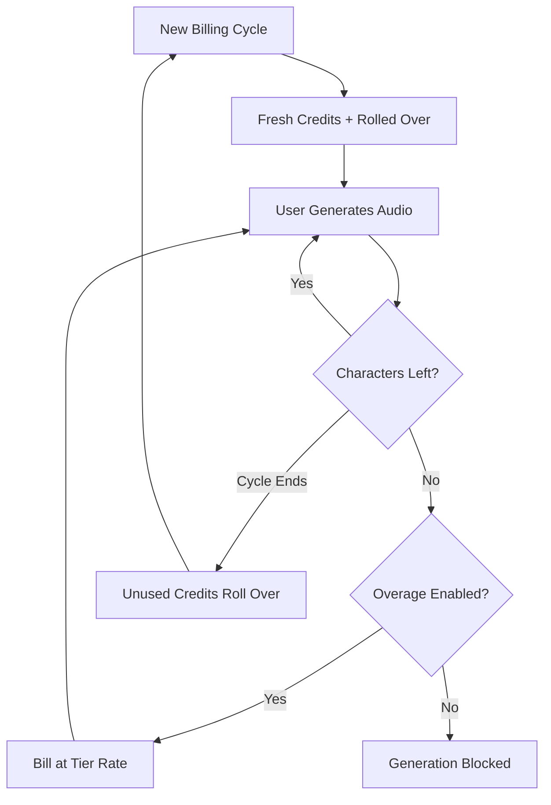

ElevenLabs đã xây dựng vị thế thống trị trong lĩnh vực giọng nói AI bằng cách làm cho việc thanh toán của họ linh hoạt như việc tổng hợp giọng nói. Mô hình của họ xoay quanh một đơn vị giá trị duy nhất: ký tự. Cho dù bạn đang tạo văn bản thành giọng nói, nhân bản giọng nói hay lồng tiếng video, bạn đều tiêu thụ từ một pool tín dụng ký tự hợp nhất.

## Cách ElevenLabs Thu Phí

Cấu trúc định giá của ElevenLabs sử dụng hạn ngạch hàng tháng cố định gắn với các tầng đăng ký. Khi người dùng chuyển lên tầng cao hơn, họ nhận được nhiều ký tự hơn và truy cập các tính năng cao cấp hơn như nhân bản giọng nói chuyên nghiệp hoặc quyền thương mại.

| Plan | Price | Characters/Month | Overage Rate |
| :--- | :--- | :--- | :--- |
| Free | \$0 | 10,000 | Not available |
| Starter | \$5/month | 30,000 | ~\$0.30/1K chars |
| Creator | \$22/month | 100,000 | ~\$0.24/1K chars |
| Pro | \$99/month | 500,000 | ~\$0.15/1K chars |
| Scale | \$330/month | 2,000,000 | ~\$0.10/1K chars |

1. **Định giá theo ký tự**: Ký tự là đơn vị tiền tệ phổ quát trên toàn bộ nền tảng. Text-to-Speech, Dubbing và Voice Cloning đều sử dụng cùng một số dư này, giúp theo dõi sử dụng đơn giản.
2. **Cơ chế chuyển tiếp**: Các ký tự chưa dùng sẽ chuyển sang chu kỳ thanh toán tiếp theo thay vì hết hạn. ElevenLabs áp dụng giới hạn để ngăn tích tụ vô hạn, đảm bảo người dùng vẫn giữ được giá trị từ đăng ký của mình.
3. **Định giá vượt hạn mức theo tầng**: Vượt hạn mức được xử lý dựa trên tầng đăng ký. Các gói cấp thấp có vượt hạn mức bị vô hiệu hóa theo mặc định để đảm bảo an toàn, trong khi các tầng cao hơn cho phép tự chọn phí vượt hạn mức để duy trì dịch vụ.

## Điều Gì Làm Nó Đặc Biệt

Một số lựa chọn chiến lược khiến mô hình thanh toán của ElevenLabs đặc biệt hiệu quả trong việc giữ chân người dùng và khuyến khích nâng cấp.

- **Chuyển tiếp ký tự**: Tín dụng chuyển tiếp giảm lo lắng "dùng không thì mất" bằng cách mang theo khoản đầu tư chưa dùng. Điều này duy trì giá trị đăng ký ngay cả trong những giai đoạn hoạt động thấp hơn.
- **Định giá vượt hạn mức theo tầng**: Tỷ lệ vượt hạn mức giảm khi kích thước gói tăng, tạo động lực mạnh mẽ để nâng cấp. Người dùng thường thấy các tầng cao hơn hấp dẫn hơn vì chi phí sử dụng thêm thấp hơn.
- **Tiêu thụ thống nhất**: Một pool ký tự duy nhất cho tất cả dịch vụ loại bỏ gánh nặng nhận thức khi quản lý hạn ngạch riêng biệt. Người dùng chỉ cần theo dõi một số để hiểu dung lượng còn lại.
- **Vượt hạn mức tự chọn**: Người dùng chuyên nghiệp có thể bật vượt hạn mức để duy trì liên tục, trong khi người dùng bình thường được hưởng lợi từ giới hạn cứng an toàn.



## Xây Dựng Điều Này với Dodo Payments

Bạn có thể sao chép mô hình tinh vi này bằng cách sử dụng tính năng thanh toán dựa trên tín dụng và đo lường sử dụng của Dodo Payments.

<Steps>
<Step title="Create a Custom Unit Credit Entitlement">
Trước tiên, xác định đơn vị "Characters" sẽ phục vụ như tiền tệ trên nền tảng của bạn.

1. Chuyển đến **Entitlements** trong bảng điều khiển Dodo của bạn.
2. Tạo một **Credit Entitlement** mới.
3. Đặt **Credit Type** thành **Custom Unit**.
4. Đặt tên đơn vị là "Characters".
5. Đặt **Precision** là 0 vì ký tự luôn là đơn vị nguyên.
6. Đặt **Credit Expiry** là 30 ngày để phù hợp chu kỳ thanh toán hàng tháng.
7. Bật **Rollover** với các cài đặt sau:
    - **Max Rollover Percentage**: 100% (cho phép toàn bộ ký tự chưa dùng chuyển tiếp).
    - **Rollover Timeframe**: 1 Month.
    - **Max Rollover Count**: 1 (tín dụng có thể chuyển tiếp một lần, sau đó hết hạn).
</Step>

<Step title="Create Tiered Subscription Products">
Tạo năm sản phẩm đăng ký. Bạn sẽ gắn cùng một quyền "Characters" cho từng sản phẩm, nhưng với các cấu hình khác nhau cho từng tầng.

| Product | Price | Credits/Cycle | Overage Enabled | Overage Price (per 1K chars) |
| :--- | :--- | :--- | :--- | :--- |
| Free | \$0/mo | 10,000 | No | - |
| Starter | \$5/mo | 30,000 | Yes (opt-in) | \$0.30 |
| Creator | \$22/mo | 100,000 | Yes | \$0.24 |
| Pro | \$99/mo | 500,000 | Yes | \$0.15 |
| Scale | \$330/mo | 2,000,000 | Yes | \$0.10 |

Khi bạn gắn quyền tín dụng vào từng sản phẩm, hãy bỏ chọn **Import Default Credit Settings**. Điều này cho phép bạn đặt **Price Per Unit** cụ thể cho vượt hạn mức ở tầng tương ứng. Đặt **Overage Behavior** thành **Bill overage at billing** và cấu hình một **Low Balance Threshold** ở mức 10% hạn ngạch của tầng đó.
</Step>

<Step title="Create a Usage Meter">
Bộ đo sử dụng kết nối hoạt động của ứng dụng bạn với hệ thống tín dụng.

1. Tạo một meter mới có tên `tts.characters`.
2. Đặt **Aggregation** thành **Sum**. Điều này sẽ cộng property `characters` từ mỗi sự kiện bạn gửi.
3. Liên kết meter này với quyền tín dụng "Characters" của bạn.
4. Đặt **Meter units per credit** là 1. Điều này đảm bảo một ký tự được sử dụng trong ứng dụng tương đương một tín dụng bị trừ khỏi số dư.
</Step>

<Step title="Send Usage Events">
Tích hợp theo dõi sử dụng vào mã ứng dụng của bạn. Mỗi khi người dùng tạo âm thanh, gửi một sự kiện đến Dodo.

```typescript
import DodoPayments from 'dodopayments';

async function trackGeneration(
  customerId: string,
  text: string, 
  service: 'tts' | 'dubbing' | 'cloning'
) {
  const characterCount = text.length;

  const client = new DodoPayments({
    bearerToken: process.env.DODO_PAYMENTS_API_KEY,
  });

  await client.usageEvents.ingest({
    events: [{
      event_id: `gen_${Date.now()}_${Math.random().toString(36).slice(2)}`,
      customer_id: customerId,
      event_name: 'tts.characters',
      timestamp: new Date().toISOString(),
      metadata: {
        characters: characterCount,
        service: service,
        voice_id: 'voice_abc123'
      }
    }]
  });
}
```

</Step>

<Step title="Handle Low Balance and Overage">
Sử dụng webhook để giữ cho người dùng của bạn luôn biết về mức sử dụng ký tự của họ.

```typescript
import DodoPayments from 'dodopayments';
import express from 'express';

const app = express();
app.use(express.raw({ type: 'application/json' }));

const client = new DodoPayments({
  bearerToken: process.env.DODO_PAYMENTS_API_KEY,
  webhookKey: process.env.DODO_PAYMENTS_WEBHOOK_KEY,
});

app.post('/webhooks/dodo', async (req, res) => {
  try {
    const event = client.webhooks.unwrap(req.body.toString(), {
      headers: {
        'webhook-id': req.headers['webhook-id'] as string,
        'webhook-signature': req.headers['webhook-signature'] as string,
        'webhook-timestamp': req.headers['webhook-timestamp'] as string,
      },
    });

    switch (event.type) {
      case 'credit.balance_low':
        await notifyUser(event.data.customer_id, 
          'You are running low on characters. Consider upgrading your plan for more characters and lower overage rates.'
        );
        break;
      case 'credit.deducted':
        await logUsage(event.data);
        break;
      case 'credit.overage_charged':
        await notifyUser(event.data.customer_id,
          'You have exceeded your character quota. Overage charges will appear on your next invoice.'
        );
        break;
    }

    res.json({ received: true });
  } catch (error) {
    res.status(401).json({ error: 'Invalid signature' });
  }
});
```

</Step>

<Step title="Create Checkout">
Khi người dùng sẵn sàng đăng ký, tạo một phiên thanh toán cho tầng đã chọn.

```typescript
const session = await client.checkoutSessions.create({
  product_cart: [
    { product_id: 'prod_elevenlabs_pro', quantity: 1 }
  ],
  customer: { email: 'creator@example.com' },
  return_url: 'https://yourapp.com/dashboard'
});
```

</Step>
</Steps>

## Thúc Đẩy Với Blueprint Tiếp Nhận Luồng

Để theo dõi đầu ra âm thanh cùng với thanh toán theo ký tự, [Stream Ingestion Blueprint](/developer-resources/ingestion-blueprints/stream) cung cấp một cách đơn giản để đo lượng băng thông tiêu thụ.

```bash
npm install @dodopayments/ingestion-blueprints
```

```typescript
import { Ingestion, trackStreamBytes } from '@dodopayments/ingestion-blueprints';

const ingestion = new Ingestion({
  apiKey: process.env.DODO_PAYMENTS_API_KEY,
  environment: 'live_mode',
  eventName: 'tts.audio_bytes',
});

// After generating audio, track the output size
const audioBuffer = await generateSpeech(text, voiceId);

await trackStreamBytes(ingestion, {
  customerId: customerId,
  bytes: audioBuffer.byteLength,
  metadata: {
    voice_id: voiceId,
    service: 'tts',
    format: 'mp3',
  },
});
```

Sử dụng Blueprint Stream để theo dõi băng thông âm thanh cùng với hệ thống tín dụng theo ký tự của bạn. Điều này cung cấp khả năng hiển thị chi phí hạ tầng thực tế cho mỗi lần tạo nội dung.

<Tip>
Blueprint Stream cũng hỗ trợ gom nhóm cho các tình huống khối lượng lớn. Xem [tài liệu blueprint đầy đủ](/developer-resources/ingestion-blueprints/stream) để biết các mẫu sử dụng nâng cao.
</Tip>

## Động Lực Nâng Cấp: Định Giá Vượt Hạn Mức Theo Tầng

Phần xuất sắc nhất của mô hình ElevenLabs là cách họ sử dụng tỷ lệ vượt hạn mức để thúc đẩy nâng cấp. Bằng cách làm chi phí mỗi ký tự rẻ hơn ở các tầng cao hơn, họ chuyển cuộc trò chuyện từ "tôi cần bao nhiêu?" sang "tôi có thể tiết kiệm bao nhiêu?".

| Tier | Included Chars | Overage (per 1K) | Effective Cost at 500K Chars |
| :--- | :--- | :--- | :--- |
| Creator | 100,000 | \$0.24 | \$22 + (400 * \$0.24) = \$118 |
| Pro | 500,000 | \$0.15 | \$99 (No overage) |

Một người dùng thường xuyên tiêu thụ 500,000 ký tự trên gói Creator trả \$118 mỗi tháng cho đăng ký cộng thêm vượt hạn mức. Nâng cấp lên gói Pro bao phủ cùng mức sử dụng với \$99, tiết kiệm \$19 mỗi tháng. Tỷ lệ vượt hạn mức thấp hơn ở các tầng cao hơn có nghĩa là khi mức sử dụng tăng, nâng cấp trở thành quyết định tài chính rõ ràng.

Với Dodo Payments, bạn thực hiện điều này bằng cách bỏ chọn hộp **Import Default Credit Settings** khi gắn tín dụng vào các sản phẩm đăng ký. Điều này mang lại cho bạn toàn quyền kiểm soát **Price Per Unit** cho từng tầng cụ thể, cho phép bạn thưởng cho khách hàng trả phí cao nhất bằng mức giá tốt nhất.

## Các Tính Năng Chính Của Dodo Được Sử Dụng

<CardGroup cols={2}>
  <Card title="Credit-Based Billing" icon="coins" href="/features/credit-based-billing">
    Quản lý hạn ngạch ký tự, chuyển tiếp và hết hạn.
  </Card>
  <Card title="Subscriptions" icon="calendar" href="/features/subscription">
    Thiết lập các tầng định kỳ cung cấp hạn ngạch ký tự hàng tháng.
  </Card>
  <Card title="Usage-Based Billing" icon="chart-line" href="/features/usage-based-billing/introduction">
    Theo dõi mức tiêu thụ ký tự theo thời gian thực trên các dịch vụ.
  </Card>
  <Card title="Event Ingestion" icon="bolt" href="/features/usage-based-billing/event-ingestion">
    Gửi dữ liệu sử dụng khối lượng lớn đến Dodo với độ trễ tối thiểu.
  </Card>
  <Card title="Webhooks" icon="webhook" href="/developer-resources/webhooks/intents/credit">
    Phản ứng với số dư thấp và sự kiện vượt hạn mức theo thời gian thực.
  </Card>
  <Card title="Stream Ingestion Blueprint" icon="tower-broadcast" href="/developer-resources/ingestion-blueprints/stream">
    Theo dõi băng thông phát trực tuyến âm thanh cho thanh toán theo mức sử dụng.
  </Card>
</CardGroup>
