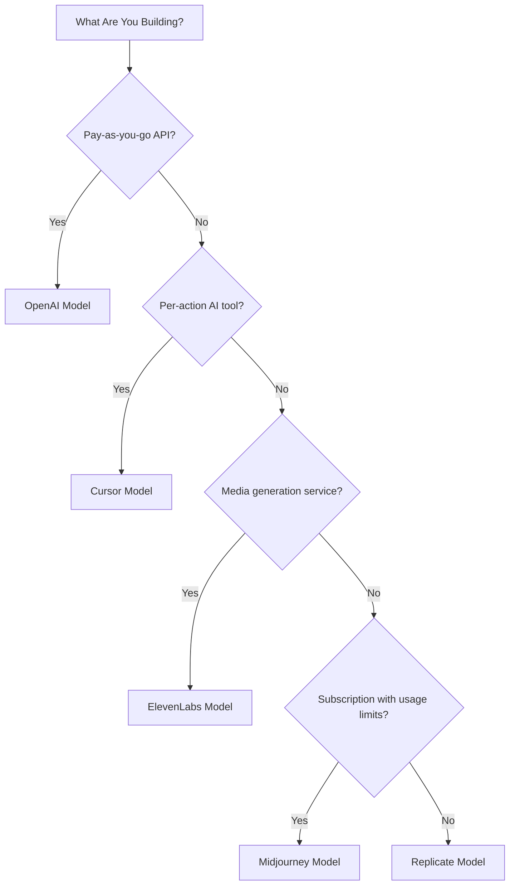

## Năm mô hình

| Ứng dụng | Chỉ số chính | Đổi mới độc đáo | Tính năng Dodo |
| :--- | :--- | :--- | :--- |
| OpenAI | Tokens (định danh theo fiat) | Tín dụng fiat trả trước với số dư không bao giờ hết hạn | Thanh toán theo tín dụng (Tín dụng fiat) |
| Cursor | Premium Requests | Tiêu hao tín dụng theo trọng số mô hình (chi phí khác nhau mỗi mô hình) | Thanh toán theo tín dụng (Đơn vị tùy chỉnh) |
| ElevenLabs | Characters | Hạn ngạch ký tự với chuyển tiếp + giá vượt tầng | Thanh toán theo tín dụng (Chuyển tiếp + Vượt hạn) |
| Midjourney | GPU Time | Chế độ "Relax Mode" không giới hạn khi vượt hạn ngạch | Đăng ký + Đồng hồ sử dụng |
| Replicate | Execution Seconds | Đo lường thuần theo từng giây và theo phần cứng cụ thể | Thanh toán hoàn toàn theo sử dụng |

## Hiểu các mẫu tín dụng

| Mẫu | Ví dụ | Tính năng Dodo | Loại đơn vị |
| :--- | :--- | :--- | :--- |
| Tín dụng trả trước định danh theo fiat | OpenAI API (nạp thêm tín dụng 5$, không thể rút) | Thanh toán theo tín dụng (Tín dụng fiat) | Đơn vị ảo định danh theo đô la |
| Tín dụng sử dụng ảo | Cursor Premium Requests, ElevenLabs Characters | Thanh toán theo tín dụng (Đơn vị tùy chỉnh) | Đơn vị tùy ý (yêu cầu, ký tự) |
| Đo lường tiêu thụ thuần | Thanh toán theo giây của Replicate | Thanh toán theo mức sử dụng (Đồng hồ) | Đo lường trực tiếp (giây, byte) |
| Đăng ký + vượt hạn đo lường | Midjourney Fast Hours với chế độ Relax | Đăng ký + Đồng hồ sử dụng | Dựa trên thời gian với ngưỡng miễn phí |

<Info>
Các Tín dụng Fiat trong Thanh toán theo tín dụng của Dodo đại diện cho các giá trị định danh theo đô la trên nền tảng và không có giá trị tiền tệ bên ngoài hệ sinh thái của bạn. Khách hàng không thể rút chúng thành tiền mặt.
</Info>

## Bạn nên dùng mô hình nào?

- Xây dựng nền tảng API trả theo sử dụng: mô hình OpenAI (Tín dụng fiat)
- Xây dựng công cụ AI với định giá theo hành động: mô hình Cursor (Tín dụng đơn vị tùy chỉnh)
- Xây dựng dịch vụ tạo nội dung media: mô hình ElevenLabs (Tín dụng chuyển tiếp)
- Xây dựng dịch vụ đăng ký có giới hạn sử dụng: mô hình Midjourney (Đăng ký + Đồng hồ sử dụng)
- Xây dựng nền tảng hạ tầng/tính toán: mô hình Replicate (Đo lường thuần túy)

<CardGroup cols={2}>
  <Card title="OpenAI" icon="/images/logos/openai.svg" href="/developer-resources/billing-deconstructions/openai">
    Tái tạo mô hình tín dụng trả trước dựa trên token.
  </Card>
  <Card title="Cursor" icon="/images/logos/cursor.svg" href="/developer-resources/billing-deconstructions/cursor">
    Xây dựng giới hạn sử dụng có trọng số theo mô hình.
  </Card>
  <Card title="ElevenLabs" icon="/images/logos/elevenlabs.svg" href="/developer-resources/billing-deconstructions/elevenlabs">
    Triển khai hạn ngạch ký tự với chuyển tiếp và phí vượt hạn.
  </Card>
  <Card title="Midjourney" icon="/images/logos/midjourney.svg" href="/developer-resources/billing-deconstructions/midjourney">
    Kết hợp đăng ký với phương án dự phòng theo sử dụng.
  </Card>
  <Card title="Replicate" icon="/images/logos/replicate.svg" href="/developer-resources/billing-deconstructions/replicate">
    Thiết lập đo lường tiêu thụ theo từng giây thuần túy.
  </Card>
</CardGroup>

## Tính năng Dodo

<CardGroup cols={2}>
  <Card title="Credit-Based Billing" href="/features/credit-based-billing">
    Quản lý tín dụng trả trước và đơn vị ảo.
  </Card>
  <Card title="Usage-Based Billing" href="/features/usage-based-billing/introduction">
    Đo lường tiêu thụ theo thời gian thực.
  </Card>
  <Card title="Subscriptions" href="/features/subscription">
    Xử lý thanh toán định kỳ và quản lý gói.
  </Card>
  <Card title="Hybrid Billing" href="/features/hybrid-billing">
    Kết hợp nhiều mô hình thanh toán để tối đa tính linh hoạt.
  </Card>
</CardGroup>

## Bản thiết kế thu thập

Mỗi phân tích cấu trúc bao gồm tích hợp với Dodo's [Ingestion Blueprints](/features/usage-based-billing/ingestion-blueprints), các SDK dựng sẵn tự động xử lý theo dõi sự kiện. Thay vì tự tạo các sự kiện sử dụng thủ công, hãy dùng một blueprint để có đo lường sẵn sàng cho sản xuất trong vài phút.

<CardGroup cols={3}>
  <Card title="LLM Blueprint" icon="brain-circuit" href="/developer-resources/ingestion-blueprints/llm">
    Theo dõi token tự động cho OpenAI, Anthropic, Groq và nhiều dịch vụ khác.
  </Card>
  <Card title="Stream Blueprint" icon="tower-broadcast" href="/developer-resources/ingestion-blueprints/stream">
    Theo dõi băng thông phát trực tuyến âm thanh và video.
  </Card>
  <Card title="Time Range Blueprint" icon="clock" href="/developer-resources/ingestion-blueprints/time-range">
    Tính phí theo thời lượng tính toán xuống từng phần nghìn giây.
  </Card>
</CardGroup>
