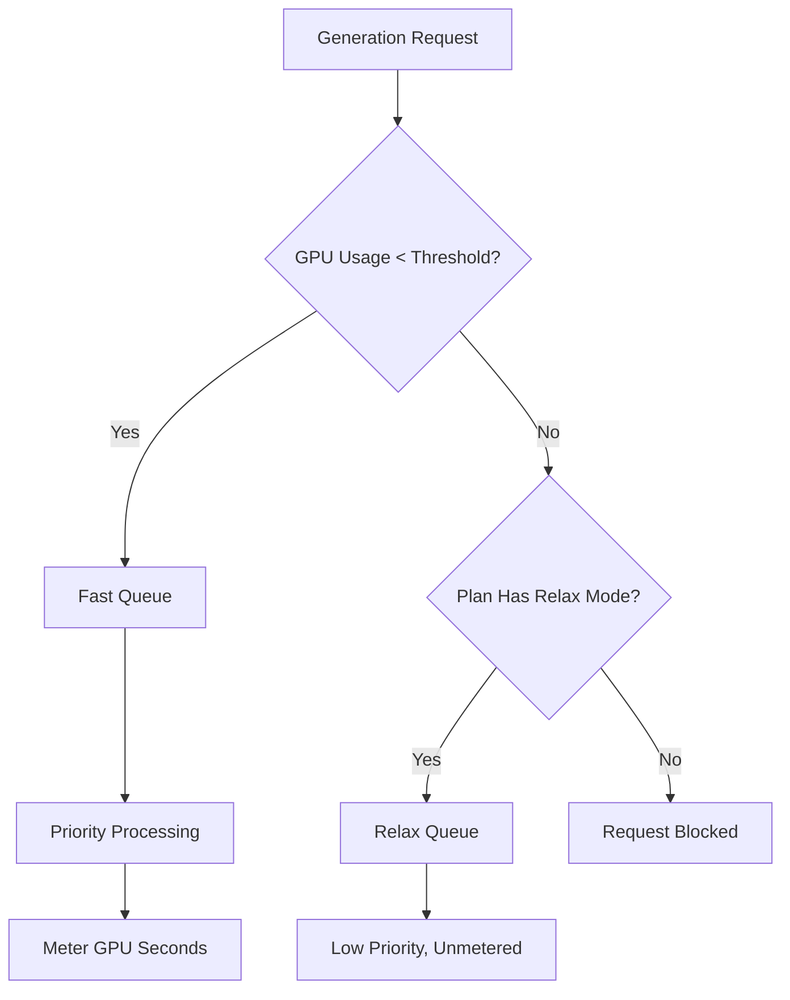

Midjourney là một nền tảng AI sinh nội dung sử dụng mô hình thanh toán độc đáo dựa trên thời gian GPU thay vì đơn giản tính theo từng hình ảnh. Cách tiếp cận này đảm bảo rằng các bản render phức tạp, độ phân giải cao sẽ tốn kém hơn các bản nháp nhanh, độ phân giải thấp.

## Cách Midjourney tính phí

Các gói đăng ký của Midjourney cấp cho người dùng một lượng "Giờ GPU Nhanh" nhất định mỗi tháng. Những giờ này thể đại diện cho thời gian tính toán thực tế đã sử dụng cho các lần tạo.

| Gói | Giá | Giờ GPU Nhanh | Chế độ Relax | Chế độ Stealth |
| :--- | :--- | :--- | :--- | :--- |
| Basic | \$10/tháng | ~3,3 giờ | Không | Không |
| Standard | \$30/tháng | 15 giờ | Không giới hạn | Không |
| Pro | \$60/tháng | 30 giờ | Không giới hạn | Có |
| Mega | \$120/tháng | 60 giờ | Không giới hạn | Có |

1. **Các tầng giá**: Midjourney cung cấp bốn cấp đăng ký dao động từ \$10 đến \$120 mỗi tháng, mỗi cấp cung cấp một lượng Giờ GPU Nhanh nhất định.
2. **Chế độ Relax**: Các gói Standard trở lên bao gồm khả năng tạo không giới hạn thông qua hàng đợi ưu tiên thấp khi hết giờ Nhanh, đảm bảo người dùng không bao giờ gặp rào cản sử dụng cứng nhắc.
3. **Giờ GPU bổ sung**: Người dùng có thể mua thêm thời gian Fast GPU với khoảng \$4 mỗi giờ nếu họ cần kết quả ngay lập tức sau khi đã sử dụng hết hạn mức hàng tháng.
4. **Đo lường theo đơn vị giây GPU**: Việc sử dụng được theo dõi qua thời gian tính toán thực tế dành cho các lần tạo, nghĩa là các render phức tạp sẽ tốn nhiều hơn so với các bản nháp đơn giản.
5. **Vòng lặp cộng đồng**: Người dùng tích cực có thể kiếm giờ GPU thưởng bằng cách đánh giá hình ảnh trong thư viện, điều này giúp huấn luyện mô hình đồng thời thưởng cho cộng đồng.
## Những điểm độc đáo

Mô hình Midjourney hiệu quả vì nó cân bằng chi phí với giá trị và mức sử dụng tài nguyên.

* **Tính phí theo thời gian GPU** cân bằng chi phí với mức sử dụng tài nguyên, đảm bảo các render phức tạp được định giá công bằng so với các bản nháp đơn giản.
* **Chế độ Relax** cung cấp phương án dự phòng không giới hạn, giảm tỷ lệ hủy đăng ký bằng cách duy trì quyền truy cập dịch vụ ngay cả sau khi đạt hạn mức hàng tháng.
* **Phân chia Fast và Relax** khuyến khích người dùng nâng cấp bằng cách cung cấp xử lý ưu tiên cho những ai cần tốc độ và kết quả tức thì.
* **Giờ GPU bổ sung** mang đến tùy chọn nạp linh hoạt cho người dùng cao cấp cần năng lực ưu tiên cao bổ sung giữa tháng.

## Xây dựng điều này bằng Dodo Payments

Bạn có thể tái tạo mô hình này bằng Dodo Payments bằng cách kết hợp các gói đăng ký với đồng hồ đo sử dụng và logic ứng dụng.

<Steps>

<Step title="Create a Usage Meter">

Đầu tiên, tạo một đồng hồ đo để theo dõi số giây GPU mà mỗi khách hàng đã sử dụng.

* **Tên đồng hồ đo**: `gpu.fast_seconds`
* **Tổng hợp**: **Tổng** (tổng thuộc tính `gpu_seconds` từ mỗi sự kiện)

Bạn chỉ theo dõi các sự kiện nơi chế độ tạo là "fast". Các lần tạo ở chế độ Relax không được đo để tính phí.

</Step>

<Step title="Create Subscription Products with Usage Pricing">

Tạo các sản phẩm đăng ký và gắn đồng hồ đo sử dụng với ngưỡng miễn phí.

| Sản phẩm | Giá cơ bản | Ngưỡng miễn phí (giây) | Giá vượt ngưỡng |
| :--- | :--- | :--- | :--- |
| Basic | \$10/tháng | 12.000 (3,3 giờ) | Không áp dụng (Giới hạn cứng) |
| Standard | \$30/tháng | 54.000 (15 giờ) | \$0,00 (Chế độ Relax) |
| Pro | \$60/tháng | 108.000 (30 giờ) | \$0,00 (Chế độ Relax) |
| Mega | \$120/tháng | 216.000 (60 giờ) | \$0,00 (Chế độ Relax) |

Với gói Basic, bạn sẽ vô hiệu hóa phí vượt ngưỡng để thực thi giới hạn cứng. Với các gói khác, “Chế độ Relax” được xử lý bởi logic ứng dụng của bạn khi đồng hồ đo cho thấy ngưỡng đã bị vượt.

</Step>

<Step title="Implement Application-Level Relax Mode">

Insight quan trọng là Relax Mode không phải là một tính năng thanh toán. Đó là ứng dụng của bạn định tuyến yêu cầu đến hàng đợi chậm hơn khi đồng hồ đo sử dụng Dodo cho thấy ngưỡng đã đạt.

```typescript
async function handleGenerationRequest(customerId: string, prompt: string) {
  const usage = await getCustomerUsage(customerId, 'gpu.fast_seconds');
  const subscription = await getSubscription(customerId);
  const threshold = getThresholdForPlan(subscription.product_id);
  
  if (usage.current >= threshold) {
    if (subscription.product_id === 'prod_basic') {
      throw new Error('Fast GPU hours exhausted. Upgrade to Standard for Relax Mode.');
    }
    
    // Relax Mode. Route to low-priority queue
    return await queueGeneration(customerId, prompt, {
      priority: 'low',
      mode: 'relax',
      model: 'standard'
    });
  }
  
  // Fast Mode. Priority processing
  return await queueGeneration(customerId, prompt, {
    priority: 'high',
    mode: 'fast',
    model: 'premium'
  });
}
```

</Step>

<Step title="Send Usage Events (Fast Mode Only)">

Chỉ gửi sự kiện sử dụng đến Dodo khi một lần tạo được thực hiện ở chế độ Fast.

```typescript
import DodoPayments from 'dodopayments';

async function trackFastGeneration(customerId: string, gpuSeconds: number, jobId: string) {
  // Only track Fast mode generations. Relax mode is free and unlimited
  const client = new DodoPayments({
    bearerToken: process.env.DODO_PAYMENTS_API_KEY,
  });

  await client.usageEvents.ingest({
    events: [{
      event_id: `gen_${jobId}`,
      customer_id: customerId,
      event_name: 'gpu.fast_seconds',
      timestamp: new Date().toISOString(),
      metadata: {
        gpu_seconds: gpuSeconds,
        resolution: '1024x1024',
        mode: 'fast'
      }
    }]
  });
}
```

</Step>

<Step title="Sell Extra Fast Hours (One-Time Top-Up)">

Tạo một sản phẩm thanh toán một lần cho "Giờ GPU Fast bổ sung" với mức \$4. Khi khách hàng mua sản phẩm này, bạn có thể cấp thêm ngưỡng hoặc tín dụng trong ứng dụng của mình.

```typescript
// After customer purchases extra hours
const session = await client.checkoutSessions.create({
  product_cart: [
    { product_id: 'prod_extra_gpu_hour', quantity: 5 }
  ],
  customer: { customer_id: customerId },
  return_url: 'https://yourapp.com/dashboard'
});
```

</Step>

<Step title="Create Checkout for Subscription">

Cuối cùng, tạo một phiên thanh toán cho gói đăng ký.

```typescript
const session = await client.checkoutSessions.create({
  product_cart: [
    { product_id: 'prod_mj_standard', quantity: 1 }
  ],
  customer: { email: 'artist@example.com' },
  return_url: 'https://yourapp.com/studio'
});
```

</Step>

</Steps>

## Tăng tốc với Blueprints Nhập khẩu Khoảng thời gian

[Time Range Ingestion Blueprint](/developer-resources/ingestion-blueprints/time-range) đơn giản hóa việc theo dõi thời gian GPU bằng cách cung cấp các trợ giúp dành riêng cho thanh toán dựa trên thời lượng.

```bash
npm install @dodopayments/ingestion-blueprints
```

```typescript
import { Ingestion, trackTimeRange } from '@dodopayments/ingestion-blueprints';

const ingestion = new Ingestion({
  apiKey: process.env.DODO_PAYMENTS_API_KEY,
  environment: 'live_mode',
  eventName: 'gpu.fast_seconds',
});

// Track generation time after a Fast mode job completes
const startTime = Date.now();
const result = await runGeneration(prompt, settings);
const durationMs = Date.now() - startTime;

await trackTimeRange(ingestion, {
  customerId: customerId,
  durationMs: durationMs,
  metadata: {
    mode: 'fast',
    resolution: '1024x1024',
  },
});
```

Blueprint xử lý chuyển đổi thời lượng và định dạng sự kiện. Bạn chỉ cần cung cấp ID khách hàng và thời gian đã trôi qua.

<Tip>
Blueprint Time Range hỗ trợ mili giây, giây và phút. Xem [tài liệu blueprint đầy đủ](/developer-resources/ingestion-blueprints/time-range) để biết tất cả các tùy chọn thời lượng và thực hành tốt nhất.
</Tip>

## Kiến trúc Fast vs Relax

Hệ thống hai hàng đợi hoạt động bằng cách định tuyến yêu cầu dựa trên trạng thái sử dụng hiện tại.



1. Tất cả yêu cầu đi qua ứng dụng của bạn.
2. Ứng dụng kiểm tra đồng hồ đo sử dụng Dodo so với ngưỡng miễn phí của gói.
3. Nếu mức sử dụng dưới ngưỡng, yêu cầu được gửi đến hàng đợi Fast và được đo.
4. Nếu mức sử dụng vượt ngưỡng, yêu cầu được đưa vào hàng đợi Relax, nơi không được tính phí và có ưu tiên thấp hơn.
5. Gói Basic không có phương án dự phòng Relax, vì vậy yêu cầu bị chặn khi đã đạt giới hạn.

<Info>
Chế độ Relax là một mẫu kiến trúc ở cấp ứng dụng, không phải một tính năng thanh toán của Dodo. Dodo theo dõi việc sử dụng Fast GPU của bạn và thông báo khi ngưỡng bị vượt. Ứng dụng của bạn quyết định chặn người dùng hay định tuyến họ đến hàng đợi chậm hơn.
</Info>

## Các tính năng chính của Dodo được sử dụng

<CardGroup cols={2}>
  <Card title="Subscriptions" icon="calendar" href="/features/subscription">
    Quản lý thanh toán định kỳ và các tầng gói.
  </Card>
  <Card title="Usage-Based Billing" icon="bolt" href="/features/usage-based-billing/introduction">
    Theo dõi và tính phí dựa trên mức tiêu thụ tài nguyên thực tế.
  </Card>
  <Card title="Event Ingestion" icon="input-pipe" href="/features/usage-based-billing/event-ingestion">
    Gửi các sự kiện sử dụng khối lượng lớn đến API Dodo.
  </Card>
  <Card title="Meters" icon="gauge" href="/features/usage-based-billing/meters">
    Định nghĩa cách các sự kiện sử dụng được tổng hợp và tính phí.
  </Card>
  <Card title="One-Time Payments" icon="credit-card" href="/features/one-time-payment-products">
    Bán các giờ bổ sung hoặc nạp thêm như các giao dịch một lần.
  </Card>
  <Card title="Time Range Blueprint" icon="clock" href="/developer-resources/ingestion-blueprints/time-range">
    Theo dõi thời gian GPU đơn giản hóa bằng các trợ giúp dựa trên thời lượng.
  </Card>
</CardGroup>
