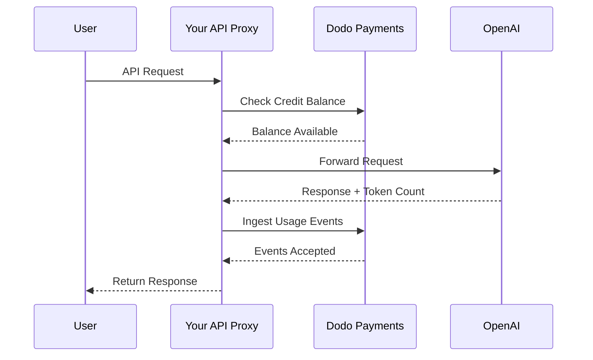
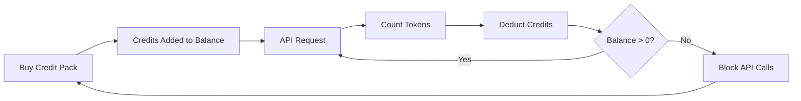

Mô hình thanh toán của OpenAI là tiêu chuẩn vàng cho các công ty AI. Nó kết hợp tín dụng tiền tệ trả trước cho việc sử dụng API với các gói đăng ký giá cố định cho sản phẩm tiêu dùng. Cách tiếp cận kết hợp này đảm bảo nguồn doanh thu dự đoán được đồng thời cho phép các nhà phát triển mở rộng quy mô sử dụng mà không gặp trở ngại.

## Tại sao mô hình của OpenAI là tiêu chuẩn

Ngành công nghiệp AI đối mặt với những thách thức riêng mà các mô hình thanh toán SaaS truyền thống không phải lúc nào cũng giải quyết được. Mô hình của OpenAI đồng thời giải quyết nhiều vấn đề này.

1. **Doanh thu dự đoán và rủi ro thấp**: Bằng cách yêu cầu tín dụng trả trước cho việc sử dụng API, OpenAI loại bỏ rủi ro người dùng tạo ra hóa đơn khổng lồ mà không thể trả. Bạn nhận được tiền trước, và người dùng dùng dịch vụ khi họ sử dụng.
2. **Khả năng mở rộng cho nhà phát triển**: Việc nạp lại \$5 là rào cản thấp để bắt đầu. Khi ứng dụng phát triển, nhà phát triển có thể tự động nạp lại hoặc mua gói lớn hơn. Các bước bắt đầu gần như bằng không, nhưng giới hạn để mở rộng thì không giới hạn.
3. **Tâm lý người dùng**: Việc quy đổi tín dụng theo tiền tệ (USD) thay vì các “token” hay “điểm” trừu tượng khiến giá trị trở nên rõ ràng. Nó giống như một tài khoản ngân hàng dành cho dịch vụ AI, giúp xây dựng niềm tin và dễ lập ngân sách hơn cho các công ty.

## Cách OpenAI lập hóa đơn

OpenAI vận hành hai mô hình thanh toán khác biệt để phục vụ các nhu cầu người dùng khác nhau.

1. **API (Trả tiền theo mức sử dụng)**: API sử dụng tín dụng trả trước quy đổi theo tiền tệ fiat. Người dùng nạp tiền vào tài khoản với các mức \$5, \$10, \$50 hoặc lớn hơn. Những tín dụng này hiển thị giá trị bằng đô la nhưng không có giá trị tiền tệ bên ngoài OpenAI. OpenAI lập hóa đơn theo token với các mức giá khác nhau cho token đầu vào và đầu ra. Tín dụng không bao giờ hết hạn, và khi số dư người dùng về \$0, các cuộc gọi API sẽ thất bại ngay lập tức.
2. **ChatGPT Plus, Team và Enterprise**: Đây là các gói đăng ký với mức phí cố định. ChatGPT Plus có giá \$20 mỗi tháng, trong khi gói Team là \$25 cho mỗi người dùng mỗi tháng. Các gói này có ngưỡng sử dụng mềm, nơi người dùng bị giảm cấp xuống mô hình nhỏ hơn thay vì bị chặn hoàn toàn.
3. **Các tầng mức giới hạn dựa trên chi tiêu**: Khi bạn chi nhiều tiền hơn theo thời gian, bạn mở khóa giới hạn tỷ lệ API cao hơn. Đây là hệ thống mở rộng truy cập dựa trên niềm tin gắn trực tiếp với lịch sử thanh toán của bạn.

| Mô hình | Giá | Token đầu vào | Token đầu ra |
| :--- | :--- | :--- | :--- |
| GPT-4o | Dựa trên mức sử dụng | \$2.50 / 1M | \$10.00 / 1M |
| GPT-4o-mini | Dựa trên mức sử dụng | \$0.15 / 1M | \$0.60 / 1M |
| o1 | Dựa trên mức sử dụng | \$15.00 / 1M | \$60.00 / 1M |

| Gói | Giá | Loại |
| :--- | :--- | :--- |
| Free | \$0 | Truy cập giới hạn |
| Plus | \$20 / tháng | Đăng ký với ngưỡng mềm |
| Team | \$25 / người dùng / tháng | Đăng ký theo ghế |
| Enterprise | Tùy chỉnh | Thanh toán bằng hóa đơn |
## Những điểm độc đáo

Chiến lược thanh toán của OpenAI có một số đặc điểm chính khiến nó hiệu quả đối với dịch vụ AI.

- **Tín dụng quy đổi theo tiền tệ**: Tín dụng cảm giác giống tiền vì được quy đổi theo USD. Điều này khiến giá cả minh bạch và dễ hiểu đối với các nhà phát triển.
- **Không hết hạn**: Số dư không bao giờ hết hạn giảm áp lực “dùng ngay hoặc mất”. Người dùng cảm thấy thoải mái khi nạp số tiền lớn hơn vì biết giá trị không biến mất.
- **Đo lường đa chiều**: Token đầu vào và đầu ra được theo dõi riêng nhưng trừ vào cùng một số dư tín dụng. Điều này cho phép OpenAI định giá token đầu ra đắt hơn khác với token đầu vào rẻ hơn.
- **Các tầng mức tin cậy**: Liên kết giới hạn tỷ lệ với tổng chi tiêu khuyến khích người dùng ở lại nền tảng và thưởng cho khách hàng dài hạn bằng hiệu suất tốt hơn.
## Lợi thế chiến lược

Mô hình này tạo ra một vòng xoáy mạnh mẽ. Chi phí đầu vào thấp thu hút nhà phát triển. Tín dụng trả trước cung cấp dòng tiền ngay. Mở rộng theo mức sử dụng đảm bảo khi nhà phát triển thành công, OpenAI cũng thành công. Phần đăng ký cung cấp nền doanh thu ổn định và dự đoán được từ người dùng không phải nhà phát triển.

## Xây dựng điều này với Dodo Payments

Bạn có thể tái tạo mô hình thanh toán của OpenAI bằng Dodo Payments. Chúng ta sẽ dùng Credit-Based Billing cho API và các gói đăng ký tiêu chuẩn cho phía ChatGPT Plus.

<Steps>
  <Step title="Create a Fiat Credit Entitlement">
    Bắt đầu bằng cách tạo một quyền lợi tín dụng trong bảng điều khiển Dodo Payments của bạn. Đây sẽ là số dư trung tâm cho người dùng của bạn.

    * **Loại tín dụng:** Tín dụng Fiat (USD)
    * **Hạn dùng tín dụng:** Không bao giờ
    * **Chuyển tiếp:** Không cần (vì chúng không bao giờ hết hạn)
    * **Vượt hạn:** Tắt

    Tắt vượt hạn đảm bảo các cuộc gọi API thất bại khi số dư về \$0, giống y hệt OpenAI.
  </Step>

  <Step title="Create Top-Up Products">
    Tạo các sản phẩm thanh toán một lần cho các gói tín dụng khác nhau. Bạn có thể cung cấp các lựa chọn \$5, \$10, \$50 và \$100. Gắn quyền lợi tín dụng fiat của bạn vào từng sản phẩm.

    Đặt số tín dụng cấp phát mỗi sản phẩm theo đơn vị xu. Với gói \$50, bạn sẽ cấp 5000 tín dụng.

    ```typescript
    import DodoPayments from 'dodopayments';

    const client = new DodoPayments({
      bearerToken: process.env.DODO_PAYMENTS_API_KEY,
    });

    const session = await client.checkoutSessions.create({
      product_cart: [
        { product_id: 'prod_credit_pack_50', quantity: 1 }
      ],
      customer: { email: 'developer@example.com' },
      return_url: 'https://yourapp.com/dashboard'
    });
    ```

  </Step>

  <Step title="Create Usage Meters">
    Tạo hai bộ đo riêng biệt để theo dõi việc sử dụng token.

    * `llm.input_tokens`: Tính tổng trên thuộc tính `tokens`.
    * `llm.output_tokens`: Tính tổng trên thuộc tính `tokens`.
    Kết nối cả hai bộ đo với quyền lợi tín dụng fiat của bạn. Bạn sẽ cần cấu hình "Đơn vị bộ đo trên mỗi tín dụng" cho từng bộ.

    ### Tính toán Đơn vị bộ đo trên mỗi tín dụng

    Để khớp với giá GPT-4o của OpenAI (\$2.50 cho 1M token đầu vào), bạn cần tính xem bao nhiêu token tương ứng với \$1 (100 xu).

    * **Token đầu vào:** 1.000.000 token / \$2.50 = 400.000 token cho \$1.
    * **Token đầu ra:** 1.000.000 token / \$10.00 = 100.000 token cho \$1.
    Trong bảng Dodo, bạn sẽ đặt "Đơn vị bộ đo trên mỗi tín dụng" là 400.000 cho đầu vào và 100.000 cho đầu ra.
  </Step>

  <Step title="Send Usage Events">
    Sau mỗi yêu cầu LLM, gửi dữ liệu sử dụng về Dodo Payments. Bạn có thể gửi cả sự kiện đầu vào và đầu ra trong cùng một yêu cầu.

    ```typescript
    await client.usageEvents.ingest({
      events: [{
        event_id: `req_${requestId}`,
        customer_id: customerId,
        event_name: 'llm.input_tokens',
        timestamp: new Date().toISOString(),
        metadata: {
          model: 'gpt-4o',
          tokens: 1500
        }
      }, {
        event_id: `req_${requestId}_out`,
        customer_id: customerId,
        event_name: 'llm.output_tokens',
        timestamp: new Date().toISOString(),
        metadata: {
          model: 'gpt-4o',
          tokens: 800
        }
      }]
    });
    ```

  </Step>

  <Step title="Handle Balance Depletion">
    Bạn nên kiểm tra số dư người dùng trước khi xử lý yêu cầu API. Nếu số dư bằng hoặc thấp hơn 0, trả về lỗi 402.

    ```typescript
    async function checkCreditsBeforeRequest(customerId: string) {
      const balance = await client.creditEntitlements.balances.retrieve(customerId, {
        credit_entitlement_id: 'credit_entitlement_id',
      });

      if (balance.available <= 0) {
        throw new Error('Insufficient credits. Please top up your account.');
      }
    }
    ```

    ### Xử lý webhook khi số dư thấp

    Đừng đợi đến khi người dùng chạm \$0 mới thông báo cho họ. Dùng webhook để kích hoạt email hoặc thông báo trong ứng dụng khi số dư của họ giảm xuống dưới ngưỡng nhất định.

    ```typescript
    import DodoPayments from 'dodopayments';
    import express from 'express';

    const app = express();
    app.use(express.raw({ type: 'application/json' }));

    const client = new DodoPayments({
      bearerToken: process.env.DODO_PAYMENTS_API_KEY,
      webhookKey: process.env.DODO_PAYMENTS_WEBHOOK_KEY,
    });

    app.post('/webhooks/dodo', async (req, res) => {
      try {
        const event = client.webhooks.unwrap(req.body.toString(), {
          headers: {
            'webhook-id': req.headers['webhook-id'] as string,
            'webhook-signature': req.headers['webhook-signature'] as string,
            'webhook-timestamp': req.headers['webhook-timestamp'] as string,
          },
        });

        if (event.type === 'credit.balance_low') {
          const { customer_id, available_balance } = event.data;
          await sendLowBalanceEmail(customer_id, available_balance);
        }

        res.json({ received: true });
      } catch (error) {
        res.status(401).json({ error: 'Invalid signature' });
      }
    });
    ```

    <Tip>
      OpenAI gửi những email này khi số dư người dùng sắp cạn, để họ có thời gian nạp thêm mà không bị gián đoạn dịch vụ.
    </Tip>
  </Step>

  <Step title="Build the ChatGPT Subscription Side (Optional)">
    Nếu bạn muốn cung cấp gói đăng ký như ChatGPT Plus, hãy tạo một sản phẩm đăng ký riêng trong Dodo Payments. Những sản phẩm này không cần quyền lợi tín dụng.
    Với gói Team, sử dụng thanh toán theo ghế bằng cách thêm phần mở rộng cho mỗi người dùng bổ sung.
    ```typescript
    const session = await client.checkoutSessions.create({
      product_cart: [
        { product_id: 'prod_plus_subscription', quantity: 1 }
      ],
      customer: { email: 'user@example.com' },
      return_url: 'https://yourapp.com/billing'
    });
    ```

    ### Triển khai ngưỡng mềm

    Để sao chép các ngưỡng mềm của OpenAI, bạn có thể theo dõi mức sử dụng của người dùng đăng ký bằng cùng các bộ đo nhưng không liên kết với quyền lợi tín dụng. Trong logic ứng dụng, kiểm tra mức sử dụng trong kỳ thanh toán hiện tại.
    ```typescript
    async function checkSubscriptionUsage(customerId: string) {
      const usage = await getUsageForCurrentPeriod(customerId);
      
      if (usage > SOFT_CAP_THRESHOLD) {
        // Route to a smaller model instead of blocking
        return 'gpt-4o-mini';
      }
      
      return 'gpt-4o';
    }
    ```

  </Step>
</Steps>

## Tăng tốc với LLM Ingestion Blueprint

Các bước ở trên cho thấy cách thủ công xây dựng và gửi các sự kiện sử dụng. Đối với triển khai sản xuất, [LLM Ingestion Blueprint](/developer-resources/ingestion-blueprints/llm) cung cấp theo dõi token tự động gói trực tiếp client OpenAI của bạn.

```bash
npm install @dodopayments/ingestion-blueprints
```

```typescript
import { createLLMTracker } from '@dodopayments/ingestion-blueprints';
import OpenAI from 'openai';

const openai = new OpenAI({ apiKey: process.env.OPENAI_API_KEY });

const tracker = createLLMTracker({
  apiKey: process.env.DODO_PAYMENTS_API_KEY,
  environment: 'live_mode',
  eventName: 'llm.chat_completion',
});

const trackedClient = tracker.wrap({
  client: openai,
  customerId: customerId,
});

// Every API call now automatically tracks token usage
const response = await trackedClient.chat.completions.create({
  model: 'gpt-4o',
  messages: [{ role: 'user', content: prompt }],
});

// inputTokens, outputTokens, and totalTokens are sent automatically
console.log('Tokens used:', response.usage);
```

Blueprint ghi lại `inputTokens`, `outputTokens` và `totalTokens` từ mọi phản hồi API và gửi chúng dưới dạng siêu dữ liệu sự kiện. Cấu hình bộ đo của bạn để tổng hợp theo thuộc tính token phù hợp.

<Tip>
Blueprint LLM hỗ trợ OpenAI, Anthropic, Groq, Google Gemini, OpenRouter và Vercel AI SDK. Xem [tài liệu blueprint đầy đủ](/developer-resources/ingestion-blueprints/llm) để biết ví dụ cụ thể theo nhà cung cấp và cấu hình nâng cao.
</Tip>

## Triển khai các tầng giới hạn dựa trên chi tiêu

Các tầng giới hạn của OpenAI là cách mạnh mẽ để quản lý năng lực. Bạn có thể triển khai điều này bằng cách theo dõi tổng chi tiêu suốt đời của khách hàng.

1. **Theo dõi chi tiêu suốt đời:** Lắng nghe webhook `payment.succeeded` và cập nhật trường `total_spend` trong cơ sở dữ liệu cho khách hàng đó.
2. **Định nghĩa các tầng:** Tạo ánh xạ từ mức chi tiêu đến giới hạn tỷ lệ.
   * Tầng 1: chi tiêu \$0 - \$50 -> 3 RPM
   * Tầng 2: chi tiêu \$50 - \$250 -> 10 RPM
   * Tầng 3: chi tiêu \$250+ -> 50 RPM
3. **Thực thi giới hạn:** Trong middleware API của bạn, kiểm tra tầng của khách hàng và áp dụng giới hạn tỷ lệ tương ứng.

```typescript
async function getRateLimitForCustomer(customerId: string) {
  const customer = await db.customers.findUnique({ where: { id: customerId } });
  const totalSpend = customer.total_spend;

  if (totalSpend >= 25000) return TIER_3_LIMITS; // $250.00
  if (totalSpend >= 5000) return TIER_2_LIMITS;  // $50.00
  return TIER_1_LIMITS;
}
```

## Ví dụ triển khai đầy đủ: Proxy API

Trong kịch bản thực tế, bạn có thể có một proxy API đứng giữa người dùng và nhà cung cấp LLM. Proxy này xử lý xác thực, kiểm tra tín dụng và báo cáo sử dụng.



```typescript
import DodoPayments from 'dodopayments';
import OpenAI from 'openai';

const client = new DodoPayments({
  bearerToken: process.env.DODO_PAYMENTS_API_KEY,
});
const openai = new OpenAI({ apiKey: process.env.OPENAI_API_KEY });

export async function handleApiRequest(req, res) {
  const { customerId, prompt, model } = req.body;

  try {
    // 1. Check credit balance
    const balance = await client.creditEntitlements.balances.retrieve(customerId, {
      credit_entitlement_id: 'credit_entitlement_id',
    });

    if (balance.available <= 0) {
      return res.status(402).json({ error: 'Insufficient credits. Please top up.' });
    }

    // 2. Call OpenAI
    const completion = await openai.chat.completions.create({
      model: model,
      messages: [{ role: 'user', content: prompt }],
    });

    const { prompt_tokens, completion_tokens } = completion.usage;

    // 3. Ingest usage events to Dodo
    await client.usageEvents.ingest({
      events: [
        {
          event_id: `req_${completion.id}_in`,
          customer_id: customerId,
          event_name: 'llm.input_tokens',
          timestamp: new Date().toISOString(),
          metadata: { model, tokens: prompt_tokens }
        },
        {
          event_id: `req_${completion.id}_out`,
          customer_id: customerId,
          event_name: 'llm.output_tokens',
          timestamp: new Date().toISOString(),
          metadata: { model, tokens: completion_tokens }
        }
      ]
    });

    // 4. Return response to user
    res.json(completion);

  } catch (error) {
    console.error('API Error:', error);
    res.status(500).json({ error: 'Internal server error' });
  }
}
```

## Xử lý các trường hợp ngoại lệ

Khi xây dựng một hệ thống thanh toán phức tạp như OpenAI, bạn sẽ gặp một số trường hợp ngoại lệ cần xử lý cẩn thận.

### Điều kiện đua

Nếu người dùng có số dư rất thấp và gửi nhiều yêu cầu đồng thời, họ có thể vượt quá giới hạn tín dụng trước khi sự kiện đầu tiên được xử lý. Để ngăn chặn điều này, bạn có thể triển khai một “bộ đệm” nhỏ hoặc sử dụng khóa phân tán trên số dư khách hàng trong quá trình xử lý yêu cầu.

### Độ trễ hập dữ liệu sự kiện

Dodo Payments xử lý sự kiện bất đồng bộ. Điều này có nghĩa đôi khi có độ trễ nhỏ giữa cuộc gọi API và việc trừ tín dụng. Với hầu hết trường hợp sử dụng, điều này là chấp nhận được. Nếu bạn cần thực thi thời gian thực nghiêm ngặt, bạn có thể duy trì bộ nhớ đệm cục bộ số dư người dùng và cập nhật một cách lạc quan.

### Xử lý hoàn tiền

Nếu bạn hoàn tiền cho việc mua gói tín dụng, Dodo Payments sẽ xử lý quyền lợi tín dụng đó tự động nếu được cấu hình. Tuy nhiên, bạn nên đảm bảo logic ứng dụng phản ánh thay đổi này ngay lập tức để ngăn người dùng sử dụng tín dụng họ không còn có.

### Hỗ trợ đa mô hình

Nếu bạn hỗ trợ nhiều mô hình với định giá khác nhau, bạn có hai lựa chọn:
1. **Các bộ đo riêng biệt:** Tạo các bộ đo riêng cho từng mô hình (ví dụ: `gpt-4o.input_tokens`, `gpt-4o-mini.input_tokens`).
2. **Sự kiện cân bằng:** Dùng một bộ đo duy nhất nhưng nhân giá trị `tokens` với trọng số trước khi gửi đến Dodo. Ví dụ, nếu GPT-4o đắt gấp 10 lần GPT-4o-mini, bạn có thể gửi 10 lần số token cho các yêu cầu GPT-4o.

OpenAI sử dụng cách tiếp cận bộ đo riêng để duy trì hồ sơ rõ ràng về mức sử dụng theo từng mô hình.

## Tổng quan kiến trúc



Các bộ đo theo dõi token và trừ giá trị tương ứng từ số dư tín dụng của người dùng dựa trên các mức giá bạn cấu hình.

## Kết luận

Tái tạo mô hình thanh toán của OpenAI với Dodo Payments mang lại cả hai lợi thế: sự linh hoạt của thanh toán theo mức sử dụng và sự dự đoán được của tín dụng trả trước. Bằng cách theo dõi hướng dẫn này, bạn có thể xây dựng hệ thống thanh toán cùng phát triển theo người dùng đồng thời bảo vệ biên lợi nhuận.

Dù bạn đang xây dựng LLM tiếp theo hay một công cụ AI chuyên biệt, những kiểu mẫu này sẽ giúp bạn tạo trải nghiệm chuyên nghiệp, thân thiện với nhà phát triển. Cách tiếp cận này đảm bảo hạ tầng thanh toán của bạn bền vững và đáng tin cậy như các mô hình AI mà bạn cung cấp cho khách hàng.

## Các tính năng Dodo chính được sử dụng

Khám phá các tính năng làm cho việc triển khai này trở nên khả thi.

<CardGroup cols={2}>
  <Card title="Credit-Based Billing" icon="coins" href="/features/credit-based-billing">
    Quản lý tín dụng fiat trả trước và quyền lợi cho người dùng của bạn.
  </Card>
  <Card title="Usage-Based Billing" icon="chart-line" href="/features/usage-based-billing/introduction">
    Theo dõi mức sử dụng chi tiết như token và lập hóa đơn theo thời gian thực.
  </Card>
  <Card title="One-Time Payments" icon="credit-card" href="/features/one-time-payment-products">
    Bán gói tín dụng và nạp tiền với luồng thanh toán đơn giản.
  </Card>
  <Card title="Event Ingestion" icon="bolt" href="/features/usage-based-billing/event-ingestion">
    Gửi dữ liệu sử dụng lưu lượng lớn đến Dodo Payments một cách dễ dàng.
  </Card>
  <Card title="Webhooks" icon="webhook" href="/developer-resources/webhooks/intents/credit">
    Luôn cập nhật khi số dư tín dụng thay đổi và cảnh báo số dư thấp.
  </Card>
  <Card title="LLM Ingestion Blueprint" icon="brain-circuit" href="/developer-resources/ingestion-blueprints/llm">
    Theo dõi token tự động cho OpenAI và các nhà cung cấp LLM khác.
  </Card>
</CardGroup>

Replicating OpenAI's billing model with Dodo Payments gives you the best of both worlds: the flexibility of usage-based billing and the predictability of prepaid credits. By following this guide, you can build a billing system that scales with your users while protecting your margins.

Whether you're building the next big LLM or a niche AI tool, these patterns will help you create a professional, developer-friendly experience. This approach ensures that your billing infrastructure is as scalable and reliable as the AI models you're delivering to your customers.

## Key Dodo Features Used

Explore the features that make this implementation possible.

<CardGroup cols={2}>
  <Card title="Credit-Based Billing" icon="coins" href="/features/credit-based-billing">
    Manage prepaid fiat credits and entitlements for your users.
  </Card>
  <Card title="Usage-Based Billing" icon="chart-line" href="/features/usage-based-billing/introduction">
    Track granular usage like tokens and bill for it in real-time.
  </Card>
  <Card title="One-Time Payments" icon="credit-card" href="/features/one-time-payment-products">
    Sell credit packs and top-ups with a simple checkout flow.
  </Card>
  <Card title="Event Ingestion" icon="bolt" href="/features/usage-based-billing/event-ingestion">
    Send high-volume usage data to Dodo Payments with ease.
  </Card>
  <Card title="Webhooks" icon="webhook" href="/developer-resources/webhooks/intents/credit">
    Stay updated on credit balance changes and low balance alerts.
  </Card>
  <Card title="LLM Ingestion Blueprint" icon="brain-circuit" href="/developer-resources/ingestion-blueprints/llm">
    Automatic token tracking for OpenAI and other LLM providers.
  </Card>
</CardGroup>
