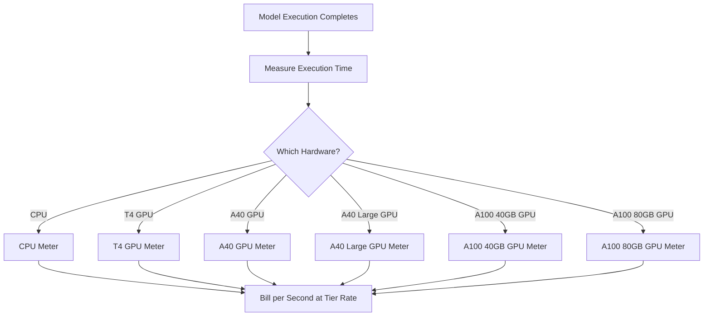

Replicate là một nền tảng để chạy các mô hình học máy mã nguồn mở trên đám mây. Mô hình thanh toán của họ là một trong những ví dụ điển hình nhất về giá theo mức sử dụng trong ngành AI. Không có phí đăng ký hàng tháng và không có mức phí cố định cho mỗi lần chạy mô hình. Thay vào đó, họ tính phí cho chính xác thời gian sử dụng tài nguyên tính toán, đến từng giây, với các mức giá khác nhau tùy vào phần cứng nền tảng.

Cách tiếp cận này phù hợp với các khối lượng công việc AI vì thời gian thực thi không thể đoán trước. Một người dùng có thể chạy một mô hình nhẹ trong vài giây hoặc một mô hình sinh lớn trong vài phút. Bằng cách gắn chi phí vào tài nguyên tính toán thay vì mô hình, Replicate giữ được sự minh bạch và khả năng mở rộng của giá cả.

## Cách Replicate Tính Phí

Giá của Replicate không phụ thuộc vào mô hình cụ thể được chạy. Dù bạn đang tạo hình ảnh với SDXL hay chạy Llama 3, việc tính phí được xác định bởi lớp phần cứng và thời lượng thực thi. Điều này cho phép họ lưu trữ hàng nghìn mô hình mã nguồn mở mà không cần một bảng giá riêng cho từng mẫu.

| Phần cứng | Giá mỗi giây | Giá mỗi giờ |
| :--- | :--- | :--- |
| NVIDIA CPU | \$0.000100 | \$0.36 |
| NVIDIA T4 GPU | \$0.000225 | \$0.81 |
| NVIDIA A40 GPU | \$0.000575 | \$2.07 |
| NVIDIA A40 (Lớn) GPU | \$0.000725 | \$2.61 |
| NVIDIA A100 (40GB) GPU | \$0.001150 | \$4.14 |
| NVIDIA A100 (80GB) GPU | \$0.001400 | \$5.04 |



1. **Giá theo phần cứng:** Chi phí mỗi giây thay đổi tùy vào tài nguyên tính toán cần đến. Mỗi lớp phần cứng có một mức giá khác nhau.
2. **Mô hình thuần túy theo mức sử dụng:** Không có phí hàng tháng, không có phí vượt hạn mức và không có giới hạn. Người dùng được tính phí theo thời gian thực tính toán chính xác (ví dụ: “12.4 giây trên A100”) thay vì theo mỗi lần tạo nội dung.
3. **Độ phân giải từng giây:** Các nhà cung cấp đám mây truyền thống tính theo giờ hoặc phút, dẫn tới lãng phí với các tác vụ ngắn. Thanh toán theo từng giây loại bỏ sự kém hiệu quả này cho cả thử nghiệm nhỏ và khối lượng công việc sản xuất lớn.

<Info>
Thời gian khởi động lạnh cũng được tính phí. Yêu cầu đầu tiên tới mô hình thường mất 10-30 giây để tải mô hình vào bộ nhớ. Thời gian tải này được tính với cùng mức giá như thời gian thực thi.
</Info>
## Điều Gì Làm Nên Sự Khác Biệt

* **Đo lường theo phần cứng:** Cùng một mô hình có chi phí cao hơn khi chạy trên phần cứng tốt hơn. Người dùng chọn giữa tốc độ và chi phí. GPU T4 phù hợp cho nhiệm vụ không cần thời gian thực, trong khi A100 xử lý ứng dụng thời gian thực.
* **Độ phân giải từng giây:** Việc tính phí được xác định đến từng giây, vì vậy người dùng không bao giờ bị tính phí quá mức cho các tác vụ ngắn.
* **Không cần đăng ký:** Không cam kết để bắt đầu. Nó mở rộng vô hạn theo mức sử dụng, rất lý tưởng cho các startup và nhà phát triển thử nghiệm với nhiều mô hình khác nhau.
* **Không phụ thuộc vào mô hình:** Luật tính phí giữ nguyên bất kể loại nhiệm vụ (tạo hình ảnh, xử lý văn bản, chuyển mã âm thanh hoặc tổng hợp video). Điều này giúp nền tảng hỗ trợ một hệ sinh thái mô hình lớn mà không cần bảng giá phức tạp.

## Xây Dựng Điều Này Với Dodo Payments

Bạn có thể tái hiện mô hình thanh toán này bằng các tính năng thanh toán theo mức sử dụng của Dodo Payments. Chìa khóa là sử dụng nhiều meter để theo dõi các lớp phần cứng khác nhau và gắn chúng vào một sản phẩm duy nhất.

<Steps>
  <Step title="Create Usage Meters (One Per Hardware Class)">
    Tạo từng meter riêng cho mỗi lớp phần cứng. Mỗi loại phần cứng có chi phí theo giây khác nhau, nên việc đo riêng cho phép Dodo định giá từng lớp khác nhau và cung cấp hoá đơn chi tiết.

    | Tên Meter | Tên Sự Kiện | Tổng Hợp | Thuộc Tính |
    | :--- | :--- | :--- | :--- |
    | CPU Compute | `compute.cpu` | Sum | `execution_seconds` |
    | GPU T4 Compute | `compute.gpu_t4` | Sum | `execution_seconds` |
    | GPU A40 Compute | `compute.gpu_a40` | Sum | `execution_seconds` |
    | GPU A40 Large Compute | `compute.gpu_a40_large` | Sum | `execution_seconds` |
    | GPU A100 40GB Compute | `compute.gpu_a100_40` | Sum | `execution_seconds` |
    | GPU A100 80GB Compute | `compute.gpu_a100_80` | Sum | `execution_seconds` |

    Tổng hợp `Sum` trên thuộc tính `execution_seconds` tính tổng thời gian tính toán theo từng lớp phần cứng trong kỳ thanh toán.
  </Step>

  <Step title="Create a Usage-Based Product">
    Tạo một sản phẩm mới trên bảng điều khiển Dodo Payments:

    * **Loại giá:** Thanh toán theo mức sử dụng
    * **Giá cơ bản:** \$0/tháng (không có phí đăng ký)
    * **Tần suất thanh toán:** Hàng tháng

    Gắn tất cả các meter với mức giá mỗi đơn vị tương ứng:

    | Meter | Giá Mỗi Đơn Vị (mỗi giây) |
    | :--- | :--- |
    | compute.cpu | \$0.000100 |
    | compute.gpu_t4 | \$0.000225 |
    | compute.gpu_a40 | \$0.000575 |
    | compute.gpu_a40_large | \$0.000725 |
    | compute.gpu_a100_40 | \$0.001150 |
    | compute.gpu_a100_80 | \$0.001400 |

    Đặt **Ngưỡng Miễn Phí** là 0 cho tất cả meter. Mỗi giây thực thi đều được tính phí.
  </Step>

  <Step title="Send Usage Events">
    Gửi sự kiện mức sử dụng tới Dodo mỗi khi một lần thực thi mô hình hoàn tất. Bao gồm một `event_id` riêng cho mỗi dự đoán để đảm bảo tính bất biến.

    ```typescript
    import DodoPayments from 'dodopayments';

    type HardwareTier = 'cpu' | 'gpu_t4' | 'gpu_a40' | 'gpu_a40_large' | 'gpu_a100_40' | 'gpu_a100_80';

    const client = new DodoPayments({
      bearerToken: process.env.DODO_PAYMENTS_API_KEY,
    });

    async function trackModelExecution(
      customerId: string,
      modelId: string,
      hardware: HardwareTier,
      executionSeconds: number,
      predictionId: string
    ) {
      const eventName = `compute.${hardware}`;

      await client.usageEvents.ingest({
        events: [{
          event_id: `pred_${predictionId}`,
          customer_id: customerId,
          event_name: eventName,
          timestamp: new Date().toISOString(),
          metadata: {
            execution_seconds: executionSeconds,
            model_id: modelId,
            hardware: hardware
          }
        }]
      });
    }

    // Example: SDXL image generation on A100
    await trackModelExecution(
      'cus_abc123',
      'stability-ai/sdxl',
      'gpu_a100_80',
      8.3,  // 8.3 seconds of A100 time
      'pred_xyz789'
    );
    ```

  </Step>

  <Step title="Measure Execution Time Precisely">
    Bao bọc việc chạy mô hình bằng việc đo thời gian chính xác sử dụng `performance.now()`. Làm tròn đến phần mười giây gần nhất để thanh toán.

    ```typescript
    async function runModelWithMetering(
      customerId: string,
      modelId: string,
      hardware: HardwareTier,
      input: Record<string, unknown>
    ) {
      const predictionId = `pred_${Date.now()}`;
      const startTime = performance.now();

      try {
        const result = await executeModel(modelId, input, hardware);
        const executionSeconds = (performance.now() - startTime) / 1000;
        const billedSeconds = Math.round(executionSeconds * 10) / 10;

        await trackModelExecution(
          customerId,
          modelId,
          hardware,
          billedSeconds,
          predictionId
        );

        return result;
      } catch (error) {
        // Still bill for compute time even on failure
        const executionSeconds = (performance.now() - startTime) / 1000;
        if (executionSeconds > 1) {
          await trackModelExecution(
            customerId,
            modelId,
            hardware,
            Math.round(executionSeconds * 10) / 10,
            predictionId
          );
        }
        throw error;
      }
    }
    ```

  </Step>

  <Step title="Create Checkout">
    Khi người dùng đăng ký, tạo một phiên thanh toán cho sản phẩm theo mức sử dụng. Dodo quản lý hệ thống thanh toán định kỳ và hoá đơn tự động.

    ```typescript
    const session = await client.checkoutSessions.create({
      product_cart: [
        { product_id: 'prod_compute_payg', quantity: 1 }
      ],
      customer: { email: 'ml-engineer@company.com' },
      return_url: 'https://yourplatform.com/dashboard'
    });
    ```

  </Step>
</Steps>

## Tăng Tốc Với Blueprint Tiếp Nhận Khoảng Thời Gian

[Blueprint Tiếp Nhận Khoảng Thời Gian](/developer-resources/ingestion-blueprints/time-range) đơn giản hóa việc theo dõi từng giây tính toán. Tạo một phiên tiếp nhận cho mỗi lớp phần cứng và sử dụng `trackTimeRange` để gửi sự kiện gọn gàng hơn.

```bash
npm install @dodopayments/ingestion-blueprints
```

```typescript
import { Ingestion, trackTimeRange } from '@dodopayments/ingestion-blueprints';

// Create one ingestion instance per hardware tier
function createHardwareIngestion(hardware: string) {
  return new Ingestion({
    apiKey: process.env.DODO_PAYMENTS_API_KEY,
    environment: 'live_mode',
    eventName: `compute.${hardware}`,
  });
}

const ingestions: Record<string, Ingestion> = {
  cpu: createHardwareIngestion('cpu'),
  gpu_t4: createHardwareIngestion('gpu_t4'),
  gpu_a40: createHardwareIngestion('gpu_a40'),
  gpu_a40_large: createHardwareIngestion('gpu_a40_large'),
  gpu_a100_40: createHardwareIngestion('gpu_a100_40'),
  gpu_a100_80: createHardwareIngestion('gpu_a100_80'),
};

// Track execution after a model run completes
const startTime = performance.now();
const result = await executeModel(modelId, input, hardware);
const durationMs = performance.now() - startTime;

await trackTimeRange(ingestions[hardware], {
  customerId: customerId,
  durationMs: durationMs,
  metadata: {
    model_id: modelId,
    hardware: hardware,
  },
});
```

Blueprint xử lý định dạng thời lượng và xây dựng sự kiện. Kết hợp với các phiên tiếp nhận riêng theo phần cứng, mẫu này phù hợp gọn ghẽ với việc đo lường đa tầng của Replicate.

<Tip>
Đối với công việc chạy dài, kết hợp Blueprint Khoảng Thời Gian với theo dõi nhịp tim theo khoảng. Xem [tài liệu blueprint đầy đủ](/developer-resources/ingestion-blueprints/time-range) để biết các mẫu nâng cao.
</Tip>

## Ước Tính Chi Phí Cho Người Dùng

Vì thanh toán theo mức sử dụng có thể khó đoán, hãy cung cấp ước tính chi phí cho người dùng trước khi họ chạy mô hình. Điều này giảm các hoá đơn gây bất ngờ và xây dựng lòng tin.

### Ví Dụ Tính Chi Phí

| Mô hình | Phần cứng | Thời gian trung bình | Chi phí mỗi lần chạy |
| :--- | :--- | :--- | :--- |
| SDXL (hình ảnh) | A100 80GB | ~8 giây | ~\$0.0112 |
| Llama 3 (văn bản) | A100 40GB | ~3 giây | ~\$0.0035 |
| Whisper (âm thanh) | GPU T4 | ~15 giây | ~\$0.0034 |

### Xây Dựng Bộ Tính Chi Phí

```typescript
function estimateCost(hardware: HardwareTier, estimatedSeconds: number): number {
  const rates: Record<HardwareTier, number> = {
    'cpu': 0.000100,
    'gpu_t4': 0.000225,
    'gpu_a40': 0.000575,
    'gpu_a40_large': 0.000725,
    'gpu_a100_40': 0.001150,
    'gpu_a100_80': 0.001400
  };

  return Number((rates[hardware] * estimatedSeconds).toFixed(4));
}

// Show the user before running: "This will cost approximately $0.0098"
const estimate = estimateCost('gpu_a100_80', 8.5);
```

## Doanh nghiệp: Dung Lượng Dự Trữ

Đối với khách hàng doanh nghiệp cần đảm bảo sẵn có và không có khởi động lạnh, Replicate cung cấp "Phiên bản Riêng" với mức phí giờ cố định.

Với Dodo Payments, mô hình này dưới dạng sản phẩm đăng ký:

* **Loại sản phẩm:** Đăng ký
* **Giá:** Giá cố định hàng tháng (ví dụ: “Phiên bản A100 Dự trữ - \$500/tháng”)
* **Chu kỳ thanh toán:** Hàng tháng

Bạn vẫn có thể gửi sự kiện mức sử dụng để giám sát và phân tích, nhưng đăng ký đã bao phủ chi phí. Khi khối lượng của người dùng tăng lên, việc chuyển từ thanh toán theo mức sử dụng sang dung lượng dự trữ thường trở nên tiết kiệm hơn.

## Nâng cao: Đo Lường Nhịp Tim

Đối với các tác vụ kéo dài vài phút hoặc giờ, gửi một sự kiện duy nhất cuối cùng là rủi ro. Nếu quá trình gặp sự cố, bạn mất dữ liệu sử dụng. Cách tốt hơn là gửi sự kiện mức sử dụng mỗi 30-60 giây trong quá trình thực thi.

```typescript
async function runLongTaskWithHeartbeat(
  customerId: string,
  modelId: string,
  hardware: HardwareTier
) {
  const predictionId = `pred_${Date.now()}`;
  let totalSeconds = 0;

  const heartbeatInterval = setInterval(async () => {
    try {
      await trackModelExecution(
        customerId,
        modelId,
        hardware,
        30,
        `${predictionId}_${totalSeconds}`
      );
      totalSeconds += 30;
    } catch (error) {
      console.error('Heartbeat tracking failed:', error, { predictionId, totalSeconds });
    }
  }, 30000);

  try {
    await executeLongTask();
  } finally {
    clearInterval(heartbeatInterval);
  }
}
```

## Các Tính Năng Chính Của Dodo Được Sử Dụng

<CardGroup cols={2}>
  <Card title="Usage-Based Billing" icon="chart-line" href="/features/usage-based-billing/introduction">
    Thiết lập sản phẩm tính phí theo mức tiêu thụ.
  </Card>
  <Card title="Meters" icon="gauge" href="/features/usage-based-billing/meters">
    Định nghĩa các chỉ số bạn muốn theo dõi và tính phí.
  </Card>
  <Card title="Event Ingestion" icon="bolt" href="/features/usage-based-billing/event-ingestion">
    Gửi dữ liệu mức sử dụng tới Dodo theo thời gian thực.
  </Card>
  <Card title="Subscriptions" icon="calendar" href="/features/subscription">
    Quản lý thanh toán định kỳ cho dung lượng dự trữ và gói doanh nghiệp.
  </Card>
  <Card title="Time Range Blueprint" icon="clock" href="/developer-resources/ingestion-blueprints/time-range">
    Theo dõi tính toán từng giây với các trợ giúp về thời lượng.
  </Card>
</CardGroup>
