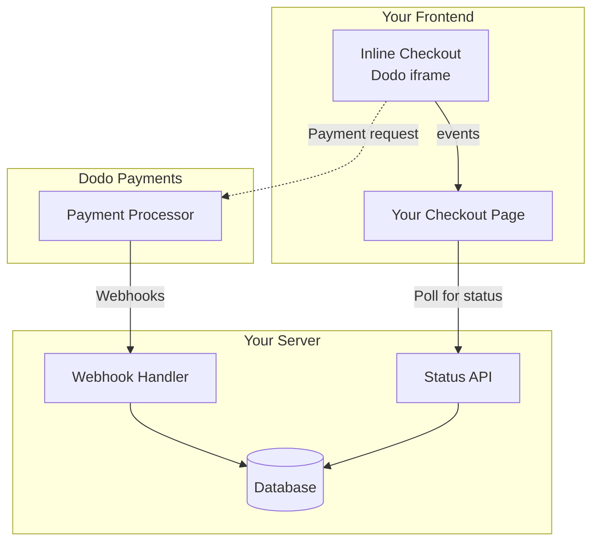

## Tổng Quan

Thanh toán inline cho phép bạn tạo ra những trải nghiệm thanh toán hoàn toàn tích hợp, hòa quyện một cách liền mạch với trang web hoặc ứng dụng của bạn. Khác với [thanh toán overlay](/developer-resources/overlay-checkout), mở dưới dạng modal trên trang của bạn, thanh toán inline nhúng biểu mẫu thanh toán trực tiếp vào bố cục trang của bạn.

Sử dụng thanh toán inline, bạn có thể:

- Tạo ra những trải nghiệm thanh toán hoàn toàn tích hợp với ứng dụng hoặc trang web của bạn
- Để Dodo Payments an toàn thu thập thông tin khách hàng và thông tin thanh toán trong một khung thanh toán tối ưu
- Hiển thị các mặt hàng, tổng số và thông tin khác từ Dodo Payments trên trang của bạn
- Sử dụng các phương thức và sự kiện SDK để xây dựng những trải nghiệm thanh toán nâng cao

<Frame>
    
</Frame>

## Cách Hoạt Động

Thanh toán inline hoạt động bằng cách nhúng một khung Dodo Payments an toàn vào trang web hoặc ứng dụng của bạn.

Khung thanh toán xử lý việc thu thập thông tin khách hàng và ghi lại chi tiết thanh toán. Trang của bạn hiển thị danh sách mặt hàng, tổng số và tùy chọn để thay đổi những gì có trên thanh toán. SDK cho phép trang của bạn và khung thanh toán tương tác với nhau.

Dodo Payments tự động tạo một đăng ký khi một thanh toán hoàn tất, sẵn sàng để bạn cung cấp.

<Note>
Khung thanh toán nội tuyến xử lý an toàn tất cả thông tin thanh toán nhạy cảm, đảm bảo tuân thủ PCI mà bạn không cần thêm chứng nhận nào nữa.
</Note>

## Điều Gì Tạo Nên Một Thanh Toán Inline Tốt?

Điều quan trọng là khách hàng biết họ đang mua từ ai, họ đang mua gì và họ phải trả bao nhiêu.

Để xây dựng một thanh toán inline tuân thủ và tối ưu hóa cho chuyển đổi, việc triển khai của bạn phải bao gồm:

{/* LOCKED_PATTERN_2c3203bfa100605bc2704d01e7dccd32 */}
    
</Frame>

1. **Thông tin định kỳ**: Nếu là định kỳ, tần suất và tổng số phải trả khi gia hạn. Nếu là dùng thử, thời gian dùng thử kéo dài bao lâu.
2. **Mô tả mặt hàng**: Một mô tả về những gì đang được mua.
3. **Tổng giao dịch**: Tổng giao dịch, bao gồm tổng phụ, thuế tổng và tổng cộng. Đảm bảo bao gồm cả loại tiền tệ.
4. **Chân trang Dodo Payments**: Toàn bộ khung thanh toán inline, bao gồm chân trang thanh toán có thông tin về Dodo Payments, điều khoản bán hàng của chúng tôi và chính sách bảo mật của chúng tôi.
5. **Chính sách hoàn tiền**: Một liên kết đến chính sách hoàn tiền của bạn, nếu nó khác với chính sách hoàn tiền tiêu chuẩn của Dodo Payments.

<Warning>
Luôn hiển thị đầy đủ khung thanh toán nội tuyến, bao gồm cả phần chân trang. Loại bỏ hoặc ẩn thông tin pháp lý sẽ vi phạm yêu cầu tuân thủ.
</Warning>

## Hành Trình Khách Hàng

Luồng thanh toán được xác định bởi cấu hình phiên thanh toán của bạn. Tùy thuộc vào cách bạn cấu hình phiên thanh toán, khách hàng sẽ trải nghiệm một thanh toán có thể trình bày tất cả thông tin trên một trang duy nhất hoặc qua nhiều bước.

<Steps>
{/* LOCKED_PATTERN_d5c5891a92fe908e4b310aff2fe906f3 */}

Bạn có thể mở thanh toán inline bằng cách truyền các mặt hàng hoặc một giao dịch hiện có. Sử dụng SDK để hiển thị và cập nhật thông tin trên trang, và các phương thức SDK để cập nhật các mặt hàng dựa trên tương tác của khách hàng.
    

</Step>

{/* LOCKED_PATTERN_271a3373ec4ee2458dad7f9a80e26855 */}

Thanh toán inline trước tiên yêu cầu khách hàng nhập địa chỉ email của họ, chọn quốc gia của họ và (nếu cần) nhập mã ZIP hoặc mã bưu chính của họ. Bước này thu thập tất cả thông tin cần thiết để xác định thuế và các tùy chọn thanh toán có sẵn.

Bạn có thể tự động điền thông tin khách hàng và trình bày các địa chỉ đã lưu để đơn giản hóa trải nghiệm.

</Step>

{/* LOCKED_PATTERN_1234bf83f7f396022f1c91c09356f654 */}

Sau khi nhập thông tin của họ, khách hàng sẽ được trình bày các phương thức thanh toán có sẵn và biểu mẫu thanh toán. Các tùy chọn có thể bao gồm thẻ tín dụng hoặc thẻ ghi nợ, PayPal, Apple Pay, Google Pay và các phương thức thanh toán địa phương khác dựa trên vị trí của họ.

Hiển thị các phương thức thanh toán đã lưu nếu có để tăng tốc độ thanh toán.


</Step>

{/* LOCKED_PATTERN_3250600b8fe70b0b1b5c169861bc3240 */}

Dodo Payments định tuyến mọi thanh toán đến nhà cung cấp tốt nhất cho giao dịch đó để có cơ hội thành công tốt nhất. Khách hàng sẽ vào một quy trình thành công mà bạn có thể xây dựng.


</Step>

{/* LOCKED_PATTERN_fe28b170edb53eebdbefd92e22425bda */}

Dodo Payments tự động tạo một đăng ký cho khách hàng, sẵn sàng để bạn cung cấp. Phương thức thanh toán mà khách hàng đã sử dụng sẽ được lưu giữ để gia hạn hoặc thay đổi đăng ký.


</Step>
</Steps>

## Bắt đầu nhanh

Bắt đầu với Dodo Payments Inline Checkout chỉ với vài dòng mã:

```typescript
import { DodoPayments } from "dodopayments-checkout";

// Initialize the SDK for inline mode
DodoPayments.Initialize({
  mode: "test",
  displayType: "inline",
  onEvent: (event) => {
    console.log("Checkout event:", event);
  },
});

// Open checkout in a specific container
DodoPayments.Checkout.open({
  checkoutUrl: "https://test.dodopayments.com/session/cks_123",
  elementId: "dodo-inline-checkout" // ID of the container element
});
```

<Tip>
Đảm bảo bạn có một phần tử chứa với `id` tương ứng trên trang của mình: `<div id="dodo-inline-checkout"></div>`.
</Tip>

## Hướng dẫn tích hợp từng bước

<Steps>
{/* LOCKED_PATTERN_776027320500bde6b99bac6bed1cc64d */}

Cài đặt Dodo Payments Checkout SDK:

<CodeGroup>

```bash npm
npm install dodopayments-checkout
```

```bash yarn
yarn add dodopayments-checkout
```

```bash pnpm
pnpm add dodopayments-checkout
```

</CodeGroup>

</Step>

{/* LOCKED_PATTERN_c9671e1641fc4b5a7d02836b54fde4a6 */}

Khởi tạo SDK và chỉ định `displayType: 'inline'`. Bạn cũng nên lắng nghe sự kiện `checkout.breakdown` để cập nhật giao diện người dùng với các tính toán thuế và tổng tiền theo thời gian thực.


```typescript
import { DodoPayments } from "dodopayments-checkout";

DodoPayments.Initialize({
  mode: "test",
  displayType: "inline",
  onEvent: (event) => {
    if (event.event_type === "checkout.breakdown") {
      const breakdown = event.data?.message;
      // Update your UI with breakdown.subTotal, breakdown.tax, breakdown.total, etc.
    }
  },
});
```

</Step>

{/* LOCKED_PATTERN_7ddf8b1f0258fda183d82c15a3096a03 */}

Thêm một phần tử vào HTML của bạn nơi khung thanh toán sẽ được chèn vào:

```html
<div id="dodo-inline-checkout"></div>
```

</Step>

{/* LOCKED_PATTERN_4817384312c2fcbac3336846aa45db8f */}

Gọi `DodoPayments.Checkout.open()` với `checkoutUrl` và `elementId` của phần tử chứa của bạn:

```typescript
DodoPayments.Checkout.open({
  checkoutUrl: "https://test.dodopayments.com/session/cks_123",
  elementId: "dodo-inline-checkout"
});
```

</Step>

{/* LOCKED_PATTERN_97e1d34fe501fd0a9dd5e96c0a83886c */}

1. Khởi động máy chủ phát triển của bạn:

```bash
npm run dev
```

2. Kiểm tra quy trình thanh toán:
   - Nhập email và địa chỉ của bạn trong khung inline.
   - Xác minh rằng tóm tắt đơn hàng tùy chỉnh của bạn cập nhật theo thời gian thực.
   - Kiểm tra quy trình thanh toán bằng cách sử dụng thông tin xác thực thử nghiệm.
   - Xác nhận rằng các chuyển hướng hoạt động chính xác.

<Check>
Bạn sẽ thấy sự kiện `checkout.breakdown` được ghi lại trong bảng điều khiển trình duyệt nếu bạn thêm một console log trong callback `onEvent`.
</Check>

</Step>

{/* LOCKED_PATTERN_b11a46166b3a72b09cb0a82966c3c591 */}

Khi bạn đã sẵn sàng cho sản xuất:

1. Thay đổi chế độ thành `'live'`:

```typescript
DodoPayments.Initialize({
  mode: "live",
  displayType: "inline",
  onEvent: (event) => {
    // Handle events
  }
});
```

2. Cập nhật các URL thanh toán của bạn để sử dụng các phiên thanh toán trực tiếp từ backend của bạn.
3. Kiểm tra quy trình hoàn chỉnh trong sản xuất.

</Step>
</Steps>

## Ví dụ hoàn chỉnh về React

Ví dụ này minh họa cách triển khai một tóm tắt đơn hàng tùy chỉnh bên cạnh thanh toán nội tuyến, giữ chúng đồng bộ bằng cách sử dụng sự kiện `checkout.breakdown`.

```tsx
"use client";

import { useEffect, useState } from 'react';
import { DodoPayments, CheckoutBreakdownData } from 'dodopayments-checkout';

export default function CheckoutPage() {
  const [breakdown, setBreakdown] = useState<Partial<CheckoutBreakdownData>>({});

  useEffect(() => {
    // 1. Initialize the SDK
    DodoPayments.Initialize({
      mode: 'test',
      displayType: 'inline',
      onEvent: (event) => {
        // 2. Listen for the 'checkout.breakdown' event
        if (event.event_type === "checkout.breakdown") {
          const message = event.data?.message as CheckoutBreakdownData;
          if (message) setBreakdown(message);
        }
      }
    });

    // 3. Open the checkout in the specified container
    DodoPayments.Checkout.open({
      checkoutUrl: 'https://test.dodopayments.com/session/cks_123',
      elementId: 'dodo-inline-checkout'
    });

    return () => DodoPayments.Checkout.close();
  }, []);

  const format = (amt: number | null | undefined, curr: string | null | undefined) => 
    amt != null && curr ? `${curr} ${(amt/100).toFixed(2)}` : '0.00';

  const currency = breakdown.currency ?? breakdown.finalTotalCurrency ?? '';

  return (
    <div className="flex flex-col md:flex-row min-h-screen">
      {/* Left Side - Checkout Form */}
      <div className="w-full md:w-1/2 flex items-center">
        <div id="dodo-inline-checkout" className='w-full' />
      </div>

      {/* Right Side - Custom Order Summary */}
      <div className="w-full md:w-1/2 p-8 bg-gray-50">
        <h2 className="text-2xl font-bold mb-4">Order Summary</h2>
        <div className="space-y-2">
          {breakdown.subTotal && (
            <div className="flex justify-between">
              <span>Subtotal</span>
              <span>{format(breakdown.subTotal, currency)}</span>
            </div>
          )}
          {breakdown.discount && (
            <div className="flex justify-between">
              <span>Discount</span>
              <span>{format(breakdown.discount, currency)}</span>
            </div>
          )}
          {breakdown.tax != null && (
            <div className="flex justify-between">
              <span>Tax</span>
              <span>{format(breakdown.tax, currency)}</span>
            </div>
          )}
          <hr />
          {(breakdown.finalTotal ?? breakdown.total) && (
            <div className="flex justify-between font-bold text-xl">
              <span>Total</span>
              <span>{format(breakdown.finalTotal ?? breakdown.total, breakdown.finalTotalCurrency ?? currency)}</span>
            </div>
          )}
        </div>
      </div>
    </div>
  );
}

```

## Tài liệu API

### Cấu hình

#### Tùy chọn khởi tạo

```typescript
interface InitializeOptions {
  mode: "test" | "live";
  displayType: "inline"; // Required for inline checkout
  onEvent: (event: CheckoutEvent) => void;
}
```

| Tùy chọn | Loại | Bắt buộc | Mô tả |
|--------|------|----------|-------------|
| `mode` | `"test" \| "live"` | Có | Chế độ môi trường. |
| `displayType` | `"inline" \| "overlay"` | Có | Phải được đặt thành `"inline"` để nhúng thanh toán. |
| `onEvent` | `function` | Có | Hàm callback để xử lý sự kiện thanh toán. |

#### Tùy chọn thanh toán

```typescript
export type FontSize = "xs" | "sm" | "md" | "lg" | "xl" | "2xl";
export type FontWeight = "normal" | "medium" | "bold" | "extraBold";

interface CheckoutOptions {
  checkoutUrl: string;
  elementId: string; // Required for inline checkout
  options?: {
    showTimer?: boolean;
    showSecurityBadge?: boolean;
    manualRedirect?: boolean;
    themeConfig?: ThemeConfig;
    payButtonText?: string;
    fontSize?: FontSize;
    fontWeight?: FontWeight;
  };
}
```

| Tùy chọn | Loại | Bắt buộc | Mô tả |
|--------|------|----------|-------------|
| `checkoutUrl` | `string` | Có | URL phiên thanh toán. |
| `elementId` | `string` | Có | `id` của phần tử DOM nơi thanh toán được hiển thị. |
| `options.showTimer` | `boolean` | Không | Hiển thị hoặc ẩn bộ đếm thời gian thanh toán. Mặc định là `true`. Khi bị tắt, bạn sẽ nhận được sự kiện `checkout.link_expired` khi phiên hết hạn. |
| `options.showSecurityBadge` | `boolean` | Không | Hiển thị hoặc ẩn huy hiệu bảo mật. Mặc định là `true`. |
| `options.manualRedirect` | `boolean` | Không | Khi bật, thanh toán sẽ không tự động chuyển hướng sau khi hoàn tất. Thay vào đó, bạn sẽ nhận sự kiện `checkout.status` và `checkout.redirect_requested` để xử lý chuyển hướng thủ công. |
| `options.themeConfig` | `ThemeConfig` | Không | Cấu hình giao diện tùy chỉnh. |
| `options.payButtonText` | `string` | Không | Văn bản tùy chỉnh hiển thị trên nút thanh toán. |
| `options.fontSize` | `FontSize` | Không | Cỡ chữ toàn cục cho thanh toán. |
| `options.fontWeight` | `FontWeight` | Không | Độ đậm chữ toàn cục cho thanh toán. |

### Phương thức

#### Mở thanh toán

Mở khung thanh toán trong phần tử được chỉ định.

```typescript
DodoPayments.Checkout.open({
  checkoutUrl: "https://test.dodopayments.com/session/cks_123",
  elementId: "dodo-inline-checkout"
});
```

Bạn cũng có thể truyền thêm tùy chọn để tùy chỉnh hành vi thanh toán:

```typescript
DodoPayments.Checkout.open({
  checkoutUrl: "https://test.dodopayments.com/session/cks_123",
  elementId: "dodo-inline-checkout",
  options: {
    showTimer: false,
    showSecurityBadge: false,
    manualRedirect: true,
    payButtonText: "Pay Now",
  },
});
```

Khi sử dụng `manualRedirect`, xử lý hoàn tất thanh toán trong callback `onEvent` của bạn:

```typescript
DodoPayments.Initialize({
  mode: "test",
  displayType: "inline",
  onEvent: (event) => {
    if (event.event_type === "checkout.status") {
      const status = event.data?.message?.status;
      // Handle status: "succeeded", "failed", or "processing"
    }
    if (event.event_type === "checkout.redirect_requested") {
      const redirectUrl = event.data?.message?.redirect_to;
      // Redirect the customer manually
      window.location.href = redirectUrl;
    }
    if (event.event_type === "checkout.link_expired") {
      // Handle expired checkout session
    }
  },
});
```

#### Đóng Thanh Toán

Loại bỏ khung thanh toán theo cách lập trình và dọn dẹp các trình lắng nghe sự kiện.

```typescript
DodoPayments.Checkout.close();
```

#### Kiểm Tra Trạng Thái

Trả về liệu khung thanh toán hiện đang được chèn hay không.

```typescript
const isOpen = DodoPayments.Checkout.isOpen();
// Returns: boolean
```

### Sự Kiện

SDK cung cấp sự kiện thời gian thực thông qua callback `onEvent`. Đối với thanh toán nội tuyến, `checkout.breakdown` đặc biệt hữu ích để đồng bộ giao diện người dùng của bạn.

| Loại sự kiện | Mô tả |
|------------|-------------|
| `checkout.opened` | Khung thanh toán đã được tải. |
| `checkout.form_ready` | Biểu mẫu thanh toán sẵn sàng nhận thông tin người dùng. Hữu ích để ẩn trạng thái tải và hiển thị giao diện thanh toán. |
| `checkout.breakdown` | Được kích hoạt khi giá cả, thuế hoặc giảm giá được cập nhật. |
| `checkout.customer_details_submitted` | Thông tin khách hàng đã được gửi. |
| `checkout.pay_button_clicked` | Được kích hoạt khi khách hàng nhấn nút thanh toán. Hữu ích cho phân tích và theo dõi kênh chuyển đổi. |
| `checkout.redirect` | Thanh toán sắp chuyển hướng (ví dụ: đến trang ngân hàng). |
| `checkout.error` | Đã xảy ra lỗi trong quá trình thanh toán. |
| `checkout.link_expired` | Được kích hoạt khi phiên thanh toán hết hạn. Chỉ nhận khi `showTimer` được đặt thành `false`. |
| `checkout.status` | Được kích hoạt khi `manualRedirect` được bật. Chứa trạng thái thanh toán (`succeeded`, `failed` hoặc `processing`). |
| `checkout.redirect_requested` | Được kích hoạt khi `manualRedirect` được bật. Chứa URL để chuyển hướng khách hàng. |

#### Dữ Liệu Phân Tích Thanh Toán

Sự kiện `checkout.breakdown` cung cấp các dữ liệu sau:

```typescript
interface CheckoutBreakdownData {
  subTotal?: number;          // Amount in cents
  discount?: number;         // Amount in cents
  tax?: number;              // Amount in cents
  total?: number;            // Amount in cents
  currency?: string;         // e.g., "USD"
  finalTotal?: number;       // Final amount including adjustments
  finalTotalCurrency?: string; // Currency for the final total
}
```

#### Dữ Liệu Sự Kiện Trạng Thái Thanh Toán

Khi `manualRedirect` được bật, bạn nhận được sự kiện `checkout.status` với các dữ liệu sau:

```typescript
interface CheckoutStatusEventData {
  message: {
    status?: "succeeded" | "failed" | "processing";
  };
}
```

#### Dữ Liệu Sự Kiện Yêu Cầu Chuyển Hướng Thanh Toán

Khi `manualRedirect` được bật, bạn nhận được sự kiện `checkout.redirect_requested` với các dữ liệu sau:

```typescript
interface CheckoutRedirectRequestedEventData {
  message: {
    redirect_to?: string;
  };
}
```

#### Hiểu Sự Kiện Phân Tích

Sự kiện `checkout.breakdown` là cách chính để giữ giao diện ứng dụng của bạn đồng bộ với trạng thái thanh toán Dodo Payments.

**Khi nó xảy ra:**
- **Khi khởi tạo**: Ngay sau khi khung thanh toán được tải và sẵn sàng.
- **Khi thay đổi địa chỉ**: Bất cứ khi nào khách hàng chọn một quốc gia hoặc nhập mã bưu chính dẫn đến việc tính toán thuế lại.

**Chi tiết trường:**

| Trường | Mô tả |
|-------|-------------|
| `subTotal` | Tổng của tất cả các mục trong phiên trước khi áp dụng giảm giá hoặc thuế. |
| `discount` | Tổng giá trị của tất cả các mã giảm giá đã áp dụng. |
| `tax` | Số tiền thuế được tính. Trong chế độ `inline`, giá trị này cập nhật động khi người dùng tương tác với các trường địa chỉ. |
| `total` | Kết quả toán học của `subTotal - discount + tax` theo đơn vị tiền tệ cơ sở của phiên. |
| `currency` | Mã tiền tệ ISO (ví dụ: `"USD"`) cho các giá trị phụ, giảm giá và thuế chuẩn. |
| `finalTotal` | Số tiền thực tế khách hàng bị tính. Có thể bao gồm điều chỉnh ngoại hối bổ sung hoặc phí phương thức thanh toán địa phương không nằm trong bảng giá cơ bản. |
| `finalTotalCurrency` | Tiền tệ mà khách hàng thực sự thanh toán. Có thể khác với `currency` nếu đang áp dụng tỷ giá theo sức mua hoặc chuyển đổi tiền tệ địa phương. |

**Mẹo tích hợp chính:**

1.  **Định dạng tiền tệ**: Giá luôn trả về dưới dạng số nguyên ở đơn vị nhỏ nhất của tiền tệ (ví dụ: xu cho USD, yên cho JPY). Để hiển thị, hãy chia cho 100 (hoặc lũy thừa phù hợp của 10) hoặc sử dụng thư viện định dạng như `Intl.NumberFormat`.
2.  **Xử lý trạng thái ban đầu**: Khi thanh toán mới tải, `tax` và `discount` có thể là `0` hoặc `null` cho đến khi người dùng cung cấp thông tin thanh toán hoặc nhập mã. Giao diện của bạn nên xử lý các trạng thái này một cách mềm mại (ví dụ: hiển thị gạch ngang `—` hoặc ẩn dòng).
3.  **"Tổng cuối cùng" và "Tổng"**: Trong khi `total` cung cấp phép tính giá chuẩn, `finalTotal` mới là nguồn sự thật cho giao dịch. Nếu `finalTotal` tồn tại, nó phản ánh chính xác số tiền sẽ bị trừ khỏi thẻ khách hàng, bao gồm mọi điều chỉnh động.
4.  **Phản hồi thời gian thực**: Sử dụng trường `tax` để cho người dùng thấy thuế đang được tính toán theo thời gian thực. Điều này tạo cảm giác "trực tiếp" cho trang thanh toán và giảm ma sát khi nhập địa chỉ.

## Tùy Chọn Triển Khai

### Cài Đặt Qua Trình Quản Lý Gói

Cài đặt qua npm, yarn hoặc pnpm như được hiển thị trong [Hướng Dẫn Tích Hợp Từng Bước](#step-by-step-integration-guide).

### Triển Khai CDN

Để tích hợp nhanh mà không cần bước xây dựng, bạn có thể sử dụng CDN của chúng tôi:

```html
<!DOCTYPE html>
<html lang="en">
<head>
    <meta charset="UTF-8">
    <meta name="viewport" content="width=device-width, initial-scale=1.0">
    <title>Dodo Payments Inline Checkout</title>
    
    <!-- Load DodoPayments -->
    <script src="https://cdn.jsdelivr.net/npm/dodopayments-checkout@latest/dist/index.js"></script>
    <script>
        // Initialize the SDK
        DodoPaymentsCheckout.DodoPayments.Initialize({
            mode: "test",
            displayType: "inline",
            onEvent: (event) => {
                console.log('Checkout event:', event);
            }
        });
    </script>
</head>
<body>
    <div id="dodo-inline-checkout"></div>

    <script>
        // Open the checkout
        DodoPaymentsCheckout.DodoPayments.Checkout.open({
            checkoutUrl: "https://test.dodopayments.com/session/cks_123",
            elementId: "dodo-inline-checkout"
        });
    </script>
</body>
</html>
```

### Tùy chỉnh Giao diện

Bạn có thể tùy chỉnh giao diện thanh toán bằng cách truyền một đối tượng `themeConfig` trong tham số `options` khi mở thanh toán. Cấu hình chủ đề hỗ trợ cả chế độ sáng và tối, cho phép bạn tùy chỉnh màu sắc, đường viền, văn bản, nút và bán kính đường viền.

<Info>
Phần này đề cập đến cấu hình chủ đề **ở phía khách hàng** bằng SDK Checkout. Bạn cũng có thể cấu hình chủ đề **ở phía máy chủ** khi tạo phiên thanh toán qua API bằng tham số `theme_config`. Xem [Tùy chỉnh Chủ đề Thanh toán](/features/checkout#checkout-theme-customization) để biết cấu hình cấp API.
</Info>

#### Cấu hình Chủ đề Cơ bản

```typescript
DodoPayments.Checkout.open({
  checkoutUrl: "https://checkout.dodopayments.com/session/cks_123",
  options: {
    themeConfig: {
      light: {
        bgPrimary: "#FFFFFF",
        textPrimary: "#344054",
        buttonPrimary: "#A6E500",
      },
      dark: {
        bgPrimary: "#0D0D0D",
        textPrimary: "#FFFFFF",
        buttonPrimary: "#A6E500",
      },
      radius: "8px",
    },
  },
});
```

#### Cấu hình Chủ đề Toàn diện

Tất cả thuộc tính chủ đề có sẵn:

```typescript
DodoPayments.Checkout.open({
  checkoutUrl: "https://checkout.dodopayments.com/session/cks_123",
  options: {
    themeConfig: {
      light: {
        // Background colors
        bgPrimary: "#FFFFFF",        // Primary background color
        bgSecondary: "#F9FAFB",      // Secondary background color (e.g., tabs)
        
        // Border colors
        borderPrimary: "#D0D5DD",     // Primary border color
        borderSecondary: "#6B7280",  // Secondary border color
        inputFocusBorder: "#D0D5DD", // Input focus border color
        
        // Text colors
        textPrimary: "#344054",       // Primary text color
        textSecondary: "#6B7280",    // Secondary text color
        textPlaceholder: "#667085",  // Placeholder text color
        textError: "#D92D20",        // Error text color
        textSuccess: "#10B981",      // Success text color
        
        // Button colors
        buttonPrimary: "#A6E500",           // Primary button background
        buttonPrimaryHover: "#8CC500",      // Primary button hover state
        buttonTextPrimary: "#0D0D0D",       // Primary button text color
        buttonSecondary: "#F3F4F6",         // Secondary button background
        buttonSecondaryHover: "#E5E7EB",     // Secondary button hover state
        buttonTextSecondary: "#344054",     // Secondary button text color
      },
      dark: {
        // Background colors
        bgPrimary: "#0D0D0D",
        bgSecondary: "#1A1A1A",
        
        // Border colors
        borderPrimary: "#323232",
        borderSecondary: "#D1D5DB",
        inputFocusBorder: "#323232",
        
        // Text colors
        textPrimary: "#FFFFFF",
        textSecondary: "#909090",
        textPlaceholder: "#9CA3AF",
        textError: "#F97066",
        textSuccess: "#34D399",
        
        // Button colors
        buttonPrimary: "#A6E500",
        buttonPrimaryHover: "#8CC500",
        buttonTextPrimary: "#0D0D0D",
        buttonSecondary: "#2A2A2A",
        buttonSecondaryHover: "#3A3A3A",
        buttonTextSecondary: "#FFFFFF",
      },
      radius: "8px", // Border radius for inputs, buttons, and tabs
    },
  },
});
```

#### Chỉ Chế độ Sáng

Nếu bạn chỉ muốn tùy chỉnh chủ đề sáng:

```typescript
DodoPayments.Checkout.open({
  checkoutUrl: "https://checkout.dodopayments.com/session/cks_123",
  options: {
    themeConfig: {
      light: {
        bgPrimary: "#FFFFFF",
        textPrimary: "#000000",
        buttonPrimary: "#0070F3",
      },
      radius: "12px",
    },
  },
});
```

#### Chỉ Chế độ Tối

Nếu bạn chỉ muốn tùy chỉnh chủ đề tối:

```typescript
DodoPayments.Checkout.open({
  checkoutUrl: "https://checkout.dodopayments.com/session/cks_123",
  options: {
    themeConfig: {
      dark: {
        bgPrimary: "#000000",
        textPrimary: "#FFFFFF",
        buttonPrimary: "#0070F3",
      },
      radius: "12px",
    },
  },
});
```

#### Ghi đè Chủ đề một phần

Bạn có thể chỉ ghi đè những thuộc tính cụ thể. Thanh toán sẽ sử dụng giá trị mặc định cho những thuộc tính bạn không chỉ định:

```typescript
DodoPayments.Checkout.open({
  checkoutUrl: "https://checkout.dodopayments.com/session/cks_123",
  options: {
    themeConfig: {
      light: {
        buttonPrimary: "#FF6B6B", // Only override primary button color
      },
      radius: "16px", // Override border radius
    },
  },
});
```

#### Cấu hình Chủ đề với Các Tùy chọn Khác

Bạn có thể kết hợp cấu hình chủ đề với các tùy chọn thanh toán khác:

```typescript
DodoPayments.Checkout.open({
  checkoutUrl: "https://checkout.dodopayments.com/session/cks_123",
  options: {
    showTimer: true,
    showSecurityBadge: true,
    manualRedirect: false,
    themeConfig: {
      light: {
        bgPrimary: "#FFFFFF",
        buttonPrimary: "#A6E500",
      },
      dark: {
        bgPrimary: "#0D0D0D",
        buttonPrimary: "#A6E500",
      },
      radius: "8px",
    },
  },
});
```

#### Kiểu TypeScript

Đối với người dùng TypeScript, tất cả kiểu cấu hình chủ đề đều được xuất ra:

```typescript
import { ThemeConfig, ThemeModeConfig } from "dodopayments-checkout";

const themeConfig: ThemeConfig = {
  light: {
    bgPrimary: "#FFFFFF",
    // ... other properties
  },
  dark: {
    bgPrimary: "#0D0D0D",
    // ... other properties
  },
  radius: "8px",
};
```

## Cập nhật Phương thức Thanh toán

Thanh toán nội tuyến hỗ trợ **cập nhật phương thức thanh toán** cho đăng ký. Khi khách hàng cần cập nhật phương thức thanh toán — dù là cho đăng ký đang hoạt động hay để kích hoạt lại đăng ký đang tạm dừng — bạn có thể hiển thị quy trình cập nhật ngay trong bố cục trang của mình.

### Cách vận hành

1. Gọi [Update Payment Method API](/features/subscription#update-payment-method-for-active-subscription) để lấy `payment_link`:

```typescript
const response = await client.subscriptions.updatePaymentMethod('sub_123', {
  type: 'new',
  return_url: 'https://example.com/return'
});
```

2. Truyền `payment_link` nhận được làm `checkoutUrl` để mở thanh toán nội tuyến:

```typescript
DodoPayments.Checkout.open({
  checkoutUrl: response.payment_link,
  elementId: "dodo-inline-checkout"
});
```

Khung nội tuyến chỉ hiển thị biểu mẫu thu thập phương thức thanh toán. Khách hàng có thể nhập thẻ mới hoặc chọn phương thức đã lưu mà không rời trang của bạn.

### Đối với Đăng ký đang tạm dừng

Khi cập nhật phương thức thanh toán cho đăng ký ở trạng thái `on_hold`, Dodo Payments tự động tạo một khoản phí cho bất kỳ khoản còn nợ nào. Theo dõi webhook `payment.succeeded` và `subscription.active` để xác nhận việc kích hoạt lại.

```typescript
const response = await client.subscriptions.updatePaymentMethod('sub_123', {
  type: 'new',
  return_url: 'https://example.com/return'
});

if (response.payment_id) {
  // Charge created for remaining dues
  // Open inline checkout for payment collection
  DodoPayments.Checkout.open({
    checkoutUrl: response.payment_link,
    elementId: "dodo-inline-checkout"
  });
}
```

<Tip>
Bạn cũng có thể sử dụng phương thức thanh toán đã lưu sẵn thay vì thu thập thẻ mới bằng cách truyền `type: 'existing'` kèm `payment_method_id` cho API Update Payment Method.
</Tip>

## Xử lý Lỗi

SDK cung cấp thông tin lỗi chi tiết qua hệ thống sự kiện. Luôn triển khai xử lý lỗi đúng cách trong callback `onEvent` của bạn:

```typescript
DodoPayments.Initialize({
  mode: "test",
  displayType: "inline",
  onEvent: (event: CheckoutEvent) => {
    if (event.event_type === "checkout.error") {
      console.error("Checkout error:", event.data?.message);
      // Handle error appropriately
    }
  }
});
```

<Warning>
Luôn xử lý sự kiện `checkout.error` để mang lại trải nghiệm người dùng tốt khi có sự cố.
</Warning>

## Thực hành tốt nhất

1. **Thiết kế phản hồi**: Đảm bảo phần tử chứa của bạn có đủ chiều rộng và chiều cao. iframe thường mở rộng để lấp đầy phần tử chứa của nó.
2. **Đồng bộ**: Sử dụng sự kiện `checkout.breakdown` để giữ tóm tắt đơn hàng tùy chỉnh hoặc bảng giá của bạn đồng bộ với những gì người dùng thấy trong khung thanh toán.
3. **Trạng thái skeleton**: Hiển thị chỉ báo tải trong phần tử chứa cho đến khi sự kiện `checkout.opened` được kích hoạt.
4. **Dọn dẹp**: Gọi `DodoPayments.Checkout.close()` khi thành phần của bạn bị huỷ để dọn dẹp iframe và bộ lắng nghe sự kiện.

<Info>
Đối với phiên bản giao diện tối, nên sử dụng `#0d0d0d` làm màu nền để tích hợp trực quan tối ưu với khung thanh toán nội tuyến.
</Info>

## Xác thực Trạng thái Thanh toán

<Warning>
Đừng chỉ dựa vào sự kiện thanh toán nội tuyến để xác định thành công hay thất bại. Luôn triển khai xác thực phía máy chủ bằng webhook và/hoặc cơ chế truy vấn.
</Warning>

### Tại sao xác thực phía máy chủ là thiết yếu

Mặc dù các sự kiện thanh toán nội tuyến như `checkout.status` cung cấp phản hồi thời gian thực, chúng **không** nên là nguồn duy nhất của bạn về trạng thái thanh toán. Sự cố mạng, trình duyệt bị lỗi, hoặc người dùng đóng trang đều có thể khiến sự kiện bị bỏ lỡ. Để đảm bảo xác thực thanh toán đáng tin cậy:

1. **Máy chủ của bạn nên lắng nghe sự kiện webhook** - Dodo Payments gửi webhook khi trạng thái thanh toán thay đổi
2. **Triển khai cơ chế truy vấn** - Giao diện nên truy vấn máy chủ của bạn để lấy cập nhật trạng thái
3. **Kết hợp cả hai phương pháp** - Dùng webhook làm nguồn chính và truy vấn làm phương án dự phòng

### Kiến trúc đề xuất



### Các bước triển khai

**1. Lắng nghe sự kiện thanh toán** - Khi người dùng nhấn nút thanh toán, bắt đầu chuẩn bị xác minh trạng thái:

```typescript
onEvent: (event) => {
  if (event.event_type === 'checkout.status') {
    // Start polling your server for confirmed status
    startPolling();
  }
}
```

**2. Truy vấn máy chủ của bạn** - Tạo một điểm cuối kiểm tra cơ sở dữ liệu để xác định trạng thái thanh toán (được cập nhật bởi webhook):

```typescript
// Poll every 2 seconds until status is confirmed
const interval = setInterval(async () => {
  const { status } = await fetch(`/api/payments/${paymentId}/status`).then(r => r.json());
  if (status === 'succeeded' || status === 'failed') {
    clearInterval(interval);
    handlePaymentResult(status);
  }
}, 2000);
```

**3. Xử lý webhook phía máy chủ** - Cập nhật cơ sở dữ liệu khi Dodo gửi webhook `payment.succeeded` hoặc `payment.failed`. Xem [tài liệu Webhook](/developer-resources/webhooks) để biết chi tiết.

### Xử lý Chuyển hướng (3DS, Google Pay, UPI)

Khi sử dụng `manualRedirect: true`, một số phương thức thanh toán yêu cầu chuyển hướng người dùng ra khỏi trang để xác thực:

- **3D Secure (3DS)** - Xác thực thẻ
- **Google Pay** - Xác thực ví trong một số luồng
- **UPI** - Chuyển hướng phương thức thanh toán Ấn Độ

Khi cần chuyển hướng, bạn sẽ nhận được sự kiện `checkout.redirect_requested`. Chuyển hướng người dùng đến URL được cung cấp:

```typescript
if (event.event_type === 'checkout.redirect_requested') {
  const redirectUrl = event.data?.message?.redirect_to;
  // Save payment ID before redirect, then redirect
  sessionStorage.setItem('pendingPaymentId', paymentId);
  window.location.href = redirectUrl;
}
```

Sau khi xác thực hoàn tất (thành công hoặc thất bại), người dùng trở lại trang của bạn. **Đừng mặc định thành công chỉ vì người dùng đã quay lại.** Thay vào đó:

1. Kiểm tra xem người dùng có đang quay lại từ chuyển hướng không (ví dụ: qua `sessionStorage`)
2. Bắt đầu truy vấn máy chủ của bạn để lấy trạng thái thanh toán đã xác nhận
3. Hiển thị trạng thái "Đang xác minh thanh toán..." trong khi truy vấn
4. Hiển thị giao diện thành công/thất bại dựa trên trạng thái được máy chủ xác nhận

<Tip>
Luôn xác minh trạng thái thanh toán phía máy chủ sau khi chuyển hướng. Người dùng quay lại trang chỉ có nghĩa là xác thực hoàn tất — không ám chỉ giao dịch thành công hay thất bại.
</Tip>

## Khắc phục sự cố

<AccordionGroup>
{/* LOCKED_PATTERN_93cff808dfbc871be9b4fbc9b88bb642 */}
- Xác minh rằng `elementId` khớp với `id` của một `div` thực sự tồn tại trong DOM.
- Đảm bảo `displayType: 'inline'` đã được truyền cho `Initialize`.
- Kiểm tra rằng `checkoutUrl` hợp lệ.
</Accordion>

{/* LOCKED_PATTERN_05b89b97a7f9c53e2d9d7a4e480e2342 */}
- Đảm bảo bạn đang lắng nghe sự kiện `checkout.breakdown`.
- Thuế chỉ được tính sau khi người dùng nhập quốc gia và mã bưu điện hợp lệ trong khung thanh toán.
</Accordion>
</AccordionGroup>

## Kích hoạt Ví kỹ thuật số

Để biết thông tin chi tiết về cách thiết lập Apple Pay, Google Pay và các ví kỹ thuật số khác, hãy xem trang <a href="/features/payment-methods/digital-wallets">Ví kỹ thuật số</a>.


### Cài đặt nhanh cho Apple Pay

<Steps>
{/* LOCKED_PATTERN_052fb22f687ef020f4d37c90a8329c23 */}
Tải xuống [tệp liên kết miền Apple Pay](http://checkout.dodopayments.com/.well-known/apple-developer-merchantid-domain-association).
</Step>

{/* LOCKED_PATTERN_3a44bb73d2b6657e3ef8dfb6df5437c3 */}
Gửi email **support@dodopayments.com** kèm URL miền sản xuất của bạn và yêu cầu kích hoạt Apple Pay.
</Step>

{/* LOCKED_PATTERN_f4cb4ca481d047ba1b29ad7a11be722d */}
Sau khi xác nhận, kiểm tra Apple Pay xuất hiện trong thanh toán và thử nghiệm toàn bộ luồng.
</Step>
</Steps>

<Warning>
Apple Pay yêu cầu xác minh miền trước khi xuất hiện trong môi trường sản xuất. Liên hệ bộ phận hỗ trợ trước khi ra mắt nếu bạn dự định cung cấp Apple Pay.
</Warning>

## Hỗ trợ trình duyệt

SDK Dodo Payments Checkout hỗ trợ các trình duyệt sau:

- Chrome (phiên bản mới nhất)
- Firefox (phiên bản mới nhất)
- Safari (phiên bản mới nhất)
- Edge (phiên bản mới nhất)
- IE11+

## Thanh toán nội tuyến so với Overlay

Chọn loại thanh toán phù hợp với trường hợp sử dụng của bạn:

| Tính năng | Thanh toán nội tuyến | Thanh toán chồng (Overlay) |
|---------|-----------------|------------------|
| Độ sâu tích hợp | Nhúng hoàn toàn trong trang | Hộp thoại trên trang |
| Kiểm soát bố cục | Toàn quyền | Hạn chế |
| Thương hiệu | Liền mạch | Tách biệt khỏi trang |
| Nỗ lực triển khai | Cao hơn | Thấp hơn |
| Phù hợp với | Trang thanh toán tùy chỉnh, luồng chuyển đổi cao | Tích hợp nhanh, trang hiện tại |

<Tip>
Sử dụng **thanh toán nội tuyến** khi bạn muốn kiểm soát tối đa trải nghiệm thanh toán và thương hiệu liền mạch. Dùng **thanh toán chồng (overlay)** để tích hợp nhanh chóng với ít thay đổi cho trang hiện có.
</Tip>

## Tài nguyên liên quan

<CardGroup cols={2}>
{/* LOCKED_PATTERN_03192cb7afa497d816218ee2e453c19b */}
    Sử dụng thanh toán chồng cho tích hợp modal nhanh chóng.
</Card>

{/* LOCKED_PATTERN_5e9b3579ee53b9305eb4a383d135b798 */}
    Tạo các phiên thanh toán để cung cấp trải nghiệm thanh toán của bạn.
</Card>

{/* LOCKED_PATTERN_4fdc255b113f889a339d4227d31c920b */}
    Xử lý sự kiện thanh toán ở phía máy chủ bằng webhook.
</Card>

{/* LOCKED_PATTERN_4389e7f71e1a171de8ea420860f91acc */}
    Hướng dẫn hoàn chỉnh để tích hợp Dodo Payments.
</Card>
</CardGroup>

Để được hỗ trợ thêm, hãy truy cập [cộng đồng Discord của chúng tôi](https://discord.gg/bYqAp4ayYh) hoặc liên hệ đội hỗ trợ nhà phát triển của chúng tôi.
