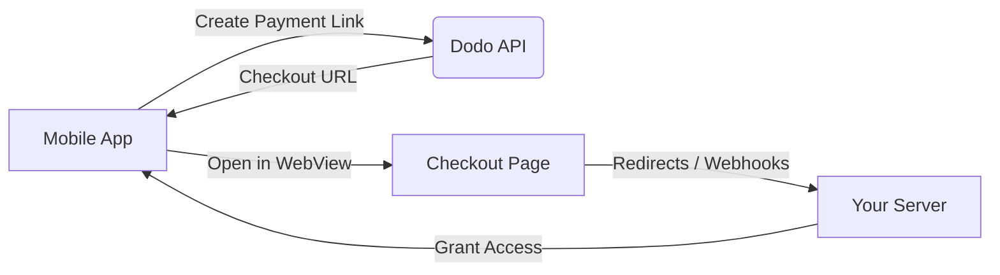

## Giới thiệu

Dodo Payments giúp các nhà phát triển bán hàng hóa và dịch vụ kỹ thuật số trong các ứng dụng iOS, xử lý các khía cạnh phức tạp như tuân thủ thuế, chuyển đổi tiền tệ và thanh toán. Hướng dẫn toàn diện này chi tiết cách tích hợp Dodo Payments vào ứng dụng iOS của bạn, đặc biệt cho các công cụ SaaS, đăng ký nội dung và tiện ích kỹ thuật số.

## Tổng quan

Dodo Payments đóng vai trò là **Merchant of Record (MoR)** của bạn, quản lý các khía cạnh quan trọng của doanh nghiệp kỹ thuật số của bạn:

<Tabs>
{/* LOCKED_PATTERN_7b95db5ad22ff10e01a4218d7aa6d6be */}
- Thu thập và nộp thuế (VAT, GST và các loại thuế khu vực khác)
- Thanh toán toàn cầu theo chính sách và phương thức thanh toán địa phương
- Chuyển đổi tiền tệ và ngoại hối
- Hoàn tiền và phòng chống gian lận
- Lập hóa đơn và biên lai cho khách hàng cuối
- Tuân thủ quy định khu vực
</Tab>

{/* LOCKED_PATTERN_da399a11cc5287c02436800c294d28be */}
- Một API thống nhất cho nền tảng web và di động
- Hỗ trợ thanh toán trong ứng dụng (UPI, thẻ, ví điện tử, BNPL)
- Hỗ trợ thanh toán toàn cầu (Payoneer, Wise, chuyển khoản ngân hàng địa phương)
- Bảng phân tích và báo cáo
- Xử lý thanh toán an toàn
</Tab>
</Tabs>

## Trường hợp sử dụng

<CardGroup cols={2}>
{/* LOCKED_PATTERN_25273516451e819dcf5729a5b31c3fb9 */}
- Truy cập nội dung hoặc tính năng cao cấp
- Hóa đơn định kỳ với các tùy chọn linh hoạt, dùng thử miễn phí, tính tỷ lệ, hoặc nâng cấp và hạ cấp
</Card>

{/* LOCKED_PATTERN_032df751886a698341277e548837215d */}
- Truy cập theo từng khóa học
- Gói nội dung kết hợp
- Giấy phép trọn đời hoặc có thể gia hạn
- Tích hợp theo dõi tiến độ
</Card>

{/* LOCKED_PATTERN_88cb7887605391efc00e89ceac393617 */}
- Mua một lần (PDF, nhạc, công cụ)
- Cung cấp tài sản kỹ thuật số
- Quản lý khóa giấy phép
</Card>

{/* LOCKED_PATTERN_53b689678a845fbab7f78be1484fe51d */}
- Đăng ký phần mềm dạng dịch vụ
- Thanh toán theo mức sử dụng
- Gói cho nhóm và doanh nghiệp
</Card>
</CardGroup>

## Quy trình tích hợp

Bạn có thể tích hợp Dodo Payments vào ứng dụng của mình bằng cách sử dụng giải pháp thanh toán được lưu trữ hoặc trình duyệt trong ứng dụng của chúng tôi.

### Các bước tích hợp

<Steps>
{/* LOCKED_PATTERN_eaf7186d297d5feae774885072c1deff */}
Quy trình bắt đầu với ứng dụng di động tạo liên kết thanh toán bằng cách tương tác với API Dodo.
</Step>

{/* LOCKED_PATTERN_b32fbf0225071fa4e66b7da8eafe9ef9 */}
API Dodo phản hồi bằng cách cung cấp URL thanh toán trở lại ứng dụng di động.
</Step>

{/* LOCKED_PATTERN_d976b5e50a0a8a20a8206d907f16914f */}
Ứng dụng di động sau đó mở URL thanh toán này trong WebView, đưa người dùng đến trang thanh toán.
</Step>

{/* LOCKED_PATTERN_44d5bb8ba746348cda77bbdfc76b7fa5 */}
Khi hoàn tất quy trình thanh toán, trang thanh toán giao tiếp với máy chủ của bạn thông qua chuyển hướng hoặc webhook.
</Step>

{/* LOCKED_PATTERN_5f4ad8be947cf24adc5f501029294d3c */}
Cuối cùng, máy chủ của bạn cấp quyền truy cập vào nội dung hoặc dịch vụ đã mua, hoàn tất chu trình giao dịch trở lại ứng dụng di động.
</Step>
</Steps>

{/* LOCKED_PATTERN_b9b6430ebe2f8c301db006aee204f66d */}
Để có hướng dẫn chi tiết cho nhà phát triển, hãy khám phá Hướng dẫn Tích hợp Di động của chúng tôi.
</Card>

## Tính khả dụng theo khu vực

Dodo Payments cho phép các luồng mua hàng trong ứng dụng thay thế chỉ ở các khu vực App Store mà Apple rõ ràng cho phép thanh toán bên ngoài, hoặc nơi có quy định hoặc lệnh của tòa án yêu cầu điều đó.

### Các khu vực được hỗ trợ

<AccordionGroup>
{/* LOCKED_PATTERN_2d6a072cfe841357c870b65ab28b5291 */}
Được hỗ trợ trong giới hạn cho phép bởi các lệnh tòa hiện tại và hướng dẫn cập nhật của Apple.

- Có sẵn theo các điều khoản do tòa án chỉ định
- Phụ thuộc vào việc Apple tuân thủ các yêu cầu pháp lý
- Phải tuân theo hướng dẫn triển khai của Apple
</Accordion>

{/* LOCKED_PATTERN_4ec7a4d0b0e955daa950f2acd6b96083 */}
Được hỗ trợ thông qua Điều khoản thay thế của EU của Apple và Quyền mua hàng bên ngoài.

- Được kích hoạt thông qua Điều khoản thay thế của EU của Apple
- Yêu cầu phê duyệt Quyền mua hàng bên ngoài
- Phải tuân thủ các yêu cầu của Đạo luật Thị trường Kỹ thuật số EU
</Accordion>

{/* LOCKED_PATTERN_6bb22099c6c9aa7ba0a1c7dba319d124 */}
Được hỗ trợ thông qua Quyền mua hàng bên ngoài của StoreKit cho các nhị phân chỉ dành cho Hàn Quốc.

- Có sẵn thông qua Quyền mua hàng bên ngoài của StoreKit
- Yêu cầu nhị phân ứng dụng riêng cho Hàn Quốc
- Phải tuân thủ luật viễn thông Hàn Quốc
</Accordion>
</AccordionGroup>

<Warning>
Luôn xem xét và tuân thủ các quyền lợi theo vùng của Apple và các yêu cầu App Store Connect trước khi bật Dodo Payments cho bất kỳ cửa hàng nào. Sử dụng luồng thanh toán thay thế ở các vùng không được hỗ trợ có thể dẫn đến việc ứng dụng bị từ chối hoặc gỡ bỏ.
</Warning>

<Note>
Đối với một số mô hình kinh doanh - chẳng hạn như dịch vụ hoặc một số loại nội dung - Apple có thể không yêu cầu sử dụng mua hàng trong ứng dụng (IAP) chút nào. Dodo Payments cũng hỗ trợ những mô hình này. Luôn kiểm tra phân loại ứng dụng của bạn và hướng dẫn mới nhất của Apple để xác định xem IAP có bắt buộc cho trường hợp sử dụng của bạn hay không.
</Note>

### Tìm hiểu thêm

Để có phân tích chi tiết về các chính sách toàn cầu, tiền lệ pháp lý và các cách tiếp cận chiến lược để vượt qua phí App Store, hãy xem hướng dẫn toàn diện của chúng tôi:

{/* LOCKED_PATTERN_4c4ef7dc147bdbe9f5385b01ed7a302b */}
Tìm hiểu nơi và cách bạn có thể triển khai hợp pháp các luồng thanh toán thay thế, với hướng dẫn khu vực cập nhật và mẹo tuân thủ.
</Card>