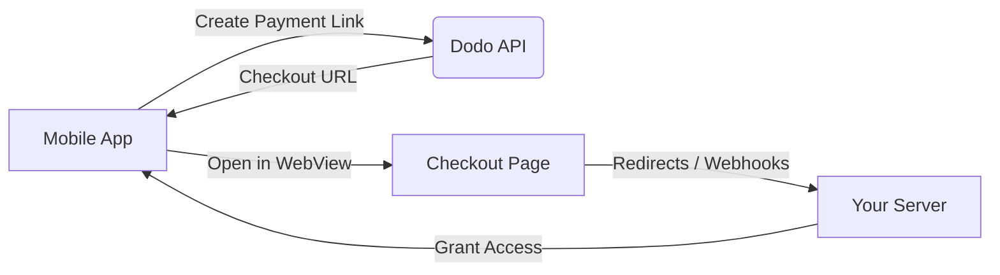

## Giới thiệu

Dodo Payments giúp các nhà phát triển bán hàng hóa và dịch vụ kỹ thuật số trong các ứng dụng iOS, xử lý các khía cạnh phức tạp như tuân thủ thuế, chuyển đổi tiền tệ và thanh toán. Hướng dẫn toàn diện này chi tiết cách tích hợp Dodo Payments vào ứng dụng iOS của bạn, đặc biệt cho các công cụ SaaS, đăng ký nội dung và tiện ích kỹ thuật số.

## Tổng quan

Dodo Payments đóng vai trò là **Merchant of Record (MoR)** của bạn, quản lý các khía cạnh quan trọng của doanh nghiệp kỹ thuật số của bạn:

<Tabs>
<Tab title="Những gì chúng tôi xử lý">
- Thu thập và nộp thuế (VAT, GST và các loại thuế khu vực khác)
- Thanh toán toàn cầu theo chính sách và phương thức thanh toán địa phương
- Chuyển đổi tiền tệ và ngoại hối
- Hoàn tiền và phòng chống gian lận
- Xuất hóa đơn và biên lai cho khách hàng cuối
- Tuân thủ các quy định khu vực
</Tab>

<Tab title="Những gì bạn nhận được">
- Một API thống nhất cho các nền tảng web và di động
- Hỗ trợ thanh toán trong ứng dụng (UPI, thẻ, ví, BNPL)
- Hỗ trợ thanh toán toàn cầu (Payoneer, Wise, chuyển khoản ngân hàng địa phương)
- Bảng điều khiển phân tích và báo cáo
- Xử lý thanh toán an toàn
</Tab>
</Tabs>

## Trường hợp sử dụng

<CardGroup cols={2}>
<Card title="Đăng ký" icon="repeat">
- Truy cập nội dung hoặc tính năng cao cấp
- Thanh toán định kỳ với các tùy chọn linh hoạt, Thử nghiệm miễn phí, Tính toán tỷ lệ, hoặc Nâng cấp và hạ cấp
</Card>

<Card title="Khóa học và Học tập" icon="graduation-cap">
- Truy cập theo khóa học
- Gói nội dung kết hợp
- Giấy phép trọn đời hoặc gia hạn
- Tích hợp theo dõi tiến độ
</Card>

<Card title="Tải xuống kỹ thuật số" icon="download">
- Mua một lần (PDF, nhạc, công cụ)
- Giao hàng tài sản kỹ thuật số
- Quản lý khóa bản quyền
</Card>

<Card title="Công cụ SaaS" icon="screwdriver-wrench">
- Đăng ký phần mềm như một dịch vụ
- Thanh toán theo mức sử dụng
- Kế hoạch cho nhóm và doanh nghiệp
</Card>
</CardGroup>

## Quy trình tích hợp

Bạn có thể tích hợp Dodo Payments vào ứng dụng của mình bằng cách sử dụng giải pháp thanh toán được lưu trữ hoặc trình duyệt trong ứng dụng của chúng tôi.

### Các bước tích hợp

<Steps>
<Step title="Ứng dụng di động đến Dodo API">
Quá trình bắt đầu với ứng dụng di động tạo một liên kết thanh toán bằng cách tương tác với Dodo API.
</Step>

<Step title="Dodo API đến Ứng dụng di động">
Dodo API phản hồi bằng cách cung cấp một URL thanh toán trở lại ứng dụng di động.
</Step>

<Step title="Ứng dụng di động đến Trang thanh toán">
Ứng dụng di động sau đó mở URL thanh toán này trong một WebView, dẫn người dùng đến trang thanh toán.
</Step>

<Step title="Trang thanh toán đến Máy chủ của bạn">
Sau khi hoàn tất quá trình thanh toán, trang thanh toán giao tiếp với máy chủ của bạn thông qua chuyển hướng hoặc webhook.
</Step>

<Step title="Máy chủ của bạn đến Ứng dụng di động">
Cuối cùng, máy chủ của bạn cấp quyền truy cập vào nội dung hoặc dịch vụ đã mua, hoàn tất chu trình giao dịch trở lại trong ứng dụng di động.
</Step>
</Steps>

<Card title="Hướng dẫn tích hợp di động" icon="mobile" href="/developer-resources/mobile-integration">
Để có hướng dẫn chi tiết cho nhà phát triển, hãy khám phá Hướng dẫn Tích hợp Di động của chúng tôi.
</Card>

## Tính khả dụng theo khu vực

Dodo Payments cho phép các luồng mua hàng trong ứng dụng thay thế chỉ ở các khu vực App Store mà Apple rõ ràng cho phép thanh toán bên ngoài, hoặc nơi có quy định hoặc lệnh của tòa án yêu cầu điều đó.

### Các khu vực được hỗ trợ

<AccordionGroup>
<Accordion title="Hoa Kỳ">
Hỗ trợ trong phạm vi được phép bởi các lệnh tòa hiện tại và hướng dẫn cập nhật của Apple.

- Có sẵn theo các điều khoản do tòa án quy định cụ thể
- Phải tuân thủ các yêu cầu pháp lý của Apple
- Phải tuân theo hướng dẫn thực hiện của Apple
</Accordion>

<Accordion title="App Store Liên minh Châu Âu (EU)">
Hỗ trợ thông qua Điều khoản Thay thế của Apple EU và Quyền Mua hàng Bên ngoài.

- Được kích hoạt thông qua Điều khoản Thay thế của Apple EU
- Cần phê duyệt Quyền Mua hàng Bên ngoài
- Phải tuân thủ các yêu cầu của Đạo luật Thị trường Kỹ thuật số EU
</Accordion>

<Accordion title="Hàn Quốc">
Hỗ trợ thông qua Quyền Mua hàng Bên ngoài StoreKit cho các nhị phân chỉ dành cho Hàn Quốc.

- Có sẵn thông qua Quyền Mua hàng Bên ngoài StoreKit
- Cần nhị phân ứng dụng cụ thể cho Hàn Quốc
- Phải tuân thủ luật viễn thông Hàn Quốc
</Accordion>
</AccordionGroup>

<Warning>
Luôn xem xét và tuân thủ các quyền lợi cụ thể theo khu vực của Apple và yêu cầu của App Store Connect trước khi kích hoạt Dodo Payments cho bất kỳ cửa hàng nào. Việc sử dụng các luồng thanh toán thay thế ở các khu vực không được hỗ trợ có thể dẫn đến việc ứng dụng bị từ chối hoặc gỡ bỏ.
</Warning>

<Note>
Đối với một số mô hình kinh doanh - chẳng hạn như dịch vụ hoặc một số loại nội dung nhất định - Apple có thể không yêu cầu sử dụng mua hàng trong ứng dụng (IAP) chút nào. Dodo Payments cũng hỗ trợ các mô hình này. Luôn xác minh phân loại ứng dụng của bạn và hướng dẫn mới nhất của Apple để xác định xem IAP có bắt buộc cho trường hợp sử dụng của bạn hay không.
</Note>

### Tìm hiểu thêm

Để có phân tích chi tiết về các chính sách toàn cầu, tiền lệ pháp lý và các cách tiếp cận chiến lược để vượt qua phí App Store, hãy xem hướng dẫn toàn diện của chúng tôi:

<Card title="Vượt qua phí App Store & Play Store: Một cuốn sách chiến lược và pháp lý" icon="shield-check" href="/features/bypassing-app-store-fees">
Tìm hiểu nơi và cách bạn có thể hợp pháp triển khai các luồng thanh toán thay thế, với hướng dẫn khu vực và mẹo tuân thủ cập nhật.
</Card>