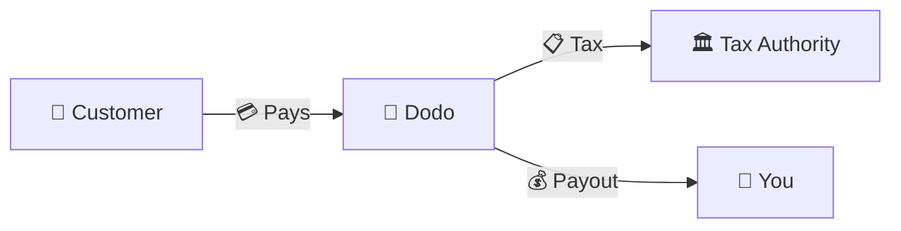
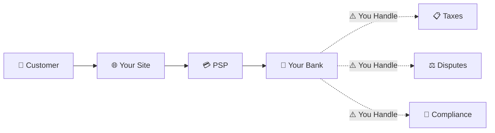
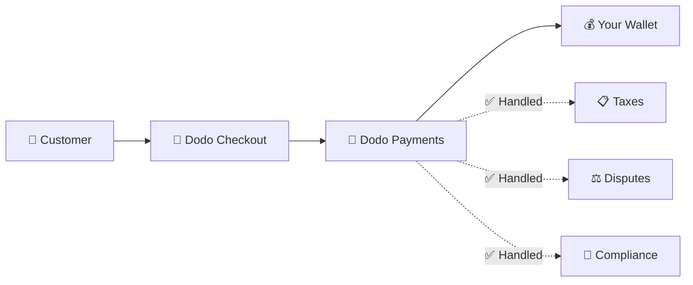
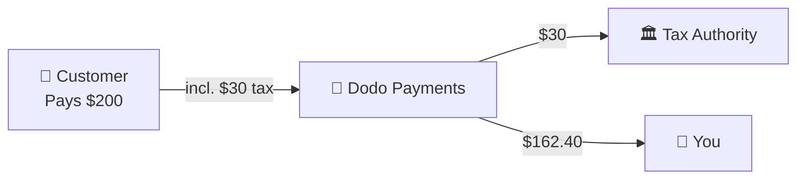

Dodo Payments hoạt động như một **Merchant of Record (MoR)** — chúng tôi trở thành người bán hợp pháp cho các sản phẩm kỹ thuật số của bạn, đảm nhận trách nhiệm về thanh toán, thuế, gian lận và tuân thủ để bạn có thể hoàn toàn tập trung vào việc xây dựng sản phẩm của mình.

<CardGroup cols={3}>
<Card title="220+ Khu vực" icon="globe">
Tuân thủ thuế được xử lý tự động
</Card>

<Card title="30+ Phương thức thanh toán" icon="credit-card">
Thẻ, ví điện tử và các phương thức địa phương
</Card>

<Card title="Không cần khai thuế" icon="file-invoice">
Chúng tôi xử lý tất cả các khoản thanh toán
</Card>
</CardGroup>

## Merchant of Record là gì?

Một **Merchant of Record** là thực thể pháp lý xuất hiện trên bảng sao kê thẻ tín dụng của khách hàng và chịu trách nhiệm cho giao dịch. Khi bạn sử dụng Dodo Payments làm MoR của mình:

- **Chúng tôi là người bán hợp pháp** — Dodo xuất hiện trên bảng sao kê ngân hàng và biên lai
- **Bạn là người tạo sản phẩm** — Bạn xây dựng, định giá và giao hàng sản phẩm của mình
- **Chúng tôi xử lý các công việc văn phòng** — Thuế, tranh chấp, tuân thủ và hỗ trợ thanh toán
- **Bạn nhận được khoản thanh toán ròng** — Doanh thu được gửi trực tiếp vào tài khoản của bạn

<Note>
Hãy nghĩ về một Merchant of Record như việc thuê một đội ngũ tài chính toàn cầu xử lý hóa đơn, thuế và thanh toán ở mọi quốc gia — mà không cần bạn phải động tay.
</Note>

## Tại sao nên sử dụng Merchant of Record?

Bán sản phẩm kỹ thuật số toàn cầu có nghĩa là phải điều hướng VAT ở châu Âu, GST ở Úc, Thuế bán hàng ở Mỹ và vô số yêu cầu khác. Mỗi khu vực pháp lý có các quy tắc, tỷ lệ, ngưỡng và thời hạn nộp thuế khác nhau.

| Trách nhiệm của bạn | Không có MoR | Với Dodo là MoR |
|---------------------|:-----------:|:----------------:|
| Đăng ký VAT/GST | ❌ Bạn | ✅ Dodo |
| Tính toán thuế | ❌ Bạn | ✅ Dodo |
| Khai thuế & Thanh toán | ❌ Bạn | ✅ Dodo |
| Trách nhiệm chargeback | ❌ Bạn | ✅ Dodo |
| Tuân thủ PCI | ❌ Bạn | ✅ Dodo |
| Hỗ trợ đa tiền tệ | ❌ Phức tạp | ✅ Tích hợp sẵn |
| Phương thức thanh toán địa phương | ❌ Tích hợp từng cái | ✅ 30+ Đã bao gồm |

<Tip>
**Ví dụ**: Bán một gói đăng ký €50/tháng cho một khách hàng Pháp?

**Không có MoR**: Đăng ký VAT Pháp, tính phí €60 (20% VAT), nộp báo cáo thuế hàng quý của Pháp, xử lý kiểm toán — bằng tiếng Pháp.

**Với Dodo**: Chúng tôi thu €60, nộp €10 VAT cho Pháp, và trả cho bạn €50 trừ phí. Bạn chỉ cần viết mã.
</Tip>

## PSP vs. MoR: Sự khác biệt chính

Hiểu sự khác biệt giữa **Nhà cung cấp dịch vụ thanh toán** (như Stripe) và **Merchant of Record** là rất quan trọng.

### Nhà cung cấp dịch vụ thanh toán (PSP)

Một PSP xử lý các giao dịch nhưng để bạn là người bán hợp pháp:

<Warning>
Với một PSP, **bạn** chịu trách nhiệm về việc đăng ký thuế, thu thập, khai báo và thanh toán ở mọi khu vực mà bạn có khách hàng.
</Warning>

### Merchant of Record (Dodo)

Một MoR trở thành người bán hợp pháp, xử lý tuân thủ từ đầu đến cuối:

<Check>
Với Dodo là MoR, chúng tôi xử lý thuế, tranh chấp và tuân thủ. Bạn nhận được khoản thanh toán ròng mà không cần giấy tờ.
</Check>

### So sánh cạnh tranh

| Khía cạnh | PSP (Stripe, v.v.) | MoR (Dodo) |
|--------|:------------------:|:----------:|
| Người bán hợp pháp | Công ty của bạn | Dodo |
| Trên bảng sao kê của khách hàng | Tên của bạn | Dodo |
| Đăng ký thuế | ❌ Bạn | ✅ Dodo |
| Tính toán thuế | ❌ Bạn | ✅ Dodo |
| Thanh toán thuế | ❌ Bạn | ✅ Dodo |
| Rủi ro chargeback | ❌ Bạn | ✅ Dodo |
| Tuân thủ PCI | ❌ Bạn | ✅ Dodo |
| Thiết lập cho toàn cầu | Phức tạp | Đơn giản |

<Info>
**Quan trọng**: Cả PSP và MoR đều xử lý việc xử lý thanh toán. Sự khác biệt chính là **ai là người chịu trách nhiệm pháp lý** về tuân thủ thuế và trách nhiệm giao dịch.
</Info>

## Cách thức tuân thủ thuế hoạt động

Dodo xử lý toàn bộ vòng đời thuế một cách tự động:

<Steps>
<Step title="Vị trí khách hàng">
Chúng tôi phát hiện quốc gia của khách hàng và xác định quy tắc thuế nào áp dụng — VAT, GST, Thuế bán hàng, hoặc các yêu cầu địa phương khác.
</Step>

<Step title="Tính toán tỷ lệ">
Tỷ lệ thuế chính xác được tính toán dựa trên loại sản phẩm, vị trí khách hàng và trạng thái B2B/B2C. Khách hàng doanh nghiệp EU có số VAT hợp lệ sẽ được áp dụng phương thức đảo ngược.
</Step>

<Step title="Thu thập tại thanh toán">
Thuế được hiển thị rõ ràng và thu thập tại thanh toán. Khách hàng thấy chính xác những gì họ đang trả.
</Step>

<Step title="Khai báo & Thanh toán">
Chúng tôi nộp báo cáo và thanh toán thuế đã thu cho các cơ quan liên quan theo lịch trình. Bạn không bao giờ thấy một mẫu thuế nào.
</Step>
</Steps>

## Dòng doanh thu

Dưới đây là cách tiền di chuyển từ khách hàng đến tài khoản của bạn:

### Phân tích khoản thanh toán ví dụ

| Mục | Số tiền |
|-----------|-------:|
| Thanh toán của khách hàng | $200.00 |
| Thuế bán hàng (15% VAT) | −$30.00 |
| Phí nền tảng Dodo (4%) | −$8.00 |
| Phí xử lý thanh toán | −$0.60 |
| **Khoản thanh toán của bạn** | **$162.40** |

## Khi nào nên chọn MoR so với PSP

<Tabs>
<Tab title="Chọn Dodo (MoR)">
**Dodo Payments là lý tưởng nếu bạn:**

- Bán sản phẩm kỹ thuật số, SaaS hoặc đăng ký
- Có khách hàng ở nhiều quốc gia
- Muốn tránh những rắc rối về đăng ký thuế
- Thích tuân thủ được dự đoán và thuê ngoài
- Đánh giá tốc độ ra thị trường hơn là kiểm soát tối đa
- Không muốn quản lý tranh chấp và gian lận
</Tab>

<Tab title="Xem xét một PSP">
**Một PSP có thể phù hợp với bạn nếu bạn:**

- Hoạt động chủ yếu ở một quốc gia
- Có đội ngũ tài chính và tuân thủ nội bộ
- Cần kiểm soát tuyệt đối về trải nghiệm thanh toán
- Làm việc với biên lợi nhuận cực kỳ mỏng
- Bán hàng hóa vật lý (MoRs tập trung vào kỹ thuật số)
</Tab>
</Tabs>

<Note>
Nhiều doanh nghiệp bắt đầu với một PSP và chuyển sang MoR khi họ mở rộng ra quốc tế. Dodo cung cấp hỗ trợ di chuyển để làm cho quá trình chuyển đổi này trở nên liền mạch.
</Note>

## Câu hỏi thường gặp

<AccordionGroup>
<Accordion title="Cái gì xuất hiện trên bảng sao kê thẻ tín dụng của khách hàng?">
Dodo Payments xuất hiện như là người bán. Chúng tôi bao gồm tham chiếu sản phẩm/thương hiệu của bạn ở những nơi có giới hạn ký tự cho phép, và khách hàng nhận được biên lai chi tiết hiển thị thông tin sản phẩm của bạn.
</Accordion>

<Accordion title="Tôi vẫn sở hữu mối quan hệ với khách hàng chứ?">
Có. Bạn kiểm soát giá cả, thương hiệu, giao hàng sản phẩm và giao tiếp trực tiếp. Dodo xử lý các cơ chế thanh toán, nhưng khách hàng biết rằng họ đang mua từ bạn. Thương hiệu của bạn xuất hiện nổi bật trong thanh toán, email và hóa đơn.
</Accordion>

<Accordion title="Cách thức hoạt động của phương thức đảo ngược VAT B2B?">
Đối với các giao dịch B2B trong EU, khách hàng có thể nhập số VAT của họ tại thanh toán. Chúng tôi xác thực và tự động áp dụng phương thức đảo ngược — thuế chuyển sang báo cáo VAT của người mua thay vì được thu.
</Accordion>

<Accordion title="Tôi có thể sử dụng bộ xử lý thanh toán của riêng mình không?">
Dodo hoạt động như một giải pháp hoàn chỉnh sử dụng cơ sở hạ tầng thanh toán của chúng tôi. Sự tích hợp này cho phép chúng tôi đảm nhận trách nhiệm về thuế và gian lận. Chúng tôi đang làm việc để cung cấp một tích hợp với các bộ xử lý thanh toán khác trong tương lai.
</Accordion>

<Accordion title="Cách thức hoạt động của việc hoàn tiền?">
Khởi tạo hoàn tiền từ bảng điều khiển của bạn. Chúng tôi xử lý hoàn tiền theo phương thức thanh toán và tiền tệ gốc của khách hàng. Các khoản thuế sẽ được điều chỉnh và đối chiếu tự động.
</Accordion>

<Accordion title="Còn thuế thu nhập của tôi thì sao?">
Dodo xử lý **thuế bán hàng** (VAT, GST, Thuế bán hàng) trên các giao dịch của khách hàng. Bạn vẫn chịu trách nhiệm về thuế thu nhập doanh nghiệp, thuế doanh nghiệp và nghĩa vụ thuế trên các khoản thanh toán bạn nhận được.
</Accordion>

<Accordion title="Tôi có thể bán cho những quốc gia nào?">
Chúng tôi chấp nhận thanh toán từ hơn 220 quốc gia và khu vực với sự mở rộng liên tục. Xem danh sách đầy đủ:

<Card title="Các khu vực được hỗ trợ" icon="globe" href="/miscellaneous/list-of-countries-we-accept-payments-from">
Xem tất cả hơn 220 quốc gia và khu vực mà chúng tôi chấp nhận thanh toán.
</Card>
</Accordion>
</AccordionGroup>

## Bắt đầu

<CardGroup cols={2}>
<Card title="Tạo tài khoản" icon="rocket" href="https://app.dodopayments.com/signup">
Đăng ký miễn phí và chấp nhận thanh toán toàn cầu trong vài phút.
</Card>

<Card title="So sánh MoR và PG" icon="scale-balanced" href="/features/mor-vs-pg">
So sánh chi tiết với ví dụ và trường hợp sử dụng.
</Card>

<Card title="Chính sách chấp nhận" icon="building-shield" href="/miscellaneous/merchant-acceptance">
Tìm hiểu những doanh nghiệp nào chúng tôi hỗ trợ.
</Card>

<Card title="Liên hệ với chúng tôi" icon="envelope" href="mailto:founders@dodopayments.com">
Nhận hướng dẫn cá nhân từ đội ngũ của chúng tôi.
</Card>
</CardGroup>
