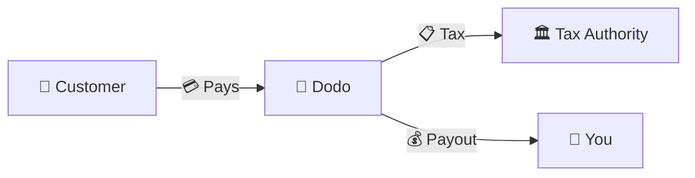
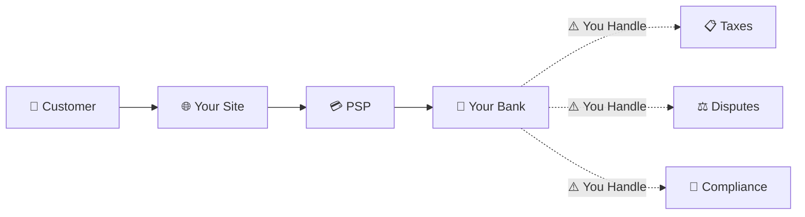
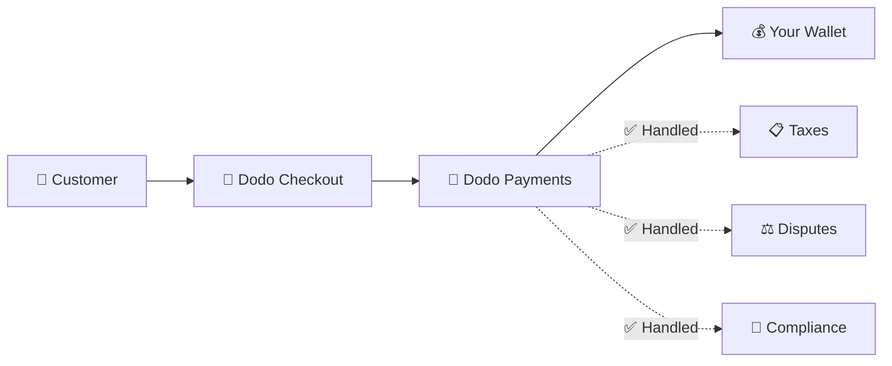
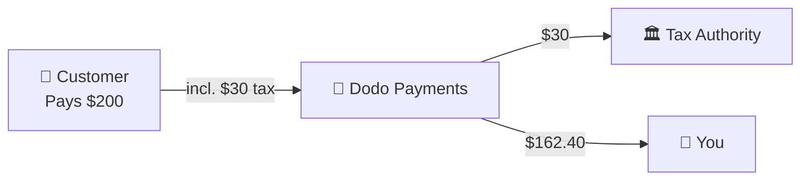

Dodo Payments hoạt động như một **Merchant of Record (MoR)** — chúng tôi trở thành người bán hợp pháp cho các sản phẩm kỹ thuật số của bạn, đảm nhận trách nhiệm về thanh toán, thuế, gian lận và tuân thủ để bạn có thể hoàn toàn tập trung vào việc xây dựng sản phẩm của mình.

<CardGroup cols={3}>
Tuân thủ thuế được xử lý tự động
</Card>

{/* LOCKED_PATTERN_a7f32ee62695527a537b82d99f01c4bc */}
Thẻ, ví và phương thức địa phương
</Card>

{/* LOCKED_PATTERN_cb6e35d755bb02c3f1254b1c5a9c4c73 */}
Chúng tôi xử lý tất cả chuyển tiền
</Card>
</CardGroup>

## Merchant of Record là gì?

Một **Merchant of Record** là thực thể pháp lý xuất hiện trên bảng sao kê thẻ tín dụng của khách hàng và chịu trách nhiệm cho giao dịch. Khi bạn sử dụng Dodo Payments làm MoR của mình:

- **Chúng tôi là người bán hợp pháp** — Dodo xuất hiện trên bảng sao kê ngân hàng và biên lai
- **Bạn là người tạo sản phẩm** — Bạn xây dựng, định giá và giao hàng sản phẩm của mình
- **Chúng tôi xử lý các công việc văn phòng** — Thuế, tranh chấp, tuân thủ và hỗ trợ thanh toán
- **Bạn nhận được khoản thanh toán ròng** — Doanh thu được gửi trực tiếp vào tài khoản của bạn

<Note>
Hãy nghĩ Merchant of Record như việc thuê một đội ngũ tài chính toàn cầu xử lý hóa đơn, thuế và thanh toán ở mọi quốc gia — mà bạn không cần làm gì cả.
</Note>

## Tại sao nên sử dụng Merchant of Record?

Bán sản phẩm kỹ thuật số toàn cầu có nghĩa là phải điều hướng VAT ở châu Âu, GST ở Úc, Thuế bán hàng ở Mỹ và vô số yêu cầu khác. Mỗi khu vực pháp lý có các quy tắc, tỷ lệ, ngưỡng và thời hạn nộp thuế khác nhau.

| Trách nhiệm của bạn | Không có MoR | Với Dodo là MoR |
|---------------------|:-----------:|:----------------:|
| Đăng ký VAT/GST | ❌ Bạn | ✅ Dodo |
| Tính toán thuế | ❌ Bạn | ✅ Dodo |
| Khai thuế & Thanh toán | ❌ Bạn | ✅ Dodo |
| Trách nhiệm chargeback | ❌ Bạn | ✅ Dodo |
| Tuân thủ PCI | ❌ Bạn | ✅ Dodo |
| Hỗ trợ đa tiền tệ | ❌ Phức tạp | ✅ Tích hợp sẵn |
| Phương thức thanh toán địa phương | ❌ Tích hợp từng cái | ✅ 30+ Đã bao gồm |

<Tip>
**Ví dụ**: Bán gói đăng ký €50/tháng cho khách hàng Pháp?

**Không có MoR**: Đăng ký VAT Pháp, tính phí €60 (20% VAT), nộp báo cáo thuế hàng quý của Pháp, xử lý kiểm toán — bằng tiếng Pháp.

**Với Dodo**: Chúng tôi thu €60, chuyển €10 VAT cho Pháp, và trả bạn €50 trừ phí. Bạn chỉ viết mã.
</Tip>

## PSP vs. MoR: Sự khác biệt chính

Hiểu sự khác biệt giữa **Nhà cung cấp dịch vụ thanh toán** (như Stripe) và **Merchant of Record** là rất quan trọng.

### Nhà cung cấp dịch vụ thanh toán (PSP)

Một PSP xử lý các giao dịch nhưng để bạn là người bán hợp pháp:

<Warning>
Với một PSP, **bạn** chịu trách nhiệm đăng ký thuế, thu, kê khai và chuyển thuế ở mọi khu vực pháp lý nơi bạn có khách hàng.
</Warning>

### Merchant of Record (Dodo)

Một MoR trở thành người bán hợp pháp, xử lý tuân thủ từ đầu đến cuối:

<Check>
Với Dodo là MoR, chúng tôi xử lý thuế, tranh chấp và tuân thủ. Bạn nhận được khoản thanh toán thực với zero giấy tờ.
</Check>

### So sánh cạnh tranh

| Khía cạnh | PSP (Stripe, v.v.) | MoR (Dodo) |
|--------|:------------------:|:----------:|
| Người bán hợp pháp | Công ty của bạn | Dodo |
| Trên bảng sao kê của khách hàng | Tên của bạn | Dodo |
| Đăng ký thuế | ❌ Bạn | ✅ Dodo |
| Tính toán thuế | ❌ Bạn | ✅ Dodo |
| Thanh toán thuế | ❌ Bạn | ✅ Dodo |
| Rủi ro chargeback | ❌ Bạn | ✅ Dodo |
| Tuân thủ PCI | ❌ Bạn | ✅ Dodo |
| Thiết lập cho toàn cầu | Phức tạp | Đơn giản |

<Info>
**Quan trọng**: Cả PSP và MoR đều xử lý thanh toán. Điểm khác biệt chính là **ai chịu trách nhiệm pháp lý** về tuân thủ thuế và rủi ro giao dịch.
</Info>

## Cách thức tuân thủ thuế hoạt động

Dodo xử lý toàn bộ vòng đời thuế một cách tự động:

<Steps>
{/* LOCKED_PATTERN_9939f53f87faa28f5e85c7bcd4aa5d90 */}
Chúng tôi xác định quốc gia của khách hàng và áp dụng quy định thuế phù hợp — VAT, GST, Thuế Bán hàng, hoặc các yêu cầu địa phương khác.
</Step>

{/* LOCKED_PATTERN_70142fc485c0e1d535a43e599b490143 */}
Mức thuế chính xác được tính dựa trên loại sản phẩm, vị trí khách hàng và tình trạng B2B/B2C. Khách hàng doanh nghiệp EU có số VAT hợp lệ sẽ được áp dụng reverse charge.
</Step>

{/* LOCKED_PATTERN_44b82b1d71e9f255cf562f67916ee9b7 */}
Thuế được hiển thị rõ ràng và thu tại lúc thanh toán. Khách hàng nhìn thấy chính xác những gì họ phải trả.
</Step>

{/* LOCKED_PATTERN_1a778e95cb3812007334c0b47194f9ac */}
Chúng tôi kê khai và nộp thuế đã thu cho các cơ quan liên quan theo lịch. Bạn không bao giờ phải nhìn thấy một mẫu thuế.
</Step>
</Steps>

## Dòng doanh thu

Dưới đây là cách tiền di chuyển từ khách hàng đến tài khoản của bạn:

### Phân tích khoản thanh toán ví dụ

| Mục | Số tiền |
|-----------|-------:|
| Thanh toán của khách hàng | $200.00 |
| Thuế bán hàng (15% VAT) | −$30.00 |
| Phí nền tảng Dodo (4%) | −$8.00 |
| Phí xử lý thanh toán | −$0.60 |
| **Khoản thanh toán của bạn** | **$162.40** |

## Khi nào nên chọn MoR so với PSP

<Tabs>
{/* LOCKED_PATTERN_1d2e428d12b1ee53f2d946d9302bede1 */}
**Dodo Payments phù hợp nếu bạn:**

- Bán sản phẩm kỹ thuật số, SaaS hoặc đăng ký
- Có khách hàng trên nhiều quốc gia
- Muốn tránh rắc rối đăng ký thuế
- Ưu tiên sự tuân thủ được thuê ngoài và dự đoán trước
- Giá trị tốc độ ra thị trường vượt trội quyền kiểm soát tối đa
- Không muốn xử lý tranh chấp và gian lận
</Tab>

{/* LOCKED_PATTERN_9020967e8e2c9a3ebc575f4072e18e76 */}
**Một PSP có thể phù hợp nếu bạn:**

- Hoạt động chủ yếu ở một quốc gia
- Có đội ngũ tài chính và tuân thủ nội bộ
- Cần quyền kiểm soát tuyệt đối đối với trải nghiệm thanh toán
- Làm việc với biên lợi nhuận rất mỏng
- Bán hàng hóa vật lý (MoR tập trung vào kỹ thuật số)
</Tab>
</Tabs>

<Note>
Nhiều doanh nghiệp bắt đầu với PSP và chuyển sang MoR khi mở rộng quốc tế. Dodo cung cấp hỗ trợ di chuyển để làm cho quá trình chuyển đổi trở nên suôn sẻ.
</Note>

## Câu hỏi thường gặp

<AccordionGroup>
{/* LOCKED_PATTERN_03db007d1397fc75cc7c059a12f7514d */}
Dodo Payments xuất hiện như người bán. Chúng tôi bao gồm tham chiếu sản phẩm/nhãn hiệu của bạn nếu giới hạn ký tự cho phép, và khách hàng nhận được hóa đơn chi tiết hiển thị thông tin sản phẩm của bạn.
</Accordion>

{/* LOCKED_PATTERN_14efbd55af6b9971cc9bb290118d1ce5 */}
Có. Bạn kiểm soát giá cả, thương hiệu, giao hàng sản phẩm và giao tiếp trực tiếp. Dodo xử lý cơ chế thanh toán, nhưng khách hàng biết họ đang mua hàng từ bạn. Thương hiệu của bạn xuất hiện nổi bật ở thanh toán, email và hóa đơn.
</Accordion>

{/* LOCKED_PATTERN_5e87ff5ce15f8c25ec293008878ec1c8 */}
Đối với doanh số B2B ở EU, khách hàng có thể nhập số VAT tại thanh toán. Chúng tôi xác minh và tự động áp dụng reverse charge — thuế chuyển sang kê khai VAT của người mua thay vì thu tại chỗ.
</Accordion>

{/* LOCKED_PATTERN_828a96aed23c294d40585d542017c689 */}
Dodo hoạt động như giải pháp toàn diện sử dụng hạ tầng thanh toán của chúng tôi. Việc tích hợp này cho phép chúng tôi chịu trách nhiệm thuế và gian lận. Chúng tôi đang làm việc để cung cấp tích hợp với các bộ xử lý thanh toán khác trong tương lai.
</Accordion>

{/* LOCKED_PATTERN_7d718a1b657f28e952148f962ca6593e */}
Khởi tạo hoàn tiền từ bảng điều khiển của bạn. Chúng tôi xử lý hoàn tiền bằng phương thức thanh toán và tiền tệ ban đầu của khách hàng. Số thuế được điều chỉnh và đối chiếu tự động.
</Accordion>

{/* LOCKED_PATTERN_dc7f113144600495109fc2c229c89f70 */}
Dodo xử lý **thuế bán hàng** (VAT, GST, Sales Tax) trên giao dịch khách hàng. Bạn vẫn chịu trách nhiệm thuế thu nhập doanh nghiệp, thuế công ty và nghĩa vụ thuế khác trên các khoản thanh toán bạn nhận được.
</Accordion>

{/* LOCKED_PATTERN_04ec30ba2875e1ca25e9a1ae1dcc112d */}
Chúng tôi chấp nhận thanh toán từ hơn 220 quốc gia và vùng lãnh thổ với mở rộng liên tục. Xem danh sách đầy đủ:

{/* LOCKED_PATTERN_1baa59aa331aff639990872bb61046bd */}
Xem tất cả hơn 220 quốc gia và vùng lãnh thổ nơi chúng tôi chấp nhận thanh toán.
</Card>
</Accordion>
</AccordionGroup>

## Bắt đầu

<CardGroup cols={2}>
{/* LOCKED_PATTERN_a6e00712f4bf1e0645985bccec8d5def */}
Đăng ký miễn phí và chấp nhận thanh toán toàn cầu trong vài phút.
</Card>

{/* LOCKED_PATTERN_d858044e80838a32f52c51b21b17f5eb */}
So sánh chi tiết với ví dụ và trường hợp sử dụng.
</Card>

{/* LOCKED_PATTERN_4e501d9df0a1b75ab7c08a16b87219c5 */}
Tìm hiểu những doanh nghiệp mà chúng tôi hỗ trợ.
</Card>

{/* LOCKED_PATTERN_6053eaa23d9fa4210c02c58e94af8536 */}
Nhận hướng dẫn cá nhân hóa từ đội ngũ của chúng tôi.
</Card>
</CardGroup>
