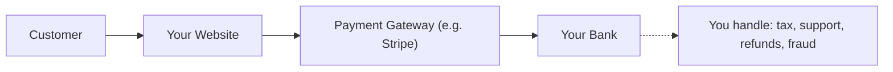
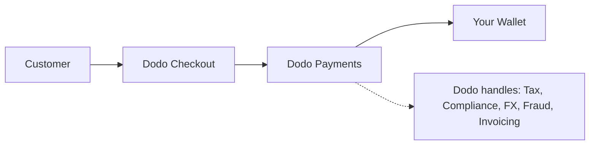

## Giới thiệu

Hướng dẫn này so sánh mô hình MoR với phương pháp Payment Gateway truyền thống, giúp bạn hiểu những lợi ích mà Dodo Payments mang lại cho doanh nghiệp của bạn.

## Sự khác biệt cốt lõi

| Tính năng                          | MoR (Dodo Payments)         | Payment Gateway (PG truyền thống)           |
|----------------------------------|--------------------------------------------|--------------------------------------------|
| Người bán hợp pháp                     | Dodo Payments (MoR)                        | Công ty của bạn                               |
| Thu thập và chuyển giao thuế     | Được Dodo xử lý                            | Bạn chịu trách nhiệm                        |
| Gánh nặng tuân thủ & quy định  | Dodo chịu trách nhiệm                     | Bạn xử lý luật địa phương và chargeback      |
| Tiền tệ thanh toán             | USD, EUR, INR và 25+ loại khác được hỗ trợ    | Phụ thuộc vào tài khoản thương mại của bạn           |
| Quản lý rủi ro                 | Bảo vệ chống gian lận và chargeback tích hợp   | Bạn tự thiết lập công cụ của riêng mình (ví dụ: Stripe Radar) |
| Thanh toán                         | Thanh toán toàn cầu được tổng hợp và đơn giản hóa   | Trực tiếp từ PG đến bạn, với thiết lập ngân hàng     |

## Điều này có nghĩa là gì đối với bạn

Với **Dodo là MoR**, chúng tôi trở thành người bán hợp pháp cho khách hàng của bạn, cho phép bạn:

- Bỏ qua việc thiết lập các thực thể địa phương
- Tránh xử lý VAT, GST hoặc thuế bán hàng
- Cung cấp nhiều phương thức thanh toán hơn trên toàn cầu
- Giảm rủi ro pháp lý
- Ra mắt nhanh hơn ở các thị trường mới

<Note>
Hãy tưởng tượng bạn bán một đăng ký kỹ thuật số cho một người dùng ở Pháp. Với Dodo Payments, chúng tôi thu thập thanh toán, nộp VAT cho cơ quan Pháp, và gửi cho bạn doanh thu ròng. Không có đau đầu về thuế. Không cần luật sư. Chỉ có sự phát triển.
</Note>

Ngoài ra, mô hình MoR đơn giản hóa toàn bộ văn phòng của bạn. Là MoR của bạn, Dodo xử lý tuân thủ PCI, phát hiện gian lận, chuyển đổi tiền tệ, và thậm chí hỗ trợ thanh toán cho khách hàng, giúp đội ngũ của bạn tập trung vào sản phẩm và sự phát triển.

## So sánh hình ảnh

**Dòng doanh thu: Payment Gateway**

**Dòng doanh thu: Merchant of Record (Dodo)**

## Tại sao điều này quan trọng đối với SaaS & Doanh nghiệp kỹ thuật số

Khi doanh nghiệp của bạn mở rộng, việc quản lý thuế, tuân thủ và sở thích thanh toán toàn cầu có thể trở nên quá tải. Với một payment gateway, bạn chịu trách nhiệm cho:

- Đăng ký và nộp VAT/GST ở nhiều khu vực pháp lý
- Quản lý chuyển đổi tiền tệ và chargeback
- Cung cấp quy trình thanh toán và phương thức thanh toán địa phương hóa

Với Dodo Payments là MoR của bạn:
- Bạn mở rộng toàn cầu mà không cần thiết lập các thực thể địa phương
- Thuế được tính toán, thu thập và nộp thay mặt bạn
- Bạn có quyền truy cập vào thư viện các phương thức thanh toán phù hợp với khách hàng của bạn
- Chúng tôi đóng vai trò là bộ đệm pháp lý và đối tác vận hành của bạn

<Tip>
"Hãy nghĩ về một payment gateway như một đường hầm. Bây giờ hãy tưởng tượng Merchant of Record như một đường hầm, tàu, tài xế và nhân viên bán vé tất cả trong một."
</Tip>

## Ai nên sử dụng MoR?

Dodo Payments hoàn hảo cho:
- Các công ty sản phẩm kỹ thuật số & SaaS
- Các nhà sáng tạo độc lập và doanh nhân đơn lẻ
- Các doanh nghiệp toàn cầu có khách hàng ở hơn 100 quốc gia
- Các công ty không muốn quản lý thuế & tuân thủ nội bộ

Nếu bạn đang mở rộng ra quốc tế, bán đăng ký, hoặc chỉ muốn giảm bớt những đau đầu trong vận hành, MoR là lựa chọn thông minh hơn.

## Khi nào nên sử dụng Payment Gateway thay thế

Có những trường hợp mà việc chỉ sử dụng một payment gateway có thể hợp lý:
- Doanh nghiệp của bạn chỉ hoạt động ở một quốc gia
- Bạn đã có nguồn lực tài chính và tuân thủ nội bộ
- Bạn cần kiểm soát hoàn toàn trải nghiệm thanh toán của khách hàng
- Bạn rất nhạy cảm về chi phí với biên lợi nhuận mỏng khi mở rộng

<Note>
Đối với nhiều startup, việc sử dụng một gateway có thể đủ trong giai đoạn đầu - nhưng khi độ phức tạp tăng lên, việc chuyển sang MoR có thể tiết kiệm thời gian, giảm rủi ro và tăng tốc độ phát triển quốc tế.
</Note>

## Tại sao chọn Dodo Payments

Dodo Payments cung cấp:
- Giải pháp thanh toán, thuế và tuân thủ tất cả trong một
- Hỗ trợ FX theo thời gian thực và đa tiền tệ
- Quyền truy cập vào hơn 30 phương thức thanh toán
- Thanh toán theo số ghế, đăng ký và thanh toán một lần
- Xử lý thuế tự động ở hơn 150 quốc gia
- Ngăn chặn gian lận và tuân thủ PCI tích hợp

Dù bạn là một nhà sáng lập đơn lẻ hay một đội ngũ SaaS đang mở rộng, Dodo đơn giản hóa những phức tạp của việc bán hàng toàn cầu.

## Tìm hiểu thêm

<CardGroup cols={2}>
<Card title="Hỗ trợ tiền tệ thích ứng" icon="money-bill-wave" href="/features/adaptive-currency">
Tìm hiểu cách Dodo tự động trình bày giá cả bằng tiền tệ địa phương của khách hàng bạn
</Card>

<Card title="Các phương thức thanh toán được hỗ trợ" icon="credit-card" href="/features/payment-methods">
Khám phá hơn 30 phương thức thanh toán có sẵn thông qua Dodo Payments
</Card>
</CardGroup>

## Sẵn sàng chuyển đổi?

Tham gia cùng hơn 3,000 doanh nghiệp kỹ thuật số đang sử dụng Dodo Payments để bán hàng toàn cầu, không có biên giới hay nút thắt.

<CardGroup cols={2}>
<Card title="Đăng ký miễn phí" icon="user-plus" href="https://app.dodopayments.com/signup">
Tạo tài khoản Dodo Payments của bạn và bắt đầu bán hàng toàn cầu ngay hôm nay
</Card>

<Card title="Liên hệ với bộ phận bán hàng" icon="envelope" href="mailto:founders@dodopayments.com">
Nhận hướng dẫn cá nhân từ đội ngũ của chúng tôi
</Card>
</CardGroup>

<Tip>
Hãy để Dodo xử lý những điều khó khăn - để bạn có thể tập trung vào việc xây dựng một sản phẩm tuyệt vời.
</Tip>