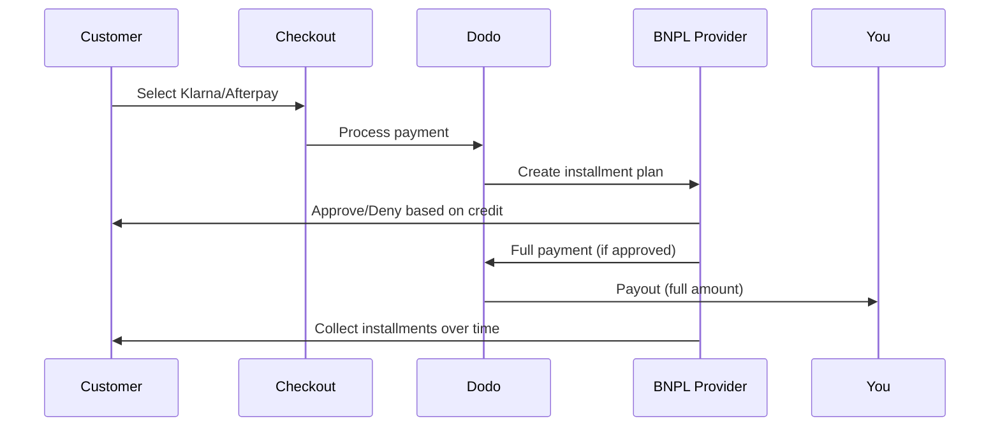

Mua Trước Trả Sau (BNPL) cho phép khách hàng chia khoản mua thành các kỳ thanh toán không lãi suất, tăng giá trị đơn hàng trung bình 20-50% và tỷ lệ chuyển đổi 10-30% cho các giao dịch đủ điều kiện.

## Tại sao nên cung cấp BNPL?

<CardGroup cols={3}>
<Card title="Higher AOV" icon="chart-line">
Khách hàng chi tiêu nhiều hơn khi họ có thể giãn các khoản thanh toán theo thời gian. Giá trị đơn hàng trung bình tăng 20-50%.
</Card>

<Card title="Better Conversion" icon="percent">
Giảm ma sát thanh toán khi thanh toán. Tỷ lệ chuyển đổi cải thiện 10-30% cho các mặt hàng giá trị cao.
</Card>

<Card title="Zero Risk" icon="shield-check">
Các nhà cung cấp BNPL xử lý rủi ro tín dụng và thu hồi nợ. Bạn nhận được toàn bộ khoản thanh toán ngay từ đầu.
</Card>
</CardGroup>

## Các nhà cung cấp hỗ trợ

### Klarna

| Tính năng | Chi tiết |
| :------ | :------ |
| **Khả dụng** | US + 19 European countries |
| **Đơn vị tiền tệ** | USD, EUR, GBP, DKK, NOK, SEK, CZK, RON, PLN, CHF |
| **Tối thiểu** | $50.01 (or equivalent) |
| **Đăng ký** | Không |

**Các quốc gia hỗ trợ:** Austria, Belgium, Czech Republic, Denmark, Finland, France, Germany, Greece, Ireland, Italy, Netherlands, Norway, Poland, Portugal, Romania, Spain, Sweden, Switzerland, United Kingdom, United States

**Các tùy chọn thanh toán:**
- **Pay in 4** — Chia thành 4 khoản thanh toán không lãi suất
- **Pay in 30 days** — Thanh toán đầy đủ sau 30 ngày
- **Financing** — Các kế hoạch trả góp dài hạn

### Afterpay (Clearpay)

| Tính năng | Chi tiết |
| :------ | :------ |
| **Khả dụng** | US, UK |
| **Đơn vị tiền tệ** | USD, GBP |
| **Tối thiểu** | $50.01 (or equivalent) |
| **Đăng ký** | Không |

**Các tùy chọn thanh toán:**
- **Pay in 4** — 4 khoản thanh toán không lãi suất mỗi 2 tuần

<Note>
Tại Vương quốc Anh, Afterpay hoạt động dưới tên “Clearpay” nhưng sử dụng cùng loại API (`afterpay_clearpay`).
</Note>

### Billie

| Tính năng | Chi tiết |
| :------ | :------ |
| **Khả dụng** | Global |
| **Đơn vị tiền tệ** | GBP |
| **Tối thiểu** | Không |
| **Đăng ký** | Không |

**Về Billie:**
Billie là giải pháp Mua Trước Trả Sau B2B cho phép các doanh nghiệp cung cấp điều khoản thanh toán linh hoạt cho khách hàng. Nó được thiết kế cho các giao dịch doanh nghiệp nơi người mua cần tùy chọn thanh toán theo hóa đơn.

**Các tùy chọn thanh toán:**
- **Invoice Payment** — Thanh toán trong thời hạn đã thỏa thuận
- **Flexible Terms** — Lịch trình thanh toán thân thiện với doanh nghiệp

## Cấu hình

### Các loại phương thức API

| Loại | Nhà cung cấp |
| :--- | :------- |
| `klarna` | Klarna |
| `afterpay_clearpay` | Afterpay / Clearpay |
| `billie` | Billie (B2B) |

### Ví dụ

```javascript
const session = await client.checkoutSessions.create({
  product_cart: [{ product_id: 'prod_123', quantity: 1 }],
  allowed_payment_method_types: [
    'klarna',
    'afterpay_clearpay',
    'credit',
    'debit'
  ],
  customer: {
    email: 'customer@example.com',
    name: 'Jane Smith'
  },
  billing_address: {
    country: 'US',
    zipcode: '10001'
  },
  return_url: 'https://example.com/success'
});
```

<Warning>
Luôn bao gồm `credit` và `debit` làm phương án dự phòng. Không phải tất cả khách hàng đều đủ điều kiện cho BNPL, và các giao dịch dưới $50.01 sẽ không đủ điều kiện.
</Warning>

## Số tiền giao dịch tối thiểu

**Cả Klarna và Afterpay đều yêu cầu tối thiểu $50.01 USD** (hoặc tương đương trong các đơn vị tiền tệ được hỗ trợ).

Các giao dịch dưới ngưỡng này:
- Tùy chọn BNPL sẽ không xuất hiện ở bước thanh toán
- Không có lỗi được phát ra — các tùy chọn đơn giản là không hiển thị
- Thanh toán bằng thẻ vẫn được cung cấp

Đây là hành vi mong đợi. Đừng bao gồm BNPL trong `allowed_payment_method_types` cho các sản phẩm dưới $50.

## Cách hoạt động của các kỳ thanh toán



**Các điểm chính:**
- Bạn nhận được **toàn bộ khoản thanh toán ngay từ đầu** từ nhà cung cấp BNPL
- Nhà cung cấp BNPL xử lý **rủi ro tín dụng và thu hồi nợ**
- Khách hàng trả tiền trực tiếp cho nhà cung cấp qua **4 kỳ thanh toán** (thường)
- **Không có hoàn tiền** từ các kỳ thanh toán thất bại — đó là rủi ro của nhà cung cấp

## Kiểm thử

### Dữ liệu kiểm thử Klarna

Sử dụng các thông tin này trong chế độ kiểm thử:

| Trường | Được phê duyệt | Bị từ chối |
| :---- | :------- | :----- |
| **Ngày sinh** | 07-10-1970 | 07-10-1970 |
| **Tên** | Test | Test |
| **Họ** | Person-us | Person-us |
| **Email** | customer@email.us | customer+denied@email.us |
| **Đường** | Amsterdam Ave | Amsterdam Ave |
| **Số nhà** | 509 | 509 |
| **Thành phố** | New York | New York |
| **Tiểu bang** | New York | New York |
| **Mã bưu chính** | 10024-3941 | 10024-3941 |
| **Điện thoại** | +13106683312 | +13106354386 |

<Note>
Giao dịch phải có ít nhất $50 để Klarna xuất hiện như một tùy chọn.
</Note>

### Kiểm thử Afterpay

<Steps>
<Step title="Select Afterpay">
Chọn Afterpay ở bước thanh toán và nhấn Pay.
</Step>

<Step title="Successful payment">
Sử dụng bất kỳ email và địa chỉ giao hàng hợp lệ nào.
</Step>

<Step title="Failed authentication">
Để kiểm thử thất bại: đóng cửa sổ Afterpay trên trang chuyển hướng. Trạng thái thanh toán chuyển sang `requires_payment_method`.
</Step>
</Steps>

## Thực hành tốt nhất

<AccordionGroup>
<Accordion title="Target high-ticket items">
BNPL hoạt động tốt nhất với các sản phẩm từ $100-$1000. Lời đề nghị “trả theo thời gian” thuyết phục nhất trong khoảng này.
</Accordion>

<Accordion title="Show installment amounts">
“4 khoản thanh toán $25” thuyết phục hơn “$100 với Klarna”. Hiển thị số tiền mỗi lần thanh toán khi có thể.
</Accordion>

<Accordion title="Don't force BNPL for low-value products">
Dưới $50 thì BNPL cũng không xuất hiện. Dưới $100, hầu hết khách hàng thích thẻ. Tập trung quảng bá BNPL cho những mặt hàng giá cao hơn.
</Accordion>

<Accordion title="Collect billing address">
Các nhà cung cấp BNPL yêu cầu thông tin thanh toán để kiểm tra tín dụng. Đảm bảo bước thanh toán của bạn thu thập đầy đủ chi tiết địa chỉ.
</Accordion>

<Accordion title="Set clear expectations">
Khách hàng nên hiểu họ đang tham gia hợp đồng tín dụng với Klarna/Afterpay, chứ không phải với bạn.
</Accordion>
</AccordionGroup>

## Hạn chế

### Không hỗ trợ đăng ký
Các phương thức thanh toán BNPL **không hỗ trợ thanh toán định kỳ**. Với các sản phẩm đăng ký, hãy dùng thẻ hoặc các phương thức tương thích định kỳ khác.

### Phê duyệt dựa trên tín dụng
Các nhà cung cấp BNPL thực hiện kiểm tra tín dụng ngay lập tức. Không phải mọi khách hàng đều được duyệt. Tỷ lệ phê duyệt thay đổi theo:
- Lịch sử tín dụng của khách hàng với nhà cung cấp
- Số tiền giao dịch
- Vị trí khách hàng

### Ánh xạ tiền tệ & quốc gia

Mỗi đơn vị tiền tệ chỉ giới hạn ở vùng tương ứng của nó:

| Đơn vị tiền tệ | Quốc gia hỗ trợ |
| :------- | :------------------ |
| **USD** | United States only |
| **EUR** | All supported European countries (Austria, Belgium, Czech Republic, Denmark, Finland, France, Germany, Greece, Ireland, Italy, Netherlands, Norway, Poland, Portugal, Romania, Spain, Sweden, Switzerland) |
| **GBP** | United Kingdom and all supported European countries |

Các đơn vị tiền tệ khác được Klarna hỗ trợ (DKK, NOK, SEK, CZK, RON, PLN, CHF) hoạt động tại các quốc gia tương ứng.

<Info>
Ví dụ: một giao dịch USD chỉ hiển thị tùy chọn BNPL cho khách hàng ở Mỹ. Một giao dịch EUR sẽ hiển thị tùy chọn BNPL trên tất cả các quốc gia châu Âu được hỗ trợ. Một giao dịch GBP sẽ hiển thị tùy chọn BNPL cho khách hàng ở Vương quốc Anh và tất cả các quốc gia châu Âu được hỗ trợ.
</Info>

| Nhà cung cấp | Đơn vị tiền tệ được hỗ trợ |
| :------- | :------------------- |
| Klarna | USD, EUR, GBP, DKK, NOK, SEK, CZK, RON, PLN, CHF |
| Afterpay | USD (US), GBP (UK) |

## Khắc phục sự cố

<AccordionGroup>
<Accordion title="BNPL not appearing at checkout">
**Kiểm tra:**
1. Số tiền giao dịch ít nhất $50.01?
2. Vị trí khách hàng thuộc quốc gia được hỗ trợ?
3. Đơn vị tiền tệ được nhà cung cấp BNPL hỗ trợ?
4. Phương thức BNPL có được bao gồm trong `allowed_payment_method_types`?


**Giải pháp:** Thông thường giao dịch dưới mức tối thiểu. Xác minh số tiền đáp ứng ngưỡng $50.01.
</Accordion>

<Accordion title="Customer denied by BNPL provider">
**Nguyên nhân:**
- Lịch sử tín dụng không đủ với nhà cung cấp
- Có quá nhiều kế hoạch trả góp đang hoạt động
- Xác minh danh tính không thành công

**Giải pháp:** Điều này là mong đợi với một số khách hàng. Đảm bảo các lựa chọn thay thế bằng thẻ luôn sẵn có. Đừng tiết lộ lý do từ chối cụ thể.
</Accordion>

<Accordion title="Payment stuck in pending">
**Nguyên nhân:** Khách hàng không hoàn tất luồng xác thực với nhà cung cấp BNPL.

**Giải pháp:** Thanh toán sẽ hết thời gian và thất bại. Khách hàng có thể thử lại hoặc dùng phương thức khác.
</Accordion>
</AccordionGroup>

## Các trang liên quan

<CardGroup cols={2}>
<Card title="Payment Methods Overview" icon="credit-card" href="/features/payment-methods">
Xem tất cả phương thức thanh toán được hỗ trợ.
</Card>

<Card title="Checkout Guide" icon="book" href="/developer-resources/checkout-session">
Hoàn tất hướng dẫn triển khai thanh toán.
</Card>

<Card title="Testing Process" icon="flask" href="/miscellaneous/testing-process">
Tất cả dữ liệu kiểm thử cho các phương thức thanh toán.
</Card>

<Card title="Adaptive Currency" icon="globe" href="/features/adaptive-currency">
Hỗ trợ và chuyển đổi tiền tệ.
</Card>
</CardGroup>