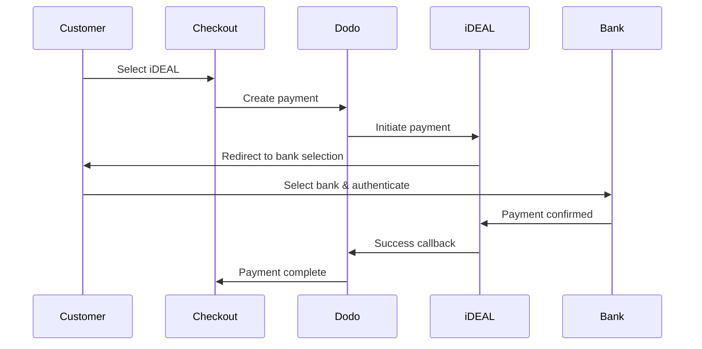

Khách hàng châu Âu ưu tiên mạnh mẽ các phương thức thanh toán địa phương tích hợp với hệ thống ngân hàng của họ. Cung cấp những phương thức này có thể tăng tỷ lệ chuyển đổi từ 20-40% ở các thị trường mục tiêu.

## Tại sao nên dùng phương thức thanh toán địa phương ở châu Âu?

<CardGroup cols={3}>
<Card title="Higher Conversion" icon="chart-line">
iDEAL chiếm khoảng 60% khoản thanh toán trực tuyến ở Hà Lan. Không cung cấp phương thức này đồng nghĩa với việc bỏ lỡ khách hàng.
</Card>

<Card title="Lower Fraud" icon="shield-check">
Thanh toán xác thực bởi ngân hàng có tỷ lệ gian lận gần như bằng 0 và không có chargebacks.
</Card>

<Card title="Real-Time Settlement" icon="bolt">
Hầu hết phương thức châu Âu cung cấp xác nhận thanh toán tức thì.
</Card>
</CardGroup>

## Các phương thức được hỗ trợ

| Phương thức | Quốc gia | Thị phần | Tiền tệ | Đăng ký định kỳ |
| :----------- | :-------- | :-------- | :------ | :--------------: |
| **iDEAL** | Hà Lan | ~60% | EUR | Không |
| **Bancontact** | Bỉ | ~50% | EUR | Không |
| **EPS** | Áo | ~30% | EUR | Không |
| **Multibanco** | Bồ Đào Nha | ~40% | EUR | Không |

## iDEAL (Hà Lan)

iDEAL là phương thức thanh toán trực tuyến chiếm ưu thế ở Hà Lan, kết nối trực tiếp với tất cả ngân hàng lớn của Hà Lan.

### Cách nó hoạt động



### Ngân hàng được hỗ trợ

All major Dutch banks are supported:
- ABN AMRO
- ASN Bank
- Bunq
- ING
- Knab
- Rabobank
- RegioBank
- Revolut
- SNS
- Triodos Bank
- Van Lanschot

### Cấu hình

```javascript
const session = await client.checkoutSessions.create({
  product_cart: [{ product_id: 'prod_123', quantity: 1 }],
  allowed_payment_method_types: ['ideal', 'credit', 'debit'],
  billing_currency: 'EUR',
  billing_address: {
    country: 'NL',
    zipcode: '1012JS'
  },
  return_url: 'https://example.com/success'
});
```

## Bancontact (Bỉ)

Bancontact là hệ thống thanh toán quốc gia của Bỉ, được hầu hết ngân hàng Bỉ sử dụng cho các giao dịch trực tuyến.

### Tính năng
- Tương thích với thẻ ghi nợ Bỉ hiện có
- Hỗ trợ ứng dụng di động (Payconiq của Bancontact)
- Xác nhận thanh toán tức thì
- Khách hàng không cần đăng ký thêm

### Cấu hình

```javascript
const session = await client.checkoutSessions.create({
  product_cart: [{ product_id: 'prod_123', quantity: 1 }],
  allowed_payment_method_types: ['bancontact_card', 'credit', 'debit'],
  billing_currency: 'EUR',
  billing_address: {
    country: 'BE',
    zipcode: '1000'
  },
  return_url: 'https://example.com/success'
});
```

## EPS (Áo)

EPS (Tiêu chuẩn Thanh toán Điện tử) cho phép chuyển khoản ngân hàng trực tuyến trực tiếp cho khách hàng Áo.

### Tính năng
- Tích hợp trực tiếp với các ngân hàng Áo
- Xác nhận thanh toán theo thời gian thực
- Độ tin cậy cao trong người tiêu dùng Áo
- Không có chargebacks

### Ngân hàng hỗ trợ

Major Austrian banks including:
- Erste Bank
- Bank Austria
- Raiffeisen
- BAWAG
- Volksbank

### Cấu hình

```javascript
const session = await client.checkoutSessions.create({
  product_cart: [{ product_id: 'prod_123', quantity: 1 }],
  allowed_payment_method_types: ['eps', 'credit', 'debit'],
  billing_currency: 'EUR',
  billing_address: {
    country: 'AT',
    zipcode: '1010'
  },
  return_url: 'https://example.com/success'
});
```

## Multibanco (Bồ Đào Nha)

Multibanco là mạng lưới ngân hàng liên minh của Bồ Đào Nha, cung cấp cả thanh toán trực tuyến và thanh toán qua cây ATM.

### Tùy chọn thanh toán

1. **Online Banking** — Chuyển khoản trực tiếp qua ngân hàng trực tuyến
2. **ATM Payment** — Khách hàng nhận mã tham chiếu để trả tại bất kỳ cây ATM Multibanco nào
3. **Mobile Banking** — Thanh toán qua ứng dụng di động của ngân hàng

### Cách thanh toán qua ATM hoạt động

Với thanh toán ATM, khách hàng nhận được mã tham chiếu thanh toán:

```
Entity: 12345
Reference: 123 456 789
Amount: €50.00
Expiry: 24 hours
```

Khách hàng có thể thanh toán tại bất kỳ cây ATM nào ở Bồ Đào Nha hoặc qua ngân hàng trực tuyến bằng mã này.

### Cấu hình

```javascript
const session = await client.checkoutSessions.create({
  product_cart: [{ product_id: 'prod_123', quantity: 1 }],
  allowed_payment_method_types: ['multibanco', 'credit', 'debit'],
  billing_currency: 'EUR',
  billing_address: {
    country: 'PT',
    zipcode: '1000-001'
  },
  return_url: 'https://example.com/success'
});
```

<Note>
Thanh toán qua ATM Multibanco có thể bị trễ giữa lúc thanh toán và khi thực sự ghi nhận. Theo dõi webhook để xác nhận thanh toán.
</Note>

## Các loại phương thức API

| Loại | Phương thức | Quốc gia |
| :--- | :--------- | :------- |
| `ideal` | iDEAL | Hà Lan |
| `bancontact_card` | Bancontact | Bỉ |
| `eps` | EPS | Áo |
| `multibanco` | Multibanco | Bồ Đào Nha |

## Thanh toán nhiều quốc gia ở châu Âu

Đối với doanh nghiệp phục vụ nhiều quốc gia châu Âu, hãy đưa vào tất cả các phương thức khu vực:

```javascript
const session = await client.checkoutSessions.create({
  product_cart: [{ product_id: 'prod_123', quantity: 1 }],
  allowed_payment_method_types: [
    'ideal',           // Netherlands
    'bancontact_card', // Belgium
    'eps',             // Austria
    'multibanco',      // Portugal
    'credit',          // Fallback
    'debit'            // Fallback
  ],
  billing_currency: 'EUR',
  return_url: 'https://example.com/success'
});
```

Dodo tự động chỉ hiển thị các phương thức phù hợp theo vị trí khách hàng. Khách hàng Hà Lan sẽ thấy iDEAL; khách hàng Bỉ sẽ thấy Bancontact.

## Kiểm tra

Các phương thức thanh toán châu Âu có thể được thử nghiệm trong chế độ sandbox. Luồng kiểm tra mô phỏng quá trình xác thực của ngân hàng.

<Steps>
<Step title="Enable test mode">
Sử dụng khóa API thử nghiệm của Dodo Payments.
</Step>

<Step title="Set appropriate billing address">
Đặt quốc gia trong địa chỉ thanh toán khớp với phương thức thanh toán:
- `NL` cho iDEAL
- `BE` cho Bancontact
- `AT` cho EPS
- `PT` cho Multibanco
</Step>

<Step title="Complete the test flow">
Làm theo luồng xác thực ngân hàng mô phỏng trong môi trường kiểm tra.
</Step>
</Steps>

## Thực hành tốt nhất

<AccordionGroup>
<Accordion title="Always include regional methods for target markets">
Nếu bạn bán hàng cho khách Hà Lan, hãy thêm iDEAL. Không làm vậy giống như không chấp nhận Visa ở Mỹ — bạn sẽ mất doanh số đáng kể.
</Accordion>

<Accordion title="Match currency to region">
Các phương thức thanh toán châu Âu yêu cầu EUR. Đảm bảo chiến lược giá của bạn hỗ trợ giao dịch bằng Euro.
</Accordion>

<Accordion title="Handle redirects gracefully">
Tất cả các phương thức châu Âu đều yêu cầu chuyển hướng đến trang ngân hàng. Đảm bảo xử lý URL trả về của bạn vững chắc và tính đến người dùng bỏ ngang giữa chừng.
</Accordion>

<Accordion title="Provide card fallbacks">
Không phải tất cả khách hàng châu Âu đều có quyền truy cập vào các phương thức khu vực này (khách du lịch, người nước ngoài định cư, v.v.). Luôn bao gồm `credit` và `debit` làm phương án dự phòng.
</Accordion>

<Accordion title="Consider Multibanco timing">
Thanh toán ATM Multibanco có thể mất vài giờ để hoàn tất. Đừng chặn xử lý đơn hàng chờ thanh toán ngay lập tức — hãy dùng webhook để xác nhận không đồng bộ.
</Accordion>
</AccordionGroup>

## Khắc phục sự cố

<AccordionGroup>
<Accordion title="European method not appearing">
**Kiểm tra:**
1. Quốc gia trong địa chỉ thanh toán của khách hàng có trùng với quốc gia của phương thức không?
2. Tiền tệ đã đặt là EUR chưa?
3. Phương thức có được bao gồm trong `allowed_payment_method_types` không?

**Giải pháp:** Các phương thức châu Âu mang tính khu vực nghiêm ngặt. Khách hàng có quốc gia thanh toán `DE` (Đức) sẽ không thấy iDEAL, vốn chỉ dành cho Hà Lan.
</Accordion>

<Accordion title="Bank authentication failed">
**Nguyên nhân:**
- Khách hàng hủy trong quá trình xác thực ngân hàng
- Hệ thống xác thực của ngân hàng tạm thời không khả dụng
- Khách hàng nhập thông tin đăng nhập sai

**Giải pháp:** Khách hàng nên thử lại. Nếu vẫn xảy ra, đề xuất chuyển sang phương thức khác.
</Accordion>

<Accordion title="Redirect not completing">
**Nguyên nhân:**
- Khách hàng đóng trình duyệt trong quá trình chuyển hướng tới ngân hàng
- Sự cố mạng trong lúc xác thực
- URL trả về cấu hình sai

**Giải pháp:** Xác minh URL trả về là chính xác và có thể truy cập. Đảm bảo nó xử lý cả trạng thái thành công và thất bại.
</Accordion>

<Accordion title="Multibanco payment pending">
**Nguyên nhân:** Khách hàng đã nhận mã tham chiếu thanh toán nhưng chưa thực hiện trả tiền.

**Giải pháp:** Đây là điều bình thường đối với thanh toán qua ATM. Chờ xác nhận qua webhook. Mã tham chiếu thường hết hạn sau 24-72 giờ.
</Accordion>
</AccordionGroup>

## Tuân thủ PSD2

Tất cả phương thức thanh toán châu Âu đều tuân thủ các quy định PSD2 (Chỉ thị dịch vụ thanh toán 2):

- **Strong Customer Authentication (SCA)** — Được tích hợp trong luồng xác thực ngân hàng
- **Secure Communication** — Tất cả dữ liệu truyền qua các kênh an toàn
- **Consumer Protection** — Tuân thủ đầy đủ quyền lợi người tiêu dùng của EU

## Trang liên quan

<CardGroup cols={2}>
<Card title="Payment Methods Overview" icon="credit-card" href="/features/payment-methods">
Xem tất cả các phương thức thanh toán được hỗ trợ.
</Card>

<Card title="Adaptive Currency" icon="globe" href="/features/adaptive-currency">
Hỗ trợ tiền tệ và chuyển đổi tự động.
</Card>

<Card title="Checkout Guide" icon="book" href="/developer-resources/checkout-session">
Hướng dẫn triển khai thanh toán đầy đủ.
</Card>

<Card title="Webhooks" icon="webhook" href="/developer-resources/webhooks">
Xử lý xác nhận thanh toán không đồng bộ.
</Card>
</CardGroup>