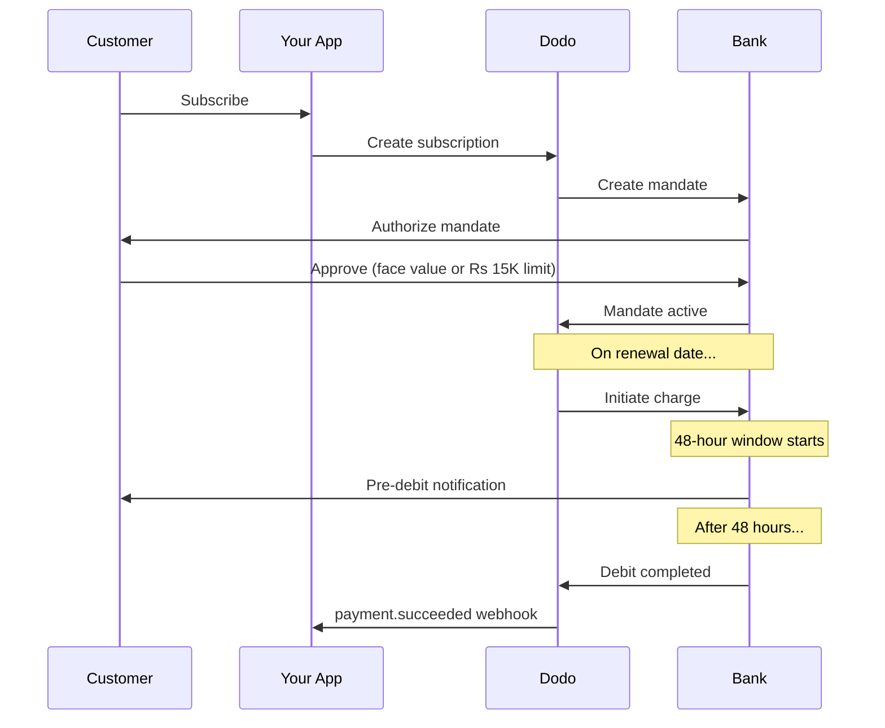

Ấn Độ có cơ sở hạ tầng thanh toán độc đáo do UPI chiếm ưu thế (hơn 60% giao dịch kỹ thuật số) và thẻ Rupay. Dodo Payments hỗ trợ cả hai với đầy đủ tuân thủ RBI cho các ủy quyền đăng ký định kỳ.

## Tại sao các phương thức thanh toán ở Ấn Độ lại quan trọng

<CardGroup cols={3}>
<Card title="UPI Dominance" icon="mobile">
UPI xử lý hơn 10 tỷ giao dịch mỗi tháng. Nhiều khách hàng Ấn Độ không có thẻ quốc tế.
</Card>

<Card title="Low Transaction Costs" icon="indian-rupee-sign">
UPI gần như không có phí giao dịch. Rất phù hợp cho các giao dịch lớn về số lượng nhưng giá trị thấp.
</Card>

<Card title="Subscription Support" icon="repeat">
Không giống hầu hết các phương thức thanh toán thay thế, UPI và Rupay hỗ trợ thanh toán định kỳ thông qua các ủy quyền của RBI.
</Card>
</CardGroup>

## Các phương thức được hỗ trợ

| Phương thức | Loại | Đăng ký định kỳ | Số tiền tối thiểu |
| :---------- | :--- | :--------------: | :-------------- |
| **UPI Collect** | Mã QR / VPA | Có* | ₹1 |
| **Rupay Credit** | Thẻ | Có* | ₹1 |
| **Rupay Debit** | Thẻ | Có* | ₹1 |

*Các gói đăng ký yêu cầu ủy quyền tuân thủ RBI với quy tắc xử lý đặc biệt.

## Cấu hình

### Các loại phương thức API

| Loại | Mô tả |
| :--- | :----- |
| `upi_collect` | UPI qua mã QR hoặc nhập VPA |
| `credit` | Thẻ tín dụng bao gồm Rupay |
| `debit` | Thẻ ghi nợ bao gồm Rupay |

### Ví dụ: Thanh toán tập trung vào Ấn Độ

```javascript
const session = await client.checkoutSessions.create({
  product_cart: [{ product_id: 'prod_123', quantity: 1 }],
  allowed_payment_method_types: [
    'upi_collect',
    'credit',
    'debit'
  ],
  billing_currency: 'INR',
  customer: {
    email: 'customer@example.in',
    name: 'Priya Sharma',
    phone_number: '+919876543210'
  },
  billing_address: {
    country: 'IN',
    zipcode: '560001'
  },
  return_url: 'https://example.com/success'
});
```

### Yêu cầu đối với UPI

Để UPI hiển thị ở trang thanh toán:
1. **Quốc gia thanh toán** phải là Ấn Độ (`IN`)
2. **Tiền tệ** phải là INR
3. Đối với nhà bán hàng không phải người Ấn Độ: **Adaptive Currency** phải được bật

<Warning>
Nếu bạn là nhà bán hàng không phải Ấn Độ và Adaptive Currency không được bật, UPI sẽ không khả dụng cho khách hàng của bạn.
</Warning>

## Đăng ký với các ủy quyền của RBI

Các gói đăng ký sử dụng phương thức thanh toán Ấn Độ hoạt động theo quy định của RBI (Ngân hàng Dự trữ Ấn Độ) với các yêu cầu riêng biệt.

### Cách hoạt động của ủy quyền RBI



### Các loại ủy quyền

| Số tiền đăng ký | Loại ủy quyền | Giới hạn |
| :-------------- | :----------- | :----- |
| **Dưới Rs 15,000** | Ủy quyền theo yêu cầu | Rs 15,000 |
| **Rs 15,000 trở lên** | Ủy quyền số tiền cố định | Số tiền chính xác của đăng ký |

**Quan trọng khi thay đổi gói:** Nếu nâng cấp dẫn đến một khoản phí vượt quá giới hạn của ủy quyền hiện tại, giao dịch sẽ thất bại và khách hàng phải cấp quyền lại.

### Độ trễ xử lý 48 giờ

Đây là khác biệt quan trọng nhất so với thẻ quốc tế:

<Steps>
<Step title="Charge Initiated (Day 0)">
Vào ngày gia hạn theo lịch, Dodo bắt đầu gửi yêu cầu tính phí đến ngân hàng.
</Step>

<Step title="Pre-Debit Notification">
Khách hàng nhận được thông báo từ ngân hàng về khoản ghi nợ sắp tới.
</Step>

<Step title="48-Hour Window">
Khách hàng có thể hủy ủy quyền trong khoảng thời gian này qua ứng dụng ngân hàng của họ.
</Step>

<Step title="Debit Completed (~48-51 hours)">
Sau 48 giờ (cộng thêm đến 3 giờ bổ sung để ngân hàng xử lý), số tiền mới bị trừ.
</Step>

<Step title="Webhook Sent">
`payment.succeeded` webhook được gửi sau khi khoản ghi nợ thực sự xảy ra, không phải khi bắt đầu.
</Step>
</Steps>

<Warning>
**Đừng cấp quyền lợi khi bắt đầu tính phí.** Hãy chờ webhook `payment.succeeded`, được gửi khoảng 48-51 giờ sau ngày tính phí dự kiến.
</Warning>

### Xử lý khoảng thời gian 48 giờ

```javascript
// DON'T do this:
async function handleSubscriptionRenewal(subscription) {
  // ❌ Bad: Granting access immediately when charge is initiated
  grantPremiumAccess(subscription.customer_id);
}

// DO this:
async function handlePaymentWebhook(event) {
  if (event.type === 'payment.succeeded') {
    // ✅ Good: Only grant access after payment is confirmed
    grantPremiumAccess(event.data.customer_id);
  }
  
  if (event.type === 'payment.failed') {
    // Handle failed payment (mandate cancelled, insufficient funds)
    revokePremiumAccess(event.data.customer_id);
  }
}
```

### Các sự kiện webhook cho đăng ký tại Ấn Độ

| Sự kiện | Khi nào | Hành động |
| :------ | :----- | :-------- |
| `subscription.created` | Ủy quyền được cấp | Ghi nhận bắt đầu đăng ký |
| `payment.succeeded` | Khoảng ~48 giờ sau ngày tính phí | Cấp/tiếp tục quyền truy cập |
| `payment.failed` | Ghi nợ thất bại | Thông báo khách hàng, tạm dừng quyền truy cập |
| `subscription.on_hold` | Thanh toán thất bại | Yêu cầu cập nhật phương thức thanh toán |
| `subscription.active` | Kích hoạt lại sau khi thanh toán | Khôi phục quyền truy cập |

## Kiểm tra

### ID thử nghiệm UPI

| Trạng thái | ID UPI |
| :-------- | :----- |
| Thành công | `success@upi` |
| Thất bại | `failure@upi` |

### Số thẻ thử nghiệm Ấn Độ

| Thương hiệu | Tình huống | Số thẻ | Hạn sử dụng | CVV |
| :------ | :-------- | :-------- | :----------- | :--- |
| Visa | Thành công | `4576238912771450` | 06/32 | 123 |
| Visa | Từ chối | `4706131211212123` | 06/32 | 123 |
| Mastercard | Thành công | `5409162669381034` | 06/32 | 123 |
| Mastercard | Từ chối | `5105105105105100` | 06/32 | 123 |

## Thực hành tốt nhất

<AccordionGroup>
<Accordion title="Plan for the 48-hour delay">
Xây dựng ứng dụng của bạn để xử lý khoảng cách giữa thời điểm bắt đầu tính phí và khi thanh toán thực sự xảy ra. Cân nhắc:
- Khoảng thời gian ân hạn cho quyền truy cập đăng ký
- Giao tiếp rõ ràng với khách hàng về thời gian xử lý
- Hoạt động dựa trên webhook, không dựa trên ngày tháng
</Accordion>

<Accordion title="Handle mandate cancellations">
Khách hàng có thể hủy ủy quyền qua ứng dụng ngân hàng bất cứ lúc nào. Giám sát webhook `subscription.on_hold` và nhắc khách hàng đăng ký lại hoặc cập nhật phương thức thanh toán.
</Accordion>

<Accordion title="Set appropriate mandate amounts">
Với giá biến đổi (ví dụ: tính theo mức sử dụng), hãy cân nhắc liệu ủy quyền theo yêu cầu Rs 15.000 có đủ không. Nếu các khoản phí có thể vượt quá mức này, khách hàng sẽ phải cấp quyền lại.
</Accordion>

<Accordion title="Offer UPI prominently">
Đối với khách hàng Ấn Độ, UPI nên là tùy chọn thanh toán chính. Nhiều người dùng ưa thích nó hơn thẻ do quen thuộc và ít rủi ro.
</Accordion>
</AccordionGroup>

## Khắc phục sự cố

<AccordionGroup>
<Accordion title="UPI not appearing at checkout">
**Kiểm tra:**
1. Quốc gia thanh toán đã đặt thành `IN`?
2. Tiền tệ đã đặt thành `INR`?
3. Nếu là nhà bán hàng không phải Ấn Độ: Adaptive Currency đã bật?
4. `upi_collect` có được bao gồm trong `allowed_payment_method_types` không?

**Giải pháp:** Xác minh địa chỉ thanh toán có `country: "IN"` và `billing_currency: "INR"`.
</Accordion>

<Accordion title="Subscription charge failed after upgrade">
**Nguyên nhân:** Số tiền tính phí mới vượt quá giới hạn ủy quyền hiện tại (ngưỡng Rs 15.000).

**Giải pháp:** Khách hàng phải cập nhật phương thức thanh toán để thiết lập ủy quyền mới với giới hạn chính xác.
</Accordion>

<Accordion title="Subscription on hold but customer claims they didn't cancel">
**Nguyên nhân:** Có thể khách hàng đã hủy ủy quyền trong khoảng thời gian 48 giờ hoặc ngân hàng từ chối ghi nợ.

**Giải pháp:** Khách hàng cần cấp quyền lại hoặc cập nhật phương thức thanh toán.
</Accordion>

<Accordion title="Payment deduction delayed beyond 48 hours">
**Nguyên nhân:** Độ trễ API của ngân hàng có thể kéo dài thêm 2-3 giờ.

**Giải pháp:** Đây là điều mong đợi. Hãy xây dựng hệ thống để xử lý độ trễ biến động lên đến khoảng 51 giờ tổng cộng.
</Accordion>

<Accordion title="Mandate cancelled but subscription still active">
**Nguyên nhân:** Trường hợp đặc biệt trong quy định của RBI — hủy ủy quyền trong khoảng thời gian xử lý không ngay lập tức hủy đăng ký.

**Giải pháp:** Lần tính phí tiếp theo sẽ thất bại và đăng ký sẽ chuyển sang `on_hold`. Giám sát webhook cho `payment.failed`.
</Accordion>
</AccordionGroup>

## Các trang liên quan

<CardGroup cols={2}>
<Card title="Payment Methods Overview" icon="credit-card" href="/features/payment-methods">
Xem tất cả các phương thức thanh toán được hỗ trợ.
</Card>

<Card title="Subscriptions" icon="repeat" href="/features/subscription">
Hoàn chỉnh tài liệu đăng ký định kỳ bao gồm các ủy quyền RBI.
</Card>

<Card title="Webhooks" icon="webhook" href="/developer-resources/webhooks">
Xử lý webhook cho các sự kiện thanh toán.
</Card>

<Card title="Testing Process" icon="flask" href="/miscellaneous/testing-process">
Tất cả dữ liệu thử nghiệm bao gồm ID UPI và thẻ Ấn Độ.
</Card>
</CardGroup>