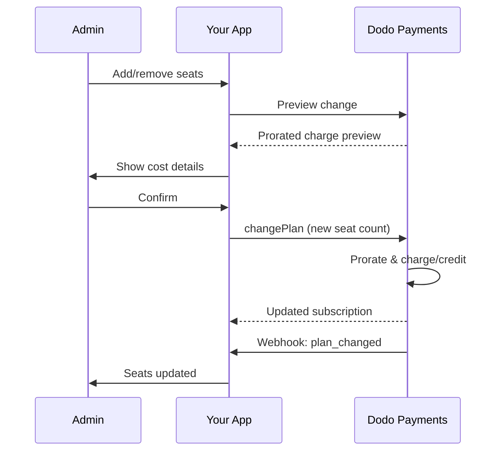

<Info>
Thanh toán theo số chỗ ngồi cho phép bạn tính phí khách hàng dựa trên số người dùng, thành viên nhóm hoặc giấy phép họ cần. Đây là mô hình định giá tiêu chuẩn cho công cụ cộng tác nhóm, phần mềm doanh nghiệp và các sản phẩm SaaS B2B.
</Info>

<CardGroup cols={2}>
{/* LOCKED_PATTERN_5dfc50fd981c1ac3b2cf0747476bb603 */}
  Hướng dẫn từng bước kèm ví dụ mã.
</Card>

{/* LOCKED_PATTERN_30543381f1fd7c60d748be8f75d9f37b */}
  Tìm hiểu về hệ thống bổ trợ hỗ trợ thanh toán theo chỗ ngồi.
</Card>

{/* LOCKED_PATTERN_d4eae9dc8961f74fa117678acde32bcf */}
  Quản lý đăng ký theo chỗ ngồi và thay đổi gói.
</Card>

<Card title="Webhooks" icon="bell" href="/developer-resources/webhooks/intents/subscription">
  Theo dõi thay đổi chỗ ngồi bằng webhook đăng ký.
</Card>
</CardGroup>

---

## Thanh Toán Theo Số Ghế Là Gì?

Thanh toán theo số ghế (còn gọi là định giá theo người dùng hoặc theo ghế) tính phí khách hàng dựa trên số lượng người dùng truy cập sản phẩm của bạn. Thay vì một khoản phí cố định, giá sẽ thay đổi theo kích thước nhóm.

### Các Trường Hợp Sử Dụng Thông Dụng

| Ngành | Ví dụ | Mô Hình Định Giá |
|----------|---------|---------------|
| Hợp Tác Nhóm | Slack, Notion, Asana | Theo người dùng hoạt động/tháng |
| Công Cụ Phát Triển | GitHub, GitLab, Jira | Theo ghế/tháng |
| Phần Mềm CRM | Salesforce, HubSpot | Theo giấy phép người dùng |
| Công Cụ Thiết Kế | Figma, Canva | Theo ghế biên tập viên |
| Phần Mềm Bảo Mật | 1Password, Okta | Theo người dùng/tháng |
| Hội Nghị Trực Tuyến | Zoom, Teams | Theo giấy phép chủ trì |

### Lợi Ích Của Định Giá Theo Số Ghế

**Đối Với Doanh Nghiệp Của Bạn:**
- Doanh thu tự nhiên tăng khi khách hàng phát triển
- Định giá có thể dự đoán mà khách hàng có thể lập ngân sách
- Lộ trình nâng cấp rõ ràng từ cá nhân đến nhóm đến doanh nghiệp
- Giá trị trọn đời cao hơn khi các nhóm mở rộng

**Đối Với Khách Hàng Của Bạn:**
- Chỉ trả tiền cho những gì họ sử dụng
- Dễ hiểu và dự đoán chi phí
- Linh hoạt thêm/bớt người dùng khi cần
- Định giá công bằng phù hợp với kích thước nhóm

---

## Cách Thanh Toán Theo Số Ghế Hoạt Động Trong Dodo Payments

Dodo Payments triển khai thanh toán theo số ghế bằng cách sử dụng hệ thống **Tiện Ích**. Đây là cách hoạt động:

### Tổng Quan Kiến Trúc

Đăng ký Team Pro có giá 99 đô la mỗi tháng và bao gồm 5 chỗ ngồi. Nếu bạn có hơn 5 người dùng, bạn trả thêm 15 đô la mỗi tháng cho mỗi chỗ ngồi bổ sung.

Ví dụ, nếu nhóm của bạn cần 15 chỗ ngồi:
- Gói cơ bản: $99/tháng (bao gồm 5 chỗ ngồi)
- Bổ trợ: 10 chỗ ngồi dư × $15/tháng = $150/tháng
- Tổng chi phí hàng tháng: $99 + $150 = $249 cho 15 chỗ ngồi

### Các Thành Phần Chính

| Thành Phần | Mục Đích | Ví Dụ |
|-----------|---------|---------|
| Sản Phẩm Cơ Bản | Đăng ký cốt lõi với các ghế đã bao gồm | "Kế Hoạch Nhóm - $99/tháng (bao gồm 5 ghế)" |
| Tiện Ích Ghế | Phí theo ghế cho người dùng bổ sung | "Ghế Bổ Sung - $15/tháng mỗi ghế" |
| Số Lượng | Số ghế bổ sung đã mua | 10 ghế bổ sung |

---

## Chiến Lược Định Giá

Chọn chiến lược định giá theo số ghế phù hợp với doanh nghiệp của bạn:

### Chiến Lược 1: Cơ Bản + Tiện Ích Theo Ghế

Bao gồm một số ghế nhất định trong kế hoạch cơ bản, tính phí cho các ghế bổ sung.

**Ví Dụ:**

```
Starter Plan: $49/month
├── Includes: 3 seats
├── Extra seats: $10/month each
└── 8 total seats = $49 + (5 × $10) = $99/month
```

**Tốt nhất cho:** Các sản phẩm mà các nhóm nhỏ có thể hoạt động với đề nghị cơ bản.

### Chiến Lược 2: Định Giá Hoàn Toàn Theo Ghế

Tính phí một mức cố định cho mỗi ghế mà không có phí cơ bản.

**Ví Dụ:**

```
Per User: $12/month
├── 5 users = $60/month
├── 20 users = $240/month
└── 100 users = $1,200/month
```

**Triển Khai:** Đặt giá kế hoạch cơ bản là $0, chỉ sử dụng tiện ích ghế.

**Tốt nhất cho:** Định giá đơn giản, minh bạch; mô hình dựa trên mức sử dụng.

### Chiến Lược 3: Định Giá Ghế Theo Bậc

Các kế hoạch cơ bản khác nhau với các mức giá theo ghế khác nhau.

**Ví Dụ:**

```
Starter: $0/month base + $15/seat
├── Lower features, higher per-seat cost

Professional: $99/month base + $10/seat
├── More features, lower per-seat cost

Enterprise: $499/month base + $7/seat
└── All features, volume discount on seats
```

**Triển Khai:** Tạo các sản phẩm riêng biệt cho mỗi bậc với các mức giá tiện ích khác nhau.

**Tốt nhất cho:** Khuyến khích nâng cấp lên các bậc cao hơn; bán hàng doanh nghiệp.

### Chiến Lược 4: Gói Ghế

Bán ghế theo gói thay vì từng cái một.

**Ví Dụ:**

```
5-Seat Pack: $50/month ($10/seat)
10-Seat Pack: $80/month ($8/seat)
25-Seat Pack: $175/month ($7/seat)
```

**Triển Khai:** Tạo nhiều tiện ích cho các kích thước gói khác nhau.

**Tốt nhất cho:** Đơn giản hóa quyết định mua hàng; khuyến khích cam kết lớn hơn.

---

## Thiết Lập Thanh Toán Theo Số Ghế

### Bước 1: Lập Kế Hoạch Định Giá Của Bạn

Trước khi triển khai, xác định cấu trúc định giá của bạn:

<Steps>
{/* LOCKED_PATTERN_8f90ecc6ba09743be9ab340aa5a551cf */}
Quyết định những gì được bao gồm trong đăng ký cơ bản:
- Giá gốc (có thể là $0 cho mô hình chỉ tính theo chỗ ngồi)
- Số chỗ ngồi được bao gồm
- Các tính năng có trong cấp này
</Step>

{/* LOCKED_PATTERN_170e31746a3dd1fcece04ceccae9b797 */}
Xác định chi phí bổ trợ theo chỗ ngồi:
- Giá cho mỗi chỗ ngồi bổ sung
- Bất kỳ giảm giá theo khối lượng nào (qua nhiều bổ trợ)
- Số chỗ ngồi tối đa cho phép (nếu có)
</Step>

{/* LOCKED_PATTERN_8c15c36cd0c3272db0db1a96e4d332dc */}
Đồng bộ giá chỗ ngồi với chu kỳ thanh toán của bạn:
- Đăng ký hàng tháng → phí chỗ ngồi hàng tháng
- Đăng ký hàng năm → phí chỗ ngồi hàng năm (thường được giảm giá)
</Step>
</Steps>

### Bước 2: Tạo Tiện Ích Ghế

Trong bảng điều khiển Dodo Payments của bạn:

1. Điều hướng đến **Sản Phẩm** → **Tiện Ích**
2. Nhấp vào **Tạo Tiện Ích**
3. Cấu hình tiện ích:

| Trường | Giá Trị | Ghi Chú |
|-------|-------|-------|
| Tên | "Ghế Bổ Sung" hoặc "Thành Viên Nhóm" | Tên rõ ràng, thân thiện với người dùng |
| Mô Tả | "Thêm một thành viên nhóm khác vào không gian làm việc của bạn" | Giải thích những gì khách hàng nhận được |
| Giá | Giá theo ghế của bạn | ví dụ: $10.00 |
| Tiền Tệ | Phù hợp với sản phẩm cơ bản của bạn | Phải là cùng một loại tiền tệ |
| Danh Mục Thuế | Giống như sản phẩm cơ bản | Đảm bảo xử lý thuế nhất quán |

<Tip>
Tạo tên bổ trợ mô tả dễ hiểu trên hóa đơn. "Chỗ ngồi nhóm bổ sung" rõ ràng hơn "Bổ trợ chỗ ngồi" khi khách hàng xem hóa đơn.
</Tip>

### Bước 3: Tạo Sản Phẩm Đăng Ký Cơ Bản

Tạo sản phẩm đăng ký của bạn:

1. Điều hướng đến **Sản Phẩm** → **Tạo Sản Phẩm**
2. Chọn **Đăng Ký**
3. Cấu hình giá và chi tiết
4. Trong phần **Tiện Ích**, đính kèm tiện ích ghế của bạn

### Bước 4: Đính Kèm Tiện Ích Vào Sản Phẩm

Liên kết tiện ích ghế với đăng ký của bạn:

1. Chỉnh sửa sản phẩm đăng ký của bạn
2. Cuộn xuống phần **Tiện Ích**
3. Nhấp vào **Thêm Tiện Ích**
4. Chọn tiện ích ghế của bạn
5. Lưu thay đổi

<Check>
Sản phẩm đăng ký của bạn giờ hỗ trợ định giá theo chỗ ngồi. Khách hàng có thể mua bất kỳ số lượng chỗ ngồi bổ sung nào trong lúc thanh toán.
</Check>

---

## Quản Lý Ghế

### Thêm Ghế Vào Các Đăng Ký Mới

Khi tạo một phiên thanh toán, xác định số lượng ghế:

```typescript
const session = await client.checkoutSessions.create({
  product_cart: [{
    product_id: 'prod_team_plan',
    quantity: 1,
    addons: [{
      addon_id: 'addon_seat',
      quantity: 10  // 10 additional seats
    }]
  }],
  customer: { email: 'admin@company.com' },
  return_url: 'https://yourapp.com/success'
});
```

### Thay Đổi Số Ghế Trong Các Đăng Ký Hiện Tại

Sử dụng API Thay Đổi Kế Hoạch để điều chỉnh số ghế:

```typescript
// Add 5 more seats to existing subscription
await client.subscriptions.changePlan('sub_123', {
  product_id: 'prod_team_plan',
  quantity: 1,
  proration_billing_mode: 'prorated_immediately',
  addons: [{
    addon_id: 'addon_seat',
    quantity: 15  // New total: 15 additional seats
  }]
});
```

### Gỡ Bỏ Ghế

Để giảm số ghế, xác định số lượng thấp hơn:

```typescript
// Reduce from 15 to 8 additional seats
await client.subscriptions.changePlan('sub_123', {
  product_id: 'prod_team_plan',
  quantity: 1,
  proration_billing_mode: 'difference_immediately',
  addons: [{
    addon_id: 'addon_seat',
    quantity: 8  // Reduced to 8 additional seats
  }]
});
```

### Gỡ Bỏ Tất Cả Ghế Bổ Sung

Truyền một mảng tiện ích rỗng để gỡ bỏ tất cả tiện ích:

```typescript
// Remove all additional seats, keep only base plan seats
await client.subscriptions.changePlan('sub_123', {
  product_id: 'prod_team_plan',
  quantity: 1,
  proration_billing_mode: 'difference_immediately',
  addons: []  // Removes all add-ons
});
```

---

## Tính Toán Tỷ Lệ Cho Các Thay Đổi Ghế

Khi khách hàng thêm hoặc gỡ bỏ ghế giữa chu kỳ, tính toán tỷ lệ xác định cách họ được tính phí.



### Chế Độ Phân Bổ

| Chế độ | Thêm chỗ ngồi | Gỡ chỗ ngồi |
|------|-------------|----------------|
| `prorated_immediately` | Tính phí cho những ngày còn lại trong chu kỳ | Ghi có cho ngày chưa sử dụng |
| `difference_immediately` | Tính phí toàn bộ giá chỗ ngồi | Ghi có vào lần gia hạn tiếp theo |
| `full_immediately` | Tính phí toàn bộ giá chỗ ngồi, đặt lại chu kỳ thanh toán | Không có ghi có |

### Ví dụ về phân bổ

**Kịch bản: còn 15 ngày trong chu kỳ thanh toán, thêm 5 chỗ ngồi với giá $10/chỗ**

<Tabs>
<Tab title="prorated_immediately">

```
Prorated charge = ($10 × 5 seats) × (15 days / 30 days)
                = $50 × 0.5
                = $25 immediate charge
```

Khách hàng trả $25 ngay bây giờ, sau đó $50/tháng khi gia hạn.
</Tab>

<Tab title="difference_immediately">

```
Immediate charge = $10 × 5 seats = $50
```

Khách hàng trả toàn bộ $50 ngay bây giờ, bất kể vị trí chu kỳ.
</Tab>

<Tab title="full_immediately">

```
Immediate charge = Full subscription + add-ons
Billing cycle resets to today
```

Khách hàng trả toàn bộ số tiền, chu kỳ thanh toán mới bắt đầu.
</Tab>
</Tabs>

**Kịch bản: Gỡ 3 chỗ ngồi giữa chu kỳ với prorated_immediately**

```
Current: Team Plan ($99/month) + 10 extra seats × $10/seat = $199/month
Change: Remove 3 seats (10 → 7 extra seats) on day 20 of 30-day cycle
Remaining: 10 days

Credit for removed seats:
  = ($10 × 3 seats) × (10 days / 30 days)
  = $30 × 0.333
  = $10.00 credit

→ $10.00 credit added to subscription
→ Next renewal: $99 + (7 × $10) = $169.00/month
→ Credit auto-applies: $169.00 − $10.00 = $159.00 on next invoice
```

<Tip>
**Chọn chế độ phân bổ cho thay đổi chỗ ngồi**: Sử dụng `prorated_immediately` để tính phí công bằng theo ngày khi các nhóm thường xuyên điều chỉnh chỗ ngồi. Sử dụng `difference_immediately` để tính toán đơn giản hơn khi tính phí hoặc ghi có theo giá chỗ ngồi đầy đủ. Xem [Hướng dẫn phân bổ](/developer-resources/subscription-upgrade-downgrade#proration-modes) để biết so sánh chi tiết.
</Tip>

### Xem trước trước khi thay đổi

Luôn xem trước phân bổ trước khi thực hiện thay đổi:

```typescript
const preview = await client.subscriptions.previewChangePlan('sub_123', {
  product_id: 'prod_team_plan',
  quantity: 1,
  proration_billing_mode: 'prorated_immediately',
  addons: [{ addon_id: 'addon_seat', quantity: 20 }]
});

console.log('Immediate charge:', preview.immediate_charge.summary);
// Show customer: "Adding 5 seats will cost $25 today"
```

---

## Theo dõi chỗ ngồi bằng Webhook

Giám sát thay đổi chỗ ngồi bằng cách theo dõi webhook đăng ký:

### Các sự kiện liên quan

| Sự kiện | Khi được kích hoạt | Tình huống sử dụng |
|-------|----------------|----------|
| `subscription.active` | Đăng ký mới được kích hoạt | Cấp phát chỗ ngồi ban đầu |
| `subscription.plan_changed` | Chỗ ngồi được thêm/bớt | Cập nhật số chỗ ngồi trong ứng dụng của bạn |
| `subscription.renewed` | Đăng ký được gia hạn | Xác nhận số chỗ ngồi không đổi |
| `subscription.cancelled` | Đăng ký bị hủy | Hủy cấp tất cả chỗ ngồi |

### Ví dụ bộ xử lý webhook

```typescript
app.post('/webhooks/dodo', async (req, res) => {
  const event = req.body;

  switch (event.type) {
    case 'subscription.active':
      // New subscription - provision seats
      const seats = calculateTotalSeats(event.data);
      await provisionSeats(event.data.customer_id, seats);
      break;

    case 'subscription.plan_changed':
      // Seats changed - update access
      const newSeats = calculateTotalSeats(event.data);
      await updateSeatCount(event.data.subscription_id, newSeats);
      break;

    case 'subscription.cancelled':
      // Subscription cancelled - deprovision
      await deprovisionAllSeats(event.data.subscription_id);
      break;
  }

  res.json({ received: true });
});

function calculateTotalSeats(subscriptionData) {
  const baseSeats = 5;  // Included in plan
  const addonSeats = subscriptionData.addons?.reduce(
    (total, addon) => total + addon.quantity, 0
  ) || 0;
  return baseSeats + addonSeats;
}
```

---

## Thực thi giới hạn chỗ ngồi

Ứng dụng của bạn phải thực thi giới hạn chỗ ngồi. Dodo Payments theo dõi thanh toán, nhưng bạn kiểm soát quyền truy cập.

### Chiến lược thực thi

<Tabs>
{/* LOCKED_PATTERN_1d31b7e688044b0efbd19ad2d6fe35e3 */}
Ngăn chặn nghiêm ngặt việc thêm người dùng vượt quá số chỗ ngồi.

```typescript
async function inviteUser(teamId: string, email: string) {
  const team = await getTeam(teamId);
  const subscription = await getSubscription(team.subscriptionId);
  const totalSeats = calculateTotalSeats(subscription);
  const usedSeats = await countTeamMembers(teamId);

  if (usedSeats >= totalSeats) {
    throw new Error('No seats available. Please upgrade your plan.');
  }

  await sendInvitation(teamId, email);
}
```

</Tab>

{/* LOCKED_PATTERN_13b3f8c9c63e02e97bed8afbecbc9f91 */}
Cho phép vượt quá với cảnh báo và thời gian ân hạn.

```typescript
async function inviteUser(teamId: string, email: string) {
  const team = await getTeam(teamId);
  const { totalSeats, usedSeats } = await getSeatInfo(team);

  if (usedSeats >= totalSeats) {
    // Allow but flag for billing
    await flagOverage(teamId, usedSeats - totalSeats + 1);
    await notifyAdmin(team.adminEmail, 'You have exceeded your seat limit');
  }

  await sendInvitation(teamId, email);
}
```

</Tab>

{/* LOCKED_PATTERN_b053ebd757bb6327d33717eadf7a8f52 */}
Tự động thêm chỗ ngồi khi đạt giới hạn.

```typescript
async function inviteUser(teamId: string, email: string) {
  const team = await getTeam(teamId);
  const { totalSeats, usedSeats, subscriptionId } = await getSeatInfo(team);

  if (usedSeats >= totalSeats) {
    // Automatically add a seat
    await client.subscriptions.changePlan(subscriptionId, {
      product_id: team.productId,
      quantity: 1,
      proration_billing_mode: 'prorated_immediately',
      addons: [{ addon_id: 'addon_seat', quantity: totalSeats - baseSeats + 1 }]
    });

    await notifyAdmin(team.adminEmail, 'A new seat was added to your plan');
  }

  await sendInvitation(teamId, email);
}
```

</Tab>
</Tabs>

---

## Mẫu nâng cao

### Các loại chỗ ngồi khác nhau

Cung cấp các loại chỗ ngồi khác nhau với giá khác nhau:

```
Full Seats: $20/month - Full access to all features
View-Only Seats: $5/month - Read-only access
Guest Seats: $0/month - Limited external collaborator access
```

**Triển khai:** Tạo các bổ trợ riêng biệt cho từng loại chỗ ngồi.

```typescript
const session = await client.checkoutSessions.create({
  product_cart: [{
    product_id: 'prod_team_plan',
    quantity: 1,
    addons: [
      { addon_id: 'addon_full_seat', quantity: 10 },
      { addon_id: 'addon_viewer_seat', quantity: 25 },
      { addon_id: 'addon_guest_seat', quantity: 50 }
    ]
  }]
});
```

### Giảm giá theo chỗ ngồi hàng năm

Đề xuất định giá chỗ ngồi hàng năm được giảm giá:

```
Monthly: $15/seat/month
Annual: $12/seat/month (20% savings)
```

**Triển khai:** Tạo sản phẩm riêng cho gói hàng tháng và hàng năm với giá bổ trợ khác nhau.

### Yêu cầu tối thiểu về chỗ ngồi

Yêu cầu số chỗ ngồi tối thiểu cho một số gói:

```typescript
async function validateSeatCount(planId: string, seatCount: number) {
  const minimums = {
    'prod_starter': 1,
    'prod_team': 5,
    'prod_enterprise': 25
  };

  if (seatCount < minimums[planId]) {
    throw new Error(`${planId} requires at least ${minimums[planId]} seats`);
  }
}
```

---

## Thực hành tốt nhất

### Thực hành định giá tốt nhất

- **Giao tiếp rõ ràng**: Hiển thị giá theo chỗ ngồi nổi bật trên trang định giá của bạn
- **Chỗ ngồi được bao gồm**: Cân nhắc bao gồm một vài chỗ ngồi trong giá cơ bản để giảm ma sát
- **Giảm giá theo khối lượng**: Đưa ra mức giá theo chỗ ngồi thấp hơn cho đội lớn hơn để giành được hợp đồng doanh nghiệp
- **Ưu đãi hàng năm**: Giảm giá các gói hàng năm để cải thiện dòng tiền và giữ chân khách hàng

### Thực hành kỹ thuật tốt nhất

- **Bộ nhớ đệm số chỗ ngồi**: Lưu số chỗ ngồi đăng ký cục bộ để tránh gọi API mỗi lần yêu cầu
- **Đồng bộ định kỳ**: Đồng bộ số chỗ ngồi cục bộ với Dodo Payments qua API định kỳ
- **Xử lý lỗi**: Nếu việc thay đổi chỗ ngồi thất bại, hiển thị thông báo lỗi rõ ràng và tùy chọn thử lại
- **Dấu vết kiểm toán**: Ghi lại tất cả thay đổi chỗ ngồi để giải quyết tranh chấp thanh toán và tuân thủ

### Thực hành trải nghiệm người dùng tốt nhất

- **Phản hồi thời gian thực**: Hiển thị tác động chi phí ngay lập tức khi điều chỉnh chỗ ngồi
- **Bước xác nhận**: Yêu cầu xác nhận trước khi thay đổi thanh toán
- **Minh bạch phân bổ**: Giải thích rõ ràng các khoản phí phân bổ trước khi áp dụng
- **Giảm cấp dễ dàng**: Đừng làm khó việc giảm số chỗ ngồi (điều đó tạo dựng lòng tin)

---

## Xử lý sự cố

<AccordionGroup>
{/* LOCKED_PATTERN_4a54068c0366de7cd698037f63ad06d7 */}
**Triệu chứng**: Ứng dụng của bạn hiển thị số chỗ ngồi khác với đăng ký.

**Nguyên nhân**:
- Webhook không được nhận hoặc xử lý
- Điều kiện tranh chấp trong quá trình thay đổi chỗ ngồi
- Dữ liệu bộ nhớ đệm chưa được cập nhật

**Giải pháp**:
1. Triển khai bộ xử lý webhook cho `subscription.plan_changed`
2. Thêm nút "Đồng bộ với thanh toán" để lấy đăng ký hiện tại
3. Đặt TTL bộ nhớ đệm để đảm bảo làm mới định kỳ
</Accordion>

{/* LOCKED_PATTERN_62506e5aa738923207d9cef5cba18998 */}
**Triệu chứng**: Khách hàng bối rối vì số tiền tính giữa chu kỳ.

**Nguyên nhân**:
- Không truyền đạt rõ chế độ phân bổ
- Khách hàng không xem trước trước khi xác nhận

**Giải pháp**:
1. Luôn sử dụng `previewChangePlan` trước khi thực hiện thay đổi
2. Hiển thị phân tích rõ ràng: "Thêm X chỗ ngồi = $Y hôm nay (phân bổ cho Z ngày)"
3. Tài liệu chính sách phân bổ của bạn trong trung tâm trợ giúp
</Accordion>

{/* LOCKED_PATTERN_a0edc83ae355b61df85c2a2a9b2f2774 */}
**Triệu chứng**: Bổ trợ chỗ ngồi không khả dụng trong lúc thanh toán.

**Nguyên nhân**:
- Bổ trợ không được gắn với sản phẩm
- Bổ trợ bị lưu trữ hoặc xóa
- Sai lệch tiền tệ giữa sản phẩm và bổ trợ

**Giải pháp**:
1. Xác minh bổ trợ được gắn trong cài đặt sản phẩm
2. Kiểm tra trạng thái bổ trợ trong bảng điều khiển Bổ trợ
3. Đảm bảo tiền tệ khớp chính xác
</Accordion>

{/* LOCKED_PATTERN_a1ec125a9845064654c125fd57ed0115 */}
**Triệu chứng**: Khách hàng muốn giảm chỗ ngồi nhưng vẫn còn người dùng được gán.

**Giải pháp**:
1. Hiển thị những người dùng phải bị xoá trước khi giảm chỗ ngồi
2. Triển khai luồng công việc: Xóa người dùng → Giảm chỗ ngồi
3. Cân nhắc thời gian ân hạn trước khi thực thi giảm chỗ ngồi
</Accordion>
</AccordionGroup>

---

## Tài liệu liên quan

<CardGroup cols={2}>
{/* LOCKED_PATTERN_67d22b5654e273ff1785a13fd2a08eef */}
  Hướng dẫn triển khai đầy đủ với mã.
</Card>

{/* LOCKED_PATTERN_64b8932d6eae113337e408ad28c3e677 */}
  Hiểu rõ hệ thống bổ trợ.
</Card>

{/* LOCKED_PATTERN_61918d5684b68ec0c29a61927d4aac95 */}
  Xử lý các sửa đổi đăng ký.
</Card>

{/* LOCKED_PATTERN_a38ca2694c5ac00d14f82dd9641df0b4 */}
  Theo dõi sự kiện đăng ký.
</Card>
</CardGroup>
