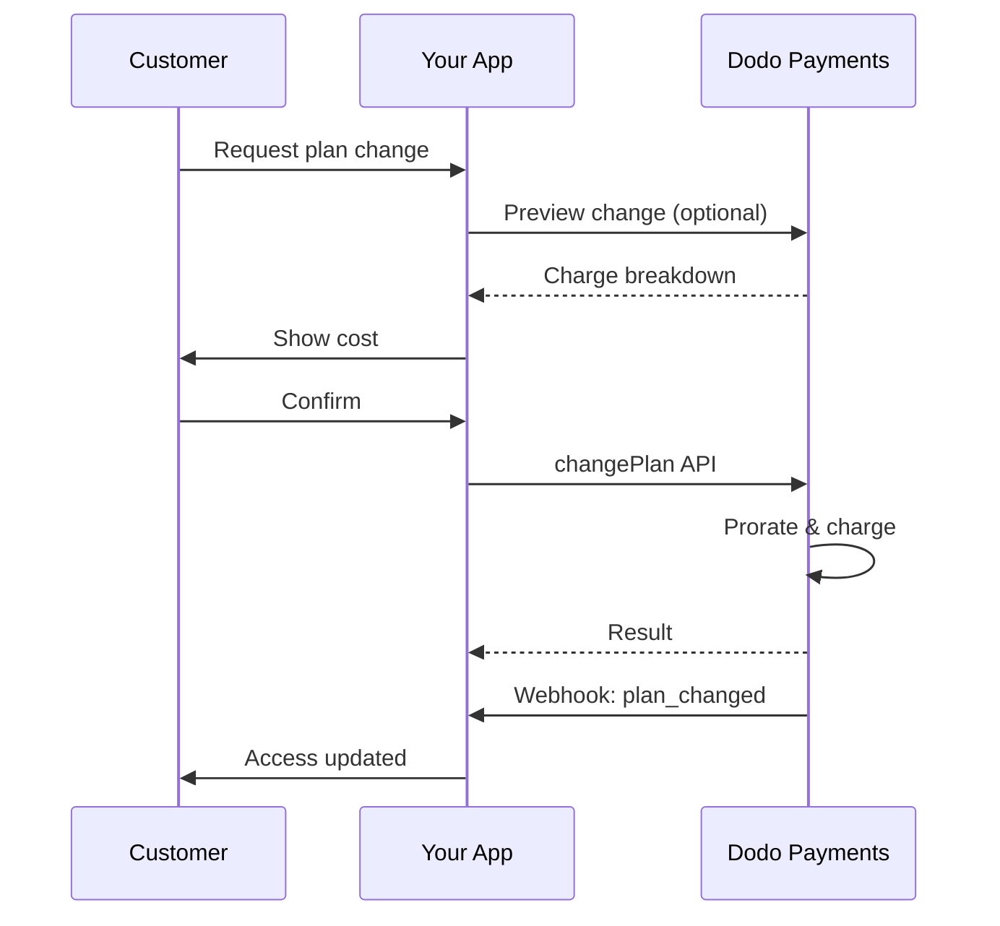
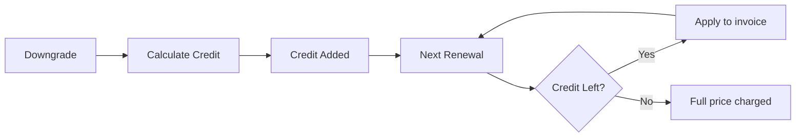

<Info>
Các gói đăng ký cho phép bạn bán quyền truy cập liên tục với việc tự động gia hạn. Sử dụng chu kỳ thanh toán linh hoạt, dùng thử miễn phí, thay đổi gói và tiện ích mở rộng để tùy chỉnh giá cho từng khách hàng.
</Info>

<CardGroup cols={2}>
<Card title="Upgrade & Downgrade" icon="repeat" href="/developer-resources/subscription-upgrade-downgrade">
Kiểm soát việc thay đổi gói với phân bổ tỷ lệ và cập nhật số lượng.
</Card>

<Card title="On‑Demand Subscriptions" icon="bolt" href="/developer-resources/ondemand-subscriptions">
Ủy quyền một ủy nhiệm ngay và tính phí sau với số tiền tùy chỉnh.
</Card>

<Card title="Customer Portal" icon="id-card" href="/features/customer-portal">
Cho khách hàng quản lý gói, thanh toán và hủy.
</Card>

<Card title="Subscription Webhooks" icon="code" href="/developer-resources/webhooks/intents/subscription">
Phản hồi các sự kiện vòng đời như tạo mới, gia hạn và hủy.
</Card>
</CardGroup>

## Đăng Ký Là Gì?

Đăng ký là các sản phẩm định kỳ mà khách hàng mua theo lịch trình. Chúng lý tưởng cho:

- **Giấy phép SaaS**: Ứng dụng, API hoặc quyền truy cập nền tảng
- **Thành viên**: Cộng đồng, chương trình hoặc câu lạc bộ
- **Nội dung kỹ thuật số**: Khóa học, phương tiện hoặc nội dung cao cấp
- **Kế hoạch hỗ trợ**: SLA, gói thành công hoặc bảo trì

## Lợi Ích Chính

- **Doanh thu dự đoán**: Thanh toán định kỳ với việc gia hạn tự động
- **Chu kỳ linh hoạt**: Hàng tháng, hàng năm, khoảng thời gian tùy chỉnh và thử nghiệm
- **Tính linh hoạt của kế hoạch**: Phân bổ cho nâng cấp và hạ cấp
- **Bổ sung và chỗ ngồi**: Gắn các nâng cấp tùy chọn, có thể định lượng
- **Thanh toán liền mạch**: Thanh toán được lưu trữ và cổng thông tin khách hàng
- **Ưu tiên cho nhà phát triển**: API rõ ràng cho việc tạo, thay đổi và theo dõi sử dụng

## Tạo Đăng Ký

Tạo các sản phẩm đăng ký trong bảng điều khiển Dodo Payments của bạn, sau đó bán chúng thông qua thanh toán hoặc API của bạn. Việc tách biệt các sản phẩm khỏi các đăng ký hoạt động cho phép bạn phiên bản giá, gắn bổ sung và theo dõi hiệu suất một cách độc lập.

### Tạo sản phẩm đăng ký

Cấu hình các trường trong bảng điều khiển để xác định cách sản phẩm đăng ký của bạn được bán, gia hạn và thanh toán. Các phần dưới đây tương ứng trực tiếp với những gì bạn thấy trong biểu mẫu tạo.

#### Chi tiết sản phẩm

- **Tên sản phẩm** (bắt buộc): Tên hiển thị được hiển thị trong thanh toán, cổng thông tin khách hàng và hóa đơn.
- **Mô tả sản phẩm** (bắt buộc): Một tuyên bố giá trị rõ ràng xuất hiện trong thanh toán và hóa đơn.
- **Hình ảnh sản phẩm** (bắt buộc): PNG/JPG/WebP tối đa 3 MB. Được sử dụng trên thanh toán và hóa đơn.
- **Thương hiệu**: Liên kết sản phẩm với một thương hiệu cụ thể để tạo chủ đề và email.
- **Danh mục thuế** (bắt buộc): Chọn danh mục (ví dụ: SaaS) để xác định quy tắc thuế.

<Tip>
Chọn danh mục thuế chính xác nhất để đảm bảo thu thuế đúng cho từng khu vực.
</Tip>

#### Giá cả

- **Loại giá**: Chọn <b>Đăng ký</b> (hướng dẫn này). Các lựa chọn thay thế là Thanh toán một lần và Thanh toán theo mức sử dụng.
- **Giá** (bắt buộc): Giá cơ bản định kỳ với đơn vị tiền tệ.
- **Giảm giá áp dụng (%)**: Phần trăm giảm giá tùy chọn áp dụng cho giá cơ bản; được phản ánh trong thanh toán và hóa đơn.
- **Lặp lại thanh toán mỗi** (bắt buộc): Khoảng thời gian cho việc gia hạn, ví dụ, mỗi 1 tháng. Chọn nhịp (tháng hoặc năm) và số lượng.
- **Thời gian đăng ký** (bắt buộc): Tổng thời gian mà đăng ký vẫn còn hiệu lực (ví dụ, 10 năm). Sau khi thời gian này kết thúc, việc gia hạn sẽ dừng lại trừ khi được gia hạn.
- **Số ngày thử nghiệm** (bắt buộc): Đặt độ dài thử nghiệm tính bằng ngày. Sử dụng 0 để vô hiệu hóa thử nghiệm. Khoản phí đầu tiên sẽ tự động xảy ra khi thử nghiệm kết thúc.
- **Chọn tiện ích bổ sung**: Gắn tối đa 10 tiện ích bổ sung mà khách hàng có thể mua cùng với gói cơ bản.

<Warning>
Thay đổi giá trên sản phẩm đang hoạt động ảnh hưởng đến những lần mua mới. Các đăng ký hiện có tuân theo cài đặt thay đổi gói và phân bổ tỷ lệ của bạn.
</Warning>

<Info>
Tiện ích mở rộng lý tưởng cho các phần bổ sung có thể định lượng như ghế ngồi hoặc dung lượng lưu trữ. Bạn có thể kiểm soát số lượng cho phép và hành vi phân bổ tỷ lệ khi khách hàng thay đổi chúng.
</Info>

#### Cài đặt nâng cao

- **Giá bao gồm thuế**: Hiển thị giá bao gồm thuế áp dụng. Tính toán thuế cuối cùng vẫn thay đổi theo vị trí của khách hàng.
- **Tạo khóa giấy phép**: Cấp một khóa duy nhất cho mỗi khách hàng sau khi mua. Xem hướng dẫn <a href="/features/license-keys">Khóa Giấy Phép</a>.
- **Giao hàng sản phẩm kỹ thuật số**: Giao tệp hoặc nội dung tự động sau khi mua. Tìm hiểu thêm trong <a href="/features/digital-product-delivery">Giao hàng sản phẩm kỹ thuật số</a>.
- **Siêu dữ liệu**: Gắn các cặp khóa–giá trị tùy chỉnh cho việc gán nhãn nội bộ hoặc tích hợp khách hàng. Xem <a href="/api-reference/metadata">Siêu dữ liệu</a>.

<Tip>
Dùng metadata để lưu các định danh từ hệ thống của bạn (ví dụ: accountId) để bạn có thể đối chiếu sự kiện và hóa đơn sau này.
</Tip>

## Thử Nghiệm Đăng Ký

Thử nghiệm cho phép khách hàng truy cập các đăng ký mà không cần thanh toán ngay lập tức. Khoản phí đầu tiên sẽ xảy ra tự động khi thử nghiệm kết thúc.

### Cấu Hình Thử Nghiệm

Đặt **Ngày dùng thử** trong phần định giá sản phẩm (dùng `0` để tắt). Bạn có thể ghi đè điều này khi tạo đăng ký:

```typescript
// Via subscription creation
const subscription = await client.subscriptions.create({
  customer_id: 'cus_123',
  product_id: 'prod_monthly',
  trial_period_days: 14  // Overrides product's trial period
});

// Via checkout session
const session = await client.checkoutSessions.create({
  product_cart: [{ product_id: 'prod_monthly', quantity: 1 }],
  subscription_data: { trial_period_days: 14 }
});
```

<Warning>
Giá trị `trial_period_days` phải nằm trong khoảng từ 0 đến 10.000 ngày.
</Warning>

### Phát Hiện Trạng Thái Thử Nghiệm

<Warning>
Hiện tại không có trường trực tiếp để phát hiện trạng thái dùng thử. Giải pháp sau đây yêu cầu truy vấn thanh toán, điều này không hiệu quả. Chúng tôi đang làm việc trên một giải pháp hiệu quả hơn.
</Warning>

Để xác định xem một đăng ký có đang trong thời gian thử nghiệm hay không, hãy lấy danh sách các khoản thanh toán cho đăng ký đó. Nếu có chính xác một khoản thanh toán với số tiền 0, thì đăng ký đang trong thời gian thử nghiệm:

```typescript
const subscription = await client.subscriptions.retrieve('sub_123');
const payments = await client.payments.list({
  subscription_id: subscription.subscription_id
});

// Check if subscription is in trial
const isInTrial = payments.items.length === 1 && 
                  payments.items[0].total_amount === 0;
```

### Cập Nhật Thời Gian Thử Nghiệm

Gia hạn thời gian dùng thử bằng cách cập nhật `next_billing_date`:

```typescript
await client.subscriptions.update('sub_123', {
  next_billing_date: '2025-02-15T00:00:00Z'  // New trial end date
});
```

<Warning>
Bạn không thể đặt `next_billing_date` thành thời điểm trong quá khứ. Ngày phải nằm trong tương lai.
</Warning>

## Thay Đổi Kế Hoạch Đăng Ký

Thay đổi kế hoạch cho phép bạn nâng cấp hoặc hạ cấp các đăng ký, điều chỉnh số lượng hoặc chuyển sang các sản phẩm khác. Mỗi thay đổi sẽ kích hoạt một khoản phí ngay lập tức dựa trên chế độ phân bổ mà bạn chọn.

<Tip>
Bạn có thể thay đổi gói đăng ký và cập nhật ngày thanh toán tiếp theo trực tiếp từ bảng điều khiển Dodo Payments. Điều này cung cấp cách nhanh để điều chỉnh đăng ký cho yêu cầu hỗ trợ khách hàng, nâng cấp khuyến mãi hoặc di cư gói mà không cần gọi API.
</Tip>

<Tip>
**Bật thay đổi gói tự phục vụ:** Muốn khách hàng tự nâng cấp hoặc hạ cấp đăng ký của họ qua Cổng Khách hàng? Thêm sản phẩm đăng ký của bạn vào Bộ sưu tập Sản phẩm và bật "Cho phép cập nhật đăng ký" trong Cài đặt Đăng ký.
</Tip>



<Card title="Product Collections" icon="layer-group" href="/features/product-collections">
  Nhóm các sản phẩm liên quan vào bộ sưu tập để cho phép đường dẫn nâng cấp/hạ cấp liền mạch trong Cổng Khách hàng.
</Card>

### Chế Độ Phân Bổ Tỷ Lệ

Chọn cách khách hàng bị tính phí khi thay đổi gói:

<Info>
**So sánh nhanh ba chế độ phân bổ tỷ lệ:**

| | `prorated_immediately` | `difference_immediately` | `full_immediately` |
|---|---|---|---|
| **Nâng cấp** | Tính phí tỷ lệ cho số ngày còn lại | Tính phần chênh lệch giá đầy đủ | Tính toàn bộ giá gói mới |
| **Hạ cấp** | Tín dụng tỷ lệ cho số ngày còn lại | Tính toàn bộ phần chênh lệch như tín dụng | Không có tín dụng, tính toàn bộ |
| **Chu kỳ thanh toán** | Giữ nguyên | Giữ nguyên | Đặt lại về hôm nay |
| **Tốt nhất cho** | Tính phí công bằng theo thời gian | Thay đổi cấp đơn giản | Đặt lại chu kỳ thanh toán |
</Info>

#### `prorated_immediately`
Tính phí số tiền theo tỷ lệ dựa trên thời gian còn lại trong chu kỳ thanh toán hiện tại. Tốt nhất cho việc tính phí công bằng dựa trên thời gian chưa sử dụng.

```typescript
await client.subscriptions.changePlan('sub_123', {
  product_id: 'prod_pro',
  quantity: 1,
  proration_billing_mode: 'prorated_immediately'
});
```

#### `difference_immediately`
Tính phần chênh lệch giá ngay lập tức (nâng cấp) hoặc thêm tín dụng cho các lần gia hạn sau (hạ cấp). Tốt nhất cho các tình huống nâng cấp/hạ cấp đơn giản.

```typescript
// Upgrade: charges $50 (difference between $30 and $80)
// Downgrade: credits remaining value, auto-applied to renewals
await client.subscriptions.changePlan('sub_123', {
  product_id: 'prod_pro',
  quantity: 1,
  proration_billing_mode: 'difference_immediately'
});
```

<Info>
Tín dụng từ việc hạ cấp dùng `difference_immediately` có phạm vi cho từng đăng ký và tự động áp dụng vào các lần gia hạn trong tương lai. Chúng khác với <a href="/features/customer-credit">Customer Credits</a>.
</Info>

Khi khách hàng hạ cấp với `difference_immediately`, giá trị chưa sử dụng sẽ trở thành tín dụng phạm vi đăng ký tự động bù vào các lần gia hạn trong tương lai:



#### `full_immediately`
Tính toàn bộ số tiền của gói mới ngay lập tức, bỏ qua thời gian còn lại. Tốt nhất để đặt lại chu kỳ thanh toán.

```typescript
await client.subscriptions.changePlan('sub_123', {
  product_id: 'prod_monthly',
  quantity: 1,
  proration_billing_mode: 'full_immediately'
});
```

<AccordionGroup>
<Accordion title="Example: Prorated upgrade calculation">

**Tình huống**: Khách hàng dùng Basic ($30/tháng) nâng cấp lên Pro ($80/tháng) vào ngày thứ 16 của chu kỳ 30 ngày với `prorated_immediately`.

```
Unused credit from Basic = $30 × (15 remaining / 30 total) = $15.00
Prorated cost of Pro     = $80 × (15 remaining / 30 total) = $40.00
────────────────────────────────────────────────────────────────────
Immediate charge         = $40.00 − $15.00 = $25.00
```

Gia hạn tiếp theo vào ngày thanh toán ban đầu: **$80.00/tháng**.

<Tip>
Để biết ví dụ tính toán chi tiết và các trường hợp đặc biệt, hãy xem [Hướng dẫn Nâng cấp & Hạ cấp](/developer-resources/subscription-upgrade-downgrade).
</Tip>

</Accordion>
<Accordion title="Example: Downgrade credit calculation">

**Tình huống**: Khách hàng dùng Pro ($80/tháng) hạ cấp xuống Starter ($20/tháng) dùng `difference_immediately`.

```
Credit = Old plan − New plan = $80 − $20 = $60.00
```

Tín dụng $60 tự động áp dụng cho các lần gia hạn tương lai:
- Gia hạn 1: $20 − $20 (tín dụng) = **$0.00** (còn $40 tín dụng)
- Gia hạn 2: $20 − $20 (tín dụng) = **$0.00** (còn $20 tín dụng)  
- Gia hạn 3: $20 − $20 (tín dụng) = **$0.00** (tín dụng đã hết)
- Gia hạn 4: **$20.00** (giá đầy đủ)

<Info>
Tìm hiểu thêm cách quản lý tín dụng trong [Hướng dẫn Nâng cấp & Hạ cấp](/developer-resources/subscription-upgrade-downgrade).
</Info>

</Accordion>
</AccordionGroup>

### Thay đổi Gói với Tiện ích Mở rộng

Thay đổi tiện ích mở rộng khi thay đổi gói. Tiện ích được bao gồm trong phép tính phân bổ tỷ lệ:

```typescript
await client.subscriptions.changePlan('sub_123', {
  product_id: 'prod_pro',
  quantity: 1,
  proration_billing_mode: 'difference_immediately',
  addons: [{ addon_id: 'addon_extra_seats', quantity: 2 }]  // Add add-ons
  // addons: []  // Empty array removes all existing add-ons
});
```

<Info>
Việc thay đổi gói kích hoạt các khoản phí ngay lập tức. Các khoản phí thất bại có thể đưa đăng ký vào trạng thái `on_hold`. Theo dõi thay đổi qua sự kiện webhook `subscription.plan_changed`.
</Info>

### Xem trước Việc thay đổi Gói

Trước khi xác nhận thay đổi gói, hãy xem trước khoản phí chính xác và đăng ký kết quả:

```typescript
const preview = await client.subscriptions.previewChangePlan('sub_123', {
  product_id: 'prod_pro',
  quantity: 1,
  proration_billing_mode: 'prorated_immediately'
});

// Show customer the charge before confirming
console.log('You will be charged:', preview.immediate_charge.summary);
```

<Card title="Preview Change Plan API" icon="eye" href="/api-reference/subscriptions/preview-change-plan">
  Xem trước thay đổi gói trước khi xác nhận.
</Card>

## Các Trạng thái Đăng ký

Đăng ký có thể ở các trạng thái khác nhau trong vòng đời:

- **`active`**: Đăng ký đang hoạt động và sẽ tự động gia hạn
- **`on_hold`**: Đăng ký bị tạm ngưng do thanh toán thất bại. Cần cập nhật phương thức thanh toán để kích hoạt lại
- **`cancelled`**: Đăng ký đã bị hủy và sẽ không được gia hạn
- **`expired`**: Đăng ký đã đến ngày kết thúc
- **`pending`**: Đăng ký đang được tạo hoặc xử lý

### Trạng thái Tạm ngưng

Một đăng ký chuyển sang trạng thái `on_hold` khi:

- Một khoản thanh toán gia hạn thất bại (không đủ tiền, thẻ hết hạn, v.v.)
- Một khoản phí thay đổi gói thất bại
- Ủy quyền phương thức thanh toán thất bại

<Warning>
Khi đăng ký ở trạng thái `on_hold`, nó sẽ không tự động gia hạn. Bạn phải cập nhật phương thức thanh toán để kích hoạt lại đăng ký.
</Warning>

### Kích hoạt lại từ Trạng thái Tạm ngưng

Để kích hoạt lại đăng ký từ trạng thái `on_hold`, cập nhật phương thức thanh toán. Việc này tự động:

1. Tạo một khoản phí cho số tiền còn nợ
2. Tạo hóa đơn
3. Xử lý thanh toán bằng phương thức mới
4. Kích hoạt lại đăng ký sang trạng thái `active` khi thanh toán thành công

```typescript
// Reactivate subscription from on_hold
const response = await client.subscriptions.updatePaymentMethod('sub_123', {
  type: 'new',
  return_url: 'https://example.com/return'
});

// For on_hold subscriptions, a charge is automatically created
if (response.payment_id) {
  console.log('Charge created:', response.payment_id);
  // Redirect customer to response.payment_link to complete payment
  // Monitor webhooks for payment.succeeded and subscription.active
}
```

<Info>
Sau khi cập nhật phương thức thanh toán thành công cho đăng ký `on_hold`, bạn sẽ nhận được sự kiện webhook `payment.succeeded` tiếp theo là `subscription.active`.
</Info>

## Quản lý API

<AccordionGroup>
<Accordion title="Create subscriptions">
Sử dụng `POST /subscriptions` để tạo đăng ký theo chương trình từ sản phẩm, với thử nghiệm và tiện ích mở rộng tùy chọn.
<Card title="API Reference" icon="code" href="/api-reference/subscriptions/post-subscriptions">
Xem API tạo đăng ký.
</Card>
</Accordion>

<Accordion title="Update subscriptions">
Sử dụng `PATCH /subscriptions/{id}` để cập nhật số lượng, hủy vào ngày thanh toán tiếp theo hoặc sửa metadata.
<Card title="API Reference" icon="code" href="/api-reference/subscriptions/patch-subscriptions">
Tìm hiểu cách cập nhật chi tiết đăng ký.
</Card>
</Accordion>

<Accordion title="Change plans (proration)">
Thay đổi sản phẩm đang dùng và số lượng với điều khiển phân bổ tỷ lệ.
<Card title="API Reference" icon="code" href="/api-reference/subscriptions/change-plan">
Xem lại các lựa chọn thay đổi gói.
</Card>
</Accordion>

<Accordion title="On‑demand charges">
Đối với đăng ký theo yêu cầu, tính phí số tiền cụ thể theo yêu cầu.
<Card title="API Reference" icon="code" href="/api-reference/subscriptions/create-charge">
Tính phí một đăng ký theo yêu cầu.
</Card>
</Accordion>

<Accordion title="List and retrieve">
Sử dụng `GET /subscriptions` để liệt kê tất cả đăng ký và `GET /subscriptions/{id}` để truy xuất một đăng ký.
<Card title="API Reference" icon="code" href="/api-reference/subscriptions/get-subscriptions">
Duyệt API liệt kê và truy xuất.
</Card>
</Accordion>

<Accordion title="Usage history">
Lấy dữ liệu sử dụng đã ghi nhận cho mô hình định giá theo mét hoặc kết hợp.
<Card title="API Reference" icon="code" href="/api-reference/subscriptions/get-usage-history">
Xem API lịch sử sử dụng.
</Card>
</Accordion>

<Accordion title="Update payment method">
Cập nhật phương thức thanh toán cho một đăng ký. Đối với đăng ký đang hoạt động, điều này cập nhật phương thức cho các lần gia hạn sau. Đối với đăng ký ở trạng thái `on_hold`, điều này kích hoạt lại đăng ký bằng cách tạo một khoản phí cho số dư còn lại.
<Card title="API Reference" icon="code" href="/api-reference/subscriptions/update-payment-method">
Tìm hiểu cách cập nhật phương thức thanh toán và kích hoạt lại đăng ký.
</Card>
</Accordion>
</AccordionGroup>

### Cập nhật phương thức thanh toán cho đăng ký đang hoạt động
Cập nhật phương thức thanh toán cho một đăng ký đang hoạt động:

```typescript
// Update with new payment method
const response = await client.subscriptions.updatePaymentMethod('sub_123', {
  type: 'new',
  return_url: 'https://example.com/return'
});

// Or use existing payment method
await client.subscriptions.updatePaymentMethod('sub_123', {
  type: 'existing',
  payment_method_id: 'pm_abc123'
});
```

### Kích hoạt lại đăng ký từ tạm dừng
Kích hoạt lại một đăng ký đã bị tạm dừng do thanh toán không thành công:

```typescript
// Update payment method - automatically creates charge for remaining dues
const response = await client.subscriptions.updatePaymentMethod('sub_123', {
  type: 'new',
  return_url: 'https://example.com/return'
});

if (response.payment_id) {
  // Charge created for remaining dues
  // Redirect customer to response.payment_link
  // Monitor webhooks: payment.succeeded → subscription.active
}
```

## Đăng ký với các mệnh lệnh tuân thủ RBI

  Đăng ký UPI và thẻ Ấn Độ hoạt động theo quy định của RBI (Ngân hàng Dự trữ Ấn Độ) với các yêu cầu mệnh lệnh cụ thể:

  ### Giới hạn mệnh lệnh

## Các Trường hợp Sử dụng Chung

- **SaaS và API**: Truy cập theo tầng với tiện ích mở rộng cho ghế ngồi hoặc sử dụng
- **Nội dung và truyền thông**: Truy cập hàng tháng với thử nghiệm giới thiệu
- **Gói hỗ trợ B2B**: Hợp đồng hàng năm với tiện ích hỗ trợ cao cấp
- **Công cụ và plugin**: Khóa giấy phép và phát hành theo phiên bản

## Ví dụ Tích hợp

### Phiên thanh toán (đăng ký)
Khi tạo phiên thanh toán, bao gồm sản phẩm đăng ký của bạn và tiện ích mở rộng tùy chọn:

```typescript
const session = await client.checkoutSessions.create({
  product_cart: [
    {
      product_id: 'prod_subscription',
      quantity: 1
    }
  ]
});
```

### Thay đổi gói với phân bổ tỷ lệ
Nâng cấp hoặc hạ cấp đăng ký và kiểm soát hành vi phân bổ tỷ lệ:

```typescript
await client.subscriptions.changePlan('sub_123', {
  product_id: 'prod_new',
  quantity: 1,
  proration_billing_mode: 'difference_immediately'
});
```

### Hủy vào ngày thanh toán tiếp theo
Lên lịch hủy có hiệu lực vào cuối kỳ thanh toán hiện tại:

```typescript
await client.subscriptions.update('sub_123', {
  cancel_at_next_billing_date: true
});
```

### Đăng ký theo yêu cầu
Tạo một đăng ký theo yêu cầu và tính phí sau khi cần:

```typescript
const onDemand = await client.subscriptions.create({
  customer_id: 'cus_123',
  product_id: 'prod_on_demand',
  on_demand: true
});

await client.subscriptions.createCharge(onDemand.id, {
  amount: 4900,
  currency: 'USD',
  description: 'Extra usage for September'
});
```

### Cập nhật phương thức thanh toán cho đăng ký đang hoạt động
Cập nhật phương thức thanh toán cho một đăng ký đang hoạt động:

```typescript
// Update with new payment method
const response = await client.subscriptions.updatePaymentMethod('sub_123', {
  type: 'new',
  return_url: 'https://example.com/return'
});

// Or use existing payment method
await client.subscriptions.updatePaymentMethod('sub_123', {
  type: 'existing',
  payment_method_id: 'pm_abc123'
});
```

### Kích hoạt lại đăng ký từ on_hold
Kích hoạt lại một đăng ký bị tạm ngưng do thanh toán thất bại:

```typescript
// Update payment method - automatically creates charge for remaining dues
const response = await client.subscriptions.updatePaymentMethod('sub_123', {
  type: 'new',
  return_url: 'https://example.com/return'
});

if (response.payment_id) {
  // Charge created for remaining dues
  // Redirect customer to response.payment_link
  // Monitor webhooks: payment.succeeded → subscription.active
}
```

## Đăng ký với Ủy nhiệm Tuân thủ RBI

  Đăng ký UPI và thẻ Ấn Độ hoạt động theo quy định của RBI (Ngân hàng Dự trữ Ấn Độ) với các yêu cầu ủy nhiệm cụ thể:

  ### Giới hạn Ủy nhiệm

  Loại ủy nhiệm và số tiền phụ thuộc vào khoản phí định kỳ của đăng ký bạn:

  - **Các khoản dưới Rs 15,000:** Chúng tôi tạo ủy nhiệm theo yêu cầu cho Rs 15,000 INR. Số tiền đăng ký được tính định kỳ theo tần suất của bạn, tối đa đến giới hạn ủy nhiệm.
  - **Các khoản Rs 15,000 trở lên:** Chúng tôi tạo ủy nhiệm đăng ký (hoặc ủy nhiệm theo yêu cầu) cho đúng số tiền đăng ký.

Để biết thông tin chi tiết về ủy nhiệm tuân thủ RBI cho phương thức thanh toán Ấn Độ, xem trang <a href="/features/payment-methods/india">Phương thức Thanh toán Ấn Độ</a>.

  ### Cân nhắc khi nâng cấp và hạ cấp

  **Quan trọng:** Khi nâng cấp hoặc hạ cấp đăng ký, hãy cân nhắc kỹ giới hạn ủy nhiệm:

  - Nếu nâng/hạ cấp dẫn đến số tiền vượt Rs 15,000 và vượt giới hạn thanh toán theo yêu cầu hiện tại, giao dịch có thể thất bại.
  - Trong trường hợp đó, khách hàng có thể cần cập nhật phương thức thanh toán hoặc thay đổi đăng ký lần nữa để thiết lập ủy nhiệm mới với giới hạn đúng.

  ### Ủy quyền cho các khoản phí giá trị cao

  Đối với khoản phí đăng ký từ Rs 15,000 trở lên:

  - Ngân hàng sẽ yêu cầu khách hàng ủy quyền giao dịch.
  - Nếu khách hàng không ủy quyền, giao dịch sẽ thất bại và đăng ký sẽ bị tạm ngưng.

  ### Độ trễ xử lý 48 giờ

  **Lộ trình xử lý:** Các khoản phí định kỳ trên thẻ Ấn Độ và đăng ký UPI tuân theo mô hình xử lý đặc biệt:

  - Các khoản phí được **khởi tạo** vào ngày theo lịch trình tần suất đăng ký của bạn.
  - Việc **khấu trừ** thực tế từ tài khoản khách hàng chỉ xảy ra sau **48 giờ** kể từ khi khởi tạo thanh toán.
  - Khoảng thời gian 48 giờ này có thể kéo dài thêm **2-3 giờ** tùy phản hồi API ngân hàng.

  ### Khoảng thời gian Hủy ủy nhiệm

  Trong khoảng xử lý 48 giờ:

  - Khách hàng có thể hủy ủy nhiệm qua ứng dụng ngân hàng.
  - Nếu khách hàng hủy trong khoảng này, đăng ký sẽ vẫn **hoạt động** (đây là trường hợp đặc biệt dành riêng cho thẻ Ấn Độ và đăng ký UPI AutoPay).
  - Tuy nhiên, việc khấu trừ thực tế có thể thất bại, và trong trường hợp đó, chúng tôi sẽ đặt đăng ký **tạm ngưng**.

  **Xử lý trường hợp đặc biệt:** Nếu bạn cung cấp lợi ích, tín dụng hoặc sử dụng đăng ký cho khách hàng ngay khi bắt đầu tính phí, bạn cần xử lý đúng khoảng thời gian 48 giờ này trong ứng dụng của mình. Cân nhắc:
  - Hoãn kích hoạt quyền lợi cho đến khi xác nhận thanh toán
  - Áp dụng thời gian ân hạn hoặc truy cập tạm thời
  - Theo dõi trạng thái đăng ký để xử lý hủy ủy nhiệm
  - Xử lý trạng thái tạm ngưng đăng ký trong logic ứng dụng của bạn

  <Tip>
  Theo dõi webhook đăng ký để nắm bắt thay đổi trạng thái thanh toán và xử lý các trường hợp đặc biệt khi ủy nhiệm bị hủy trong khoảng 48 giờ.
  </Tip>

  <Tip>
  Monitor subscription webhooks to track payment status changes and handle edge cases where mandates are cancelled during the 48-hour window.
  </Tip>

## Các Thực hành Tốt nhất

- **Bắt đầu với các cấp rõ ràng**: 2–3 gói với sự khác biệt rõ ràng
- **Truyền đạt giá**: Hiển thị tổng, phân bổ tỷ lệ và lần gia hạn tiếp theo
- **Sử dụng thử một cách có suy nghĩ**: Chuyển đổi bằng hướng dẫn khởi tạo, không chỉ dựa vào thời gian
- **Tận dụng tiện ích**: Giữ các gói cơ bản đơn giản và bán thêm tiện ích
- **Thử nghiệm thay đổi**: Xác thực thay đổi gói và phân bổ tỷ lệ ở chế độ thử nghiệm

<Info>
Đăng ký là nền tảng linh hoạt cho doanh thu định kỳ. Bắt đầu đơn giản, thử nghiệm kỹ lưỡng và lặp lại dựa vào các chỉ số áp dụng, churn và mở rộng.
</Info>