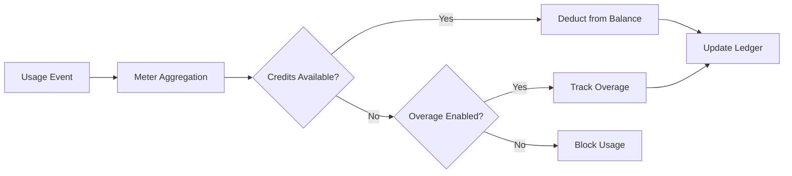

<Info>
Meters chuyển đổi sự kiện thô thành các lượng có thể lập hóa đơn. Chúng lọc sự kiện và áp dụng các hàm tổng hợp (Count, Sum, Max, Last) để tính mức sử dụng theo khách hàng.
</Info>

<Frame>

</Frame>

## Tài nguyên API

<AccordionGroup>
<Accordion title="View Meter API References">
<CardGroup cols={2}>
<Card title="Create Meter" icon="plus" href="/api-reference/meters/create-meter">
Tạo meter theo lập trình qua API.
</Card>

<Card title="List Meters" icon="list" href="/api-reference/meters/get-meters">
Truy xuất tất cả meter trong tài khoản của bạn.
</Card>

<Card title="Get Meter" icon="eye" href="/api-reference/meters/retrieve-meter">
Lấy chi tiết cho một meter cụ thể theo ID.
</Card>

<Card title="Archive Meter" icon="arrow-rotate-right" href="/api-reference/meters/archive-meter">
Lưu trữ một meter để ngừng theo dõi sử dụng.
</Card>

<Card title="Unarchive Meter" icon="arrow-rotate-left" href="/api-reference/meters/unarchive-meter">
Khôi phục một meter đã lưu trữ để tiếp tục theo dõi.
</Card>
</CardGroup>
</Accordion>
</AccordionGroup>

## Tạo một Công tơ

<Steps>
<Step title="Basic Information">
<ParamField path="Meter Name" type="string" required>
Tên mô tả (ví dụ: "API Requests", "Token Usage")
</ParamField>

<ParamField path="Event Name" type="string" required>
Tên sự kiện chính xác cần khớp (phân biệt chữ hoa chữ thường). Ví dụ: `api.call`, `image.generated`
</ParamField>
</Step>

<Step title="Aggregation">
<ParamField path="Aggregation Type" type="string" required>
Chọn cách các sự kiện được tổng hợp:

- **Count**: Tổng số sự kiện (cuộc gọi API, tải lên)
- **Sum**: Cộng các giá trị số (tokens, bytes)
- **Max**: Giá trị lớn nhất trong kỳ (người dùng đỉnh)
- **Last**: Giá trị gần nhất
</ParamField>

<ParamField path="Over Property" type="string">
Khóa metadata để tổng hợp (bắt buộc cho tất cả loại ngoại trừ Count). Ví dụ: `tokens`, `bytes`, `duration_ms`
</ParamField>

<ParamField path="Measurement Unit" type="string" required>
Nhãn đơn vị cho hóa đơn. Ví dụ: `calls`, `tokens`, `GB`, `hours`
</ParamField>
</Step>

<Step title="Filtering (Optional)">
<Frame>

</Frame>

Thêm điều kiện để lọc các sự kiện được tính:
- **Logic AND**: Tất cả các điều kiện phải khớp
- **Logic OR**: Bất kỳ điều kiện nào cũng có thể khớp

**So sánh**: bằng, không bằng, lớn hơn, nhỏ hơn, chứa

Bật lọc, chọn logic, thêm điều kiện với khóa thuộc tính, bộ so sánh và giá trị.
</Step>

<Step title="Create">
Xem lại cấu hình và nhấp **Create Meter**.
</Step>
</Steps>

## Xem Phân tích

<Frame>

</Frame>

Bảng điều khiển công tơ của bạn hiển thị:
- **Tổng quan**: Tổng mức sử dụng và biểu đồ mức sử dụng
- **Sự kiện**: Các sự kiện riêng lẻ đã nhận
- **Khách hàng**: Mức sử dụng và phí theo từng khách hàng

## Thanh toán bằng tín chỉ thay vì tiền tệ

Mặc định, các đồng hồ tính phí khách hàng theo từng đơn vị bằng đô la (hoặc loại tiền bạn đã cấu hình). Bạn có thể thay vào đó cấu hình một đồng hồ để **khấu trừ từ số dư tín chỉ** — nên việc sử dụng sẽ tiêu thụ tín chỉ thay vì tạo ra chi phí tiền tệ.

<Info>
Khấu trừ theo tín chỉ yêu cầu một [Quyền tín dụng](/features/credit-based-billing) được gắn với cùng sản phẩm. Hãy tạo tín chỉ trước, rồi liên kết nó với đồng hồ.
</Info>

### Khi nào nên dùng khấu trừ theo tín chỉ

| Tình huống | Tiêu chuẩn (tiền tệ) | Dựa trên tín chỉ |
|----------|-------------------|--------------|
| Định giá theo đơn vị đơn giản (0,01$/cuộc gọi) | ✅ Phù hợp nhất | Gánh nặng không cần thiết |
| Gói tín chỉ trả trước (mua 10K token, dùng dần) | ❌ Không thể biểu đạt | ✅ Phù hợp nhất |
| Sử dụng gói kèm đăng ký (gói Pro bao gồm 100K cuộc gọi) | Có thể qua ngưỡng miễn phí | ✅ Tốt hơn - tín chỉ được chuyển kỳ sau, hết hạn, hiển thị ở cổng |
| Sản phẩm nhiều đồng hồ sử dụng chung pool tín chỉ | ❌ Mỗi đồng hồ tính phí riêng | ✅ Tất cả đồng hồ khấu trừ từ một số dư |

### Cấu hình đồng hồ để khấu trừ tín chỉ

<Steps>
{/* LOCKED_PATTERN_2f001d4cc191a503bfa27e2b02a887d3 */}
Đầu tiên, tạo một tín chỉ trong **Products → Credits**. Xác định đơn vị (ví dụ: "API Calls", "Tokens"), độ chính xác và các cài đặt vòng đời (hết hạn, chuyển kỳ sau, vượt hạn).

Xem [Hướng dẫn Thanh toán theo tín chỉ](/features/credit-based-billing) để biết hướng dẫn chi tiết.
</Step>

{/* LOCKED_PATTERN_e56c2bce14c9ffc41b822106f30b9344 */}
Vào sản phẩm tính phí theo mức sử dụng và mở phần cấu hình **Meter**.
</Step>

{/* LOCKED_PATTERN_0e1120cd860a229dcc6f92a517f37ac6 */}
Nhấp nút **+** để đính kèm một đồng hồ. Cấu hình tên sự kiện, kiểu tổng hợp và đơn vị đo như thường lệ.
</Step>

{/* LOCKED_PATTERN_5742803ec5f5aba6317bae5a7cd68e62 */}
Bật tùy chọn **Bill usage in Credits** trong cấu hình đồng hồ. Điều này sẽ hiển thị các cài đặt tín chỉ:

{/* LOCKED_PATTERN_5164565eee83d03235035c7c8b6b2680 */}

</Frame>

{/* LOCKED_PATTERN_643db6bd6419b3403905cdf5351f1450 */}
Chọn quyền tín dụng mà đồng hồ này sẽ khấu trừ.
</ParamField>

{/* LOCKED_PATTERN_f350d049ff7e758408e63c7b8b7766de */}
Số đơn vị sử dụng cần thiết để khấu trừ 1 tín chỉ. Ví dụ:
- `1` = mỗi sự kiện đồng hồ khấu trừ 1 tín chỉ
- `100` = 100 sự kiện đồng hồ khấu trừ 1 tín chỉ
- `1000` = 1.000 cuộc gọi API tiêu thụ 1 tín chỉ
</ParamField>
</Step>

{/* LOCKED_PATTERN_6b77ac14c64de04b72ad44281724bb0c */}
**Ngưỡng miễn phí** vẫn có hiệu lực — các sự kiện nằm dưới ngưỡng này sẽ không khấu trừ tín chỉ.

**Ví dụ**: Với ngưỡng miễn phí là 1.000 và số đơn vị đồng hồ trên mỗi tín chỉ là 1:
- Khách hàng sử dụng 2.500 cuộc gọi API
- 1.000 đầu tiên miễn phí
- 1.500 còn lại khấu trừ 1.500 tín chỉ khỏi số dư của họ
</Step>
</Steps>

### Cách khấu trừ tín chỉ hoạt động

Sau khi được cấu hình, quy trình khấu trừ chạy tự động:

1. **Sự kiện đến** - Ứng dụng của bạn gửi sự kiện sử dụng qua [Event Ingestion API](/features/usage-based-billing/event-ingestion)
2. **Đồng hồ tổng hợp** - Các sự kiện được tổng hợp theo cấu hình đồng hồ của bạn (Count, Sum, Max, Last)
3. **Worker nền xử lý** - Mỗi phút, một worker lấy các sự kiện mới kể từ checkpoint trước đó
4. **Tín chỉ được khấu trừ** - Lượng sử dụng tổng hợp được chuyển đổi sang tín chỉ theo tỷ lệ `meter_units_per_credit` và khấu trừ theo **thứ tự FIFO** (quyền cấp cũ nhất bị tiêu thụ trước)
5. **Theo dõi vượt hạn** - Nếu số dư về 0 và vượt hạn được bật, việc sử dụng vẫn tiếp tục và vượt hạn được xử lý theo hành vi đã cấu hình (xóa khi đặt lại, tính phí ở hóa đơn tiếp theo hoặc chuyển làm thâm hụt)

{/* LOCKED_PATTERN_4907e9f6f7fbd509120d7a87afc829e9 */}
Quá trình khấu trừ tín chỉ chạy bất đồng bộ (khoảng mỗi ~1 phút). Có thể có độ trễ nhỏ giữa việc thu thập sự kiện và khấu trừ số dư. Thiết kế ứng dụng của bạn để xử lý độ trễ này — đừng dựa vào kiểm tra số dư theo thời gian thực để điều khiển truy cập cho từng yêu cầu đơn lẻ.
{/* LOCKED_PATTERN_176d815432e7554ac558e8631b2bc397 */}

### Nhiều đồng hồ, một pool tín chỉ

Bạn có thể liên kết nhiều đồng hồ trên cùng một sản phẩm với **cùng một quyền tín dụng**. Tất cả đồng hồ khấu trừ từ một số dư dùng chung.

**Ví dụ**: Một nền tảng AI với hai đồng hồ:
- `text.generation` - 1 tín chỉ cho mỗi 1.000 token
- `image.generation` - 10 tín chỉ cho mỗi hình ảnh

Cả hai khấu trừ từ cùng pool "AI Credits". Khách hàng thấy một số dư thống nhất trong cổng của họ.

{/* LOCKED_PATTERN_317ec56569e36d0c9e56c2648890a76e */}
Sử dụng các tỷ lệ `meter_units_per_credit` khác nhau giữa các đồng hồ để biểu đạt chi phí tương đối. Các hoạt động tốn kém (tạo hình ảnh) tiêu thụ ít đơn vị đồng hồ trên mỗi tín chỉ hơn các hoạt động rẻ hơn (hoàn thành văn bản).
{/* LOCKED_PATTERN_4dec52ce04aa8849a8a60508baae30ae */}

<CardGroup cols={2}>
{/* LOCKED_PATTERN_2e110f22e0f3741250f140b212ae466d */}
Xem toàn bộ lịch sử khấu trừ tín chỉ cho một khách hàng.
</Card>
{/* LOCKED_PATTERN_83b4a13ef9031c5fd9378a998aeaa952 */}
Kiểm tra số dư tín chỉ hiện tại của khách hàng qua API.
</Card>
</CardGroup>

## Khắc phục sự cố

<AccordionGroup>
<Accordion title="Events not appearing">
- Tên sự kiện phải khớp chính xác (phân biệt chữ hoa/thường)
- Kiểm tra các bộ lọc đồng hồ không loại trừ sự kiện
- Xác minh ID khách hàng tồn tại
- Tạm thời vô hiệu hóa các bộ lọc để thử nghiệm
</Accordion>

<Accordion title="Aggregation not working">
- Xác nhận thuộc tính Over Property khớp chính xác khóa metadata
- Dùng số, không phải chuỗi: `tokens: 150` chứ không phải `"150"`
- Bao gồm các thuộc tính bắt buộc trong tất cả sự kiện
</Accordion>

<Accordion title="Filters not working">
- Phải khớp chính xác chữ hoa/chữ thường
- Dùng toán tử đúng cho kiểu dữ liệu
- Đảm bảo sự kiện bao gồm các thuộc tính được lọc
</Accordion>

<Accordion title="Wrong usage totals">
- Kiểm tra tab Events để đếm số sự kiện thực tế nhận được
- Xác minh kiểu tổng hợp (Count vs Sum)
- Đảm bảo giá trị là số đối với Sum/Max
</Accordion>
</AccordionGroup>

## Bước tiếp theo

<CardGroup cols={2}>

<Card title="Send Events" icon="bolt" href="/features/usage-based-billing/event-ingestion">
Bắt đầu gửi sự kiện sử dụng từ ứng dụng của bạn đến các đồng hồ.
</Card>

<Card title="View Blueprints" icon="copy" href="/features/usage-based-billing/ingestion-blueprints">
Sử dụng các cấu hình đồng hồ dựng sẵn cho các trường hợp phổ biến.
</Card>
</CardGroup>
